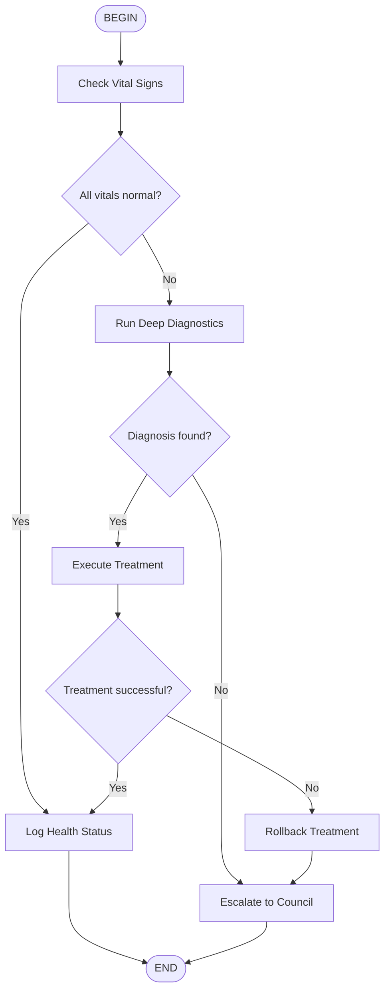

# Domain Diagnostic Flow

Automated diagnostic and remediation workflow for Dynamic Domains.

## Flow Diagram



## Step Descriptions

1. **Check Vital Signs** - Quick health check with 2s timeout
2. **Run Deep Diagnostics** - Comprehensive analysis with 30s timeout
3. **Execute Treatment** - Apply remediation with compensation on failure
4. **Rebuild Domain** - Full reconstruction (no retries, halt on failure)
5. **Escalate to Council** - Human intervention required

## Error Handling

| Step | Retries | Timeout | On Failure |
|------|---------|---------|------------|
| Check Vital Signs | 1 | 2s | Skip |
| Run Deep Diagnostics | 3 | 30s | Fallback to Council |
| Execute Treatment | 2 | 10s | Compensate |
| Rebuild Domain | 0 | 60s | Halt |

## Usage

```typescript
import { SkillOrchestrator } from './lib/skill-orchestrator';

const orchestrator = new SkillOrchestrator();
const results = await orchestrator.executeFlowSkill(
  'domain-diagnostic-flow',
  targetDomain
);

// Check results
for (const step of results) {
  console.log(`${step.status}: ${step.attempts} attempts, ${step.durationMs}ms`);
}
```
