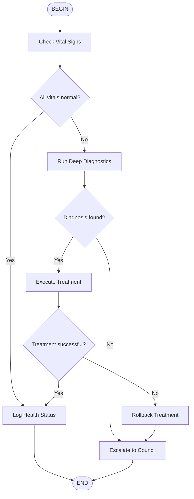

# Domain Diagnostic Flow

Automated diagnostic and remediation workflow for Dynamic Domains.

Default resilience policy: retry twice with exponential backoff and a 5-second timeout, then
escalate. Treat steps as non-idempotent unless the table below says otherwise.

## Flow Diagram

```mermaid
flowchart TD
    A([BEGIN]) --> B[Check Vital Signs]
    B --> C{All vitals normal?}
    C -->|Yes| D[Log Health Status]
    C -->|No| E[Run Deep Diagnostics]
    
    E --> F{Diagnosis found?}
    F -->|No| G[Escalate to Council]
    F -->|Yes| H[Execute Treatment]
    
    H --> I{Treatment successful?}
    I -->|Yes| D
    I -->|No| J[Rollback Treatment]
    J --> G
    
    D --> K([END])
    G --> K
```

## Step Descriptions

1. **Check Vital Signs** - Quick health check with 2s timeout
2. **Run Deep Diagnostics** - Comprehensive analysis with 30s timeout
3. **Execute Treatment** - Apply remediation with compensation on failure
4. **Rebuild Domain** - Full reconstruction (no retries, halt on failure)
5. **Escalate to Council** - Human intervention required

## Error Handling

| Step | Retries | Strategy | Timeout | On failure | Idempotent |
|------|---------|----------|---------|------------|------------|
| Check Vital Signs | 1 | Exponential backoff | 2s | Skip | No |
| Run Deep Diagnostics | 3 | Fixed | 30s | Fallback to Council | No |
| Execute Treatment | 2 | Exponential backoff | 10s | Roll back treatment | Yes |
| Rebuild Domain | 0 | None | 60s | Halt | No |

## Agent tooling

| Tool | Use when |
|------|----------|
| `ast_grep_workflow` | Continuous scan after treatment (`--fail-on-drift`) |
| `ast_grep_skill_loop` | `action: run --skill domain-diagnostic-flow --phases doctor,rate` |
| `/precommit` | Before committing flow or resilience policy changes |

Shared reference: [agent-tooling.md](../references/agent-tooling.md)
