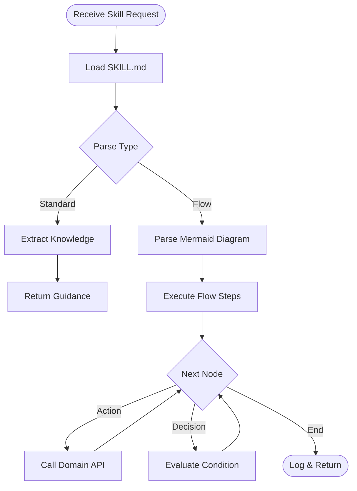

# Domain Skill Orchestrator

## Flow: Execute Domain Skill



## Domain API Mapping

| Skill Instruction | Domain Method |
|-------------------|---------------|
| "Check health" | `domain.checkHealth()` |
| "Optimize" | `domain.optimize()` |
| "Collapse state" | `domain.collapse('property')` |
| "Entangle" | `domain.entangleWith(other)` |
| "Self-heal" | `domain.triggerHealing()` |

## Usage

```typescript
// Execute a flow skill on a domain
const orchestrator = new SkillOrchestrator();
const results = await orchestrator.executeFlowSkill(
  'domain-diagnostic-flow',
  myDomain
);

// Load guidance skill
const guidance = await orchestrator.loadSkill('quantum-domain-ops');
```
