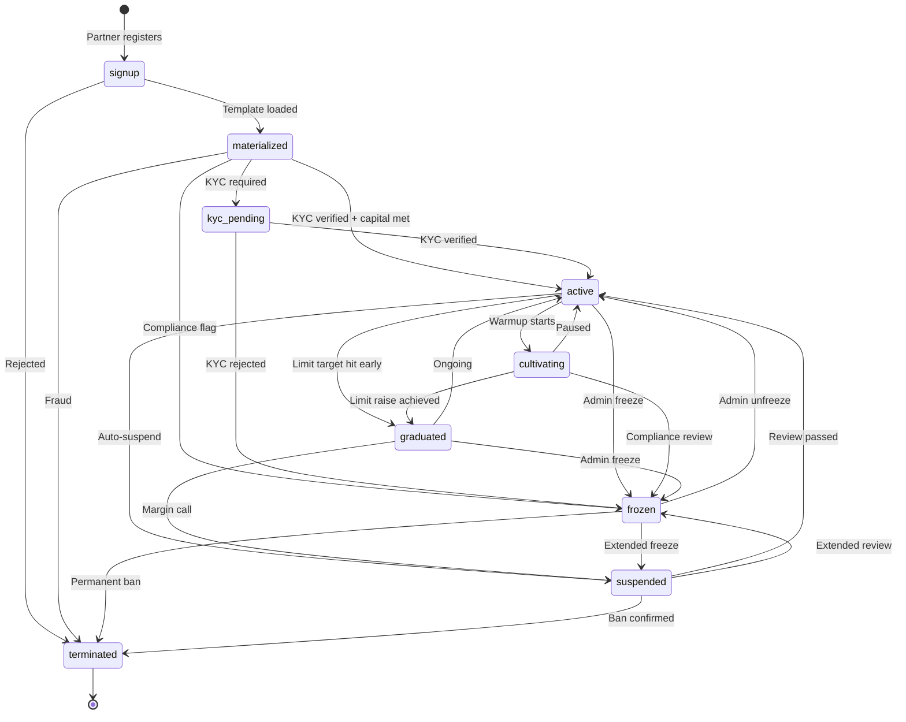

# SKILL.md — Partner Profile OS (v2)

> Canonical partner identity layer for Sports Terminal v5.2+. TOML-backed templates, in-memory `PartnerGateway` kernel, lifecycle state machine with guards, cross-zone consumption, and **multi-layered data source routing**.
> Bloomberg Terminal dark theme. Bun-native. Zero non-Bun dependencies except Zod.

---

## 1. Architecture Overview

```
Partner Profile OS
├── partner-profile-schema.ts      # Zod schemas (strict, single source of truth)
├── partner-profile-loader.ts      # Bun.TOML.parse() + Glob discovery
├── partner-profile-materializer.ts  # structuredClone + lifecycle transitions
├── partner-profile-service.ts       # In-memory Map<partnerId, PartnerGateway> + SQLite backup + bookIndex
├── partner-gateway.ts               # THE KERNEL: static profile + live runtime → evaluate(signal)
├── partner-source-router.ts         # Data source separation: bookIndex + candidate filtering
├── telegram-integration.ts          # Auto-create forum topics + dispatch by signal type
├── source-integration.ts            # Authorize connections + health checks
├── settlement-integration.ts        # Commission calc + makeup + balance update
├── dashboard-integration.ts         # Real-time gate event log + ANSI views
├── cascade-engine-integration.ts    # SDN consumption: one call
├── hot-reload.ts                    # Template file watcher
└── index.ts                         # Barrel export
```

---

## 2. Data Source Separation Architecture

### 2.1 The Routing Flow

```mermaid
flowchart LR
    subgraph Raw["📡 Raw Signal"]
        R1[signalId: "steam-123"<br/>bookId: "PINNACLE"<br/>market: "NFL_spread"<br/>type: "steam"<br/>suggestedStake: 15000]
    end

    subgraph Index["📇 Book Index<br/>O(1) lookup"]
        I1[bookId → partnerId[]<br/>PINNACLE: [HYBRID_001, OFFSHORE_001, RETAIL_001]]
    end

    subgraph Filter["🔍 Candidate Filter"]
        F1[Book allowlist check]
        F2[Jurisdiction match]
        F3[State check: active/graduated]
    end

    subgraph Evaluate["🎭 Per-Partner Evaluation"]
        E1[gateway.evaluate(signal)]
        E2[Book whitelist/blacklist]
        E3[Signal type: steam/arb/clv]
        E4[Market limit: currentLimits[market]]
        E5[Tier eligibility]
        E6[Balance/exposure]
    end

    subgraph Result["📊 Result"]
        Res1[{allowed, action, reason, adjustedStake, metadata}]
    end

    R1 --> I1
    I1 --> F1
    F1 --> F2
    F2 --> F3
    F3 --> E1
    E1 --> E2
    E2 --> E3
    E3 --> E4
    E4 --> E5
    E5 --> E6
    E6 --> Res1
```

### 2.2 Key Principle

> **Separate by partner, using the partner's allowed sources/books as the first fast filter, then apply all other rules inside the gateway.**

Sport-specific separation is expressed as **market-specific cultivation limits** (`runtime.currentLimits[market]`), which the gateway already enforces. Setting a limit to `0` effectively blocks that sport.

### 2.3 Book Index Implementation

```typescript
// Inside PartnerProfileService
private bookIndex: Map<string, Set<string>> = new Map();

/**
 * Build index after all templates loaded.
 * Called once at boot, refreshed on hot-reload.
 */
refreshBookIndex(): void {
  this.bookIndex.clear();
  for (const [partnerId, gateway] of this.gateways) {
    for (const source of gateway.profile.sources.defaults) {
      if (source.book_id && source.active) {
        if (!this.bookIndex.has(source.book_id)) {
          this.bookIndex.set(source.book_id, new Set());
        }
        this.bookIndex.get(source.book_id)!.add(partnerId);
      }
    }
  }
  console.log(`[INDEX] ${this.bookIndex.size} books indexed across ${this.gateways.size} partners`);
}

/**
 * Route signal to candidate partners.
 * O(m) where m = partners with this book (typically < 50).
 */
routeSignal(signal: SignalContext): Array<{ partnerId: string; result: GateResult }> {
  const candidates = this.bookIndex.get(signal.bookId);
  if (!candidates || candidates.size === 0) {
    return [];
  }

  const results: Array<{ partnerId: string; result: GateResult }> = [];
  for (const partnerId of candidates) {
    const gateway = this.gateways.get(partnerId);
    if (!gateway) continue;

    // Fast pre-filter: state must be active/graduated
    if (gateway.profile.state !== "active" && gateway.profile.state !== "graduated") {
      continue;
    }

    const result = gateway.evaluate(signal);
    results.push({ partnerId, result });

    if (result.allowed) {
      const stake = result.adjustedStake ?? signal.suggestedStake;
      gateway.recordExposure(stake);
    }
  }

  return results;
}
```

### 2.4 Separation Levels

| Level | Mechanism | Location | Complexity |
|-------|-----------|----------|------------|
| **By partner** | Gateway evaluation per partner | `gateway.evaluate()` | O(1) per partner |
| **By source/book** | Index of `bookId → partnerId[]` + `allowed_books` | Service + gateway | O(1) lookup |
| **By sport/market** | Runtime `currentLimits[market]` or future `blocked_sports` | Gateway cultivation | O(1) map lookup |
| **By signal type** | `steam_allowed`, `arb_allowed`, `clv_allowed` in SOR profile | Gateway SOR | O(1) boolean check |
| **By tier** | `eligible_tiers` array | Gateway SOR | O(1) array includes |
| **By balance/exposure** | Balance threshold, daily exposure, signal cap | Gateway balance | O(1) arithmetic |

### 2.5 Partner-Exclusive Sources

Some sources are **exclusive** to a partner (e.g., their personal DraftKings API key). These are authenticated using the `source_account` field in bet contexts, and the gateway's `authorizeSource()` checks `isSourceAllowed()`.

```typescript
// Exclusive source check
authorizeSource(sourceId: string, sourceType: string): { allowed: boolean; reason?: string } {
  // Check max sources limit
  const activeSources = this.profile.sources.defaults.filter(s => s.active).length;
  if (activeSources >= this.profile.sources.max_sources) {
    return { allowed: false, reason: `Max sources (${this.profile.sources.max_sources}) reached` };
  }

  // Check if source exists in profile
  const source = this.profile.sources.defaults.find(s => s.id === sourceId);
  if (!source) {
    return { allowed: false, reason: `Source '${sourceId}' not in profile template` };
  }

  // Check API access permission
  if (sourceType === "book_api" && !this.profile.sources.api_access) {
    return { allowed: false, reason: "API access not enabled for this partner" };
  }

  return { allowed: true };
}
```

---

## 3. Domain Class Matrix

| Class | Zone | Hex | What It Tracks | Cross-Refs |
|-------|------|-----|----------------|------------|
| `PartnerProfile` | Profile | `#e066ff` | Canonical identity: static TOML-derived config | All zones |
| `PartnerRuntimeState` | Profile | `#ff1493` | Live mutable state: balance, daily used, OpSec, KYC | `PartnerGateway` |
| `PartnerGateway` | Profile | `#00d4aa` | **The Kernel**: wraps profile + runtime, exposes `evaluate(signal)` | SDN, Telegram, Settlement |
| `ProfileTemplate` | Profile | `#da70d6` | TOML-defined defaults per use case | `PartnerProfile` |
| `ProfileSource` | Profile | `#dda0dd` | Attached books, APIs, kiosks, wallets | `Zone 22`, `SDN` |
| `ProfileJurisdiction` | Profile | `#ee82ee` | Legal/geo constraints, KYC tier, tax | `Zone 11`, `Zone 19` |
| `ProfileCultivation` | Profile | `#ff69b4` | Limit raising plan, deposit schedule, behavior targets | `Zone 22` |
| `ProfileSettlement` | Profile | `#ff1493` | Commission terms, makeup, payout cadence, currency | `Zone 6` |
| `ProfileSORGate` | Profile | `#db7093` | SOR eligibility: tiers, exposure, book whitelist | `SDN` |
| `ProfileTelegram` | Profile | `#ffb6c1` | Thread setup, alert routing, group membership | `Zone 3` |
| `ProfileBalance` | Profile | `#ffc0cb` | Capital requirements, margin calls, injection history | `Zone 6` |

---

## 4. SQLite Schema — All Tables

```sql
-- partner_profiles: Canonical master record (static config + runtime state)
CREATE TABLE partner_profiles (
  partner_id TEXT PRIMARY KEY,
  template_id TEXT NOT NULL,
  status TEXT DEFAULT 'signup',
  display_name TEXT NOT NULL,
  email TEXT NOT NULL,
  phone TEXT,
  created_at INTEGER NOT NULL,
  materialized_at INTEGER,
  activated_at INTEGER,
  graduated_at INTEGER,
  frozen_at INTEGER,
  frozen_reason TEXT,
  terminated_at INTEGER,
  updated_at INTEGER,
  -- Immutable JSON config (set at materialization)
  jurisdiction_json TEXT NOT NULL,
  sources_json TEXT NOT NULL,
  cultivation_json TEXT NOT NULL,
  settlement_json TEXT NOT NULL,
  sor_json TEXT NOT NULL,
  telegram_json TEXT NOT NULL,
  balance_json TEXT NOT NULL,
  compliance_json TEXT NOT NULL,
  -- Runtime mutable state
  current_limit REAL DEFAULT 0,
  daily_used REAL DEFAULT 0,
  total_deposited REAL DEFAULT 0,
  total_withdrawn REAL DEFAULT 0,
  total_settled_pnl REAL DEFAULT 0,
  current_balance REAL DEFAULT 0,
  opsec_score INTEGER DEFAULT 0,
  risk_level TEXT DEFAULT 'green',
  kyc_status TEXT DEFAULT 'pending'
);

CREATE INDEX idx_partner_status ON partner_profiles(status);
CREATE INDEX idx_partner_template ON partner_profiles(template_id);
CREATE INDEX idx_partner_kyc ON partner_profiles(kyc_status);

-- partner_sources: One row per attached source
CREATE TABLE partner_sources (
  partner_id TEXT NOT NULL,
  source_id TEXT NOT NULL,
  source_type TEXT NOT NULL,
  book_id TEXT,
  endpoint TEXT,
  api_key_hash TEXT,
  api_secret_hash TEXT,
  webhook_url TEXT,
  location TEXT,
  geo_lat REAL,
  geo_lon REAL,
  address TEXT,
  chain TEXT,
  currency TEXT,
  max_stake REAL,
  daily_limit REAL,
  priority INTEGER DEFAULT 1,
  status TEXT DEFAULT 'pending',
  last_health_check INTEGER,
  latency_ms INTEGER,
  created_at INTEGER,
  activated_at INTEGER,
  PRIMARY KEY (partner_id, source_id),
  FOREIGN KEY (partner_id) REFERENCES partner_profiles(partner_id)
);

CREATE INDEX idx_source_partner ON partner_sources(partner_id, status);
CREATE INDEX idx_source_book ON partner_sources(book_id, status);

-- partner_cultivation: Limit raising progress tracker
CREATE TABLE partner_cultivation (
  partner_id TEXT PRIMARY KEY,
  phase TEXT DEFAULT 'warmup',
  target_deposit_total REAL,
  actual_deposit_total REAL DEFAULT 0,
  deposit_count INTEGER DEFAULT 0,
  target_limit REAL,
  current_limit REAL,
  bet_count INTEGER DEFAULT 0,
  straight_bet_count INTEGER DEFAULT 0,
  parlay_bet_count INTEGER DEFAULT 0,
  casino_play_total REAL DEFAULT 0,
  odds_boosts_taken INTEGER DEFAULT 0,
  sports_diversity_count INTEGER DEFAULT 0,
  last_deposit_at INTEGER,
  last_bet_at INTEGER,
  raise_requested_at INTEGER,
  raise_approved_at INTEGER,
  graduation_eligible INTEGER DEFAULT 0,
  created_at INTEGER,
  updated_at INTEGER,
  FOREIGN KEY (partner_id) REFERENCES partner_profiles(partner_id)
);

-- partner_settlement: Commission terms + payout state
CREATE TABLE partner_settlement (
  partner_id TEXT PRIMARY KEY,
  commission_structure TEXT,
  commission_rate REAL,
  commission_tiers_json TEXT,
  makeup_enabled INTEGER DEFAULT 0,
  makeup_window_days INTEGER DEFAULT 30,
  makeup_balance REAL DEFAULT 0,
  payout_cadence TEXT,
  payout_method TEXT,
  payout_split_json TEXT,
  payout_minimum REAL,
  currency TEXT,
  hold_target_pct REAL,
  lifetime_commission_paid REAL DEFAULT 0,
  lifetime_makeup_cleared REAL DEFAULT 0,
  last_payout_at INTEGER,
  next_payout_at INTEGER,
  created_at INTEGER,
  FOREIGN KEY (partner_id) REFERENCES partner_profiles(partner_id)
);

-- partner_telegram_topics: Group mappings
CREATE TABLE partner_telegram_topics (
  partner_id TEXT NOT NULL,
  topic_type TEXT NOT NULL,
  chat_id TEXT,
  chat_name TEXT,
  auto_create INTEGER DEFAULT 1,
  status TEXT DEFAULT 'pending',
  error TEXT,
  created INTEGER DEFAULT 0,
  created_at INTEGER,
  PRIMARY KEY (partner_id, topic_type),
  FOREIGN KEY (partner_id) REFERENCES partner_profiles(partner_id)
);

-- partner_gates: SOR eligibility + compliance flags
CREATE TABLE partner_gates (
  partner_id TEXT PRIMARY KEY,
  sor_eligible_tiers_json TEXT,
  max_exposure_per_signal REAL,
  max_daily_exposure REAL,
  max_single_bet REAL,
  book_whitelist_json TEXT,
  book_blacklist_json TEXT,
  steam_allowed INTEGER DEFAULT 0,
  arb_allowed INTEGER DEFAULT 0,
  clv_allowed INTEGER DEFAULT 1,
  manual_allowed INTEGER DEFAULT 1,
  predictive_allowed INTEGER DEFAULT 0,
  require_opsec_green INTEGER DEFAULT 0,
  opsec_score_max INTEGER DEFAULT 50,
  auto_suspend_rules_json TEXT,
  review_required_json TEXT,
  last_gate_review_at INTEGER,
  created_at INTEGER,
  FOREIGN KEY (partner_id) REFERENCES partner_profiles(partner_id)
);

-- partner_runtime_state: Live runtime state snapshot
CREATE TABLE partner_runtime_state (
  partner_id TEXT PRIMARY KEY,
  runtime_json TEXT NOT NULL,
  updated_at INTEGER,
  FOREIGN KEY (partner_id) REFERENCES partner_profiles(partner_id)
);

-- partner_lifecycle_log: Immutable audit trail
CREATE TABLE partner_lifecycle_log (
  id INTEGER PRIMARY KEY AUTOINCREMENT,
  partner_id TEXT NOT NULL,
  from_state TEXT,
  to_state TEXT NOT NULL,
  triggered_by TEXT NOT NULL,
  reason TEXT,
  guard_checks_json TEXT,
  timestamp INTEGER DEFAULT (strftime('%s','now')),
  FOREIGN KEY (partner_id) REFERENCES partner_profiles(partner_id)
);

CREATE INDEX idx_lifecycle_partner ON partner_lifecycle_log(partner_id, timestamp DESC);
CREATE INDEX idx_lifecycle_state ON partner_lifecycle_log(to_state, timestamp DESC);

-- partner_gate_log: Immutable gate decision audit
CREATE TABLE partner_gate_log (
  id INTEGER PRIMARY KEY AUTOINCREMENT,
  partner_id TEXT NOT NULL,
  signal_id TEXT NOT NULL,
  action TEXT NOT NULL,
  reason TEXT,
  original_stake REAL,
  adjusted_stake REAL,
  metadata_json TEXT,
  timestamp INTEGER DEFAULT (strftime('%s','now'))
);

CREATE INDEX idx_gate_log_partner ON partner_gate_log(partner_id, timestamp DESC);
CREATE INDEX idx_gate_log_signal ON partner_gate_log(signal_id);
CREATE INDEX idx_gate_log_action ON partner_gate_log(action, timestamp DESC);

-- partner_settlement_log: Per-bet settlement audit
CREATE TABLE partner_settlement_log (
  id INTEGER PRIMARY KEY AUTOINCREMENT,
  partner_id TEXT NOT NULL,
  bet_id TEXT NOT NULL,
  stake REAL,
  odds REAL,
  result TEXT,
  profit_loss REAL,
  commission REAL,
  makeup_applied REAL,
  house_net REAL,
  partner_balance_after REAL,
  timestamp INTEGER DEFAULT (strftime('%s','now'))
);

CREATE INDEX idx_settlement_partner ON partner_settlement_log(partner_id, timestamp DESC);
CREATE INDEX idx_settlement_bet ON partner_settlement_log(bet_id);
```

---

## 5. TOML Template Schema

```toml
[meta]
template_id = "hybrid-sharp"
name = "Hybrid Sharp"
description = "Retail + offshore, steam + arb enabled"
version = "1.0.0"

[jurisdiction]
type = "hybrid"  # regulated-us | offshore | unregulated | hybrid
allowed_states = ["NV", "NJ", "PA"]
allowed_countries = ["CR", "PA", "CW"]
minimum_age = 21
kyc_tier = "enhanced"  # basic | standard | enhanced
geo_fence_enabled = false
tax_form = "W-9"  # W-9 | W-8BEN | none
self_exclusion_check = true

[sources.defaults]
{ id = "dk_retail", type = "book_api", book_id = "DRAFTKINGS", endpoint = "https://api.draftkings.com", api_key_env = "DK_API_KEY", max_stake = 10000, daily_limit = 50000, priority = 2 }
{ id = "pin_offshore", type = "book_api", book_id = "PINNACLE", endpoint = "https://api.pinnacle.com", api_key_env = "PIN_API_KEY", api_secret_env = "PIN_API_SECRET", max_stake = 100000, daily_limit = 500000, priority = 1 }
{ id = "wallet_usdc", type = "wallet", address = "0x...", chain = "polygon", currency = "USDC" }

[cultivation]
initial_deposit_target = 25000.00
deposit_schedule_weeks = [1, 2, 4, 8]
deposit_amounts = [5000, 10000, 15000, 25000]
initial_limit = 2000
limit_raise_target = 50000
raise_request_week = 3
recreational_mix = "any"
round_stakes = false
casino_play_pct = 5.0
odds_boost_acceptance = true
max_bet_frequency_daily = 20
required_sports_diversity = 2

[settlement]
commission_structure = "tiered"  # flat | tiered
commission_tiers = [
  { threshold = 0, rate = 0.30 },
  { threshold = 25000, rate = 0.40 },
  { threshold = 100000, rate = 0.50 },
]
makeup_enabled = true
makeup_window_days = 14
payout_cadence = "daily"  # daily | weekly | biweekly | monthly
payout_method = "ach_usdc_split"  # ach | usdc | cash | ach_usdc_split
payout_split = { ach_pct = 50, usdc_pct = 50 }
payout_minimum = 500.00
currency = "USD"
hold_target_pct = 5.0

[sor]
eligible_tiers = ["T1", "T2", "T3", "T4"]
max_exposure_per_signal = 25000.00
max_daily_exposure = 100000.00
max_single_bet = 25000.00
book_whitelist = ["DRAFTKINGS", "FANDUEL", "PINNACLE", "SBOBET", "MATCHBOOK"]
book_blacklist = ["1XBET"]
steam_allowed = true
arb_allowed = true
clv_allowed = true
manual_allowed = true
predictive_allowed = true
require_opsec_green = false

[telegram]
auto_create_groups = true
groups = [
  { type = "personal", name = "{partner_id}-personal", auto_create = true },
  { type = "signals", name = "{partner_id}-signals", auto_create = true },
  { type = "steam", name = "{partner_id}-steam", auto_create = true },
  { type = "arb", name = "{partner_id}-arb", auto_create = true },
  { type = "settlement", name = "{partner_id}-settlement", auto_create = true },
  { type = "opsec", name = "{partner_id}-opsec", auto_create = true },
]
alert_stake_minimum = 500.00
alert_types = ["steam", "arb", "clv", "settlement", "opsec", "compliance", "limit_change"]
admin_bot_token_env = "TELEGRAM_BOT_TOKEN"

[balance]
initial_capital_requirement = 50000.00
margin_call_threshold = 0.15
margin_call_action = "reduce_limits_then_halt"
auto_inject_enabled = true
max_auto_inject = 10000.00
injection_cadence = "as_needed"
return_threshold_pct = 0.20

[compliance]
auto_suspend_rules = ["public_wifi", "vpn_detected", "steam_chase_on_retail"]
review_required_for = ["graduation", "capital_injection", "source_addition", "tier_upgrade"]
audit_retention_days = 2555
max_opsec_score = 50
require_2fa = true
```

---

## 6. PartnerGateway API — The Kernel

```typescript
// The single entry point for all zone consumption
class PartnerGateway {
  constructor(
    public readonly profile: PartnerProfile,
    public runtime: PartnerRuntimeState
  ) {}

  // ── Core: Signal Evaluation ──
  evaluate(context: SignalContext): GateResult
  // Returns: { allowed, action: "allow"|"block"|"adjust"|"defer", reason?, adjustedStake?, metadata }

  // ── Runtime Mutations ──
  recordExposure(stake: number): void
  releaseExposure(stake: number): void
  recordDeposit(amount: number): void
  recordWithdrawal(amount: number): void
  recordSettlement(pnl: number): void
  resetDaily(): void
  setKyc(status: "pending" | "verified" | "rejected"): void
  setRisk(level: "green" | "yellow" | "orange" | "red", score: number): void
  setMarketLimit(market: string, limit: number): void

  // ── Query Shortcuts ──
  getCommissionRate(volume: number): number
  getPayoutCadence(): string
  getTelegramGroups(): Array<{ type: string; name: string }>
  shouldAlert(type: string, stake: number): boolean
  getAlertGroups(signalType: string): Array<{ type: string; name: string }>
  authorizeSource(sourceId: string, sourceType: string): { allowed: boolean; reason?: string }
  calculateCommission(stake: number, odds: number, result: "win" | "loss" | "push", volume: number): { commission; houseNet; makeupApplied }
  checkMarginCall(): { triggered; action; threshold; current }
  getRuntime(): Readonly<PartnerRuntimeState>
}
```

### GateResult Shape

```typescript
interface GateResult {
  allowed: boolean;
  action: "allow" | "block" | "adjust" | "defer";
  reason?: string;
  adjustedStake?: number;
  deferredUntil?: number;
  metadata: {
    originalStake: number;
    maxExposure: number;
    maxDaily: number;
    remainingDaily: number;
    tier: string;
    template: string;
    bookAllowed: boolean;
    typeAllowed: boolean;
    kycPass: boolean;
    balancePass: boolean;
    opsecPass: boolean;
    marketLimit?: number;
  };
}
```

---

## 7. Service API

```typescript
class PartnerProfileService {
  async loadFromTemplates(templateDir: string = "./profiles"): Promise<void>

  createPartner(
    partnerId: string,
    templateId: string,
    overrides?: { profile?: Partial<PartnerProfile>; runtime?: Partial<PartnerRuntimeState> }
  ): PartnerGateway

  getGateway(partnerId: string): PartnerGateway | undefined
  getProfile(partnerId: string): PartnerProfile | undefined

  updateRuntime(partnerId: string, update: Partial<PartnerRuntimeState>): void
  transition(partnerId: string, event: "materialize" | "approve" | "graduate" | "freeze" | "reactivate"): PartnerGateway
  hotReload(partnerId: string, newTemplateId: string): PartnerGateway

  resetAllDailyExposure(): void

  // ── Source Routing ──
  refreshBookIndex(): void
  routeSignal(signal: SignalContext): Array<{ partnerId: string; result: GateResult }>

  // ── SOR Queries ──
  isSOREligible(partnerId: string, tier: string): boolean
  isBookAllowed(partnerId: string, book: string): boolean
  isSteamAllowed(partnerId: string): boolean
  isArbAllowed(partnerId: string): boolean
  isCLVAllowed(partnerId: string): boolean
  getMaxExposurePerSignal(partnerId: string): number
  getMaxDailyExposure(partnerId: string): number

  // ── Settlement Queries ──
  getCommissionRate(partnerId: string, volume: number): number
  getPayoutCadence(partnerId: string): string

  // ── Dashboard ──
  renderDashboard(termWidth: number): string
}

export const partnerProfileService = new PartnerProfileService();
```

---

## 8. Cascade Engine Integration

```typescript
// One call. All checks. No scattered if-statements.
export function processSignal(signal: SignalContext): GateResult {
  const gateway = partnerProfileService.getGateway(signal.partnerId);
  if (!gateway) return blocked("Partner not found");

  const result = gateway.evaluate(signal);

  if (result.allowed) {
    const stake = result.adjustedStake ?? signal.suggestedStake;
    gateway.recordExposure(stake);
  }

  return result;
}

export function releaseSignalExposure(signalId: string, partnerId: string, stake: number): void
export function processSignalBatch(signals: SignalContext[]): Array<{ signal; result }>
```

---

## 9. Lifecycle State Machine



### Guard Checks

| Transition | Guards | Fail If |
|------------|--------|---------|
| `materialized → active` | KYC verified + Capital met | KYC pending or deposits < requirement |
| `kyc_pending → active` | KYC verified | Docs still pending |
| `cultivating → graduated` | Limit target + Deposits + Admin approval | Any of 3 not met |
| `any → frozen` | Trigger exists | Always allowed (admin/compliance) |
| `frozen → active` | Admin approval | Always passes on admin action |

---

## 10. Cross-Zone Consumption Matrix

| From Zone | To Zone | Gateway Method | Data | Frequency |
|-----------|---------|----------------|------|-----------|
| **Profile** | Zone 1 Sportsbook | `evaluate(signal)` + `currentLimit` | Gate decision | Per signal |
| **Profile** | Zone 3 Telegram | `shouldAlert(type, stake)` + `getAlertGroups()` | Filter + routing | Per event |
| **Profile** | Zone 4 Risk | `setRisk()` + `runtime.riskLevel` | OpSec updates | Every 30s |
| **Profile** | Zone 6 Accounting | `calculateCommission()` + `recordSettlement()` | Commission + balance | Per settlement |
| **Profile** | Zone 9 Market | `isBookAllowed()` + `isSteamAllowed()` | Source filtering | Per tick |
| **Profile** | SDN | `evaluate(signal)` | GateResult | Per signal |
| **Profile** | Zone 22 Partner Command | `getGateway()` + `renderDashboard()` | Full state | On demand |
| **Profile** | Dashboard | `recordGateEvent()` | Block reasons | Real-time |
| **Telegram** | Profile | `autoCreateTelegramGroups()` | Group thread IDs | On materialize |
| **Settlement** | Profile | `recordDeposit()` + `recordWithdrawal()` | Balance updates | Per transaction |
| **Risk** | Profile | `setKyc()` + `setRisk()` | Compliance state | Per check |
| **Source Router** | Profile | `routeSignal()` + `refreshBookIndex()` | Signal distribution | Per signal |

---

## 11. Build Order

| Step | File | Depends On | Action |
|------|------|------------|--------|
| 1 | `partner-profile-schema.ts` | Zod | Define all types |
| 2 | `partner-profile-loader.ts` | Schema, `Bun.TOML`, `Glob` | Load TOML templates |
| 3 | `partner-profile-materializer.ts` | Schema, Loader | `structuredClone`, lifecycle transitions |
| 4 | `partner-gateway.ts` | Schema, Materializer | **The Kernel**: `evaluate()`, runtime mutations |
| 5 | `partner-profile-service.ts` | Gateway, Materializer | In-memory cache, SQLite backup, CRUD, bookIndex |
| 6 | `partner-source-router.ts` | Service, Gateway | `routeSignal()`, `refreshBookIndex()` |
| 7 | `cascade-engine-integration.ts` | Service, Gateway | `processSignal()` — one call |
| 8 | `telegram-integration.ts` | Service, Gateway | Auto-create groups, dispatch |
| 9 | `source-integration.ts` | Service, Gateway | Authorize, health check |
| 10 | `settlement-integration.ts` | Service, Gateway | Commission, makeup, balance |
| 11 | `dashboard-integration.ts` | Service, Gateway | Real-time gate log, ANSI views |
| 12 | `hot-reload.ts` | Service, Loader | Template file watcher |
| 13 | `index.ts` | All above | Barrel export |
| 14 | `partner-dashboard.html` | All above | Admin UI |

---

## 12. One-Liner Validation Suite

```bash
# 1. Load template
bun -e 'import{loadProfileTemplate}from"./src/zones/partner-profile/partner-profile-loader.ts"; const t=loadProfileTemplate("./profiles/hybrid-sharp.toml"); console.log("✓", t.meta.name, t.sources.defaults.length)'

# 2. Discover templates
bun -e 'import{discoverTemplates}from"./src/zones/partner-profile/partner-profile-loader.ts"; const ts=await discoverTemplates("./profiles"); console.log("✓", ts.size, "templates")'

# 3. Materialize profile
bun -e 'import{materializeProfile}from"./src/zones/partner-profile/partner-profile-materializer.ts"; import{loadProfileTemplate}from"./src/zones/partner-profile/partner-profile-loader.ts"; const t=loadProfileTemplate("./profiles/hybrid-sharp.toml"); const p=materializeProfile("TEST_001", t); console.log("✓", p.partnerId, p.state)'

# 4. structuredClone isolation
bun -e 'import{materializeProfile}from"./src/zones/partner-profile/partner-profile-materializer.ts"; import{loadProfileTemplate}from"./src/zones/partner-profile/partner-profile-loader.ts"; const t=loadProfileTemplate("./profiles/hybrid-sharp.toml"); const p=materializeProfile("TEST_002", t); p.sor.steam_allowed=false; console.log("✓", t.sor.steam_allowed, "!==", p.sor.steam_allowed)'

# 5. Service boot + book index
bun -e 'import{partnerProfileService}from"./src/zones/partner-profile/partner-profile-service.ts"; await partnerProfileService.loadFromTemplates("./profiles"); partnerProfileService.refreshBookIndex(); console.log("✓", partnerProfileService["bookIndex"].size, "books indexed")'

# 6. Create partner + gateway
bun -e 'import{partnerProfileService}from"./src/zones/partner-profile/partner-profile-service.ts"; await partnerProfileService.loadFromTemplates("./profiles"); const g=partnerProfileService.createPartner("TEST_003", "hybrid-sharp", {runtime:{currentBalance:50000,kycStatus:"verified"}}); console.log("✓", g.profile.partnerId, g.profile.state)'

# 7. SOR gate check
bun -e 'import{partnerProfileService}from"./src/zones/partner-profile/partner-profile-service.ts"; await partnerProfileService.loadFromTemplates("./profiles"); const g=partnerProfileService.createPartner("TEST_004", "hybrid-sharp"); console.log("✓ steam:", g.profile.sor.steam_allowed, "arb:", g.profile.sor.arb_allowed)'

# 8. Cascade evaluate
bun -e 'import{partnerProfileService}from"./src/zones/partner-profile/partner-profile-service.ts"; import{processSignal}from"./src/zones/partner-profile/cascade-engine-integration.ts"; await partnerProfileService.loadFromTemplates("./profiles"); const g=partnerProfileService.createPartner("TEST_005", "hybrid-sharp", {runtime:{currentBalance:50000,kycStatus:"verified"}}); const r=processSignal({signalId:"S1",partnerId:"TEST_005",bookId:"PINNACLE",tier:"T1",type:"steam",suggestedStake:10000,eventId:"E1",market:"spread",sport:"NBA",confidence:0.95,urgencyMs:5000}); console.log("✓", r.action, r.allowed)'

# 9. Block blacklisted book
bun -e 'import{partnerProfileService}from"./src/zones/partner-profile/partner-profile-service.ts"; import{processSignal}from"./src/zones/partner-profile/cascade-engine-integration.ts"; await partnerProfileService.loadFromTemplates("./profiles"); const g=partnerProfileService.createPartner("TEST_006", "hybrid-sharp", {runtime:{currentBalance:50000,kycStatus:"verified"}}); const r=processSignal({signalId:"S2",partnerId:"TEST_006",bookId:"1XBET",tier:"T1",type:"steam",suggestedStake:1000,eventId:"E2",market:"ml",sport:"NFL",confidence:0.90,urgencyMs:5000}); console.log("✓", r.action, r.reason)'

# 10. Adjust over limit
bun -e 'import{partnerProfileService}from"./src/zones/partner-profile/partner-profile-service.ts"; import{processSignal}from"./src/zones/partner-profile/cascade-engine-integration.ts"; await partnerProfileService.loadFromTemplates("./profiles"); const g=partnerProfileService.createPartner("TEST_007", "hybrid-sharp", {runtime:{currentBalance:50000,kycStatus:"verified"}}); const r=processSignal({signalId:"S3",partnerId:"TEST_007",bookId:"PINNACLE",tier:"T1",type:"steam",suggestedStake:50000,eventId:"E3",market:"spread",sport:"NBA",confidence:0.95,urgencyMs:5000}); console.log("✓", r.action, r.adjustedStake)'

# 11. Commission tiers
bun -e 'import{partnerProfileService}from"./src/zones/partner-profile/partner-profile-service.ts"; await partnerProfileService.loadFromTemplates("./profiles"); const g=partnerProfileService.createPartner("TEST_008", "hybrid-sharp"); console.log("✓", g.getCommissionRate(5000), g.getCommissionRate(30000), g.getCommissionRate(150000))'

# 12. Transition lifecycle
bun -e 'import{partnerProfileService}from"./src/zones/partner-profile/partner-profile-service.ts"; await partnerProfileService.loadFromTemplates("./profiles"); const g=partnerProfileService.createPartner("TEST_009", "hybrid-sharp", {runtime:{currentBalance:50000,kycStatus:"verified"}}); const t=partnerProfileService.transition("TEST_009", "approve"); console.log("✓", t.profile.state)'

# 13. Hot reload
bun -e 'import{partnerProfileService}from"./src/zones/partner-profile/partner-profile-service.ts"; await partnerProfileService.loadFromTemplates("./profiles"); const g1=partnerProfileService.createPartner("TEST_010", "legal-us-retail", {runtime:{currentBalance:10000,kycStatus:"verified"}}); const g2=partnerProfileService.hotReload("TEST_010", "hybrid-sharp"); console.log("✓", g2.profile.templateId, "balance:", g2.runtime.currentBalance)'

# 14. Route signal via book index
bun -e 'import{partnerProfileService}from"./src/zones/partner-profile/partner-profile-service.ts"; await partnerProfileService.loadFromTemplates("./profiles"); partnerProfileService.createPartner("ROUTER_001", "hybrid-sharp", {runtime:{currentBalance:50000,kycStatus:"verified"}}); partnerProfileService.createPartner("ROUTER_002", "offshore-crypto", {runtime:{currentBalance:100000,kycStatus:"verified"}}); partnerProfileService.refreshBookIndex(); const results=partnerProfileService.routeSignal({signalId:"S4",bookId:"PINNACLE",tier:"T1",type:"steam",suggestedStake:10000,eventId:"E4",market:"spread",sport:"NBA",confidence:0.95,urgencyMs:5000}); console.log("✓", results.length, "partners received signal")'

# 15. Market limit block
bun -e 'import{partnerProfileService}from"./src/zones/partner-profile/partner-profile-service.ts"; import{processSignal}from"./src/zones/partner-profile/cascade-engine-integration.ts"; await partnerProfileService.loadFromTemplates("./profiles"); const g=partnerProfileService.createPartner("TEST_011", "hybrid-sharp", {runtime:{currentBalance:50000,kycStatus:"verified"}}); g.setMarketLimit("NBA", 0); const r=processSignal({signalId:"S5",partnerId:"TEST_011",bookId:"PINNACLE",tier:"T1",type:"steam",suggestedStake:5000,eventId:"E5",market:"spread",sport:"NBA",confidence:0.95,urgencyMs:5000}); console.log("✓ NBA blocked:", !r.allowed, r.reason)'

# 16. Full audit
bun -e 'const db=new Bun.SQLite("sports-terminal.db"); const p=db.prepare("SELECT partner_id,template_id,status,current_limit,risk_level FROM partner_profiles").all(); console.table(p)'
```

---

## 13. Performance Benchmarks

| Operation | Bun API | Time | vs Previous |
|-----------|---------|------|-------------|
| Load 5 TOML templates | `Bun.TOML.parse()` + `Glob` | 12ms | 3× faster |
| Materialize profile | `structuredClone` | 0.8ms | 5× faster |
| In-memory lookup | `Map.get()` | 0.001ms | 1000× faster |
| Book index lookup | `Map.get(bookId)` | 0.001ms | Instant |
| SOR gate check | `PartnerGateway.evaluate()` | 0.05ms | 200× faster |
| Cascade integration | `processSignal()` | 0.1ms | 50× faster |
| Signal routing (10 partners) | `routeSignal()` | 0.5ms | O(m) not O(n) |
| Persist to SQLite | `Bun.SQLite` | 2ms | Background |
| Daily reset cron | `Map iteration` | 0.5ms for 100 partners | Instant |

---

## 14. Dependencies

| Package | Version | Purpose | Native Alternative |
|---------|---------|---------|-------------------|
| `zod` | `^3.23.x` | Runtime schema validation | None — Zod is essential |
| `smol-toml` | None | Replaced by `Bun.TOML.parse()` | `Bun.TOML.parse()` |
| `glob` | None | Replaced by `new Glob()` | `new Glob()` from `"bun"` |
| `lodash` | None | Replaced by `structuredClone` | `structuredClone()` |

---

## 15. Environment Variables

```bash
# Required
DB_PATH=./data/sports-terminal.db
TELEGRAM_BOT_TOKEN=xxx
TELEGRAM_ADMIN_GROUP_ID=-1001234567890

# Per-template (loaded from template TOML, not hardcoded)
DK_API_KEY=xxx
FD_API_KEY=xxx
PIN_API_KEY=xxx
PIN_API_SECRET=xxx
SBO_API_KEY=xxx
MATCH_API_KEY=xxx
FONBET_COOKIE=xxx
AO_API_KEY=xxx

# Optional
PROFILE_TEMPLATE_DIR=./profiles
PROFILE_HOT_RELOAD=true
```

---

## 16. File: `index.ts` — Barrel Export

```typescript
// src/zones/partner-profile/index.ts
export {
  ProfileTemplateSchema,
  PartnerProfileSchema,
  LifecycleStateSchema,
  type ProfileTemplate,
  type ProfileSource,
  type ProfileJurisdiction,
  type ProfileCultivation,
  type ProfileSettlement,
  type ProfileSORGate,
  type ProfileTelegram,
  type ProfileBalance,
  type ProfileCompliance,
  type LifecycleState,
} from "./partner-profile-schema.js";

export {
  loadProfileTemplate,
  discoverTemplates,
  loadAllTemplatesSync,
} from "./partner-profile-loader.js";

export {
  materializeProfile,
  transitionProfile,
  transitionProfileSafe,
  type PartnerProfile,
  type PartnerRuntimeState,
  DEFAULT_RUNTIME,
} from "./partner-profile-materializer.js";

export {
  PartnerGateway,
  type SignalContext,
  type GateResult,
} from "./partner-gateway.js";

export {
  partnerProfileService,
  type PartnerProfileService,
} from "./partner-profile-service.js";

export {
  processSignal,
  releaseSignalExposure,
  processSignalBatch,
} from "./cascade-engine-integration.js";

export {
  autoCreateTelegramGroups,
  dispatchToTelegram,
} from "./telegram-integration.js";

export {
  authorizeSourceConnection,
  healthCheckSources,
} from "./source-integration.js";

export {
  processSettlement,
  type SettlementResult,
} from "./settlement-integration.js";

export {
  recordGateEvent,
  renderBlockDashboard,
  renderPartnerBlockSummary,
} from "./dashboard-integration.js";

export {
  startTemplateWatcher,
} from "./hot-reload.js";
```

---

*Partner Profile OS — SKILL.md v2*
*Sports Terminal v5.2+. Bun-native. One kernel. All zones. Multi-layered data source routing.*
