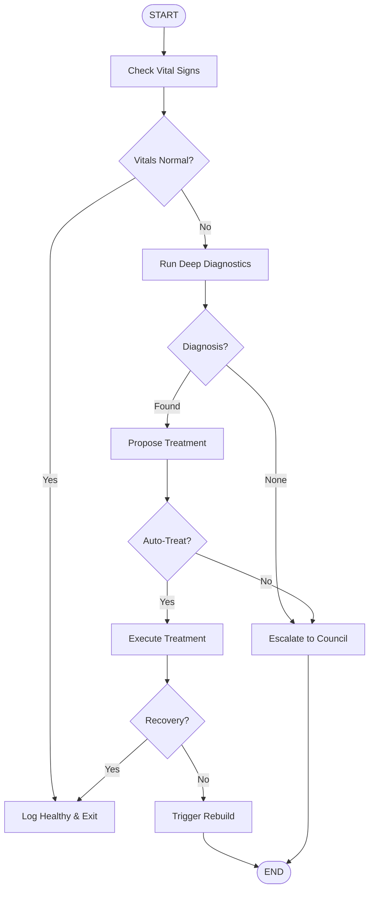

# Self-Healing Domain Operations

## Flow: Domain Health Diagnostic



## API Reference

| Step | Domain Method |
|------|---------------|
| Check Vitals | `domain.checkHealth()` |
| Deep Diagnostics | `domain.autoDiagnose()` |
| Propose Treatment | `domain.proposeTreatment()` |
| Execute Treatment | `domain.applyTreatment()` |
| Trigger Rebuild | `domain.fullRebuild()` |
| Log Health | `DomainPerformanceMonitor.record()` |

## Usage

```typescript
// Trigger diagnostic flow
const orchestrator = new SkillOrchestrator();
await orchestrator.executeFlowSkill('self-healing-domain', myDomain);
```
