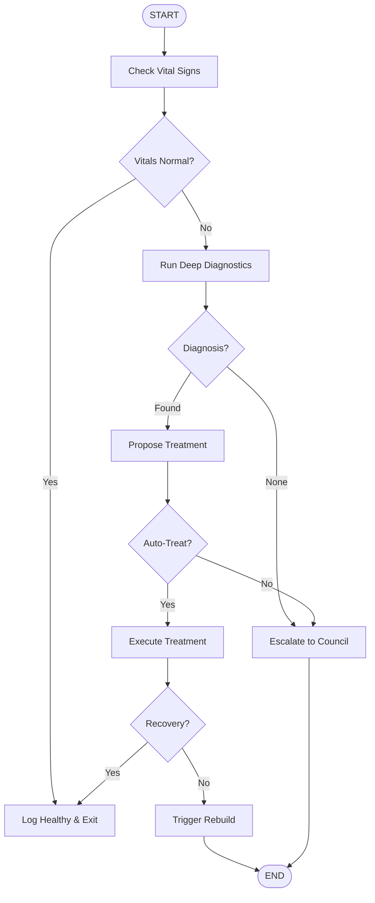

# Self-Healing Domain Operations

## Flow: Domain Health Diagnostic


```mermaid
flowchart TD
    A([START]) --> B[Check Vital Signs]
    B --> C{Vitals Normal?}
    C -->|Yes| D[Log Healthy & Exit]
    C -->|No| E[Run Deep Diagnostics]
    E --> F{Diagnosis?}
    F -->|None| G[Escalate to Council]
    F -->|Found| H[Propose Treatment]
    H --> I{Auto-Treat?}
    I -->|Yes| J[Execute Treatment]
    I -->|No| G
    J --> K{Recovery?}
    K -->|Yes| D
    K -->|No| L[Trigger Rebuild]
    L --> M([END])
    G --> M
```

## API Reference

| Step | Domain Method |
|------|---------------|
| Check Vitals | `domain.checkHealth()` |
| Deep Diagnostics | `domain.autoDiagnose()` |
| Propose Treatment | `domain.proposeTreatment()` |
| Execute Treatment | `domain.applyTreatment()` |
| Trigger Rebuild | `domain.fullRebuild()` |
| Log Health | `DomainPerformanceMonitor.record()` |

## Usage

```typescript
// Trigger diagnostic flow
const orchestrator = new SkillOrchestrator();
await orchestrator.executeFlowSkill('self-healing-domain', myDomain);
```

## Agent tooling

| Tool | Use when |
|------|----------|
| `ast_grep_workflow` | Watch loop with `--effect alert.url=...` after failed recovery |
| `ast_grep_audit` | Scan domain modules before applying auto-treatment |
| `/workflow` | Plan remediation effects with `--dry-run --explain` |

Shared reference: [agent-tooling.md](../references/agent-tooling.md)
