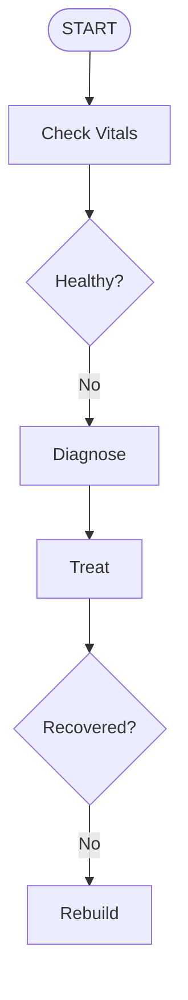

# Dynamic Domain + Kimi Skills Integration

## Overview

Executable domain intelligence layer that bridges Kimi Agent Skills with Dynamic Domain APIs.

## Architecture

```
┌─────────────────────────────────────────────────────────────────────┐
│                     SKILL LAYERS                                     │
├─────────────────────────────────────────────────────────────────────┤
│                                                                      │
│  Layer 1: SKILL.md Files (Knowledge)                                │
│  ├── domain-orchestrator/SKILL.md      (Flow skill)                 │
│  ├── quantum-domain-ops/SKILL.md       (Standard skill)             │
│  ├── self-healing-domain/SKILL.md      (Flow skill)                 │
│  └── bun-v139-playground/SKILL.md      (Standard skill)             │
│                                                                      │
│  Layer 2: SkillOrchestrator (Bridge)                                │
│  ├── loadSkill()       → Parse SKILL.md from RECOMMENDED paths      │
│  ├── parseFrontmatter() → Extract metadata                          │
│  ├── executeFlowSkill() → Run mermaid flows                         │
│  └── executeFlowStep()  → Map to domain methods                     │
│                                                                      │
│  Layer 3: Dynamic Domains (Execution)                               │
│  ├── QuantumDomain      → collapse(), entangleWith()                │
│  ├── SelfHealingDomain  → checkHealth(), autoDiagnose()             │
│  └── DomainPerformanceMonitor → recordEvent()                       │
│                                                                      │
└─────────────────────────────────────────────────────────────────────┘
```

## Skill Types

### Standard Skills (`/skill:<name>`)
Encode operational knowledge and procedures.

**Example: quantum-domain-ops**
- State collapse protocols
- Entanglement management
- Coherence monitoring
- Safety rules

### Flow Skills (`/flow:<name>`)
Encode multi-step automated workflows with mermaid diagrams.

**Example: self-healing-domain**


## API Mapping

| Skill Instruction | Domain Method |
|-------------------|---------------|
| "Check health" | `domain.checkHealth()` |
| "Diagnose" | `domain.autoDiagnose()` |
| "Apply treatment" | `domain.applyTreatment()` |
| "Rebuild" | `domain.fullRebuild()` |
| "Collapse state" | `domain.collapse('property')` |
| "Entangle" | `domain.entangleWith([...])` |
| "Optimize" | `domain.optimize()` |

## Usage

```typescript
import { SkillOrchestrator } from './lib/skill-orchestrator';

// Initialize
const orchestrator = new SkillOrchestrator();

// Load guidance skill
const quantumOps = await orchestrator.loadSkill('quantum-domain-ops');
const info = orchestrator.parseFrontmatter(quantumOps);
console.log(info.description);

// Execute flow skill
const myDomain = getDomain('WR-001-Q'); // QuantumDomain
const results = await orchestrator.executeFlowSkill(
  'self-healing-domain',
  myDomain
);

// Results include each step's execution
for (const result of results) {
  console.log(`${result.step}: ${JSON.stringify(result.result)}`);
}
```

## Skill Discovery (kimi-cli standard)

Priority order (first found wins):
1. Project-level: `.agents/skills/` ← RECOMMENDED
2. User-level: `~/.config/agents/skills/` ← RECOMMENDED
3. Legacy: `~/.kimi/skills/` (symlinked)

## Files

| File | Purpose |
|------|---------|
| `lib/skill-orchestrator.ts` | Core orchestrator implementation |
| `.agents/skills/domain-orchestrator/SKILL.md` | Orchestration flow skill |
| `.agents/skills/quantum-domain-ops/SKILL.md` | Quantum domain procedures |
| `.agents/skills/self-healing-domain/SKILL.md` | Healing workflow skill |

## Integration Points

- **DomainPerformanceMonitor**: Logs all skill executions
- **Bun native**: async/await, fs/promises, path
- **MCP**: Can be called via unified-shell-bridge
- **Kimi CLI**: Skills discoverable via `/skill:name` or `/flow:name`

## Next Steps

1. Implement actual Domain classes with methods
2. Connect DomainPerformanceMonitor
3. Add more domain-specific skills (biological, temporal, etc.)
4. Create flow visualization dashboard
5. Add skill versioning and updates
