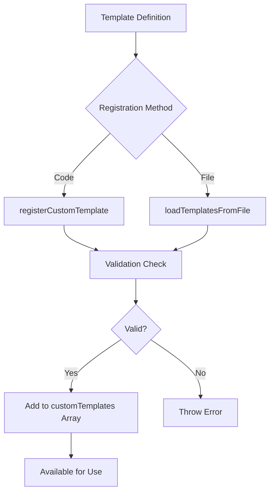

# WikiTemplate Registry & Storage System

## 🏗️ Template Registry Architecture

The `WikiTemplate` system uses a **hybrid registry approach** that combines built-in templates with dynamic custom template registration, providing both reliability and extensibility.

### 📦 Storage Components

#### **1. Built-in Template Registry**
```typescript
// Static built-in templates (hardcoded, always available)
static getWikiTemplates(): WikiTemplate[] {
  const builtInTemplates = [
    {
      name: 'Confluence Integration',
      description: 'Markdown format optimized for Confluence import',
      baseUrl: 'https://yourcompany.atlassian.net/wiki',
      workspace: 'engineering/bun-utilities',
      format: 'markdown',
      includeExamples: true,
      customSections: ['## Integration Notes', '## API Examples'],
    },
    // ... 6 more built-in templates
  ];
  return [...builtInTemplates, ...MCPWikiGenerator.customTemplates];
}
```

#### **2. Dynamic Custom Template Store**
```typescript
export class MCPWikiGenerator {
  private static customTemplates: WikiTemplate[] = []; // In-memory registry
  
  // Registration with validation
  static registerCustomTemplate(template: WikiTemplate): void {
    // Validation and duplicate checking
    const existingIndex = MCPWikiGenerator.customTemplates.findIndex(t => t.name === template.name);
    if (existingIndex >= 0) {
      MCPWikiGenerator.customTemplates[existingIndex] = template; // Update existing
    } else {
      MCPWikiGenerator.customTemplates.push(template); // Add new
    }
  }
}
```

#### **3. External Configuration Store**
```typescript
// File-based template persistence
static async loadTemplatesFromFile(configPath: string): Promise<void> {
  const config = await Bun.file(configPath).json();
  if (config.templates && Array.isArray(config.templates)) {
    for (const template of config.templates) {
      MCPWikiGenerator.registerCustomTemplate(template);
    }
  }
}
```

### 🔄 Template Lifecycle

#### **Registration Flow**


#### **Retrieval Flow**
```typescript
// Templates are merged at retrieval time
static getWikiTemplates(): WikiTemplate[] {
  const builtInTemplates = [/* 7 built-in templates */];
  return [...builtInTemplates, ...MCPWikiGenerator.customTemplates];
}

// Individual template lookup
static async generateFromTemplate(templateName: string): Promise<WikiGenerationResult> {
  const templates = MCPWikiGenerator.getWikiTemplates();
  const template = templates.find(t => t.name === templateName);
  // ... use template for generation
}
```

### 📋 Registry Contents

#### **Built-in Templates (Always Available)**
1. **Confluence Integration** - Markdown for Atlassian Confluence
2. **Notion API** - JSON format for Notion integration  
3. **GitHub Wiki** - Markdown for GitHub Wiki pages
4. **Internal Portal** - HTML for internal documentation portals
5. **API Documentation** - JSON for API documentation systems
6. **Internal Knowledge Base** - HTML for internal KB systems
7. **DevPortal Wiki** - Markdown for developer portal wikis

#### **Custom Templates (Runtime Registered)**
- Stored in memory: `MCPWikiGenerator.customTemplates[]`
- Can be loaded from external JSON files
- Persisted via export functionality
- Override built-in templates with same name

### 🔧 Registry Operations

#### **Registration Methods**

```typescript
// 1. Direct Programmatic Registration
const customTemplate: WikiTemplate = {
  name: 'Slack Knowledge Base',
  description: 'Markdown for Slack knowledge sharing',
  baseUrl: 'https://company.slack.com',
  workspace: 'engineering/bun-utilities',
  format: 'markdown',
  includeExamples: true,
  customSections: ['## Quick Commands', '## Team Contacts']
};

MCPWikiGenerator.registerCustomTemplate(customTemplate);

// 2. Batch Registration from File
await MCPWikiGenerator.loadTemplatesFromFile('./wiki-templates.json');

// 3. Export Current Registry
await MCPWikiGenerator.exportTemplatesToFile('./current-templates.json');
```

#### **Template Discovery**

```typescript
// List all available templates
const allTemplates = MCPWikiGenerator.getWikiTemplates();
console.log('Available templates:');
allTemplates.forEach(template => {
  console.log(`- ${template.name}: ${template.description}`);
});

// Check if template exists
const templateExists = allTemplates.some(t => t.name === 'My Custom Template');

// Get template by name
const template = allTemplates.find(t => t.name === 'GitHub Wiki');
```

### 📁 External Storage Format

#### **Configuration File Structure**
```json
{
  "templates": [
    {
      "name": "Slack Knowledge Base",
      "description": "Markdown format optimized for Slack knowledge sharing",
      "baseUrl": "https://company.slack.com/archives/knowledge",
      "workspace": "engineering/bun-utilities",
      "format": "markdown",
      "includeExamples": true,
      "customSections": ["## Quick Commands", "## Team Contacts"]
    }
  ],
  "exported": "2026-02-07T06:57:00.000Z",
  "version": "1.0.0",
  "validFormats": ["markdown", "html", "json", "all"]
}
```

### 🚀 Usage Examples

#### **Complete Registry Workflow**
```typescript
// 1. Initialize with built-in templates
console.log('Built-in templates:', MCPWikiGenerator.getWikiTemplates().length);

// 2. Register custom templates
MCPWikiGenerator.registerCustomTemplate({
  name: 'Team Wiki',
  format: 'markdown',
  baseUrl: 'https://wiki.team.com',
  workspace: 'team-docs',
  includeExamples: true,
  description: 'Team-specific documentation'
});

// 3. Load from configuration file
await MCPWikiGenerator.loadTemplatesFromFile('./team-templates.json');

// 4. Use any template (built-in or custom)
const result = await MCPWikiGenerator.generateFromTemplate('Team Wiki');

// 5. Export complete registry for backup
await MCPWikiGenerator.exportTemplatesToFile('./backup-templates.json');
```

### 🔍 Registry Management

#### **Template Validation**
```typescript
static registerCustomTemplate(template: WikiTemplate): void {
  // Required field validation
  if (!template.name || !template.baseUrl || !template.format) {
    throw new Error('Template must have name, baseUrl, and format');
  }
  
  // Format validation against WikiFormat union
  const validFormats: WikiFormat[] = ['markdown', 'html', 'json', 'all'];
  if (!validFormats.includes(template.format)) {
    throw new Error(`Invalid format '${template.format}'. Must be one of: ${validFormats.join(', ')}`);
  }
  
  // Duplicate handling (update existing vs add new)
  const existingIndex = MCPWikiGenerator.customTemplates.findIndex(t => t.name === template.name);
  if (existingIndex >= 0) {
    MCPWikiGenerator.customTemplates[existingIndex] = template;
    console.log(`📝 Updated custom template: ${template.name}`);
  } else {
    MCPWikiGenerator.customTemplates.push(template);
    console.log(`📝 Registered custom template: ${template.name}`);
  }
}
```

#### **Registry Statistics**
```typescript
function getRegistryStats() {
  const allTemplates = MCPWikiGenerator.getWikiTemplates();
  const builtInCount = 7; // Fixed number of built-in templates
  const customCount = allTemplates.length - builtInCount;
  
  return {
    total: allTemplates.length,
    builtIn: builtInCount,
    custom: customCount,
    byFormat: {
      markdown: allTemplates.filter(t => t.format === 'markdown').length,
      html: allTemplates.filter(t => t.format === 'html').length,
      json: allTemplates.filter(t => t.format === 'json').length,
      all: allTemplates.filter(t => t.format === 'all').length
    }
  };
}
```

### 🌐 Benefits of This Registry System

1. **Reliability**: Built-in templates always available
2. **Extensibility**: Custom templates can be added at runtime
3. **Persistence**: Templates can be saved/loaded from files
4. **Validation**: Type-safe registration prevents invalid templates
5. **Override Capability**: Custom templates can override built-ins
6. **Discovery**: Unified interface for template enumeration
7. **Backup/Restore**: Complete registry export/import functionality

### 🎯 Best Practices

1. **Use Descriptive Names**: Make templates easily discoverable
2. **Provide Clear Descriptions**: Help users understand template purpose
3. **Validate Custom Sections**: Ensure section names are consistent
4. **Version Control**: Track template changes in configuration files
5. **Regular Backups**: Export registry periodically for disaster recovery
6. **Test Templates**: Validate templates before production deployment

The WikiTemplate registry provides a **robust, extensible system** for managing documentation templates, combining the reliability of built-in templates with the flexibility of dynamic custom template registration!
