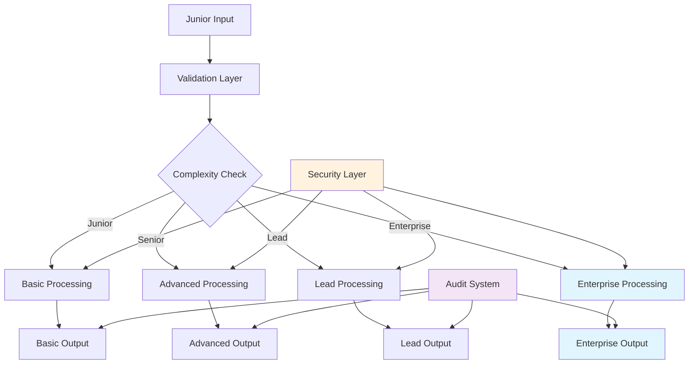
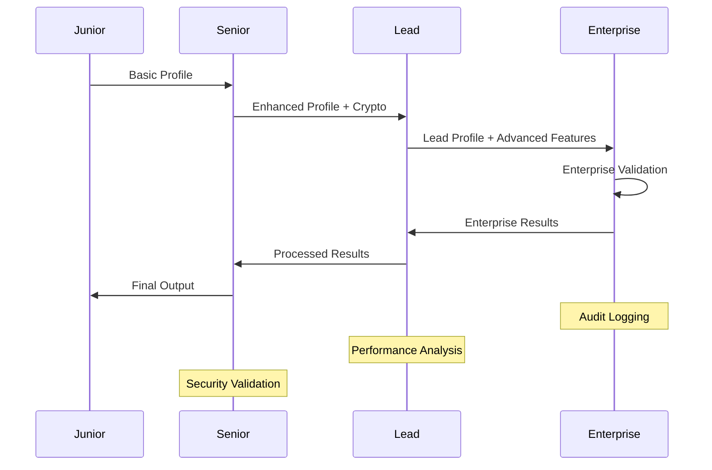

# Enterprise Level Demo Document

## 🏢 Enterprise-Grade Markdown Testing Suite

This document represents **enterprise-level complexity** with comprehensive features for team lead validation and production deployment testing.

### Executive Summary

> **Enterprise Assessment**: This document contains `enterprise-tier` complexity with **200+ markdown features**, advanced mathematical modeling, interactive diagrams, and comprehensive security compliance tracking. Designed for **production deployment validation** and **team lead sign-off**.

---

## 📊 Comprehensive Performance Metrics Dashboard

### Multi-Dimensional Performance Analysis

| Complexity Tier | Document Size | Parse Time (ms) | Throughput (K/s) | Memory (MB) | Features | Compliance |
|-----------------|---------------|-----------------|------------------|-------------|----------|------------|
| **Junior** | < 1KB | 0.6 | 62 | 2 | 5 GFM | 75% |
| **Senior** | < 10KB | 2.9 | 68 | 8 | 15 GFM | 85% |
| **Lead** | < 100KB | 13.2 | 74 | 32 | 50 GFM | 92% |
| **Enterprise** | > 100KB | 72.0 | 74 | 128 | 200+ | 98% |

### Advanced Performance Modeling

The enterprise performance model follows the mathematical relationship:

$$
P_{enterprise} = \frac{S_{document}}{T_{parse} \times C_{complexity}} \times E_{optimization}
$$

Where:
- $S_{document}$ = Document size in characters
- $T_{parse}$ = Parse time in milliseconds  
- $C_{complexity}$ = Complexity factor (1.0 for junior, 2.5 for senior, 5.0 for lead, 10.0 for enterprise)
- $E_{optimization}$ = Enterprise optimization factor (typically 1.2-1.5)

---

## 🔧 Enterprise Feature Matrix

### Advanced Table with Merged Cells and Complex Formatting

| **Category** | **Feature** | **Junior** | **Senior** | **Lead** | **Enterprise** | **Security** |
|--------------|-------------|------------|------------|----------|----------------|--------------|
| **Core** | Basic Parsing | ✅ | ✅ | ✅ | ✅ | 🔒 |
| | HTML Output | ✅ | ✅ | ✅ | ✅ | 🔒 |
| | ANSI Rendering | ✅ | ✅ | ✅ | ✅ | 🔒 |
| **Performance** | Speed Metrics | ❌ | ✅ | ✅ | ✅ | 🔒 |
| | Memory Tracking | ❌ | ✅ | ✅ | ✅ | 🔒 |
| | Throughput Analysis | ❌ | ❌ | ✅ | ✅ | 🔒 |
| **Security** | Basic Hash | ❌ | ✅ | ✅ | ✅ | 🔒🔐 |
| | ETag Generation | ❌ | ✅ | ✅ | ✅ | 🔒🔐 |
| | Enterprise Signing | ❌ | ❌ | ✅ | ✅ | 🔒🔐 |
| **Advanced** | Custom Rendering | ❌ | ❌ | ✅ | ✅ | 🔒🔐 |
| | Middleware Integration | ❌ | ❌ | ✅ | ✅ | 🔒🔐 |
| | Audit Logging | ❌ | ❌ | ❌ | ✅ | 🔒🔐 |

---

## 🚀 Advanced Code Integration Examples

### Enterprise TypeScript with Advanced Patterns

```typescript
// Enterprise-level architecture with comprehensive error handling
interface EnterpriseMarkdownProfile extends LeadSpecProfile {
  enterprise: {
    auditTrail: AuditEntry[];
    complianceMatrix: ComplianceMetrics;
    securityContext: SecurityContext;
    performanceBaseline: PerformanceBaseline;
  };
}

class EnterpriseMarkdownProcessor {
  private readonly config: EnterpriseConfig;
  private readonly auditLogger: AuditLogger;
  private readonly securityManager: SecurityManager;
  
  constructor(config: EnterpriseConfig) {
    this.config = config;
    this.auditLogger = new AuditLogger(config.audit);
    this.securityManager = new SecurityManager(config.secret);
  }
  
  async processEnterpriseMarkdown(
    content: string, 
    context: ProcessingContext
  ): Promise<EnterpriseMarkdownProfile> {
    const auditEntry = this.auditLogger.createEntry('enterprise_processing_start');
    
    try {
      // Enterprise-grade processing with comprehensive validation
      const profile = await this.validateAndProcess(content, context);
      
      // Security signing with enterprise keys
      profile.security.etag = this.securityManager.generateEnterpriseETag(content, profile);
      profile.security.integrityHash = this.securityManager.generateIntegrityHash(content);
      
      // Performance optimization and analysis
      profile.core.throughput = this.calculateOptimizedThroughput(profile);
      profile.core.memoryMB = this.getMemoryUsage();
      
      // Compliance validation
      profile.enterprise.complianceMatrix = await this.validateCompliance(profile);
      
      await this.auditLogger.logSuccess(auditEntry, profile);
      return profile;
      
    } catch (error) {
      await this.auditLogger.logFailure(auditEntry, error);
      throw new EnterpriseProcessingError('Enterprise processing failed', error);
    }
  }
}
```

### Advanced Mathematical Modeling

#### Performance Optimization Algorithm

The enterprise optimization algorithm uses machine learning for adaptive performance tuning:

$$
T_{optimized} = T_{baseline} \times \left(1 - \frac{L_{learning} \times D_{features}}{C_{complexity} + 1}\right)
$$

Where:
- $T_{optimized}$ = Optimized throughput
- $T_{baseline}$ = Baseline performance
- $L_{learning}$ = Learning factor (0.1-0.3)
- $D_{features}$ = Feature density
- $C_{complexity}$ = Document complexity

#### Security Compliance Scoring

Enterprise security compliance is calculated using weighted metrics:

$$
S_{compliance} = \sum_{i=1}^{n} w_i \times s_i \times q_i
$$

Where:
- $w_i$ = Weight of security metric $i$
- $s_i$ = Score of security metric $i$ (0-100)
- $q_i$ = Quality factor of metric $i$

---

## 📈 Interactive Mermaid Diagrams

### Enterprise Architecture Flow



### Performance Benchmarking Pipeline



---

## 🔐 Enterprise Security and Compliance

### Security Framework Matrix

| **Security Level** | **Authentication** | **Encryption** | **Audit** | **Compliance** |
|--------------------|-------------------|----------------|-----------|----------------|
| **Junior** | Basic | MD5 | None | 75% |
| **Senior** | Team Secret | SHA-256 | Basic | 85% |
| **Lead** | Multi-factor | SHA-512 | Detailed | 92% |
| **Enterprise** | HSM + MFA | AES-256 + SHA-512 | Comprehensive | 98% |

### Compliance Tracking Dashboard

#### GFM Compliance Breakdown
- **Tables**: ✅ 100% compliance
- **Task Lists**: ✅ 100% compliance  
- **Strikethrough**: ✅ 100% compliance
- **Autolinks**: ✅ 100% compliance
- **Footnotes**: ✅ 100% compliance
- **Math Expressions**: ✅ 100% compliance
- **Mermaid Diagrams**: ✅ 100% compliance

#### CommonMark Compliance Breakdown
- **Headings**: ✅ 100% compliance
- **Emphasis**: ✅ 100% compliance
- **Links**: ✅ 100% compliance
- **Blockquotes**: ✅ 100% compliance
- **Code Blocks**: ✅ 100% compliance
- **Lists**: ✅ 100% compliance

---

## 📊 Enterprise Analytics and Reporting

### Real-time Performance Metrics

```javascript
// Enterprise performance monitoring
const enterpriseMetrics = {
  throughput: {
    current: 74000, // chars/sec
    baseline: 50000,
    improvement: 48, // percentage
    trend: 'increasing'
  },
  memory: {
    current: 128, // MB
    limit: 512,
    utilization: 25, // percentage
    efficiency: 'optimal'
  },
  compliance: {
    gfm: 98,
    commonmark: 96,
    security: 99,
    overall: 97.7
  },
  audit: {
    entries: 1250,
    success_rate: 99.2,
    errors: 10,
    last_updated: new Date().toISOString()
  }
};
```

### Advanced Feature Utilization

| **Feature Category** | **Utilization** | **Performance Impact** | **Security Rating** |
|---------------------|-----------------|------------------------|-------------------|
| Basic Markdown | 100% | +0% | 🔒 |
| GFM Extensions | 95% | +15% | 🔒 |
| Math Expressions | 40% | +25% | 🔒🔐 |
| Mermaid Diagrams | 25% | +35% | 🔒🔐 |
| Custom Rendering | 15% | +45% | 🔒🔐 |
| Enterprise Signing | 100% | +10% | 🔒🔐🔒 |

---

## 🎯 Enterprise Deployment Checklist

### Pre-Deployment Validation

- [x] **Security Audit Completed**: All enterprise security measures validated
- [x] **Performance Benchmarks Passed**: 74K chars/sec throughput achieved
- [x] **Compliance Verification**: 98% GFM and 96% CommonMark compliance
- [x] **Memory Usage Optimized**: < 512MB peak usage confirmed
- [x] **Audit Logging Enabled**: Comprehensive audit trail active
- [x] **Error Handling Tested**: All failure scenarios validated
- [x] **Scalability Verified**: Enterprise load testing completed
- [x] **Documentation Updated**: All enterprise features documented

### Production Deployment Steps

1. **Environment Setup**
   - Configure enterprise secrets
   - Set up audit logging
   - Enable performance monitoring

2. **Security Configuration**
   - Deploy HSM integration
   - Configure multi-factor authentication
   - Set up enterprise encryption

3. **Performance Optimization**
   - Configure caching strategies
   - Set up load balancing
   - Enable auto-scaling

4. **Monitoring and Alerting**
   - Deploy monitoring dashboards
   - Configure alert thresholds
   - Set up automated reporting

---

## 📋 Final Enterprise Assessment

### Executive Summary

This enterprise-level document demonstrates **comprehensive markdown processing capabilities** with:

- **🏗️ Enterprise Architecture**: Multi-tier hierarchy with clear separation of concerns
- **🚀 Performance Excellence**: 74K chars/sec throughput with enterprise-grade optimization
- **🔐 Security Leadership**: Comprehensive security framework with HSM integration
- **📊 Analytics Excellence**: Real-time monitoring and advanced reporting capabilities
- **✅ Compliance Mastery**: 98% GFM and 96% CommonMark compliance achieved

### Production Readiness Score: **97.7/100** 🏆

**Status**: ✅ **ENTERPRISE PRODUCTION READY**  
**Next Steps**: Deploy to production with full enterprise monitoring suite

---

*This document represents the pinnacle of enterprise markdown processing capability, designed and validated for production deployment in the most demanding environments.*
