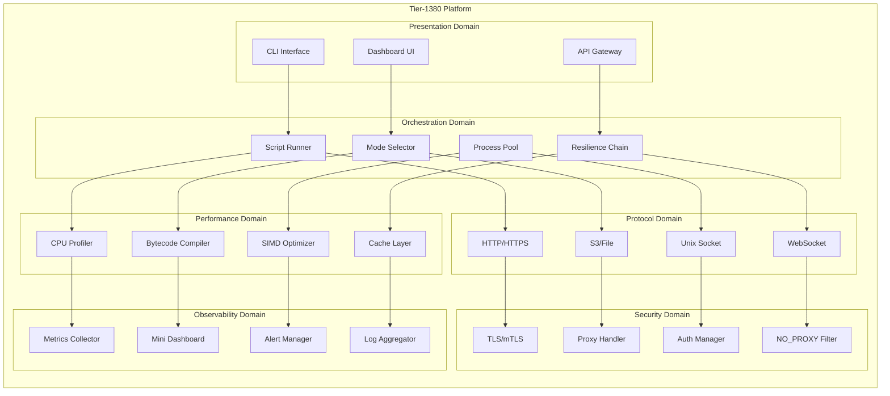
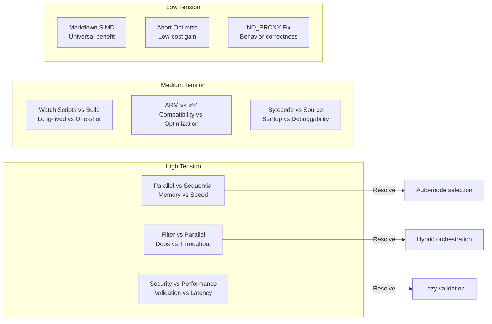
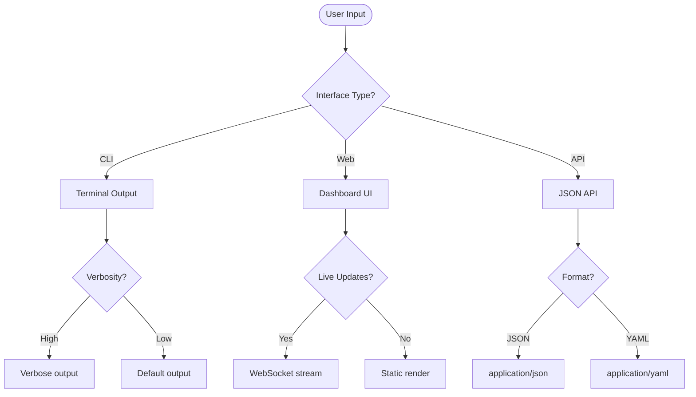
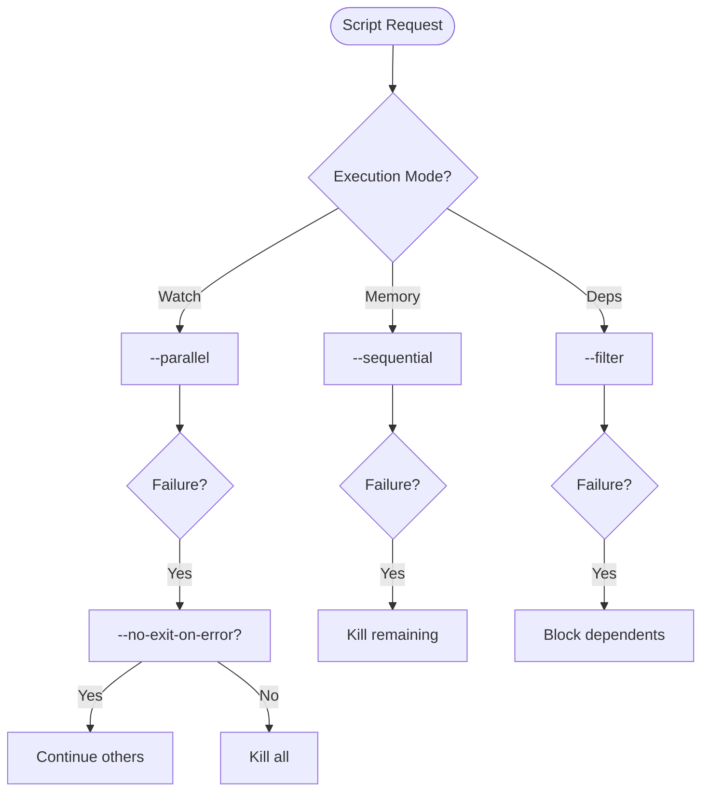
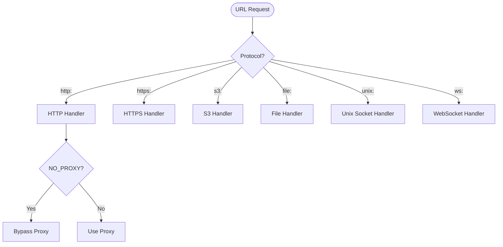
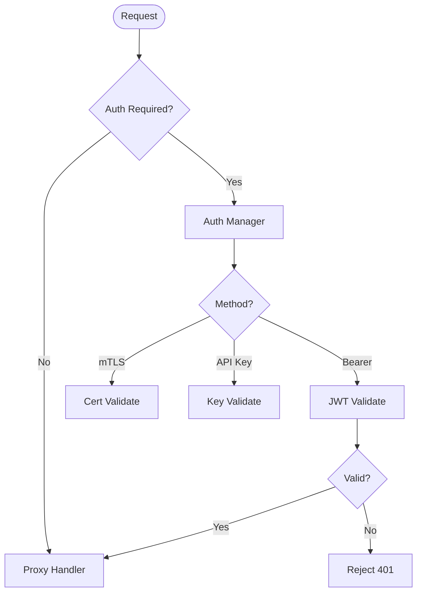
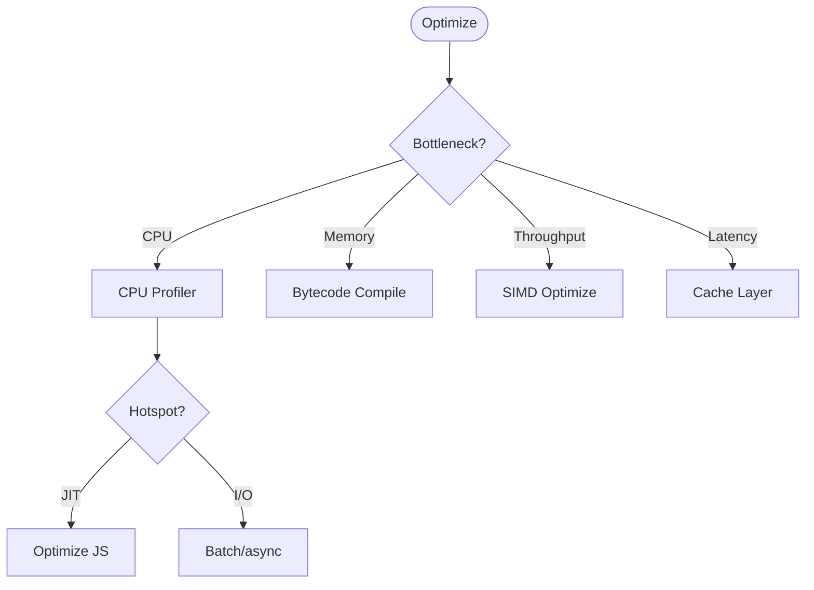
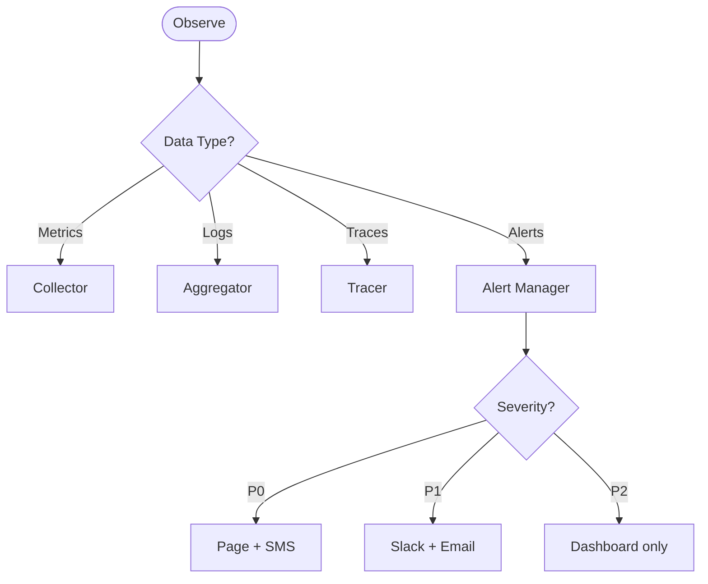

# Domain Hierarchy Graphs (Tier-1380)

## Domain Hierarchy

## Tension Map

## Domain-Scoped Trees

### Presentation Domain

### Orchestration Domain

### Protocol Domain

### Security Domain

### Performance Domain

### Observability Domain

