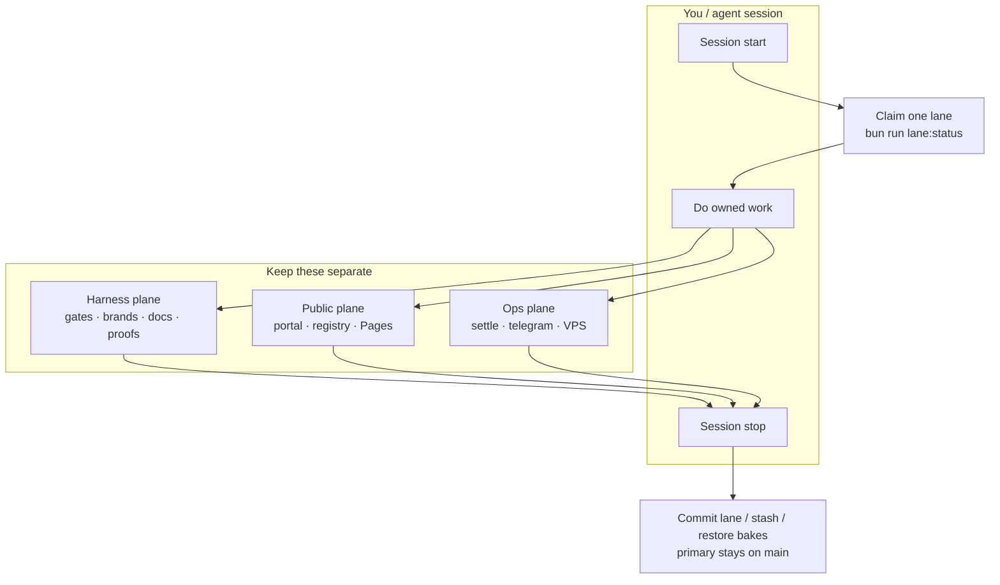
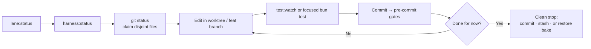
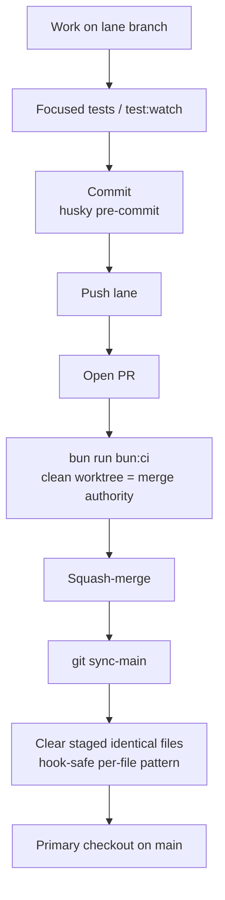
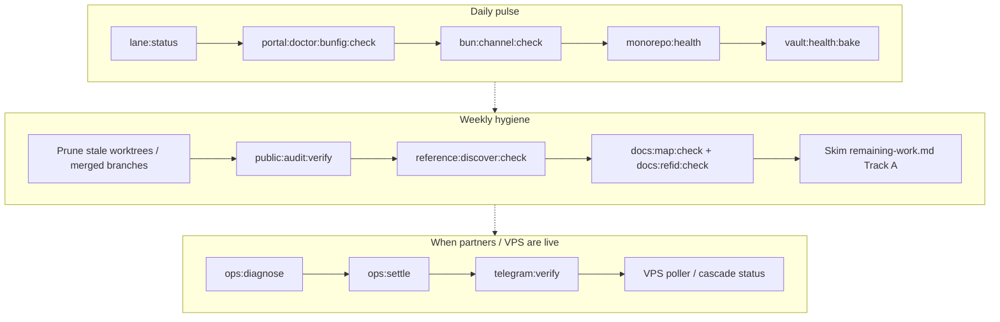
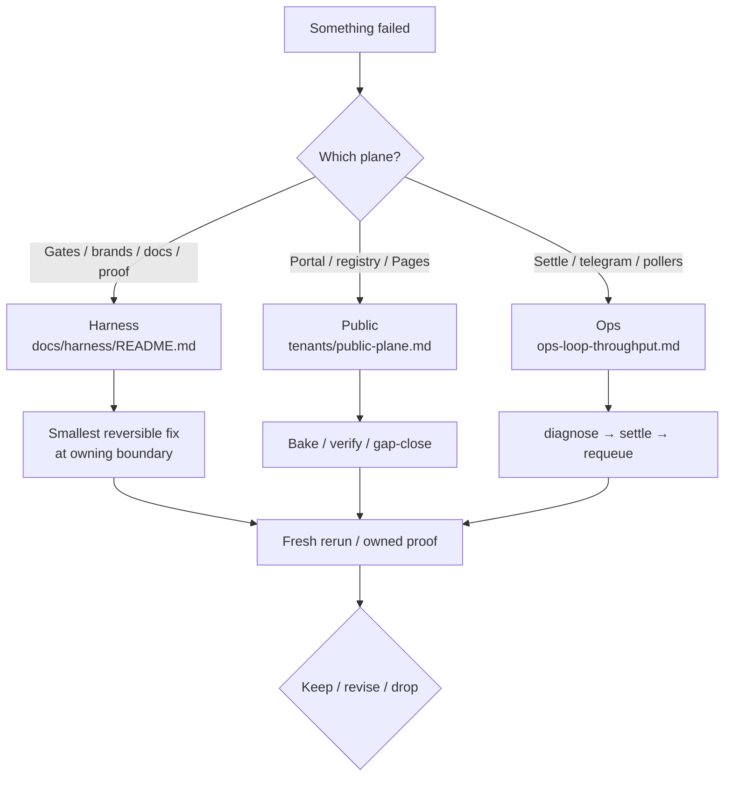
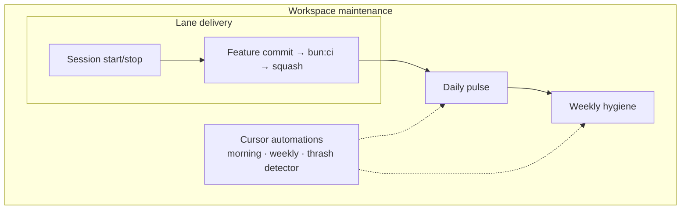

# Tenant: maintain-workspace

**Tenant** `maintain-workspace` (operator runbook — not a spine cron)  
**Purpose** Keep project-R-score + workspace maintainable: lanes, delivery,
daily/weekly pulses, Cursor automations  
**Related** [`AUTHORITY.md`](../AUTHORITY.md) · [`day-loop.md`](../day-loop.md)
· [`workspace-lane-cross-map.md`](workspace-lane-cross-map.md) ·
[`remaining-work.md`](remaining-work.md) ·
[`portal-doctor.md`](portal-doctor.md) · [`public-plane.md`](public-plane.md) ·
[`ops-loop-throughput.md`](ops-loop-throughput.md)  
**Skills** `.agents/skills/project-r-ops-management/` ·
`.agents/skills/harness-improve/`

Operator map for “how do I maintain this workspace?” — diagrams + exact
commands + copy-paste Cursor automation prompts.

## Three planes

Claim **one plane per session** (or one subdirectory lane). Mixing planes is the
usual thrash source.

| Plane   | Protects                        | Entry                                                                       |
| ------- | ------------------------------- | --------------------------------------------------------------------------- |
| Harness | gates · brands · docs · proofs  | [`../README.md`](../README.md) · `bun run harness:status`                   |
| Public  | portal · registry bakes · Pages | [`public-plane.md`](public-plane.md) · `bun run public:audit:verify`        |
| Ops     | settle · telegram · VPS pollers | [`ops-loop-throughput.md`](ops-loop-throughput.md) · `bun run ops:diagnose` |



## Session start / stop

```bash
# Start
bun run lane:status          # or --json for agents
bun run harness:status
git status                   # claim disjoint paths before edit

# Stop
# Commit on the lane branch, or:
#   git stash push -u -m "<lane> <date>"
# Bake artifacts: own chore(bake) commit, or git restore public/registry
# Primary checkout tracks main only — never a feat branch
```



## Feature delivery (local merge authority)

Hosted GitHub Actions is a side-signal. Clean local `bun run bun:ci` is merge
authority ([`AUTHORITY.md`](../AUTHORITY.md)).

```bash
# Develop
bun run test:watch                 # or: bun test <owned files>
# Commit → husky pre-commit
git push -u origin HEAD:refs/heads/<lane>
# Open PR from template .github/pull_request_template.md

# Before merge (clean worktree)
bun run bun:ci

# After squash-merge
git sync-main
# Clear staged identical files (hook-safe, per path):
#   git show origin/main:<path> > <path> && git add <path>
```



## Daily pulse

Short honesty check. Fix the owning surface; do not weaken gates.

```bash
bun run pulse:lane                 # parallel: lane:status:count + harness:status
bun run lane:status                # full tables (or --json / --jsonl / --short)
bun run portal:doctor:bunfig:check
bun run bun:channel:check
bun run monorepo:health
bun run vault:health:bake    # when Proton / env available
```

## Weekly hygiene

```bash
bun run lane:status
# Remove clean worktrees idle >7 days (quarantine non-empty diffs first)
# Prune branches already merged into origin/main

bun run public:audit:verify
bun run verify:portal:static
bun run reference:discover:check
bun run docs:map:check
bun run docs:refid:check
# Skim human-only leftovers:
#   docs/harness/tenants/remaining-work.md  (Track A)
```



## Ops / runtime (live partners)

Keep separate from harness code work:

```bash
bun run ops:diagnose
bun run ops:settle
# when needed:
bun run ops:outbox:requeue
bun run telegram:verify
```

VPS poller / cascade: see cascade-mover runbook
(`.agents/skills/cascade-mover-v3/`). Token reseed only when the JWT refresh
loop breaks.

## Failure routing



Repeated gate thrash →
[`.agents/skills/harness-improve/`](../../../.agents/skills/harness-improve/SKILL.md)
(earliest failed handoff → smallest reversible fix → fresh rerun).

## Nesting (how the loops compose)



## Cursor automation prompts

Paste into a Cursor Automation. Do **not** commit, push, deploy, or touch
foreign dirty lanes. Report only; open a draft note or issue when something
fails.

### Morning pulse

```text
You are the FactoryWager morning pulse. Read docs/harness/tenants/maintain-workspace.md.

Run (read-only unless a command is explicitly a check):
1. bun run lane:status --json
2. bun run harness:status
3. bun run portal:doctor:bunfig:check
4. bun run bun:channel:check
5. bun run monorepo:health

Summarize in ≤12 bullets:
- STALE / dirty worktrees and whether primary is on main
- First failing check (command + one-line cause)
- Recommended plane to claim today (harness / public / ops)
- Human-only leftovers worth glancing at (remaining-work.md Track A) if relevant

Do not edit files. Do not git commit or push. Do not weaken gates.
```

### Weekly hygiene

```text
You are the FactoryWager weekly hygiene sweep. Read docs/harness/tenants/maintain-workspace.md § Weekly hygiene.

Run:
1. bun run lane:status --json
2. bun run public:audit:verify
3. bun run verify:portal:static
4. bun run reference:discover:check
5. bun run docs:map:check
6. bun run docs:refid:check

Then skim docs/harness/tenants/remaining-work.md Track A for open human items.

Output:
- Pass/fail table for each command
- Worktrees idle >7 days that look safe to remove (list only; do not remove)
- Branches already merged to origin/main that look pruneable (list only)
- Top 3 actionable follow-ups with owning plane + exact next command

Do not delete worktrees, prune branches, commit, or push unless the user explicitly asks in a follow-up.
```

### Harness thrash detector

```text
You are the FactoryWager harness thrash detector. Trigger when the same pre-commit / day-loop gate has failed ≥3 times in this conversation or the user pastes repeated gate failures.

Read:
- docs/harness/tenants/maintain-workspace.md § Failure routing
- .agents/skills/harness-improve/SKILL.md
- docs/harness/FEEDBACK.md

Job:
1. Name the earliest failed handoff (context | capability | domain ownership | authority | proof | feedback).
2. Name the owning doc from docs/harness/README.md (one hop).
3. Propose the smallest reversible fix at that owner.
4. Give the exact fresh-rerun / proof command to paste after the fix.
5. Do not weaken graders or skip hooks.
```

## Adoption order

1. Lock session start/stop + delivery loop
2. Add the daily pulse
3. Automate weekly hygiene (Cursor prompt above)
4. Deepen ops/runtime only when partners / VPS are live

## Prove / refresh

No spine claim — operator contract. Sanity:

```bash
bun run lane:status
bun run harness:status
# optional deeper:
bun run portal:doctor:bunfig:check
bun run discover:compose:check
```
