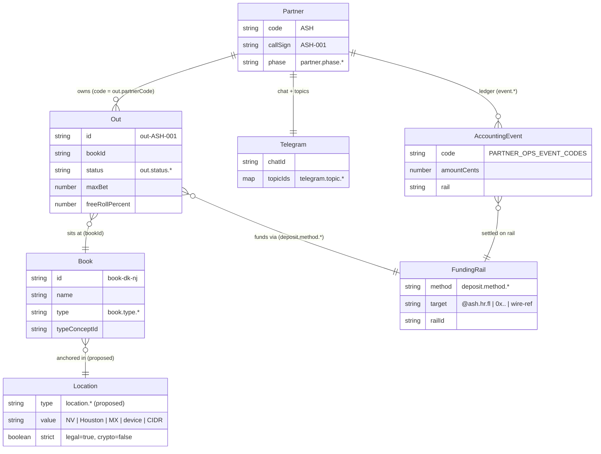
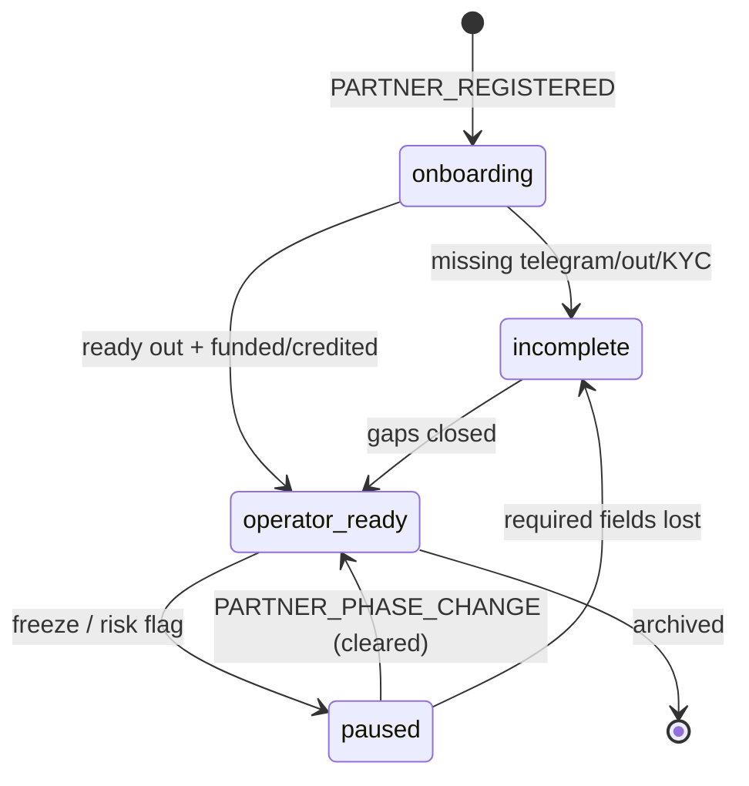
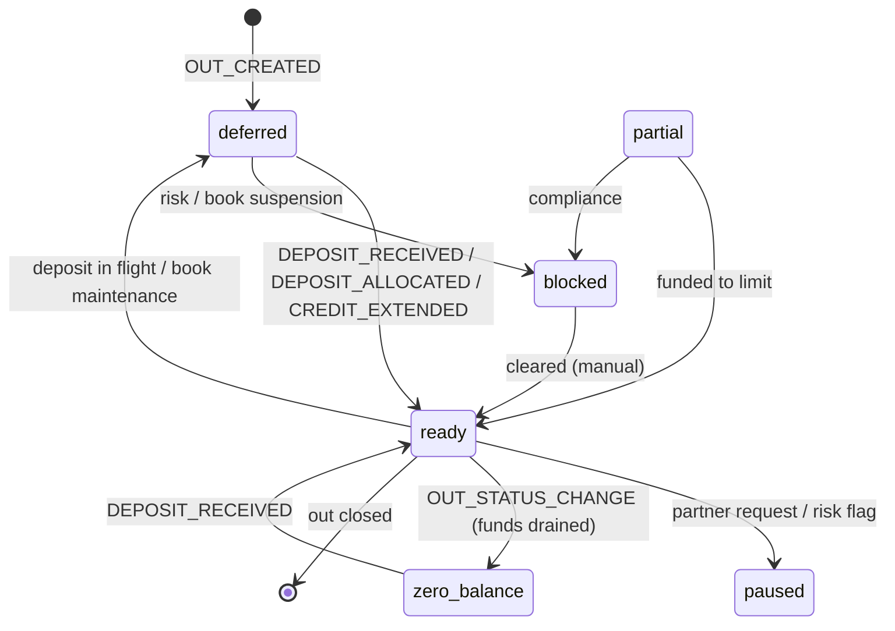

# Partner-Ops Domain Map

Cross-repo domain model for the seat capital desk — **Kalshi-bot** owns shared
glossary cores, **FactoryWager** owns the Factory overlay, the color kernel, and
the registry bake.

| Home | Module | Role |
|------|--------|------|
| Kalshi-bot | `src/institutions/glossary.ts` | Shared cores: `partner.phase.*`, `book.type.*`, `deposit.method.{venmo,crypto,wire,credit}`, `out.status.{ready,deferred,paused}`, `accounting.*`, `event.*` (31 ids) |
| Kalshi-bot | `scripts/partners-validate.ts` | Gate: core ids exist, correct kind, valid ColorKey, on `PAGE_SURFACES.ops` |
| FactoryWager | `lib/telegram/partner-ops-glossary.ts` | Factory overlay: `deposit.method.{cashapp,paypal,zelle,apple_pay,unknown}`, `out.status.{blocked,partial,funded}`, `telegram.topic.*`, `partner.ops.event` (14 ids) |
| FactoryWager | `lib/telegram/partner-ops-color-kernel.ts` | `PARTNER_OPS_COLORS` (9-key closed palette, Bun.color-validated) + `PARTNER_OPS_CONCEPT_COLORS` (33 concept→key) |
| FactoryWager | `lib/telegram/partner-ops-events.ts` | 11 event codes (`PARTNER_OPS_EVENT_CODES`) |
| FactoryWager | `lib/telegram/partner-ops-registry.ts` | Registry bake (`factorywager.partners-ops.v2` → `/registry/partners-ops.json`) |
| FactoryWager | `tools/partners-ops.ts` | CLI: `bun run partners:validate` / `partners:build` / `partners:ledger:append` |

**Status legend:** 🟢 shipped · 🟡 rename→deprecate (proposed) · 🟠 proposed-new (not implemented) · ⚪ doc-missed (shipped, omitted by source doc)

---

## 1. Reconciliation — proposed model vs. shipped reality

Source: 40 concept entries proposed in the seat-capital desk domain model.
Against the 45 real concepts (31 Kalshi cores + 14 Factory overlay).

### 1.1 Shipped cores (13/40) — already in Kalshi-bot glossary

| Concept | Kind | Kernel key |
|---------|------|-----------|
| `partner.phase.onboarding` | ui | middleware |
| `partner.phase.operator_ready` | ui | tennis |
| `partner.phase.incomplete` | ui | trading |
| `partner.phase.paused` | ui | env |
| `book.type.legal` | ui | kalshi |
| `book.type.offshore` | ui | polymarket |
| `book.type.pph` | ui | pinnacle |
| `book.type.crypto` | ui | middleware |
| `deposit.method.venmo` | ui | trading |
| `deposit.method.wire` | ui | kalshi |
| `out.status.ready` | ui | tennis |
| `out.status.deferred` | ui | middleware |
| `out.status.paused` | ui | env |

### 1.2 Shipped overlay (8/40) — already in FactoryWager overlay glossary

| Concept | Kernel key |
|---------|-----------|
| `deposit.method.cashapp` | trading |
| `deposit.method.zelle` | polymarket |
| `deposit.method.paypal` | kalshi |
| `telegram.topic.general` | env |
| `telegram.topic.ops` | kalshi |
| `telegram.topic.alerts` | trading |
| `telegram.topic.liquidity` | polymarket |
| `telegram.topic.accounting` | tennis |

### 1.3 Rename-with-deprecation (5/40) — proposed renames of shipped cores

Depicts `accounting.*` renamed to the doc's `*_received|_processed|_extended|_applied|_confirmed` forms. If implemented: old id gets `status: "deprecated"` + `deprecatedBy` → new id; color kernel map updated.

| Current (shipped) | Proposed | Kernel key (inherited) |
|-------------------|----------|------------------------|
| `accounting.deposit` | `accounting.deposit_received` | tennis |
| `accounting.withdrawal` | `accounting.withdrawal_processed` | trading |
| `accounting.credit` | `accounting.credit_extended` | kalshi |
| `accounting.free_roll` | `accounting.free_roll_applied` | research |
| `accounting.settlement` | `accounting.settlement_confirmed` | polymarket |

### 1.4 Proposed-new (13/40) — not implemented anywhere

| Concept | Kind (proposed) | Kernel key (proposed) |
|---------|-----------------|-----------------------|
| `deposit.method.btc` | ui | tennis |
| `deposit.method.eth` | ui | polymarket |
| `deposit.method.usdt` | ui | kalshi |
| `deposit.method.cash` | ui | env |
| `out.status.zero_balance` | ui | env |
| `accounting.credit_repaid` | composite | polymarket |
| `accounting.fee_deducted` | composite | env |
| `location.state` | composite | kalshi |
| `location.city` | composite | pinnacle |
| `location.country` | composite | polymarket |
| `location.device` | composite | env |
| `location.ip` | composite | env |
| `telegram.bot` | ui | middleware |

### 1.5 Doc-missed (5 shipped concepts the source doc omitted)

`out.status.blocked` (trading) · `out.status.partial` (middleware) ·
`out.status.funded` (tennis) · `deposit.method.apple_pay` (env) ·
`deposit.method.unknown` (unknown)

### 1.6 Count reconciliation

| Claim | Reality |
|-------|---------|
| 47 new glossary entries | 40 listed (internal inconsistency); 21 already shipped, 5 renames, 13 new |
| 10 funding methods (§4) | 9 listed |
| 36 color-mapped ids | 33 in `PARTNER_OPS_CONCEPT_COLORS` |
| `category: "ops"` | not a valid category in either taxonomy |

---

## 2. Corrections — doc claims vs. real modules

| Doc claim | Reality |
|-----------|---------|
| `src/lib/shared/glossary.ts` | `src/institutions/glossary.ts` (Kalshi-bot) |
| `src/lib/partner-registry.ts` | `lib/telegram/partner-ops-registry.ts` (FactoryWager) — already exists |
| `scripts/validate-partners.ts` | `tools/partners-ops.ts` (FactoryWager) · `scripts/partners-validate.ts` (Kalshi-bot) |
| `category: "ops"` | Kalshi: `market\|model\|tournament\|warehouse\|trading\|ui\|pipeline\|other` · Overlay: `trading\|pipeline\|ui\|warehouse` |
| `type: "enum"` field | Not on `GlossaryEntry` — use `values?: string[]` + `valueLabels?: Record<string,string>` |
| `tennisGreen`/`middlewareYellow`/`tradingRed`/`neutralGray`/`successGreen`/`infoBlue`/`warningOrange`/`poly` | Kernel keys: `tennis`/`middleware`/`trading`/`env`/`tennis`/`kalshi`/`research`/`polymarket` (see §3) |
| `color: "kalshi"`, `color: "pinnacle"` | ✅ valid kernel keys as-is |
| `kind: "ui"` + `category: "ops"` for states; `composite` for accounting | Shipped impl: `ui`/`composite` kinds; categories `trading`/`pipeline`/`warehouse`/`ui` |
| `Out.balance` / `Partner.accounting.totalX` registry shape | Real: `PartnersOpsOut` (funding, maxBet, freeRollPercent, status, incomplete) · `PartnersOpsPartner.accounting` (fundStatus, incompleteOuts, deposits, credits, freeRoll, ledger) |

---

## 3. Color legend (real kernel — `PARTNER_OPS_CONCEPT_COLORS` → `partnerOpsColorWire()`)

Verified by importing `lib/telegram/partner-ops-color-kernel.ts` (module-level `Bun.color` checks pass).

### 3.1 Closed palette (9 keys)

| Key | HEX | Semantic |
|-----|-----|----------|
| `tennis` | `#3FB950` | green — live / healthy / funded |
| `middleware` | `#D29922` | yellow — caution / gate / pending |
| `trading` | `#F85149` | red — risk / real money / blocked |
| `env` | `#8B949E` | gray — neutral / config |
| `kalshi` | `#58A6FF` | blue — venue identity / wire |
| `polymarket` | `#1F6FEB` | deep blue — venue / crypto rail |
| `pinnacle` | `#A371F7` | purple — venue / PPH |
| `research` | `#F0883E` | orange — discovery / credit |
| `unknown` | `#8B949E` | gray — unmapped |

### 3.2 Shipped concept colors (33, from kernel)

| Concept | Key | HEX |
|---------|-----|-----|
| `partner.phase.operator_ready` | tennis | `#3FB950` |
| `partner.phase.onboarding` | middleware | `#D29922` |
| `partner.phase.incomplete` | trading | `#F85149` |
| `partner.phase.paused` | env | `#8B949E` |
| `book.type.legal` | kalshi | `#58A6FF` |
| `book.type.offshore` | polymarket | `#1F6FEB` |
| `book.type.pph` | pinnacle | `#A371F7` |
| `book.type.crypto` | middleware | `#D29922` |
| `deposit.method.venmo` | trading | `#F85149` |
| `deposit.method.crypto` | tennis | `#3FB950` |
| `deposit.method.wire` | kalshi | `#58A6FF` |
| `deposit.method.credit` | research | `#F0883E` |
| `deposit.method.cashapp` | trading | `#F85149` |
| `deposit.method.paypal` | kalshi | `#58A6FF` |
| `deposit.method.zelle` | polymarket | `#1F6FEB` |
| `deposit.method.apple_pay` | env | `#8B949E` |
| `deposit.method.unknown` | unknown | `#8B949E` |
| `out.status.ready` | tennis | `#3FB950` |
| `out.status.deferred` | middleware | `#D29922` |
| `out.status.paused` | env | `#8B949E` |
| `out.status.blocked` | trading | `#F85149` |
| `out.status.partial` | middleware | `#D29922` |
| `out.status.funded` | tennis | `#3FB950` |
| `accounting.deposit` | tennis | `#3FB950` |
| `accounting.withdrawal` | trading | `#F85149` |
| `accounting.credit` | kalshi | `#58A6FF` |
| `accounting.free_roll` | research | `#F0883E` |
| `accounting.settlement` | polymarket | `#1F6FEB` |
| `telegram.topic.general` | env | `#8B949E` |
| `telegram.topic.ops` | kalshi | `#58A6FF` |
| `telegram.topic.alerts` | trading | `#F85149` |
| `telegram.topic.liquidity` | polymarket | `#1F6FEB` |
| `telegram.topic.accounting` | tennis | `#3FB950` |

### 3.3 Proposed-new concept colors (closed palette only — no extension)

| Concept | Key | HEX |
|---------|-----|-----|
| `deposit.method.btc` | tennis | `#3FB950` |
| `deposit.method.eth` | polymarket | `#1F6FEB` |
| `deposit.method.usdt` | kalshi | `#58A6FF` |
| `deposit.method.cash` | env | `#8B949E` |
| `out.status.zero_balance` | env | `#8B949E` |
| `accounting.credit_repaid` | polymarket | `#1F6FEB` |
| `accounting.fee_deducted` | env | `#8B949E` |
| `location.state` | kalshi | `#58A6FF` |
| `location.city` | pinnacle | `#A371F7` |
| `location.country` | polymarket | `#1F6FEB` |
| `location.device` | env | `#8B949E` |
| `location.ip` | env | `#8B949E` |
| `telegram.bot` | middleware | `#D29922` |

Renames inherit predecessor keys (§1.3): `deposit_received→tennis`, `withdrawal_processed→trading`, `credit_extended→kalshi`, `free_roll_applied→research`, `settlement_confirmed→polymarket`.

---

## 4. Semantic translation — doc's invented ColorKeys → real kernel keys

| Doc's name | Real kernel key | HEX | Used for (doc) |
|------------|-----------------|-----|----------------|
| `tennisGreen` | `tennis` | `#3FB950` | operator_ready, ready, deposit_received, settlement |
| `successGreen` | `tennis` | `#3FB950` | cashapp, settlement_confirmed |
| `middlewareYellow` | `middleware` | `#D29922` | onboarding, deferred, telegram.bot |
| `tradingRed` | `trading` | `#F85149` | incomplete, venmo, paused, alerts |
| `warningOrange` | `research` | `#F0883E` | paypal, zero_balance, free_roll, credit |
| `infoBlue` | `kalshi` | `#58A6FF` | zelle |
| `neutralGray` | `env` | `#8B949E` | paused, cash, general, fee_deducted |
| `poly` | `polymarket` | `#1F6FEB` | eth, credit_repaid, settlement |
| `kalshi` | `kalshi` | `#58A6FF` | ✅ already valid |
| `pinnacle` | `pinnacle` | `#A371F7` | ✅ already valid |

**Rule:** the color kernel is a closed 9-key palette (`PARTNER_OPS_COLORS`). Invented names are never added — they translate to the nearest semantic token.

---

## 5. Entity map (`erDiagram`)

Real entities from `lib/telegram/partner-ops-registry.ts` (`PartnersOpsPartner` /
`PartnersOpsOut` / `PartnersOpsBook`); `Location` is proposed (doc §8).

---

## 6. Partner phase state machine (`stateDiagram-v2`)

Shipped cores; transitions fire on `event.*` / `PARTNER_OPS_EVENT_CODES`.

## 7. Out status state machine (`stateDiagram-v2`)

Shipped: `ready|deferred|paused` (Kalshi core) + `blocked|partial|funded` (Factory
overlay). `zero_balance` is proposed-new (closed-palette key `env`).

---

## 8. Node annotations — repo home + status

| Tag | Meaning |
|-----|---------|
| `[K]` | Kalshi-bot shared core (`src/institutions/glossary.ts`) |
| `[F]` | FactoryWager overlay (`lib/telegram/partner-ops-glossary.ts`) |
| 🟢 | shipped (present in an authoritative inventory) |
| 🟡 | proposed rename → deprecate (shipped id kept, `deprecatedBy` → new) |
| 🟠 | proposed-new — **not implemented** (map-only scope) |

Every id in §5–§7 carries these via its section: §1.1–1.5 classifies all 40
proposed + 5 doc-missed ids; §3.2–3.3 gives the color for every node. Event
transition labels in §6–§7 are the real `PARTNER_OPS_EVENT_CODES`.
