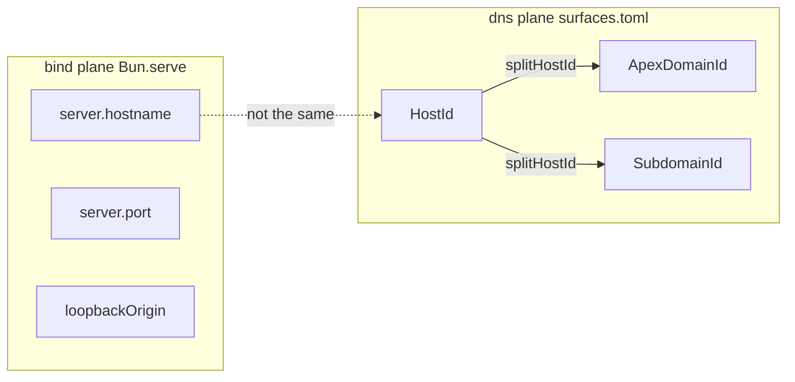
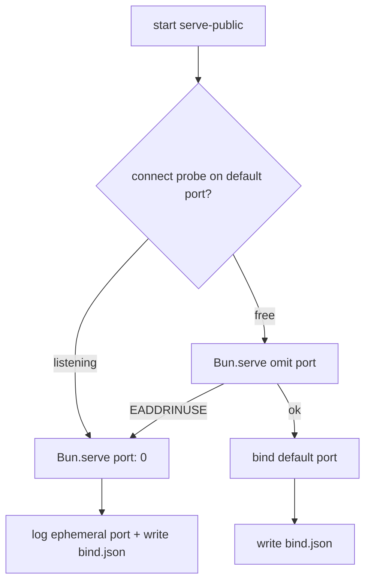

# Tenant: serve-public bind

**Tenant** `serve-public-bind` (local dev plane)
**Server** [`scripts/serve-public.ts`](../../../scripts/serve-public.ts)
**Bind SSOT** [`lib/http/serve-public-bind.ts`](../../../lib/http/serve-public-bind.ts)
**Shape helpers** [`lib/http/bun-serve-shape.ts`](../../../lib/http/bun-serve-shape.ts) · lifecycle [`lib/http/bun-serve-lifecycle.ts`](../../../lib/http/bun-serve-lifecycle.ts) · [`lib/http/bun-server.ts`](../../../lib/http/bun-server.ts)

Local public-plane dev server — static `public/` + live SQLite/APIs. This doc is the operator reference for **port**, **hostname**, **URL shapes**, and **verify probes**.

## Quick start

```bash
bun run serve:public          # default bind (usually :3000)
bun run serve:public:hot      # soft reload server TS
bun run verify:portal         # live probes (reads bind manifest when present)
```

Open the command centre: `http://127.0.0.1:3000/` (or the port printed at startup).

## Where behavior comes from (Bun docs vs harness)

| Question | Read from | Notes |
|----------|-----------|-------|
| What port did we bind? | **`server.port`** / **`server.url`** after `Bun.serve` | Canonical — [server docs](https://bun.com/docs/runtime/http/server#changing-the-port-and-hostname) |
| What env vars apply? | **`Bun.env`** (= `process.env`) | Bun auto-loads `.env` → `.env.local` before your script runs — [env docs](https://bun.com/docs/runtime/environment-variables) |
| What port will Bun try first? | Omit `port` on `Bun.serve` — **Bun decides** | Same env/`--port` chain inside the runtime |
| What port for verify *before* server is up? | `.serve-public/bind.json` or `PORTAL_VERIFY_BASE` | Prefer manifest from last run |
| Pre-bind port *guess* | `resolveBunServeDefaultPort(Bun.env, Bun.argv)` | Mirror of server docs only — **not** a second bind path |

### `server.port` vs `server.url` (two shapes, same listen)

After bind, Bun exposes the chosen listen in **two related properties**:

```ts
console.log(server.port); // 3000              — number
console.log(server.url);  // http://localhost:3000/  — URL instance (prints as href)
```

| Field | Type | Role |
|-------|------|------|
| `server.port` | `number` | Actual TCP port (works for `port: 0` ephemeral) |
| `server.url` | `URL` | Full listen URL (`href`, `origin`, `hostname`, …) |
| `server.url.port` | `string` | Same port as a string; **empty** only for default 80/443 |
| `server.protocol` | `"http"\|"https"` | Bare scheme (no colon) |
| `server.url.protocol` | `"http:"\|"https:"` | URL scheme **with** colon |

Helpers: `formatServerPortUrlLines(server)` · `assertServerPortUrlAligned(server)` · `serveBindSnapshot(server)` in [`lib/http/bun-server.ts`](../../../lib/http/bun-server.ts).

We do **not** scrape or parse Bun’s doc site at runtime. Docs are cited with `@see` URLs; behavior is validated with tests against **this Bun version’s runtime** (`tests/server-defaults.test.ts`).

## Environment variables ([Bun env docs](https://bun.com/docs/runtime/environment-variables))

Bun loads env before `serve-public` executes:

| Source | Precedence (low → high) |
|--------|-------------------------|
| Shell / OS | Base |
| `.env` | Auto-loaded |
| `.env.production` / `.development` / `.test` | When `NODE_ENV` matches |
| `.env.local` | Overrides above |
| Inline on command | `PORT=3099 bun run serve:public` |
| `--env-file` | Explicit files (`bun --env-file=.env.staging …`) |

Read at runtime with `Bun.env.PORT`, `Bun.env.BUN_PORT`, etc. — same as `process.env`. This repo uses `Bun.env` per harness policy (`bun run check:bun-env`).

**Port-related vars** (server bind — [HTTP server docs](https://bun.com/docs/runtime/http/server#configuring-a-default-port), not the “Configuring Bun” table):

| Var | Role |
|-----|------|
| `BUN_PORT` | Bun-specific default when `port` omitted |
| `PORT` | PaaS / Node convention (Heroku, etc.) |
| `NODE_PORT` | Node compatibility |

Put them in root `.env` if you want a stable dev port without exporting each shell:

```ini
# .env — loaded automatically by Bun
BUN_PORT=3099
```

**Global CLI flags without editing scripts:**

```bash
# BUN_OPTIONS prepends args to every bun invocation (env docs)
BUN_OPTIONS="--hot --port=3099" bun run serve:public
```

**CI / no dotenv:**

```bash
bun run --no-env-file serve:public   # shell env only
PORTAL_VERIFY_BASE=http://127.0.0.1:3000 bun run verify:portal
```

## TOML config ([Bun TOML docs](https://bun.com/docs/runtime/toml))

Committed operator defaults live in [`config/serve-public.toml`](../../../config/serve-public.toml). Loaded via Bun's native TOML import — **hot reloads** under `bun --hot scripts/serve-public.ts` without a process restart.

```toml
[server]
port = 3000
host = "127.0.0.1"
```

| Precedence | Port bind | Hostname |
|------------|-----------|----------|
| 1 | `bun --port` / `BUN_PORT` / `PORT` / `NODE_PORT` → **omit** `port` on `Bun.serve` | `HOST` / `BIND_HOST` env |
| 2 | `[server] port` in TOML (only when env/CLI port unset) | `[server] host` in TOML |
| 3 | Bun default **3000** | Bun runtime default |

Code: `resolveServePublicBindPrefs()` in [`lib/http/serve-public-config.ts`](../../../lib/http/serve-public-config.ts).

Runtime API alternative (dynamic files): `Bun.TOML.parse(await Bun.file("…").text())` — same parser as import.

## Port resolution (Bun-native bind)

When `serve-public` omits `port` on `Bun.serve`, Bun applies this chain ([docs](https://bun.com/docs/runtime/http/server#configuring-a-default-port)):

| Precedence | Source | Example |
|------------|--------|---------|
| 1 | `bun --port=N` (flag **immediately after** `bun`) | `bun --port=3099 run serve:public` |
| 2 | `BUN_PORT` | `BUN_PORT=3099 bun run serve:public` |
| 3 | `PORT` | `PORT=3099 bun run serve:public` |
| 4 | `NODE_PORT` | `NODE_PORT=3099 bun run serve:public` |
| 5 | Fallback | **3000** |

**At bind time:** `createServer()` omits `port` → **Bun’s runtime** applies this chain from env it already loaded. We do not pass env into a custom parser.

**Before bind / without a server:** `resolveBunServeDefaultPort(Bun.env, Bun.argv)` mirrors the same precedence so probes and error messages match — tested in `tests/bun-serve-shape.test.ts` and `tests/server-defaults.test.ts`.

**Explicit `port` in `Bun.serve({ port: N })`** skips the env chain. `serve-public` only passes `port` during ephemeral fallback (`port: 0`).

## Hostname resolution

| Knob | Behavior |
|------|----------|
| Default | Omitted — Bun picks bind hostname (runtime: often `localhost` on macOS canary) |
| `HOST` or `BIND_HOST` | Passed to `Bun.serve({ hostname })` — e.g. `HOST=0.0.0.0` for LAN |
| Live-reload hint | Uses `HOST`/`BIND_HOST` or `localhost` before listen for SSE gating |

## Bind hostname ≠ DNS HostId (plane map)

English “host” / “hostname” / “domain” spans **two planes**. Do not put `0.0.0.0` in a `HostId` column or `score.factory-wager.com` in `Bun.serve({ hostname })` unless you intend that bind.

**Data SSOT:** [`lib/http/host-planes.ts`](../../../lib/http/host-planes.ts) · `HOST_PLANE_MAP` · Server/URL defaults [`lib/http/bun-serve-shape.ts`](../../../lib/http/bun-serve-shape.ts) · methods/options [`lib/http/bun-serve-lifecycle.ts`](../../../lib/http/bun-serve-lifecycle.ts) · live transitions [`lib/http/host-lineage.ts`](../../../lib/http/host-lineage.ts) · CLI: `bun run brand:status:once` · `brand:status:bind` · `brand:status:lifecycle` · `brand:status:json`.

### Server methods + serve options (lifecycle)

Lifecycle cards (stop / reload / `timeout` / `idleTimeout` / TLS→protocol / WS idleTimeout) live in [`lib/http/bun-serve-lifecycle.ts`](../../../lib/http/bun-serve-lifecycle.ts) — `BUN_SERVE_METHOD_MATRIX` · `BUN_SERVE_OPTION_MATRIX`. Printed as **C. SERVER METHODS** and **D. SERVE OPTIONS** whenever bind serve-shape prints (`bun run brand:status:bind`). Lifecycle-only: `bun run brand:status:lifecycle` (`--lifecycle --once`). HTTP `idleTimeout`: default **10**, max **255**, **0 = off**; per-request override via `server.timeout(req, seconds)`.

### BIND IDENTITY (serve-public startup)

After bind, [`formatServePublicBindLines`](../../../lib/http/serve-public-bind.ts) keeps the one-line `Serve: development=…` summary and appends an indexed **BIND IDENTITY** card from [`lib/http/bind-identity-card.ts`](../../../lib/http/bind-identity-card.ts) (`port` · `hostname` · `protocol` · `url` · `origin` · `loopbackOrigin` · `development`) — full wrap via `formatIndexedCards`, no mid-token ellipsis. Identity only; lifecycle methods stay in brand-status C/D.

| Plane | Concept | Property | Type | Values | Default (omit / pre-bind) | Fallback / after-bind | Example |
|-------|---------|----------|------|--------|---------------------------|------------------------|---------|
| **bind** | listen port | `server.port` | `number \| undefined` | 1–65535 · unix `undefined` | `--port` → `BUN_PORT` → `PORT` → `NODE_PORT` → `3000` | `port:0` ephemeral · re-read after bind | `3000` |
| **bind** | listen URL | `server.url` | `URL` | `http(s)://host:port/` | derived after bind | prefer `loopbackOrigin` when hostname is `0.0.0.0` | `http://localhost:3000/` |
| **bind** | URL port | `server.url.port` | `string` | `"3000"` · `""` on 80/443 | n/a (mirror) | twin of `server.port` | `3000` |
| **bind** | listen hostname | `server.hostname` | `string \| undefined` | `0.0.0.0`, `localhost` | docs `0.0.0.0` | **not** `HostId` · unix `undefined` | `localhost` |
| **bind** | wire protocol | `server.protocol` | `"http"\|"https"\|null` | bare scheme | TCP→http · TLS→https | unix `null` | `http` |
| **bind** | URL scheme | `server.url.protocol` | `string` | `http:`, `https:` | `${server.protocol}:` | always trailing colon | `http:` |
| **bind** | loopback origin | `loopbackOrigin` | URL string | `http://127.0.0.1:PORT` | after bind rewrite | `0.0.0.0`→`127.0.0.1` · bind.json | `http://127.0.0.1:3000` |
| **dns** | public FQDN | `HostId` | `HostId` | no scheme/path | surfaces.toml `host` | `hostIdFromParts` / `hostIdFromUrl` | `score.factory-wager.com` |
| **dns** | probe URL | `httpsUrlForHost` | `string` | `https://host/…` | path `/` | Access helper for path scope | `https://score…/` |
| **dns** | zone apex | `ApexDomainId` | `ApexDomainId` | zone root | `FACTORY_WAGER_APEX` | public-suffix split | `factory-wager.com` |
| **dns** | left labels | `SubdomainId` | `SubdomainId` | labels · `@` | from split | `hostIdFromParts` | `score`, `@` |
| **dns** | inventory key | `SurfaceId` | `SurfaceId` | config key | `[surfaces.*]` | may ≠ DNS subdomain | `pages_dev` |
| **access** | Access app domain | `AccessDomainId` | `AccessDomainId` | host · host/path | accessSubpaths | cross via helpers only | `score…/portal` |
| **pages** | Pages project | `PagesProjectId` | `PagesProjectId` | CF slug | `CLOUDFLARE_DEFAULTS.pages.project` | `pagesDevHostForProject` | `project-r-score` |

Bun recommend: after `Bun.serve`, read the **chosen** listen from `server.port` / `server.url` — env/`--port` only set the pre-bind attempt. `server.protocol` is `"http" | "https"` (no colon); `server.url.protocol` is `"http:" | "https:"`. HostId never carries a scheme — use `httpsUrlForHost` / `httpsUrlForAccessDomain` at the edge.



## Busy-port fallback (FactoryWager policy)

Bun docs: bind a fixed port → **`EADDRINUSE`** if taken; or use **`port: 0`** and read `server.port` after bind.

`serve-public` adds harness policy on top:



1. **Connect probe** — `Bun.connect` to `127.0.0.1:<defaultPort>`. Needed because Bun may use **SO_REUSEPORT**: a second bind can succeed without `EADDRINUSE` while requests round-robin across stale instances.
2. **Primary bind** — omit `port` (Bun env chain).
3. **Retry once** — `port: 0` (OS ephemeral); startup warns and logs the chosen port.

Free a stuck default port:

```bash
lsof -nP -iTCP:3000 -sTCP:LISTEN
kill <PID>
bun run serve:public
```

## URL shapes after bind

Two origins matter:

| Field | Meaning | Example (default 3000) |
|-------|---------|------------------------|
| `server.origin` / `manifest.origin` | Wire origin from Bun | `http://localhost:3000` |
| `manifest.loopbackOrigin` | Console + verify probes; maps `0.0.0.0` → `127.0.0.1` | `http://127.0.0.1:3000` |
| `server.url.href` | Full URL with trailing slash on root | `http://localhost:3000/` |
| `server.port` | Numeric listen port | `3000` |
| `server.url.port` | String port (empty only on default 80/443) | `"3000"` or `""` |
| `server.protocol` | Bare scheme | `http` |
| `server.url.protocol` | URL scheme with colon | `http:` |

Startup prints both bind and loopback:

```
Bind: http://localhost:3000 (url.port=3000)
Serve: … origin=http://localhost:3000 · loopback=http://127.0.0.1:3000 …
```

When `HOST=0.0.0.0`:

```
Bind: http://0.0.0.0:3000 …
loopback=http://127.0.0.1:3000   ← use this in browser on same machine
```

## Bind manifest (`.serve-public/bind.toml` + `.json`)

Written on every successful start (gitignored). Consumed by `verify:portal` when `PORTAL_VERIFY_BASE` is unset. TOML is written with `Bun.TOML.stringify` ([TOML docs](https://bun.com/docs/runtime/toml)); JSON retained for tools that expect it.

```json
{
  "schemaVersion": 1,
  "boundAt": "2026-07-28T…",
  "ephemeralFallback": false,
  "requestedDefaultPort": 3000,
  "port": 3000,
  "hostname": "localhost",
  "protocol": "http",
  "urlPort": "3000",
  "origin": "http://localhost:3000",
  "loopbackOrigin": "http://127.0.0.1:3000",
  "url": "http://localhost:3000/",
  "development": false
}
```

| Field | Use |
|-------|-----|
| `ephemeralFallback` | `true` when default port was busy |
| `requestedDefaultPort` | What env/CLI resolved before fallback |
| `loopbackOrigin` | **Verify base** when ephemeral (3000 probe would miss the server) |

## Verify probe base

`tools/verify-portal.ts` resolves live URL:

| Precedence | Source |
|------------|--------|
| 1 | `PORTAL_VERIFY_BASE` (explicit) |
| 2 | `.serve-public/bind.toml` or `bind.json` → `loopbackOrigin` |
| 3 | `http://127.0.0.1:${resolveBunServeDefaultPort()}` |

```bash
PORTAL_VERIFY_BASE=http://127.0.0.1:3000 bun run verify:portal
bun run verify:portal    # auto when bind.json exists
```

## Key surfaces (loopback URLs)

| Path | Purpose |
|------|---------|
| `/` | Command centre (apex) |
| `/portal/` | Registry portal |
| `/portal/ops/` | Ops dashboard |
| `/portal/tools/` | CLI tools hub |
| `/monitoring/` | Monitoring HTML |
| `/registry/*.json` | Baked proof JSON |
| `/api/health` | Live health schema v1 |
| `/api/portal/dashboard` | Command centre aggregate (loopback; may 401 without auth) |
| `/__hmr` | Browser live-reload SSE |

## Related env knobs

| Env | Doc source | Effect |
|-----|------------|--------|
| `BUN_PORT` / `PORT` / `NODE_PORT` | [HTTP server](https://bun.com/docs/runtime/http/server#configuring-a-default-port) | Default bind port when `port` omitted |
| `BUN_OPTIONS` | [Environment variables](https://bun.com/docs/runtime/environment-variables) | Prepends CLI flags (e.g. `--hot`, `--port=3099`) |
| `HOST` / `BIND_HOST` | Harness (`serve-public.ts`) | Optional `Bun.serve({ hostname })` |
| `SERVE_PUBLIC_HMR` | Harness | Browser SSE reload (`0` off, `1` force on) |
| `SERVE_PUBLIC_DEV` | Harness | `development: true` on Bun.serve |
| `PORTAL_VERIFY_BASE` | Harness | Override verify probe origin |
| `OPS_DB_PATH` | Harness | SQLite path (logged at startup) |
| `REGISTRY_SECRET` | Harness | Bearer gate for publish/API (public read plane stays open) |
| `BUN_CONFIG_NO_CLEAR_TERMINAL_ON_RELOAD` | [Environment variables](https://bun.com/docs/runtime/environment-variables) | Keep console on `bun --watch` reload |
| `BUN_RUNTIME_TRANSPILER_CACHE_PATH` | [Environment variables](https://bun.com/docs/runtime/environment-variables) | Transpiler cache dir; `0` disables |

## Bun docs vs this harness

| Topic | Bun docs | serve-public |
|-------|----------|--------------|
| Env loading | Auto `.env` → `Bun.env` | Uses `Bun.env`; no custom dotenv |
| Operator defaults | — | Optional `config/serve-public.toml` (native import, hot reload) |
| Default port | Env chain → 3000 | Same (omit `port`) |
| Port busy | `EADDRINUSE` or `port: 0` | Probe + one `port: 0` retry |
| Discover actual port | `server.port` / `server.url` | + bind.json + startup logs |
| Pre-bind free port API | Not provided ([issue #25528](https://github.com/oven-sh/bun/issues/25528)) | Connect probe only (best-effort) |

## Verification

```bash
bun test tests/serve-public-bind.test.ts tests/serve-public-config.test.ts \
  tests/bun-serve-shape.test.ts tests/bun-serve-lifecycle.test.ts \
  tests/bind-identity-card.test.ts tests/brand-status-cli.test.ts \
  tests/server-defaults.test.ts
bun run brand:status:bind
bun run brand:status:lifecycle
bun run verify:portal
```

## Cross-links

- Portal dev reload: [`docs/portal-foundation.md`](../../portal-foundation.md#port-configuration)
- Platform routing: [`docs/platform-routing.md`](../../platform-routing.md)
- Command centre: [`command-centre.md`](command-centre.md)
- Public plane: [`public-plane.md`](public-plane.md)
- Lib index: [`lib/http/README.md`](../../../lib/http/README.md) · Bun.serve claim row: [`docs/BUN_NATIVE_CAPABILITIES.md`](../../BUN_NATIVE_CAPABILITIES.md)

**Owner** `// owner: platform / portal`
