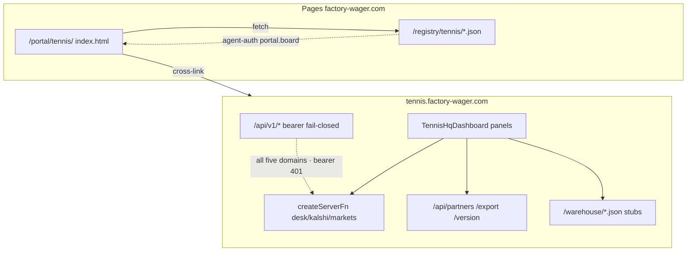

# Tenant audit: Tennis HQ dashboard UI surfaces

**Probed** 2026-08-06 (UTC) via `/api/version` + R2 ledger/executions + desk
serverFn · tip docs refreshed same day  
**Claim** dual-surface inventory + path traces + ranked findings  
**Owners** producer `plum-spruce-dawn-dune1` (Market Desk) · this monorepo
(`/portal/tennis/` board) · Cloudflare edge (Worker networking)

Companion auth/registry runbook:
[`tennis-hq-registry.md`](tennis-hq-registry.md).

## Scope

Two live UIs share the Tennis HQ brand and must not be collapsed into one:

| Surface | Host | Owner tree | Role |
| ------- | ---- | ---------- | ---- |
| Market Desk | `https://tennis.factory-wager.com` | [`plum-spruce-dawn-dune1`](https://github.com/brendadeeznuts1111/plum-spruce-dawn-dune1) ([CONTRIBUTING](https://github.com/brendadeeznuts1111/plum-spruce-dawn-dune1/blob/main/CONTRIBUTING.md)) · Worker `tennis-hq` · local sibling `~/Projects/plum-spruce-dawn-dune1` | Interactive desk SPA |
| Portal board | `https://factory-wager.com/portal/tennis/` | [`public/portal/tennis/`](../../../public/portal/tennis/) | Baked registry evidence board |

Live identity (desk tip = git tip): `tennis-hq@1.4.0` · SHA `8f21bf2`
(`8f21bf25ce47f11828a388a5e77650152104a2be`) · deploymentId
`a930f52c-4160-4240-af1c-56e4444a9727` · probed via `/api/version` 2026-08-06.
Matches producer `origin/main` after Wrangler redeploy + `deploy:verify:prod`.



There is **no** redirect from the Worker host to `/portal/tennis/`. Registry
JSON and the portal board live on Pages only.

---

## A. Market Desk — component inventory

**Entry:** `src/routes/index.tsx` → `<TennisHqDashboard />`  
**Shell:** `src/components/dashboard/dashboard.tsx`  
**Router:** single HTTP route `/`; in-page sections via hash
(`src/lib/shared/hash-router.ts`, `useDeskHashScroll`,
`SURFACE_HASH_ALIASES` in `src/lib/shared/page-glossary.ts`).

### Panels (paint order ≈ DOM order)

| Panel | File under `src/components/dashboard/` | Mount id(s) | Data path |
| ----- | -------------------------------------- | ----------- | --------- |
| Desk status / ops | `desk-status-bar.tsx` | `#ops`, `#desk-status-bar` | `getOpsHealth` serverFn |
| Source strip | `source-strip.tsx` | `#source-strip` | desk payload / ops |
| Live Kalshi feed | `live-feed-panel.tsx` | `#live-feed-panel` | `getLiveTennisFeed` |
| Phase 2 research | `phase2-status-card.tsx` | `#phase2-status-card` | `getPhase2Status` |
| Filters / presets | `hq-filters.tsx`, `filter-presets.tsx` | `#hq-filters`, `#filter-presets` | client filter state |
| Analytics / KPI | `analytics-kpi-row.tsx`, `kpi-cards.tsx` | `#analytics-kpi-row`, `#kpi-cards` | desk payload |
| Markets strip + hot misprices | `markets-strip.tsx`, `hot-misprices.tsx` | `#markets`, `#markets-strip`, `#hot-misprices` | desk-server + `/warehouse/hardrock-board-overlay.json` |
| Live board | `live-board.tsx` | `#live`, `#live-board` | `fetchTennisHqPayload` + Hard Rock stub |
| Player detail | `player-detail.tsx` | `#player-detail` | `fetchPlayerVolume` (conditional) |
| Unified cross-market | `unified-desk-panel.tsx` | `#unified-desk-panel` | `getUnifiedDesk` |
| Research team | `research-team-panel.tsx` | `#research-team-panel` | `getResearchBrief` |
| Match intelligence | `match-intelligence-panel.tsx`, `bookmaker-comparison.tsx` | `#match-intelligence-panel`, `#matches` | markets serverFns + quotes |
| Microstructure / alerts | `microstructure-panel.tsx`, `micro-signal-feed.tsx` | `#microstructure-panel`, `#alerts`, `#micro-signal-feed` | serverFn + `/warehouse/odds-move-signals.json` |
| Volume / liquidity | `volume-liquidity-panel.tsx` | `#volume-liquidity-panel` | `getLiquidityProfile` |
| Cross-market signals | `cross-market-panel.tsx` | `#cross-market-panel` | desk enrichment |
| Warehouse | `warehouse-panel.tsx` | `#warehouse`, `#warehouse-panel` | `fetchTennisWarehouse` (12s → empty shell) |
| Trend charts | `trend-charts.tsx` | `#trend-charts` | warehouse / desk |
| Profiles | `profiles-table.tsx` | `#profiles`, `#profiles-table` | warehouse |
| Execution + accounts | `execution-dashboard.tsx`, `account-inventory-panel.tsx` | `#execution`, `#execution-dashboard`, `#accounts` | `/api/partners/executions`, execute, client profiles |
| Partners cluster | `partner-panel.tsx`, `partner-detail.tsx`, `out-table.tsx`, `out-card.tsx`, `book-card.tsx`, `partner-ledger.tsx` | `#partners`, `#partner-panel`, … `#partner-ledger` | `/api/partners/health` (+ stream), ledger |
| Export | `export-bar.tsx` | `#export-bar` | `/api/export/hq-json`, `warehouse-json`, `warehouse-csv` |
| Build footer | `build-version-footer.tsx` | footer | `/api/version`, `/build-id.json` |
| Glossary drawer | `src/components/ui/glossary-panel.tsx` | `#glossary` | in-memory glossary (HTTP twin unused by UI) |
| Command palette | `src/components/ui/command-palette.tsx` | overlay | hash jumps |

Core load in `dashboard.tsx`: `fetchTennisHqPayload` → parallel
`fetchPolyJoinCache` + `fetchTennisWarehouse` + `recordHotMisprices`; ops via
`getOpsHealth`; phase2 via `getPhase2Status`.

### HTTP API routes (producer `src/routes/api/`)

| Path | Role | UI consumer |
| ---- | ---- | ----------- |
| `GET /api/health` | Identity/health | unused by desk panels |
| `GET /api/version` | Build identity | footer |
| `GET /api/glossary` | Glossary JSON | unused by UI (in-memory) |
| `GET /api/ops/health` | Ops twin | serverFn preferred |
| `GET /api/ops/pipeline` | Pipeline | unused by UI |
| `GET /api/export/hq-json` | Desk export | `export-bar` |
| `GET /api/export/warehouse-json` / `warehouse-csv` | Warehouse export | `export-bar` |
| `GET /api/partners/health` (+ `?probe=1`, `/stream`) | Partner health | `use-partner-health` |
| `GET/POST /api/partners/*` execute · ledger · settle · accounts | Money paths | execution / ledger |
| `GET /api/v1/research/status` | v1 research read | contracts / weave probes |
| `GET /api/v1/marketdata/desk` | v1 desk mids | contracts / weave probes |
| `GET /api/v1/trading/executions` | v1 executions | contracts / weave probes |
| `GET /api/v1/partners/capacity` | v1 partners capacity | contracts / weave probes |
| `GET /api/v1/accounting/finance` | v1 finance | contracts / weave probes |

Auth: `assertPartnerServiceAccess` in `src/lib/server/partner-api-guard.ts` —
never fail-open for v1; missing token → **503** `contract_auth_unconfigured`.

---

## B. Portal board — component inventory

**Page:** [`public/portal/tennis/index.html`](../../../public/portal/tennis/index.html)
(shell + chrome) · board controller
[`public/portal/components/tennis-desk.js`](../../../public/portal/components/tennis-desk.js)
(loaded as `<script type="module">`).

**Shared chrome:** `/portal/data.js`, `topbar.js`, `components/sidebar.js`,
`footer.js`, `components/venue-badge.js`, `/portal/style.css`, `venues.css`.

**Companion MD:** [`public/portal/tennis.md`](../../../public/portal/tennis.md).

### DOM hosts → renderers → artifacts

| DOM host | Renderer (`tennis-desk.js`) | Registry artifact |
| -------- | --------------------------- | ----------------- |
| `#kpi-host` | `renderKpis` | `board-metrics.json` + `agent-auth.json` + partner-contracts |
| `#venue-legend-host` / `#venue-live-host` | `mountVenueLegend` + `renderVenuesFromMetrics` | board-metrics |
| `#charts-host` | `renderCharts` / `barChartHtml` | board-metrics · mid-distribution fallback |
| `#sample-rows` + `#venue-filter` | `renderSampleTable` | live-matches + avatar-index |
| `#hero-avatar` / avatar strip | `loadAvatarIndex` / `avatarImg` | avatar-index · `/avatars/*.webp` |
| `#reg-table` / `#reg-sub` | `renderRegistry` | `registry.json` |
| `#live-banner` | `setBanner` | load status |
| `#tenant-health-line` | `renderHealth` | portal chrome health |
| poll / `#btn-refresh` | `load()` every 30s (`portal-poll-ms`) | all of the above |

### Bake writers (`lib/tennis/` + scripts)

| Artifact | Writer | Command |
| -------- | ------ | ------- |
| `board-metrics.json`, `mid-distribution.json`, `live-matches.json`, `avatar-index.json` | [`scripts/bake-tennis-board.ts`](../../../scripts/bake-tennis-board.ts) + [`lib/tennis/{board-metrics,live-matches,avatar-index}.ts`](../../../lib/tennis/) | `bun run tennis:board:bake` |
| `agent-auth.json` | [`tools/bake-tennis-agent-auth.ts`](../../../tools/bake-tennis-agent-auth.ts) + [`lib/tennis/agent-auth.ts`](../../../lib/tennis/agent-auth.ts) | `bun run tennis:agent-auth:bake` |
| `partner-contracts.json` | [`tools/bake-tennis-partner-contracts.ts`](../../../tools/bake-tennis-partner-contracts.ts) | `bun tools/bake-tennis-partner-contracts.ts` |
| `registry.json` | tenant seed | ops/tenant registry seed |

### Closed / residual drift

| Item | Status |
| ---- | ------ |
| `tennis-desk.js` wired from `index.html` | **Closed** (PR #363) — foundation Board UI row cites `tennis-desk.js` |
| Legacy `tennis-board.js` name | **Closed** — no remaining foundation cite; do not reintroduce |

---

## C. Path / trace matrix (live probe)

### Market Desk — `https://tennis.factory-wager.com`

| URL | Status | Notes |
| --- | ------ | ----- |
| `/` | 200 | Title `Tennis HQ · Market Desk`; SSR “Loading desk…” shell (client hydrates via serverFn) |
| `/api/health` | 200 | `ok`, package `tennis-hq@1.4.0` (prefer `/api/version` for tip SHA) |
| `/api/version` | 200 | tip SHA `8f21bf2` · deploymentId `a930f52c…` · 2026-08-05T22:43Z |
| `/_serverFn/<payload-id>` | **200** | requires header `x-tsr-serverFn: true` (without it → 500 `HTTPError`); seed desk payload ~44KB |
| `/api/glossary` | 200 | 300 entries · live `generatedAt` refreshes on probe |
| `/build-id.json` | 200 | packageVersion 1.4.0 |
| `/api/export/hq-json` | 200 | schema `hq-desk/v1` · **`row_count`: 71** · `source: hybrid` |
| `/api/partners/health` | 200 | engine snapshot · `everProbed: true` · summary online/degraded |
| `/api/partners/health?probe=1` | **200** | live probe ok · `engine: fetch+AbortSignal.timeout` · 6 liveProbes |
| `/api/partners/executions` | 200 | **`count`: 4** · `source: cache` · **`meta.cache: url`** (R2) |
| `/api/partners/ledger?partner=ASH` | 200 | **`count`: 3** · `source: cache` · **`meta.cache: url`** · balanceCents 299880 |
| `/api/partners/accounts` | 200 | **public GET** · seat-capital DTO (no secrets) · overrides soft-fail on edge |
| `/api/v1/research/status` | **401** | JSON `unauthorized` (fail-closed; 503 only if secret missing) |
| `/api/v1/marketdata/desk` | **401** | JSON `unauthorized` (wired — not SPA 404) |
| `/api/v1/trading/executions` | **401** | JSON `unauthorized` (wired — not SPA 404) |
| `/api/v1/partners/capacity` | **401** | JSON `unauthorized` (wired — not SPA 404) |
| `/api/v1/accounting/finance` | **401** | JSON `unauthorized` (wired — not SPA 404) |
| `/warehouse/hardrock-board-overlay.json` | 200 | **`count`: 200** · `generatedAt` 2026-08-05T22:03Z (not stub) |
| `/warehouse/odds-move-signals.json` | 200 | **`count`: 245** signals · same bake window |
| `/api/export/warehouse-json` | **401** | partner bearer required (`PARTNER_API_TOKEN`) |
| `/favicon.svg` | **200** | SVG icon referenced from root head |
| `/site.webmanifest` | **200** | PWA manifest (icons → `/favicon.svg`) |
| `/favicon.ico` | **200** | PNG 32×32 (legacy + webmanifest) |
| `/manifest.json` | **404** | SPA HTML — use `/site.webmanifest` |
| `/portal/tennis/` | **404** | not on Worker |
| `/registry/tennis/agent-auth.json` | **404** | not on Worker |

### Portal / Pages — `https://factory-wager.com`

| URL | Status | Notes |
| --- | ------ | ----- |
| `/portal/tennis/` | 200 | Tenant board |
| `/registry/tennis/board-metrics.json` | 200 | `generatedAt` **2026-08-05T22:07:13Z** · event-store · 8856 markets · 52 mids |
| `/registry/tennis/mid-distribution.json` | 200 | same bake stamp |
| `/registry/tennis/live-matches.json` | 200 | `generatedAt` 2026-08-05T22:07:13Z · 12 matches · mid-ok 12/12 |
| `/registry/tennis/avatar-index.json` | 200 | same bake stamp · 221 players |
| `/registry/tennis/agent-auth.json` | 200 | `status: configured` · `generatedAt` 2026-08-05T02:48:46Z |
| `/registry/tennis/registry.json` | 200 | `lastUpdated` 2026-08-04 |
| `/registry/surfaces-state.json` | 200 | tennis row note tracks tip SHA · re-bake after tip change (`bun run surfaces:bake`) |

---

## D. Ranked findings

### P0 — Contract / docs vs live

1. ~~**v1 surface incomplete**~~ — **Closed 2026-08-05 re-probe.** All five
   `GET /api/v1/{research,marketdata,trading,partners,accounting}/*` routes
   return JSON **401** unauth (not SPA 404). Residual risk is **authenticated
   payload quality** + edge ledger emptiness, not route absence. Ownership
   residual: **producer** data plane.
2. ~~**Surfaces inventory overclaims**~~ — **Closed 2026-08-06 tip refresh.**
   `[surfaces.tennis].note` + `surfaces-state.json` pin production tip
   `8f21bf2` / deploymentId `a930f52c…` and state all five v1 domains
   fail-closed unauth + R2-first partner caches. Ownership was **monorepo**.

### P1 — Empty / soft-fail desk (UI looks broken)

3. ~~**Desk export empty**~~ — **Closed 2026-08-05 re-probe.**
   `/api/export/hq-json` returns **`row_count`: 71** · `source: hybrid`
   (Kalshi/Poly live + mock pinny/oddsblaze). Ownership was **producer** data
   plane.
4. ~~**Warehouse stubs + export 404**~~ — **Closed 2026-08-05 re-probe.**
   Hard Rock overlay **`count`: 200** and odds-move **`count`: 245** (not
   stubs). `/api/export/warehouse-json` is **401** without
   `PARTNER_API_TOKEN` (expected fail-closed; not SPA 404). Ownership was
   **producer** ops.
5. ~~**Edge storage soft-fail (executions empty)**~~ — **Closed 2026-08-05 ·
   R2-first 2026-08-06.** Producer
   [#11](https://github.com/brendadeeznuts1111/plum-spruce-dawn-dune1/pull/11) /
   [#13](https://github.com/brendadeeznuts1111/plum-spruce-dawn-dune1/pull/13)
   publish partner snapshots to R2; live edge returns **`count`: 4**
   executions / **`count`: 3** ASH ledger with **`meta.cache: url`** when
   SQLite is unavailable. Residual: live ledger **writes** still 503 on edge
   (no D1). Ownership was **producer**.
6. ~~**Partner live probe 500**~~ — **Closed 2026-08-05 re-probe.**
   `?probe=1` returns **200** with `engine: fetch+AbortSignal.timeout`,
   `liveProbes: 6`, summary online/degraded. Ownership was **Cloudflare edge**
   + **producer** probe path.
6b. ~~**SSR “Loading desk…” looks hung**~~ — **Closed 2026-08-06 (probe
   artifact).** Bare `GET /_serverFn/<id>` without TanStack header returns
   **500** `HTTPError`; browser client sets `x-tsr-serverFn: true` and gets
   **200** seed desk payload (~44KB). Curl/bot probes must send that header.
   Ownership: **docs / probe hygiene** (not a producer outage).

### P2 — Portal consumer drift

7. ~~**Stale board bake**~~ — **Closed 2026-08-05.** Re-ran
   `bun run tennis:board:bake` from event-store → board-metrics /
   mid-distribution / live-matches / avatar-index stamped
   **2026-08-05T22:07Z** (8856 markets · 12 matches · 221 avatars). Ownership
   was **monorepo** operator.
8. ~~**Orphan `tennis-desk.js` + missing `tennis-board.js` doc**~~ — **Closed**
   (PR #363 + foundation Board UI row). Controller is wired; no `tennis-board.js`
   cite remains.
9. **Cross-host path confusion** — `/portal/tennis/` and `/registry/tennis/*` on
   the Worker are 404 SPA shells (expected, but operators hit them). Ownership:
   **docs / UX** (link hygiene).
10. ~~**Missing desk chrome assets**~~ — **Closed 2026-08-05.**
    `/favicon.svg`, `/favicon.ico` (PNG), and `/site.webmanifest` return **200**
    (producer #12). Residual: `/manifest.json` alias optional only.
    Ownership was **producer**.
11. ~~**Git tip leads production**~~ — **Closed 2026-08-06.** Live tip is
    `8f21bf2` / deploymentId `a930f52c…` (R2-only snapshots #13 on
    `origin/main`); verified via `/api/version` + partner `meta.cache=url`.
    Ownership was **operator**.

### P3 — Hygiene

12. **APIs unused by UI** — `/api/glossary`, `/api/health`,
    `/api/ops/pipeline` exist without panel callers (accounts/ledger/executions
    feed partner panels via public GETs — see auth matrix below).
13. **Stub adapters** — BETER live fetch returns `[]`; `StubOrderAdapter`
    default fill path in partner router.

### Partner API auth matrix (2026-08-06)

| Route | Methods | Gate | Live unauth |
| ----- | ------- | ---- | ----------- |
| `/api/partners/health` · `health.stream` | GET | **open** (desk chips) | 200 snapshot / soft-fail |
| `/api/partners/ledger` | GET | **open** (edge R2/static cache) | 200 `source: cache` · `meta.cache: url` |
| `/api/partners/ledger` | POST | `assertPartnerApiAccess` write | 401 without token (or same-origin desk) |
| `/api/partners/executions` | GET | **open** (edge R2 cache) | 200 `meta.cache: url` |
| `/api/partners/accounts` | GET | **open** (seat-capital DTO, no secrets) | 200 · overrides edge soft-fail |
| `/api/partners/accounts` | POST/DELETE | write gate | 401 / 503 |
| `/api/partners/execute` · `settle` · ledger seed/transfer/post-fee | POST | write gate | 401 without token |
| `/api/v1/*` (five domains) | GET | **strict bearer** (`assertPartnerServiceAccessAsync`) | **401** `unauthorized` |
| `/api/export/warehouse-json` · `warehouse-csv` | GET | partner bearer | **401** |
| `/api/export/hq-json` | GET | open | 200 hybrid export |

**Intentional:** desk SPA has no embedded `PARTNER_API_TOKEN`; public partner
**reads** + same-origin writes keep the UI usable. External clients must use
bearer for v1 contracts and mutates. Do not collapse public partner GETs into
v1 bearer without a desk token handoff design.

---

## E. Remediations held (separate approval)

Documentation-only audit — **do not** apply these without an explicit fix lane:

| Lane | Action |
| ---- | ------ |
| Producer | Keep publish loop (`hq-export` · `partner-executions` · `partner-ledger` · warehouse overlays); optional D1 dual-driver for live **writes** only |
| Monorepo | After each producer deploy: refresh tip in `tennis-hq-registry.md` + `[surfaces.tennis].note` + `bun run surfaces:bake`; re-run `tennis:board:bake` when event-store drifts; re-open pass-cli for authenticated v1 payload smoke |
| Edge | Residual: live ledger **writes** on edge (GET R2 caches shipped in #13) |

**Done this tip lane (2026-08-06):** production tip pin `8f21bf2` /
deploymentId `a930f52c…` · R2-first partner ledger+executions
(`meta.cache=url`) · surfaces note accuracy · desk serverFn probe hygiene
(`x-tsr-serverFn`) · partner GET vs bearer matrix documented · all five v1
unauth **401** · residual live **writes** only.

Out of scope here: Pages deploy, vault token mint, edge DO/D1 redesign.

---

## F. Re-probe commands

```bash
# Desk identity + contracts
curl -fsS https://tennis.factory-wager.com/api/version
curl -sS -o /dev/null -w '%{http_code}\n' https://tennis.factory-wager.com/api/v1/research/status
curl -sS -o /dev/null -w '%{http_code}\n' https://tennis.factory-wager.com/api/v1/marketdata/desk

# Portal bake age
curl -fsS https://factory-wager.com/registry/tennis/board-metrics.json | bun -e 'console.log(JSON.parse(await Bun.stdin.text()).generatedAt)'

# Harness
bun run tennis:agent-auth:check
bun run tennis:ssot:release:check
bun run verify:weave -- --subdomains
```

## Related

- [`tennis-hq-registry.md`](tennis-hq-registry.md) — registry auth · v1 contract table · weave · **producer CONTRIBUTING mesh**
- Producer contribute: [CONTRIBUTING.md](https://github.com/brendadeeznuts1111/plum-spruce-dawn-dune1/blob/main/CONTRIBUTING.md) · [docs hub](https://github.com/brendadeeznuts1111/plum-spruce-dawn-dune1/blob/main/docs/README.md)
- [`docs/platform-routing.md`](../../platform-routing.md) — host ownership
- [`docs/portal-foundation.md`](../../portal-foundation.md) — portal tennis board row
- [`lib/tennis/README.md`](../../../lib/tennis/README.md) — avatar / bake mapping
