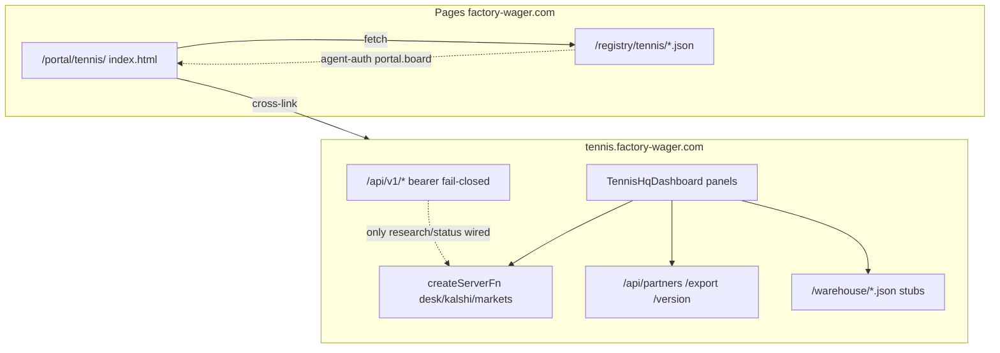

# Tenant audit: Tennis HQ dashboard UI surfaces

**Probed** 2026-08-05T05:39:55Z (UTC)  
**Claim** dual-surface inventory + path traces + ranked findings  
**Owners** producer `plum-spruce-dawn-dune1` (Market Desk) · this monorepo
(`/portal/tennis/` board) · Cloudflare edge (Worker networking)

Companion auth/registry runbook:
[`tennis-hq-registry.md`](tennis-hq-registry.md).

## Scope

Two live UIs share the Tennis HQ brand and must not be collapsed into one:

| Surface | Host | Owner tree | Role |
| ------- | ---- | ---------- | ---- |
| Market Desk | `https://tennis.factory-wager.com` | [`plum-spruce-dawn-dune1`](../../../plum-spruce-dawn-dune1) · Worker `tennis-hq` | Interactive desk SPA |
| Portal board | `https://factory-wager.com/portal/tennis/` | [`public/portal/tennis/`](../../../public/portal/tennis/) | Baked registry evidence board |

Live identity (desk): `tennis-hq@1.4.0` · SHA `1092c5e`
(`1092c5ea6da9af87bbdb1102b3cd4cc1270790f1`) · matches local producer HEAD /
`build-id.json`.



There is **no** redirect from the Worker host to `/portal/tennis/`. Registry
JSON and the portal board live on Pages only.

---

## A. Market Desk — component inventory

**Entry:** `src/routes/index.tsx` → `<TennisHqDashboard />`  
**Shell:** `src/components/dashboard/dashboard.tsx`  
**Router:** single HTTP route `/`; in-page sections via hash
(`src/lib/shared/hash-router.ts`, `useDeskHashScroll`,
`SURFACE_HASH_ALIASES` in `src/lib/shared/page-glossary.ts`).

### Panels (paint order ≈ DOM order)

| Panel | File under `src/components/dashboard/` | Mount id(s) | Data path |
| ----- | -------------------------------------- | ----------- | --------- |
| Desk status / ops | `desk-status-bar.tsx` | `#ops`, `#desk-status-bar` | `getOpsHealth` serverFn |
| Source strip | `source-strip.tsx` | `#source-strip` | desk payload / ops |
| Live Kalshi feed | `live-feed-panel.tsx` | `#live-feed-panel` | `getLiveTennisFeed` |
| Phase 2 research | `phase2-status-card.tsx` | `#phase2-status-card` | `getPhase2Status` |
| Filters / presets | `hq-filters.tsx`, `filter-presets.tsx` | `#hq-filters`, `#filter-presets` | client filter state |
| Analytics / KPI | `analytics-kpi-row.tsx`, `kpi-cards.tsx` | `#analytics-kpi-row`, `#kpi-cards` | desk payload |
| Markets strip + hot misprices | `markets-strip.tsx`, `hot-misprices.tsx` | `#markets`, `#markets-strip`, `#hot-misprices` | desk-server + `/warehouse/hardrock-board-overlay.json` |
| Live board | `live-board.tsx` | `#live`, `#live-board` | `fetchTennisHqPayload` + Hard Rock stub |
| Player detail | `player-detail.tsx` | `#player-detail` | `fetchPlayerVolume` (conditional) |
| Unified cross-market | `unified-desk-panel.tsx` | `#unified-desk-panel` | `getUnifiedDesk` |
| Research team | `research-team-panel.tsx` | `#research-team-panel` | `getResearchBrief` |
| Match intelligence | `match-intelligence-panel.tsx`, `bookmaker-comparison.tsx` | `#match-intelligence-panel`, `#matches` | markets serverFns + quotes |
| Microstructure / alerts | `microstructure-panel.tsx`, `micro-signal-feed.tsx` | `#microstructure-panel`, `#alerts`, `#micro-signal-feed` | serverFn + `/warehouse/odds-move-signals.json` |
| Volume / liquidity | `volume-liquidity-panel.tsx` | `#volume-liquidity-panel` | `getLiquidityProfile` |
| Cross-market signals | `cross-market-panel.tsx` | `#cross-market-panel` | desk enrichment |
| Warehouse | `warehouse-panel.tsx` | `#warehouse`, `#warehouse-panel` | `fetchTennisWarehouse` (12s → empty shell) |
| Trend charts | `trend-charts.tsx` | `#trend-charts` | warehouse / desk |
| Profiles | `profiles-table.tsx` | `#profiles`, `#profiles-table` | warehouse |
| Execution + accounts | `execution-dashboard.tsx`, `account-inventory-panel.tsx` | `#execution`, `#execution-dashboard`, `#accounts` | `/api/partners/executions`, execute, client profiles |
| Partners cluster | `partner-panel.tsx`, `partner-detail.tsx`, `out-table.tsx`, `out-card.tsx`, `book-card.tsx`, `partner-ledger.tsx` | `#partners`, `#partner-panel`, … `#partner-ledger` | `/api/partners/health` (+ stream), ledger |
| Export | `export-bar.tsx` | `#export-bar` | `/api/export/hq-json`, `warehouse-json`, `warehouse-csv` |
| Build footer | `build-version-footer.tsx` | footer | `/api/version`, `/build-id.json` |
| Glossary drawer | `src/components/ui/glossary-panel.tsx` | `#glossary` | in-memory glossary (HTTP twin unused by UI) |
| Command palette | `src/components/ui/command-palette.tsx` | overlay | hash jumps |

Core load in `dashboard.tsx`: `fetchTennisHqPayload` → parallel
`fetchPolyJoinCache` + `fetchTennisWarehouse` + `recordHotMisprices`; ops via
`getOpsHealth`; phase2 via `getPhase2Status`.

### HTTP API routes (producer `src/routes/api/`)

| Path | Role | UI consumer |
| ---- | ---- | ----------- |
| `GET /api/health` | Identity/health | unused by desk panels |
| `GET /api/version` | Build identity | footer |
| `GET /api/glossary` | Glossary JSON | unused by UI (in-memory) |
| `GET /api/ops/health` | Ops twin | serverFn preferred |
| `GET /api/ops/pipeline` | Pipeline | unused by UI |
| `GET /api/export/hq-json` | Desk export | `export-bar` |
| `GET /api/export/warehouse-json` / `warehouse-csv` | Warehouse export | `export-bar` |
| `GET /api/partners/health` (+ `?probe=1`, `/stream`) | Partner health | `use-partner-health` |
| `GET/POST /api/partners/*` execute · ledger · settle · accounts | Money paths | execution / ledger |
| `GET /api/v1/research/status` | **Only** implemented v1 read | contracts / weave probes |
| Manifest-only v1 | marketdata · trading · partners · accounting | **no route files** → SPA 404 |

Auth: `assertPartnerServiceAccess` in `src/lib/server/partner-api-guard.ts` —
never fail-open for v1; missing token → **503** `contract_auth_unconfigured`.

---

## B. Portal board — component inventory

**Page:** [`public/portal/tennis/index.html`](../../../public/portal/tennis/index.html)
only (board logic is an **inline** `<script type="module">`, not a separate JS
file).

**Shared chrome:** `/portal/data.js`, `topbar.js`, `components/sidebar.js`,
`footer.js`, `components/venue-badge.js`, `/portal/style.css`, `venues.css`.

**Companion MD:** [`public/portal/tennis.md`](../../../public/portal/tennis.md).

### DOM hosts → renderers → artifacts

| DOM host | Renderer | Registry artifact |
| -------- | -------- | ----------------- |
| `#kpi-host` | `renderKpis` | `board-metrics.json` + `agent-auth.json` |
| `#venue-legend-host` / `#venue-live-host` | `mountVenueLegend` + `renderVenuesFromMetrics` | board-metrics |
| `#charts-host` | `renderCharts` / `barChartHtml` | board-metrics · mid-distribution fallback |
| `#sample-rows` + `#venue-filter` | `renderSampleTable` | live-matches + avatar-index |
| `#hero-avatar` / avatar strip | `loadAvatarIndex` / `avatarImg` | avatar-index · `/avatars/*.webp` |
| `#reg-table` / `#reg-sub` | `renderRegistry` | `registry.json` |
| `#live-banner` | `setBanner` | load status |
| `#tenant-health-line` | `renderHealth` | portal chrome health |
| poll / `#btn-refresh` | `load()` every 30s (`portal-poll-ms`) | all of the above |

### Bake writers (`lib/tennis/` + scripts)

| Artifact | Writer | Command |
| -------- | ------ | ------- |
| `board-metrics.json`, `mid-distribution.json`, `live-matches.json`, `avatar-index.json` | [`scripts/bake-tennis-board.ts`](../../../scripts/bake-tennis-board.ts) + [`lib/tennis/{board-metrics,live-matches,avatar-index}.ts`](../../../lib/tennis/) | `bun run tennis:board:bake` |
| `agent-auth.json` | [`tools/bake-tennis-agent-auth.ts`](../../../tools/bake-tennis-agent-auth.ts) + [`lib/tennis/agent-auth.ts`](../../../lib/tennis/agent-auth.ts) | `bun run tennis:agent-auth:bake` |
| `registry.json` | tenant seed | ops/tenant registry seed |

### Orphan / doc drift

| Item | Evidence |
| ---- | -------- |
| `public/portal/components/tennis-desk.js` | 298-line twin of the board module; **not** imported by `index.html`; still listed in `packages-graph-map.json` |
| Docs cite `tennis-board.js` | [`docs/portal-foundation.md`](../../portal-foundation.md) Board UI row — file does not exist; logic is inlined in `index.html` |

---

## C. Path / trace matrix (live probe)

### Market Desk — `https://tennis.factory-wager.com`

| URL | Status | Notes |
| --- | ------ | ----- |
| `/` | 200 | Title `Tennis HQ · Market Desk`; SSR “Loading desk…” shell |
| `/api/health` | 200 | `ok`, SHA `1092c5e`, package `tennis-hq@1.4.0` |
| `/api/version` | 200 | same identity |
| `/api/glossary` | 200 | 300 entries · `generatedAt` 2026-08-05 |
| `/build-id.json` | 200 | packageVersion 1.4.0 |
| `/api/export/hq-json` | 200 | schema `hq-desk/v1` · **`row_count`: 0** |
| `/api/partners/health` | 200 | snapshot engine; `probed: false` |
| `/api/partners/health?probe=1` | **500** | `{"ok":false,"error":"operation not permitted"}` |
| `/api/v1/research/status` | **503** | `contract_auth_unconfigured` (fail-closed) |
| `/api/v1/marketdata/desk` | **404** | SPA HTML (not JSON) |
| `/api/v1/trading/executions` | **404** | SPA HTML |
| `/api/v1/partners/capacity` | **404** | SPA HTML |
| `/api/v1/accounting/finance` | **404** | SPA HTML |
| `/warehouse/hardrock-board-overlay.json` | 200 | `stub: true`, `count: 0` |
| `/warehouse/odds-move-signals.json` | 200 | `stub: true`, `count: 0` |
| `/api/export/warehouse-json` | **404** | no warehouse DB / 0 desk rows |
| `/favicon.ico` | **404** | SPA HTML |
| `/manifest.json` | **404** | SPA HTML |
| `/portal/tennis/` | **404** | not on Worker |
| `/registry/tennis/agent-auth.json` | **404** | not on Worker |

### Portal / Pages — `https://factory-wager.com`

| URL | Status | Notes |
| --- | ------ | ----- |
| `/portal/tennis/` | 200 | Tenant board |
| `/registry/tennis/board-metrics.json` | 200 | `generatedAt` **2026-07-30T23:09:19Z** · event-store · 6378 markets |
| `/registry/tennis/mid-distribution.json` | 200 | same bake stamp |
| `/registry/tennis/live-matches.json` | 200 | `generatedAt` 2026-07-30 · 12 matches |
| `/registry/tennis/avatar-index.json` | 200 | same bake stamp |
| `/registry/tennis/agent-auth.json` | 200 | `status: configured` · `generatedAt` 2026-08-05T02:48:46Z |
| `/registry/tennis/registry.json` | 200 | `lastUpdated` 2026-08-04 |
| `/registry/surfaces-state.json` | 200 | tennis row **stale vs live**: note still cites SHA `cb091989` / Worker `9aaae6ba…` (bake 2026-08-04); live Worker is `1092c5e` / `873ca076…` |

---

## D. Ranked findings

### P0 — Contract / docs vs live

1. **v1 surface incomplete** — Tenant docs and `@tennis-hq/ssot` manifest declare
   five authenticated reads; **only** `GET /api/v1/research/status` has a route
   (`plum-spruce-dawn-dune1/src/routes/api/v1/research/status.ts`). The other four
   return SPA **404**. Ownership: **producer**.
2. **Surfaces inventory overclaims** — [`config/surfaces.toml`](../../../config/surfaces.toml)
   `[surfaces.tennis]` and baked `surfaces-state.json` imply a live fail-closed
   `/api/v1/*` plane. Accurate wording: research-only route + token
   unconfigured (503). Live Pages bake also lags the verified SHA.
   Ownership: **monorepo** (toml + `surfaces:bake`) + **producer** (routes).

### P1 — Empty / soft-fail desk (UI looks broken)

3. **Desk export empty** — `/api/export/hq-json` `row_count: 0` while shell
   paints. Ownership: **producer** / data plane (no live rows on Worker).
4. **Warehouse stubs + export 404** — Hard Rock / odds-move JSON are empty
   stubs; warehouse export returns “No warehouse DB…”. Ownership: **producer**
   ops (WAREHOUSE_DIR / pollers).
5. **Edge storage soft-fail** — Cloudflare Worker SQLite path soft-fails GETs
   empty / POSTs 503 (`edge-storage`). Ledger/executions look empty on edge.
   Ownership: **producer** + **Cloudflare** Durable Object / D1 choice.
6. **Partner live probe 500** — `?probe=1` → `operation not permitted` (Kalshi
   outbound blocked at edge). Snapshot health still 200. Ownership: **Cloudflare
   edge** networking + **producer** probe path.

### P2 — Portal consumer drift

7. **Stale board bake** — board-metrics / live-matches / avatar-index stamped
   **2026-07-30**; Worker build **2026-08-05**. Ownership: **monorepo** operator
   (`bun run tennis:board:bake`).
8. **Orphan `tennis-desk.js` + missing `tennis-board.js` doc** — graph map still
   tracks the orphan; portal-foundation cites a non-existent file.
   Ownership: **monorepo**.
9. **Cross-host path confusion** — `/portal/tennis/` and `/registry/tennis/*` on
   the Worker are 404 SPA shells (expected, but operators hit them). Ownership:
   **docs / UX** (link hygiene).
10. **Missing desk chrome assets** — favicon / webmanifest 404 on Worker.
    Ownership: **producer**.

### P3 — Hygiene

11. **APIs unused by UI** — `/api/glossary`, `/api/health`,
    `/api/partners/accounts`, `/api/ops/pipeline` exist without panel callers.
12. **Stub adapters** — BETER live fetch returns `[]`; `StubOrderAdapter`
    default fill path in partner router.

---

## E. Remediations held (separate approval)

Documentation-only audit — **do not** apply these without an explicit fix lane:

| Lane | Action |
| ---- | ------ |
| Producer | Implement remaining v1 routes **or** shrink manifest/docs to `research` only; provision `PARTNER_API_TOKEN`; attach warehouse/DB or hide empty panels; add favicon/manifest |
| Monorepo | `bun run tennis:board:bake`; `bun run surfaces:bake` after surfaces.toml note fix; fix `tennis-board.js` doc ref; delete or wire `tennis-desk.js`; soften `[surfaces.tennis].note` |
| Edge | Kalshi probe ACL / outbound permission for `?probe=1` |

Out of scope here: Pages deploy, vault token mint, Kalshi network ACL changes.

---

## F. Re-probe commands

```bash
# Desk identity + contracts
curl -fsS https://tennis.factory-wager.com/api/version
curl -sS -o /dev/null -w '%{http_code}\n' https://tennis.factory-wager.com/api/v1/research/status
curl -sS -o /dev/null -w '%{http_code}\n' https://tennis.factory-wager.com/api/v1/marketdata/desk

# Portal bake age
curl -fsS https://factory-wager.com/registry/tennis/board-metrics.json | bun -e 'console.log(JSON.parse(await Bun.stdin.text()).generatedAt)'

# Harness
bun run tennis:agent-auth:check
bun run tennis:ssot:release:check
bun run verify:weave -- --subdomains
```

## Related

- [`tennis-hq-registry.md`](tennis-hq-registry.md) — registry auth · v1 contract table · weave
- [`docs/platform-routing.md`](../../platform-routing.md) — host ownership
- [`docs/portal-foundation.md`](../../portal-foundation.md) — portal tennis board row
- [`lib/tennis/README.md`](../../../lib/tennis/README.md) — avatar / bake mapping
