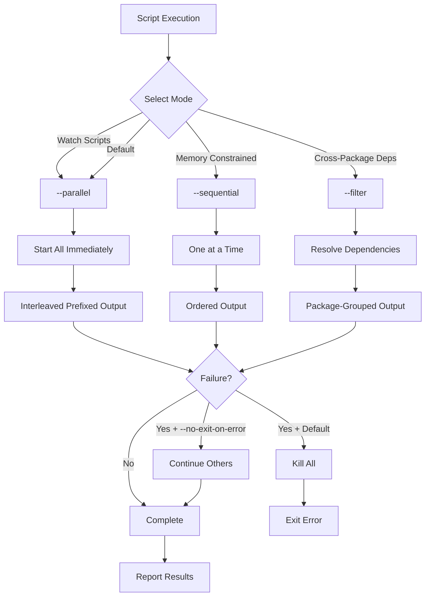
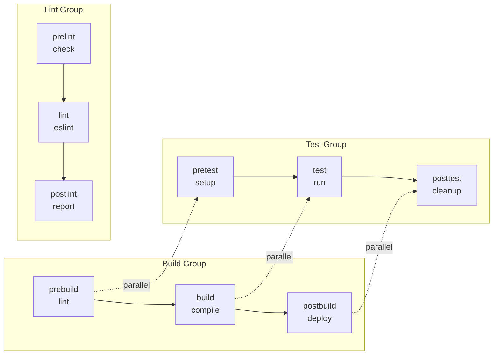
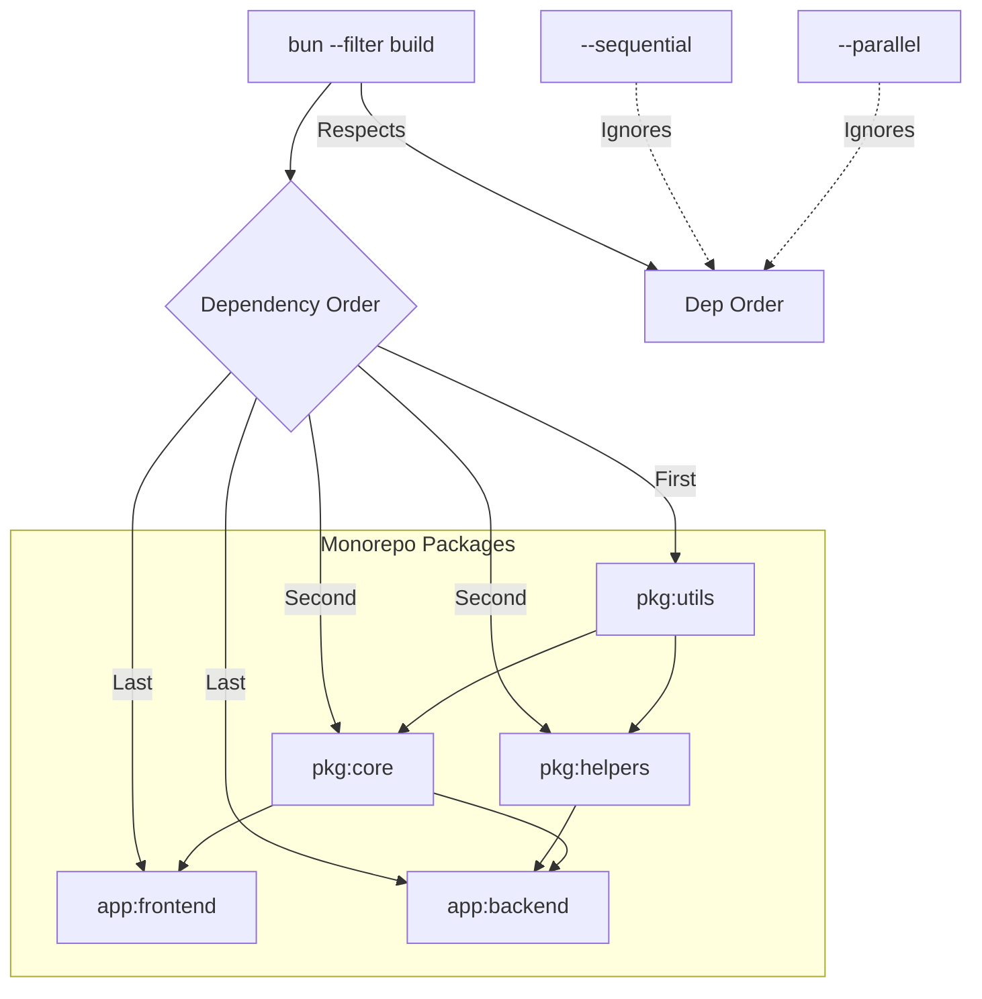
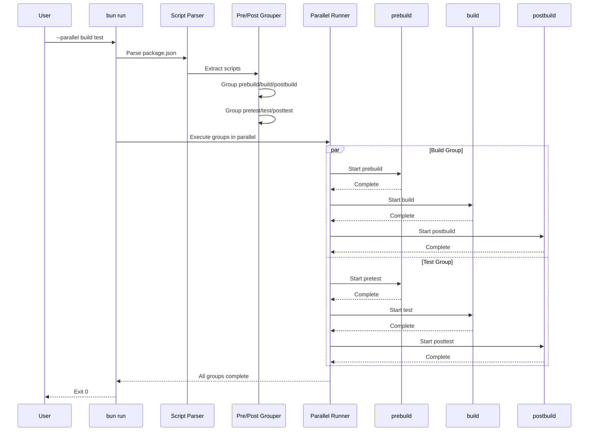
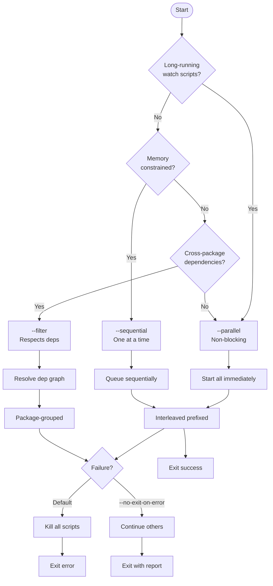

# Orchestration Graphs (Bun v1.3.9)

These diagrams document script orchestration semantics for:
- `bun run --parallel`
- `bun run --sequential`
- `bun --filter`
- Bun automatic pre/post grouping (`pre<name>` -> `<name>` -> `post<name>`)

## Orchestration Flow

## Pre/Post Grouping

## Filter Dependency Order

## Tier-1380 Sequence

## Decision Matrix

