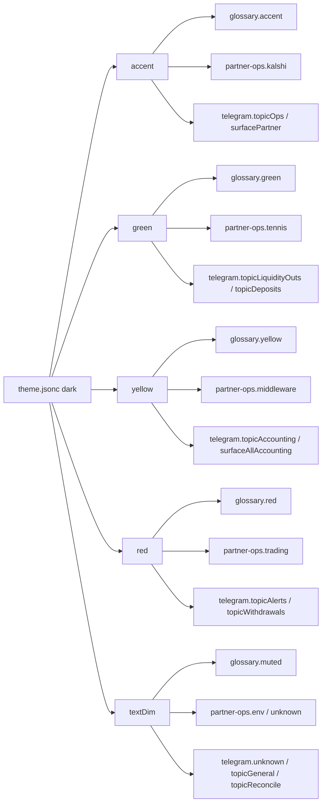

# Portal foundation

Single source of truth for the FactoryWager static portal (`public/portal/`). New pages and edits must follow these patterns so health, env, and navigation stay consistent.

**Template:** [`public/portal/_page-template.html`](../public/portal/_page-template.html)  
**Verify:** `bun run verify:portal:static` (CI) · `bun run verify:portal` (live server) · `bun run public:audit:verify` (discovery + static + audit)

**Agents:** Portal Design ([`.agents/skills/portal-design/`](../.agents/skills/portal-design/) · [`docs/design/portal-design-agent.md`](design/portal-design-agent.md)) · Public Discovery · Public Audit Gap Close — [`docs/harness/tenants/public-plane.md`](harness/tenants/public-plane.md)

---

## Data flow

```text
data.js  ──fetch──►  /api/health  (schemaVersion: 1)
    │
    ├── sessionStorage (SWR cache: portal_health_cache)
    ├── portal:data  { status, data?, error? }
    │       status: loading | ok | stale | error
    │
    ├── topbar.js   → health dot + ARIA
    ├── env page    → health.env or /api/env fallback
    └── page scripts → listen portal:data, render locally
```

Pages **must not** poll `/api/health` directly for the topbar dot. Use `portal:data` or `getHealthData()` from [`public/portal/data.js`](../public/portal/data.js).

Exception: [`public/portal/health-page.js`](../public/portal/health-page.js) (shell [`health/index.html`](../public/portal/health/index.html)) is a diagnostic surface that probes `/api/health` and `/health` for its own banner. It must not own the topbar dot (still `data.js` / `topbar.js`). Surfaces routing proof rows, env checklist, defaults proof, and operate glance (TOC/loop via `ops-summary` enrich).

### Chrome + CLI control plane

| Piece | Path / command | Notes |
|-------|----------------|-------|
| Nav SSOT | [`lib/portal/chrome-catalog.ts`](../lib/portal/chrome-catalog.ts) | priority + overflow · `group` · `cli` · bake `portal:chrome:bake` · apply `portal:chrome:apply` |
| Weave surfaces | [`lib/http/portal-weave.ts`](../lib/http/portal-weave.ts) | machine map · includes `vault` · `tools` · `failures` |
| Nav badges | [`public/portal/nav-badges.js`](../public/portal/nav-badges.js) | client `fetch` of **baked** registry JSON only (no pass-cli) |
| Brand assets | [`public/site.webmanifest`](../public/site.webmanifest) · [`public/icons/factory/`](../public/icons/factory/) | canonical mark, favicon/install metadata, theme colors |
| CLI hub | [`/portal/tools/`](../public/portal/tools/) | copy-CLI · bake freshness · capability subset · `#capabilities` |
| Packages board | [`/portal/packages/`](../public/portal/packages/) | SVG dependency graph · role filter · detail panel · claim `packages-graph-map-v13` |
| Brand keymap | [`/portal/brands/`](../public/portal/brands/) | 67-value glossary · constructor tiers · glossary concept links · design-kernel domain colors · tracked-project adoption · `/registry/brand-keymap.json` |
| Domain glossary | [`/portal/glossary/`](../public/portal/glossary/) | schema v3 · canonical market/model/trading vocabulary + typed portal field semantics · surface `sections[]` as `{ hash, domId, conceptId, title }` · `URLPattern.hash` deep links · portal design-kernel category tokens + partner-ops concept colors · `/registry/domain-glossary.json` |
| Vault board | [`/portal/vault/`](../public/portal/vault/) | live bake visual; gate = `portal-cli vault health` (offline snaps) |
| Failures board | [`/portal/failures/`](../public/portal/failures/) | junit bake · nav badge = failure count |
| Install hygiene | [`/portal/install-hygiene/`](../public/portal/install-hygiene/) | cache prune · npm policy · install:verify · `bake:install-hygiene` |
| Launcher | `bun run portal-cli dashboard --view=packages\|vault\|tools\|… [--open]` | real boards only — no phantom `/portal/pm/` etc. |

Do **not** invent new portal routes without a board under `public/portal/<name>/` + route manifest + chrome/weave entries.

### Portal semantic contract

[`lib/portal/semantic-vocabulary.ts`](../lib/portal/semantic-vocabulary.ts) owns
cross-portal field names and their typed UI meaning. The glossary projection
combines that authority with the Kalshi-bot domain glossary without changing
the latter's market/model definitions.

**Lifecycle map (definition → wire → graph → boards → audit):**
[`docs/CONCEPT_LIFECYCLE.md`](CONCEPT_LIFECYCLE.md). Agent/limit-row integration:
[`docs/harness/tenants/agents.md`](harness/tenants/agents.md).

| Dimension | Meaning | Examples |
|-----------|---------|----------|
| Concept kind | Provenance and consumer class | `ui` · `registry` · `composite` |
| Semantic type | Stable data role | `classification` · `state` · `location` · `resource` |
| UI role | Rendering role | `chip` · `badge` · `code` · `link` · `token` |
| Operational kind | Governed value of the Kind concept | `edge-health` · `registry-bake` · `proof` |
| Tone | Presentation token derived from status | `ok` · `warn` · `bad` · `skip` |

Portal labels link to durable glossary fragments such as
`/portal/glossary/#glossary:ui.semantic.status`. Prefer the canonical
`Hostname` label; `host` remains a search synonym.

### Portal URL planes ([URLPattern](https://bun.com/blog/bun-v1.3.4#urlpattern-api))

Bun matches **components independently** (`protocol` · `hostname` · `pathname` · `search` · `hash`).
SSOT classifiers + hash inits: [`lib/portal/url-planes.ts`](../lib/portal/url-planes.ts).

| Component | Plane | Provable by | Examples |
|-----------|-------|-------------|----------|
| `hostname` | Host | DNS / Access | `score.factory-wager.com` |
| `pathname` | Page | HTTP | `/portal/partners/` · `/portal/glossary/` |
| `pathname` | Registry | HTTP JSON | `/registry/domain-glossary.json` · `/registry/partners-ops.json` |
| `pathname` | API | HTTP JSON | `/api/health` · `/api/env` — **not** `/api/glossary` |
| `hash` | Section | Browser only | `#section:onboard` → `page-glossary` mounts |
| `hash` | Partner | Browser only | `#partner/ASH/out/out-ASH-1` → `partner-routes` |
| `hash` | Glossary concept | Browser only | `#glossary:section.partnersOnboard` |

Do **not** curl a hash as a path, route partner deep links via `pathname` patterns, or invent
`/api/parse-hash` — `URLPattern({ hash })` is the parser. Board JS must mirror
`PARTNER_HASH_PATTERN_INITS` / section·glossary inits (gated by `tests/portal-url-planes.test.ts`).

Compile repeated patterns once at module scope. Use `test()` for classification/allowlist matching
when no captures are needed; use `exec()` only when reading named groups. The shared kernel does
this in `lib/portal/url-planes.ts`, and browser glossary modules mirror it. `URLPatternInit.search`
and `.hash` match component text without the leading `?` / `#`; escape a literal colon before a
named group (`glossary\\::concept`). URLPattern grammar is not a JavaScript named-capture regexp.
The Bun 1.3.12 speedups are release evidence, not a timing threshold for CI:
[`test()` / `exec()` performance](https://bun.com/blog/bun-v1.3.12#urlpattern-is-up-to-2-3x-faster).

---

## API contracts

### `GET /api/health` (schema v1)

Origin: `collectHealthData()` in [`scripts/serve-public.ts`](../scripts/serve-public.ts). Pages: shared [`lib/http/portal-health-edge.ts`](../lib/http/portal-health-edge.ts) via [`functions/api/health.ts`](../functions/api/health.ts) (`/api/health`), [`functions/health/index.ts`](../functions/health/index.ts) (`/health` JSON), and [`functions/health/pre.ts`](../functions/health/pre.ts) (`/health/pre` plain text).

| Field | Type | Notes |
|-------|------|-------|
| `schemaVersion` | `1` | Required; clients warn on mismatch |
| `status` | `'ok' \| 'degraded'` | Topbar dot mapping |
| `env` | object | `{ summary, table, requiredMissingKeys }` |
| `registry` | object | `{ packages, versions }` |
| `artifacts` | object | ops summary, proofs, `complianceBoard` (edge + serve-public parity) |
| `defaults` | object | Bun defaults proof slice (`passed`/`total`/`status`) |
| `proofTaxonomy` | object | taxonomy audit rollup (`contracts`/`ok`) |

### `GET /api/env`

SSOT: [`lib/http/portal-env-status.ts`](../lib/http/portal-env-status.ts) → env-check table (redacted).

| Field | Type |
|-------|------|
| `ok` | boolean |
| `checkedAt` | ISO string |
| `summary` | `{ total, ok, missing, requiredMissing, … }` |
| `table` | `{ Key, Group, Severity, Status, Detail }[]` |

No raw `process.env` on the client.

### `GET /api/content-type`

Content-Type matrix rows for env page CT section.

---

## Component responsibilities

| Module | Role |
|--------|------|
| [`data.js`](../public/portal/data.js) | SWR, backoff, abort, `portal:data`, `startDataService()`, `getHealthData()` |
| [`topbar.js`](../public/portal/topbar.js) | Health dot (rAF + ARIA), lazy sidebar/notif bootstrap |
| [`components/sidebar.js`](../public/portal/components/sidebar.js) | Tenant manifest, `?tenant=` switch, keyboard a11y |
| [`components/notification.js`](../public/portal/components/notification.js) | `<notification-center>` toasts via `/api/channels/events` |
| [`components/glossary-ux.js`](../public/portal/components/glossary-ux.js) | Glossary tooltips · search autocomplete · breadcrumbs · local usage tracking (`domain-glossary.json`) |
| [`app.js`](../public/portal/app.js) | Registry grid; listens `portal:tenant` |

---

## New page checklist

1. Copy [`public/portal/_page-template.html`](../public/portal/_page-template.html).
2. Include in `<head>` or before `</body>`:
   ```html
   <script type="module" src="/portal/data.js"></script>
   <script type="module" src="/portal/topbar.js"></script>
   ```
3. Use shared topbar chrome from SSOT (do not hand-edit nav or substitute a text glyph for the mark): [`lib/portal/chrome-catalog.ts`](../lib/portal/chrome-catalog.ts) · bake `bun run portal:chrome:bake` → `/registry/portal-chrome.json` · apply `bun run portal:chrome:apply`. Priority: Home · Ops · Registry · Health · DOD · Compliance. Overflow is ops/registry/secrets-facing (Packages · Vault · Env · Concepts · …); harness boards (doctor · failures · tools · bunfig · console-format · install-hygiene) stay on direct URL / weave / footer, not default overflow.
4. Bun-native monorepo/portal probes: `bun run portal:probe` · `portal-cli probe lockfile`. Launcher: `portal-cli dashboard --view=<board>`.
5. Keep the generated brand head block (`theme-color`, factory icons, `/site.webmanifest`) and add topbar status: MD link (if applicable) + health link with `#health-dot` / `#health-label` (badges via `nav-badges.js` / topbar).
6. Subscribe to `portal:data` for data; do not inline-fetch `/api/health` for the dot.
7. Register route in [`lib/http/portal-route-manifest.ts`](../lib/http/portal-route-manifest.ts) + `public/_redirects` + chrome/weave when adding a board.
8. Run `bun run verify:portal:static` · `bun run public:discover:check`.

---

## Typography & UX polish

Agent rule: [`.cursor/rules/portal-frontend.mdc`](../.cursor/rules/portal-frontend.mdc) (supersedes generic “avoid Inter” for this surface).

Agent rule (ship): [`.cursor/rules/portal-ship.mdc`](../.cursor/rules/portal-ship.mdc) (Prettier on touched `lib/**/*.ts` before commit; PR bodies follow [`.github/pull_request_template.md`](../.github/pull_request_template.md), not HEREDOC stubs).

| Role | Preferred | CSS |
|------|-----------|-----|
| Brand / UI | Inter (Space Grotesk optional for wordmark) | `--font-brand` / `--font-sans` in `style.css` |
| Metrics, hashes, code | JetBrains Mono or SF Mono / Monaco | `--font-mono` · tabular nums |
| Load | Shared head on **all** pages + `_page-template.html` | CDN from `package.json` `factoryWager.brand.fonts` or self-hosted |

Preferred chrome patterns: priority nav + overflow, subtle atmosphere gradient, skeleton loading (not spinner-only), actionable error states with codes, channel-aware verification cards (`data-channel`, `data-subsystem`, etc.) with `<channel-filter>` composing channel + subsystem checkboxes on the ops dashboard. Keep the existing GitHub-dark palette.

### Board primitives

Shared layout / status classes in [`public/portal/style.css`](../public/portal/style.css) (**Board primitives** block). Prefer these over new per-board prefixes (`vh-*`, `tf-*`, light Tailwind hexes, emoji headings).

| Class | Role |
|-------|------|
| `.portal-page` | Page shell (`max-width: var(--layout-max)`, pad). Aliases: `.health-page`, `.doc-wrap`, `.partner-page`. |
| `.portal-hero` | In-page title + `.hero-sub` / `.sub` (topbar `.logo-page` stays chrome). |
| `.portal-hero--card` | Glossary-grade operator hero (radial accent + title + meta row). |
| `.portal-eyebrow` | Mono uppercase label above hero title. |
| `.portal-gate` + `.pass`/`.ok`/`.warn`/`.fail`/`.bad` | Bake/audit gate pill with pulse on pass. |
| `.portal-baked` · `.portal-source-links` | Bake timestamp + artifact deep links. |
| `.portal-stat-grid` · `.portal-stat` | Clickable metric cards (`ok`/`warn`/`bad`/`muted`/`active`). |
| `.portal-panel` · `.portal-panel-head` · `.portal-panel-desc` | Section panel + uppercase h2. |
| `.portal-toolbar` · `.portal-count` · `.portal-clear` | Filter row + result chip + clear. |
| `.portal-skeleton` · `.portal-error` | Shimmer loading + actionable failure card. |
| `.portal-section` / `.section` + `.section-sub` | Bordered `h2` + dim description. **No emoji in headings.** |
| `.portal-card` / `.portal-card-grid` | **Canonical card primitive** (accent hairline). Variants: `--metric` (numbers), `--panel` (sections), `--stat` (KPI summaries). Composed aliases: `.pkg-card`, `.ops-panel`, `.stat-card`, `.ops-desk-stat`, `.card`, `.verification-result` (`.health-card` is a group container, not a card surface). |
| `.portal-table` + `.table-wrap` | **Canonical** dark data tables (`data-density` · `data-zebra` · `data-tone`). CSS aliases still style `.data-table` / `.ops-table` / `.env-table` / `.live-table` / `.doc-table` — new markup should use `.portal-table` only. |
| `.portal-chip` · `.portal-pill` · `.portal-meta-row` | Shared chips / category pills / mono meta rows (prefer over per-board CSS). Atom names used by boards: `.chip` (pills/tags) · `.kicker` (uppercase micro labels) · `.metric-value` (large tabular numbers). |
| `lib/portal/ui-html.ts` · `components/portal-ui.js` | Pure HTML builders — table (+ `tableAttrs` / rows) · `renderPortalStatGrid` · chips/pill · **banner** · **hero** · panel · error · skeleton · gate · `portalRowToneClass`. Matrix: [`.agents/skills/portal-design/references/building-blocks.md`](../.agents/skills/portal-design/references/building-blocks.md). Bakes: identity · vault · failures. Boards: partners · account · packages · bookmakers · surfaces · tools hub. Dual-class `portal-table` + board alias when specialty CSS remains. |
| `.row-ok` / `.row-warn` / `.row-bad` | 3px inset row rails (Live check pattern). |
| `.tone-chip.tone-ok\|warn\|bad\|neutral` | Status pills. |
| `.status-text` / `.st-ok` / `.st-warn` / `.st-bad` | Inline status color. |
| `.portal-actions` + `.btn` / `.btn-primary` | Secondary outline actions. |
| `.portal-banner` | Status strip + `.dot` (ok/warn/bad). |

Operator boards that already use the raised bar: Concepts · Surfaces · Skills · Env · Glossary · Brands · Catalog · Bunfig · Console-format · Doctor · Partners · Packages · Failures · Vault · Install-hygiene. Prefer these primitives for remaining boards.

**Tone contract (only):** `ok → var(--green)` · `warn → var(--yellow)` · `bad → var(--red)` · `neutral → var(--text-dim)`. Do not use Tailwind greens (`#16a34a`) or light badge fills on portal boards.

### Canonical primitives contract

Canonical names for new `/portal/*` boards. Aliases are **permanent legacy-compat shims — safe to use, never a merge blocker**; new code prefers the canonical names. Do not migrate legacy markup unless already touching the template.

| Primitive | Classes | Modifiers | Notes |
|-----------|---------|-----------|-------|
| **Table** | `.portal-table` | `data-density="compact"` · `data-tone="accent|warn|bad"` · `data-zebra` | Aliases: `.data-table`, `.env-table`, `.ops-table`, `.live-table`, `.doc-table` (share base + `row-ok/warn/bad` rails). |
| **Card** | `.portal-card` | `--metric` (numbers) · `--panel` (sections) · `--stat` (KPI summaries) | Composed aliases: `.pkg-card`, `.ops-panel`, `.stat-card`, `.ops-desk-stat`, `.card`, `.verification-result`. |
| **Atoms** | `.kicker` (micro labels) · `.chip` (pills/tags — canonical pill base) · `.metric-value` (large tabular numbers) | tone via `--tone-*` tokens | `.chip` theme variants compose the base: `.tone-chip`, `.kind-chip`, `.plane-chip`, `.portal-pill`, `.ops-badge`, `.portal-chip` (`.version-badge`/`.channel-badge` are the accent-badge family, own base). Avoid inventing new per-board names (`ops-*`, `vh-*`, `tf-*`…) for these roles. |

**Governance:** new boards targeting `/portal/*` must use the canonical primitives above. Reviewers suggest swapping an alias → canonical on *new* elements; aliases on legacy elements are never a blocker.

### Venue identity palette (not status)

Cross-market / tennis desk venues use a **separate identity palette** (brand border + text + 8% tint). Do not map Kalshi/Polymarket/etc. onto ok/warn/bad.

| Venue | Short | Border | Text (dark) | CSS prefix |
|-------|-------|--------|-------------|------------|
| Kalshi | KX | `#7DD3FC` | `#A5D6FF` | `--venue-kalshi-*` |
| Polymarket | PM | `#2E5CFF` | `#58A6FF` | `--venue-poly-*` |
| Pinnacle | PN | `#1A73E8` | `#79C0FF` | `--venue-pinnacle-*` |
| Betfair | BF | `#F5B942` | `#E3B341` | `--venue-betfair-*` |

| Surface | Path |
|---------|------|
| CSS | [`public/portal/venues.css`](../public/portal/venues.css) |
| Portal JS | [`public/portal/components/venue-badge.js`](../public/portal/components/venue-badge.js) |
| TS SSOT + ANSI | [`lib/venues/venue-brand.ts`](../lib/venues/venue-brand.ts) (`fmtVenueBadge` · `fmtVenueLegend`) |
| Kalshi desk ANSI | [`Kalshi-bot/src/institutions/venue-badge.ts`](../Kalshi-bot/src/institutions/venue-badge.ts) |
| Board demo | [`/portal/tennis/`](../public/portal/tennis/) |

```bash
bun -e 'import { fmtVenueLegend, fmtVenueBadge } from "./lib/venues/venue-brand.ts"; console.log(fmtVenueLegend()); console.log("Row:", fmtVenueBadge("polymarket", false), "53¢  +4.2");'
bun test tests/venue-brand.test.ts
```

### Tennis board metrics bake

| Artifact | Path |
|----------|------|
| Board metrics | `/registry/tennis/board-metrics.json` |
| Mid distribution | `/registry/tennis/mid-distribution.json` |
| Agent registry auth | `/registry/tennis/agent-auth.json` (`FACTORY_WAGER_TOKEN` status · no secret) · [`tennis-hq-registry`](harness/tenants/tennis-hq-registry.md) |
| Bake | `bun run tennis:board:bake` (event-store) · `--sample` fallback |
| Board UI | [`/portal/tennis/`](../public/portal/tennis/) · [`tennis-desk.js`](../public/portal/components/tennis-desk.js) |
| Pure helpers | [`lib/tennis/board-metrics.ts`](../lib/tennis/board-metrics.ts) |

Event-store default: `Kalshi-bot/research/cache/event-store.db` (book_ticks mids + markets series volume).

**Reference boards:** [`/portal/health/`](../public/portal/health/) (Live check multi-column + section rhythm) · [`/portal/install-hygiene/`](../public/portal/install-hygiene/) (tone chips). **Template:** [`_page-template.html`](../public/portal/_page-template.html). **Chrome apply:** `bun run portal:chrome:apply`.

**Unification phases:** P0 chrome holes + emoji/token strip · P1 promote remaining private CSS into primitives · P2 rewrite limits/partner-history/doctor/vault shells to full template.

Modern CSS in [`public/portal/style.css`](../public/portal/style.css) — **static-first** by default.

**Scoring SSOT:**
- Static-fit (R/S/M/B): [`lib/portal/css-enhancement-score.ts`](../lib/portal/css-enhancement-score.ts) · `bun run portal:css:score`
- **Power UI** (5 pillars, equal mean): [`lib/portal/power-ui-score.ts`](../lib/portal/power-ui-score.ts) · `bun run portal:css:score:power`

| Pillar | What it measures |
|--------|------------------|
| 🌍 Global UX | RTL/LTR, `:lang()`, a11y, color-scheme |
| ⚡ Performance | CLS, FOUT, fluid `clamp()`, smaller CSS |
| 🎨 Consistency | Design tokens, color harmony |
| 🧩 Scalability | Nesting, `:is()`/`:not()`, CSS Modules |
| 🔧 Future | P3 / OKLCH / modern notation |

| | |
|--|--|
| Weights | R 35% · S 25% · M 20% · B 20% (kept as clean hundredths — do not tweak to 36.5% for fake precision) |
| Axes | Float **0.0–10.0** at **1 decimal** (breaks the old integer 0.05 grid) |
| Display | **3 decimals** — 5-decimal padding is still theater when totals land on thousandths |
| Finest step | ΔR = 0.1 → Δscore = **0.035** |

Correct float totals for the published axes (integer-era 8.9 / 8.0 were coarse):

| Priority | Feature | R | S | M | B | Score | Portal use |
|----------|---------|--:|--:|--:|--:|------:|------------|
| Keep | [Logical properties](https://bun.com/docs/bundler/css#logical-properties) | 9.8 | 7.6 | 9.1 | 8.8 | **8.910** | Logo / overflow / dropdown / `text-align: end` |
| Keep | [`:lang()`](https://bun.com/docs/bundler/css#lang-selector) | 8.7 | 8.4 | 9.2 | 7.1 | **8.405** | RTL `ar,he,fa,ur` · CJK · nav-more mirror |
| Keep | [`:not()`](https://bun.com/docs/bundler/css#not-selector) | 4.5 | 9.3 | 9.5 | 8.2 | **7.440** | Badge defaults · fail emphasis |
| Keep | [Nesting](https://bun.com/docs/bundler/css#nesting) | 4.8 | 8.9 | 9.7 | 7.8 | **7.405** | Nav / health-dot / badges |
| Keep | [Shorthands](https://bun.com/docs/bundler/css#shorthands) | 3.2 | 8.7 | 9.4 | 8.5 | **6.875** | `place-items` · `overflow: auto hidden` |
| Optional | [`:is()`](https://bun.com/docs/bundler/css#is-selector) | 4.2 | 9.5 | 9.0 | 5.5 | **6.745** | Shared mono · open/hover groups |
| Optional | [`system-ui`](https://bun.com/docs/bundler/css#system-ui-font) | 3.3 | 7.6 | 9.1 | 8.2 | **6.515** | After Inter in `--font-sans` |
| Keep | [Math / `clamp()`](https://bun.com/docs/bundler/css#math-functions) | 3.0 | 8.2 | 8.4 | 7.5 | **6.280** | Fluid `--font-hero` / `--pad-*` / layout max |
| Optional | [Media ranges](https://bun.com/docs/bundler/css#media-query-ranges) | 3.1 | 8.8 | 8.3 | 6.2 | **6.185** | `@media (width < 641px)` |
| Defer | `color-mix` / `light-dark` / relative·LAB·P3 / CSS Modules | — | — | — | — | ≤6.4 | Re-enable when shipping `/portal/dist/style.css` |

Power UI top (2 decimals): `:lang()` / `:not()` **7.30** · `clamp()` **7.10** · shorthands / `system-ui` / logical ≈ **7.0+**. Full table: `bun run portal:css:score:power`.

Component readiness (static-fit): `bun run portal:css:score:components`.

### Optional CSS build (`Bun.build`)

| Scenario | API |
|----------|-----|
| Build once, ship lowered CSS | [`Bun.build`](https://bun.com/docs/bundler/index#basic-example) via [`tools/build-portal-css.ts`](../tools/build-portal-css.ts) |
| Asset Processing entry | [Content types](https://bun.com/docs/bundler#content-types) → `.css` uses the **css** loader |
| CSS loader | [`loader:css`](https://bun.com/docs/bundler/loaders#css) — `@import`, `url()`, outdir stylesheet |
| Theme config | [`loader:jsonc`](https://bun.com/docs/bundler/loaders#jsonc) → [`theme.jsonc`](../public/portal/theme.jsonc) → `theme-tokens.css` |
| File / asset loader | [`loader:file`](https://bun.com/docs/bundler/loaders#file) — copy unrecognized assets + rewrite paths (`publicPath`) |
| CSS feature set | [Bundler CSS](https://bun.com/docs/bundler/css) |
| HTML-entry auto-bundle (alt) | [HTML & static sites](https://bun.com/docs/bundler/html-static) (also under Asset Processing) |
| Custom preprocess | [Plugins](https://bun.com/docs/runtime/plugins) |
| Read/write artifacts | [`Bun.file`](https://bun.com/docs/runtime/file-io) / `Bun.write` |
| Prove lowering | `bun:test` → [`tests/portal-css-build.test.ts`](../tests/portal-css-build.test.ts) · [`tests/portal-theme.test.ts`](../tests/portal-theme.test.ts) |

**Portal need → loader**

| Need | Loader | Path |
|------|--------|------|
| Design tokens | `jsonc` | `theme.jsonc` → `bun run portal:theme:sync` |
| Stylesheet + `@import` | `css` | `style.css` → `bun run portal:css:build` |
| Icons / images (future) | `file` | import in JS/CSS; Bun copies to `outdir` |
| CSS Modules | `css` (+ modules) | Deferred until component library split |

**Color kernel planes** — registry bake field `colorKernel` points at [`public/portal/theme.jsonc`](../public/portal/theme.jsonc). Do not invent a parallel `colorkernal` CLI.

**Read-only token printer** — `bun run tokens` (`tools/portal-tokens.ts`) resolves dotted paths on [`theme.jsonc`](../public/portal/theme.jsonc) via [`lib/portal/theme.ts`](../lib/portal/theme.ts) / [`lib/portal/theme-token-resolve.ts`](../lib/portal/theme-token-resolve.ts) and prints [Bun.color](https://bun.com/docs/runtime/color) formats. `--all-formats` emits one JSON report covering all 16 formats declared by Bun 1.4 (`ansi*`, CSS strings, channel objects/arrays, hex, and number), including terminal-disabled/unsupported status. It is **not** a second palette or color-kernel CLI — fail-closed on unknown paths (lists nearest). UX alias: `semantic.tiers.*` → `semantic.tier.*` (SSOT key is singular `tier`). Examples: `bun run tokens --token semantic.vertical.sportsbook --format hex` → `#3fb950`; `bun run tokens --token dark.green --format '[rgba]'`; `bun run tokens --token namespaces.bun14.accentSoft --all-formats`.

**Product namespace discipline** — `namespaces.bun14` projects shared role and interaction aliases into collision-resistant `--fw-bun-14-color-*` custom properties. The namespace includes canvas, surface states, text states, accent states, semantic statuses, and focus. Values must remain `var(--…)` references into the FactoryWager kernel; product-owned hex values are prohibited.

| Plane | Owns | Source | Validation | Example Keys |
|-------|------|--------|------------|--------------|
| Portal chrome | Dark/light CSS vars + design-system layers | [`theme.jsonc`](../public/portal/theme.jsonc) → [`lib/portal/theme.ts`](../lib/portal/theme.ts) → `theme-tokens.css` | `bun run portal:theme:check` (CSS stale) · [`tests/portal-theme.test.ts`](../tests/portal-theme.test.ts) · `validate:colors` claim/evidence (theme version + dark key count) | Flat: `accent` · `green` · `yellow` · `orange` · `red` · `textDim` · `bg` · `surface`. Semantic: `--status-fresh/stale/old/critical` · `--group-*`. Scales: `--text-*` · `--space-*` · `--radius-*` · `--duration-*` |
| Glossary chips | Category chip hex for domain-glossary bake | [`lib/portal/portal-kernel-palette.ts`](../lib/portal/portal-kernel-palette.ts) (dark tones from theme + extras) | `portal:colors:check` aliases · `bun run glossary:portal:check` | Theme-aliased: `accent` · `green` · `yellow` · `red` · `muted`. Extended (may diverge): `purple` · `blueDeep`. Fallback: unknown category → `muted` |
| Partner-ops | Concept / book / phase chip palette | [`lib/telegram/partner-ops-color-kernel.ts`](../lib/telegram/partner-ops-color-kernel.ts) | `portal:colors:check` aliases · Bun.color load assert · partner-ops / ops-view tests | Aliased: `kalshi`←accent · `tennis`←green · `middleware`←yellow · `trading`←red · `env`/`unknown`←textDim. Extended: `polymarket` · `pinnacle` · `research`. Fallback: missing concept → palette key `unknown` (`#8B949E`) |
| Telegram topics | Package-forum / surface / brand marks | [`lib/telegram/telegram-color-kernel.ts`](../lib/telegram/telegram-color-kernel.ts) | `portal:colors:check` aliases · Bun.color load assert · telegram color-kernel tests | Aliased: `topicOps`/`surfacePartner`←accent · `topicLiquidityOuts`/`topicDeposits`←green · `topicAccounting`/`surfaceAllAccounting`←yellow · `topicAlerts`/`topicWithdrawals`←red · `unknown`/`topicGeneral`/`topicReconcile`←textDim. Extended: `brand` · `surfaceHq` · `surfaceSandbox`. Fallback: missing / unknown → `TELEGRAM_COLORS.unknown` |
| Components | `var(--token, <fallback>)` pairs in injected component styles (the fallback IS the live color when no page override exists) | [`theme.jsonc`](../public/portal/theme.jsonc) `card` block (light-surface card palette, kernel-aliased to light tokens) → `--portal-card-*` CSS vars | `portal:colors:check` component plane via [`lib/portal/component-color-align.ts`](../lib/portal/component-color-align.ts) · [`tests/portal-component-color-align.test.ts`](../tests/portal-component-color-align.test.ts) | `--portal-health-ok`←`card.healthOk` · `--portal-accent`←`card.accent` · `--tone-ok`←`dark.green` · `--accent-glow`←`dark.accentGlow` |

`bun run portal:colors:check` / `bun run validate:colors` (Bun.color via [`lib/portal/color-kernel-align.ts`](../lib/portal/color-kernel-align.ts) for aliases, [`lib/portal/component-color-align.ts`](../lib/portal/component-color-align.ts) for components) enforces the aliased columns plus **minimum count floors** (`COLOR_KERNEL_COUNT_FLOORS`). Extended keys may diverge. Check-only — no TypeScript rewrite. Chained from `portal:theme:check` after CSS stale check. Component comparison uses Bun.color `{rgba}` (not `HEX` — HEX drops the alpha channel, so `accent-glow` alpha drift would be invisible). Unmapped component vars warn for triage into `COMPONENT_VAR_TOKEN_MAP`. Typed stdout via [`lib/portal/claim-reporter.ts`](../lib/portal/claim-reporter.ts). Machines: `bun run validate:colors:json` (`ClaimReport` · `checks[]` · `meta`).

These **planes are not UI elevation layers** (not Base / Raised / Overlay / Modal). They are color SSOTs: chrome tokens · glossary palette · partner-ops concepts · telegram topic/surface roles.

### Theme-dark alias hub

What `validate:colors` fail-closes (plus floors): `theme.dark` semantic tokens fan out to consumer keys.



> **Color kernel claim workflow:** CI always validates the kernel via `bun run validate:colors:strict` (Harness Gates · `test:colors` · claim `color-kernel-theme-aliases`). When a PR touches theme / kernels, paste `bun run validate:colors` into the **Color Kernel Evidence** slot — success looks like `Claim: Color kernel theme-dark aliases are complete and conflict-free (theme v…)`. `check-pr-claim` soft-warns if that paste is missing/template or shows an inconsistent Claim (never fails CI by itself). Machines: `bun run validate:colors:json` (`ClaimReport` · `status` · `checks[]`). Evidence is per-plane coverage + floors — not extended-key uniqueness or CSS contrast.

```bash
bun run portal:theme:sync          # theme.jsonc → theme-tokens.css
bun run portal:theme:watch         # same, but bun --watch — regenerates on every theme.jsonc edit
bun run portal:theme:check         # tokens CSS stale + color-kernel aliases
bun run dev:portal:theme           # one-command dev loop: theme watch + serve:public:hot (bun scripts/dev-portal.ts)
bun run portal:colors:check        # alias Claim/Evidence (same as validate:colors)
bun run validate:colors            # alias of portal:colors:check — paste for PRs
bun run validate:colors:json       # ClaimReport JSON (status · checks[] · meta · floors)
bun run validate:colors:strict     # fail-closed + --ci env tag
bun run test:colors                # unit + validate:colors smoke
bun run portal:css:build           # sync theme + lower CSS → dist/style.css
bun run portal:css:build:minify    # → also dist/style.min.css
bun run portal:css:check
bun run portal:css:score:power     # 5-pillar Power UI matrix
bun run docs:portal                # ANSI preview this file (bun ./docs/portal-foundation.md)
```

### Terminal preview (`bun ./file.md`)

Ship note: [Bun v1.3.12 — render markdown in the terminal](https://bun.com/blog/bun-v1.3.12#render-markdown-in-the-terminal-with-bun-file-md). Canonical API: [`Bun.markdown.ansi`](https://bun.com/docs/runtime/markdown#ansi-terminal-output) (`AnsiTheme`).

| Mode | How | Factory |
|------|-----|---------|
| File path (zero VM overhead) | `bun ./docs/portal-foundation.md` · `bun run docs:portal` | Same pattern as `bun run docs:harness` / `docs:cron` |
| Programmatic string | `Bun.markdown.ansi(md, theme?)` | Call the API directly — pass `AnsiTheme` at the call site when needed |
| Proof | — | `bun test tests/bun-markdown-ansi.test.ts` · harness `bun run harness:status` |

`AnsiTheme` knobs ([blog](https://bun.com/blog/bun-v1.3.12#render-markdown-in-the-terminal-with-bun-file-md) / [docs](https://bun.com/docs/runtime/markdown#ansi-terminal-output)):

| Option | Intent | Bun default |
|--------|--------|-------------|
| `colors` | Plain vs ANSI | `true` |
| `hyperlinks` | Clickable OSC 8 links | `false` |
| `columns` | Wrap width | `80` |
| `kittyGraphics` | Inline images (Kitty / WezTerm / Ghostty) | `false` |
| `light` | Light terminal palette | unset |

Static portal boards still ship HTML/CSS from `theme.jsonc` — terminal ANSI is for **operator/doc preview**, not a second colorKernel SSOT.

Default pages keep `<link href="/portal/style.css">` (which `@import`s `theme-tokens.css`). Opt in to `/portal/dist/style.css` for Bun-lowered CSS. **No browserslist dual-file API** — one `Bun.build` pass already emits legacy-safe CSS; source vs `dist/` is the modern/lowered pair.

Theme tokens: `html[data-theme="light"]` overrides CSS variables (no `light-dark()` in static source). Smoke-test RTL with `lang="ar"` and/or `dir="rtl"` on `<html>`.

## Anti-patterns

| Do not | Do instead |
|--------|------------|
| `fetch('/api/health')` in page scripts (dot) | `portal:data` or `getHealthData()` |
| `process.env` in `public/portal/` | `/api/env` |
| Duplicate topbar health-dot logic | Rely on `topbar.js` |
| Hash for tenant (`#factory`) | `?tenant=factory` (hash is for search filters) |
| Skip `data.js` / `topbar.js` on HTML pages | Required on every portal page |
| Webfonts only on `index.html` | Template + every portal page head |
| System-only fonts “because Inter is banned” | Intentional brand faces per table above |

---

## Verification

```bash
bun run verify:portal:static   # anti-patterns + script includes (no server)
bun run verify:portal          # static + live nav/API/styles (needs serve-public)
```

Live probe checks CSS/JS assets (`checkPortalStyles`), ops dashboard panels (including `proof-taxonomy-audit.json`), and subsystem filters on verification cards.

Wired into `ci:harness` as gate `portal-foundation` and appended to `verify-all` for live checks.

### Executive dashboard (`/portal/dashboard/`)

[`dashboard-app.js`](../public/portal/dashboard-app.js) is the at-a-glance proof command center (not a duplicate of Ops):

- Data: `/registry/*` proofs first (Pages), with `/api/defaults` · `/api/monitoring` · `/api/operations/summary` fallbacks
- Surfaces: **Operate planes** (TOC Ops + tree/loop from `ops-summary`), proof KPIs, subsystem rollup, `<channel-filter>` release cards, Bun defaults, taxonomy audit
- Soft refresh via Refresh control; deep links to `/portal/ops/` and `/portal/toc/`
- Cross-surface map: [`portal-weave.json`](../public/registry/portal-weave.json) from [`lib/http/portal-weave.ts`](../lib/http/portal-weave.ts) (`ops:snapshot`)
- Operator guide (scannable): [`portal-ops-board-map.md`](portal-ops-board-map.md) — bake with `bun tools/bake-portal-ops-map.ts`

### Ops dashboard (`/portal/ops/`)

[`operations-dashboard.js`](../public/portal/operations-dashboard.js) uses **two pipelines**:

**Layer 1 — summary API (embedded slices)**

- Local: `GET /api/operations/summary` → [`buildOpsSummary`](../lib/operations/ops-summary.ts) (`source: live`)
- Pages: same path → snapshot [`ops-summary.json`](../public/registry/ops-summary.json)
- Regenerate snapshot: `bun run ops:snapshot`
- Triage: `bun run ops:diagnose` · runbook [`docs/harness/ops-summary-endpoint.md`](harness/ops-summary-endpoint.md)

**Layer 2 — portal registry fetches (full panels)**

- `/registry/*.json` — release-features · install-* · networking · runtime-nits · bundler · proof-taxonomy-audit
- Release preview rows deduped via [`lib/verification/release-preview.ts`](../lib/verification/release-preview.ts)

Filters: `<channel-filter>` composes release channel + verification subsystem checkboxes. Cards expose `data-channel`, `data-subsystem`, `data-introduced-in`.

TOC Ops rollup card on this page reads `ops-summary.toc` (warmed / warming / bottlenecks). Full board: [`/portal/toc/`](../public/portal/toc/) · tenant [`docs/harness/tenants/toc-ops.md`](harness/tenants/toc-ops.md).

Compliance rollup on Ops reads `ops-summary.compliance` from the same bake as `/portal/compliance/` · monitoring · health — one board → many projections: [`docs/harness/tenants/compliance-portal.md`](harness/tenants/compliance-portal.md).

### TOC Ops board (`/portal/toc/`)

Fixture-first Drum / Buffer / Rope desk for Pages (no `toc-ops-repo` SQLite on the edge).

| Piece | Path |
|-------|------|
| UI | [`public/portal/toc/`](../public/portal/toc/) · `toc-dashboard.js` |
| Baked artifact | [`public/registry/toc-ops.json`](../public/registry/toc-ops.json) |
| Edge API | `GET /api/toc` · `GET /api/toc/summary` · POST → **503** |
| Seed / bake | `bun run ops:seed:toc` · `bun run ops:snapshot` |
| Types / fixture | [`lib/toc-ops/`](../lib/toc-ops/) |
| Live mutations | **toc-ops-repo** Central Tool (`ct`) only |

**Plane split:** `/portal/toc` = demo-readonly mirror of TOC edge (rails, accounts, Soft/Gate 12, Ball-in-Court, bottlenecks). `/portal/ops` = live FactoryWager ops (partner-profile bridge, channels outbox, phones inventory) **plus** a TOC summary card. Cloudflare MCP does **not** expose TOC desk data — use it for Pages deploy/inspect only. Full concern matrix: [`docs/harness/tenants/toc-ops.md`](harness/tenants/toc-ops.md)#surface-map-portal-vs-live.

### Partner limits board (`/portal/limits/`)

| | |
|-|-|
| UI | [`public/portal/limits/`](../public/portal/limits/) · multi-factor score badges |
| Bake | `/registry/limit-raises.json` via `ops:snapshot` |
| Agent | Local SQLite · Pages snapshot `GET /api/agents/v1/limits/raises` · summary `/api/limits/summary` |
| Tenant | [`docs/harness/tenants/partner-limits.md`](harness/tenants/partner-limits.md) · `ops:limits:demo` |

Dashboard plane card + monitoring `limitRaises` slice + health `artifacts.limitRaises` project from the same bake (missing bake does not degrade health).

### Compliance board (`/portal/compliance/`)

Baked MA/NJ board (enhancements · shadow · geo · HMAC). Priority-nav surface; same bake projects to Ops rollup, monitoring tile, and health.

| Piece | Path |
|-------|------|
| UI | [`public/portal/compliance/`](../public/portal/compliance/) · `compliance-dashboard.js` |
| Baked artifact | [`public/registry/compliance-board.json`](../public/registry/compliance-board.json) |
| Health | `/api/health` → `artifacts.complianceBoard` (`projectComplianceHealthArtifact`) |
| Edge API | `GET /api/compliance` (registry snapshot; 503 if missing bake) |
| Bake / verify | `bun run compliance:bake` · `bun run compliance:verify` · companion of `ops:snapshot` |
| Tenant | [`docs/harness/tenants/compliance-portal.md`](harness/tenants/compliance-portal.md) |

Missing bake → `exists:false` (no degrade); present + fail → `ok:false` (**degrades** health).

### Local auth (`REGISTRY_SECRET`)

When auth is enabled, static read plane is public (Pages parity):

- `/portal/*` — HTML, CSS, JS modules
- `/registry/*` — proof JSON for dashboard fetches
- `/icons/*` + `/site.webmanifest` — canonical public brand resources

Publish and most API routes remain Bearer-gated. See [`docs/platform-routing.md`](platform-routing.md).

### Local dev: restart when Home shows `{"error":"Package not found"}`

Two stale `serve-public` PIDs on `:3000` can race — the old one treats `/` as an npm package name. Fix:

```bash
lsof -nP -iTCP:3000 -sTCP:LISTEN | awk 'NR>1 {print $2}' | sort -u | xargs kill -9
bun run serve:public
```

Then `curl -s http://localhost:3000/ | head -1` should show `<!doctype html>`, not JSON.

> **`bun run dev` is NOT the portal.** `dev`/`start` boot `server/server-enhanced.ts` (the Bun-docs
> demo server: RSS feeds, typed-array examples) on the same `:3000` — visiting `/portal` there is a
> 404. For the portal, run `bun run dev:portal` (= `serve:public:hot`) after clearing `:3000`.

### Port configuration

`serve-public` omits `port` and `hostname` on `Bun.serve` so bind matches [Bun’s server docs](https://bun.com/docs/runtime/http/server#configuration) mechanically:

| Knob | Behavior |
|------|----------|
| **`port`** | Omitted — Bun resolves `--port` → `BUN_PORT` → `PORT` → `NODE_PORT` → `3000` |
| **`hostname`** | Omitted unless `HOST` / `BIND_HOST` is set (Bun default bind) |
| **Busy default port** | One retry with `port: 0` (ephemeral); startup logs the chosen port |

```bash
bun --port=3099 run serve:public
BUN_PORT=3099 bun run serve:public
HOST=0.0.0.0 bun run serve:public   # optional LAN bind override
bun run verify:portal               # probes resolveBunServeDefaultPort() or PORTAL_VERIFY_BASE
bun run brand:status:bind           # indexed Server/URL identity cards
bun run brand:status:lifecycle      # C. SERVER METHODS + D. SERVE OPTIONS
bun run check:serve-shape           # shape + lifecycle + bind-identity suites
```

Verify helper: `resolveBunServeDefaultPort()` in `lib/http/bun-serve-shape.ts` (includes `--port` for probes only; bind is native Bun). After bind, `serve-public` logs **BIND IDENTITY** ([`bind-identity-card.ts`](../lib/http/bind-identity-card.ts)); full policy: [`serve-public-bind.md`](harness/tenants/serve-public-bind.md).

**Routing:** [`buildPublicRoutes`](../scripts/serve-public.ts) registers exact SIMD `routes` for `/ready`, APIs (method maps), and **every** `public/portal/<board>/` index via `portalBoardRoutes` / `PORTAL_BOARD_SLUGS`. JSON GET APIs use `jsonETag` (data-ETag + 304). Unmatched traffic (npm publish `PUT`, multi-segment static, skill detail pages) stays on `fetch` — [Bun routing](https://bun.com/docs/runtime/http/routing).

### Dev reload (`--watch`, `--hot`, browser SSE)

Three independent layers — do not conflate them. See [Bun watch mode](https://bun.com/docs/runtime/watch-mode) and [runtime `--watch`](https://bun.com/docs/runtime#watch).

| Layer | Command / mechanism | Reloads |
|-------|---------------------|---------|
| **Server soft reload** | `bun run serve:public:hot` → `bun --hot scripts/serve-public.ts` | Server TS (`routes`, `fetchHandler`, APIs) without process restart |
| **Server hard restart** | `bun run serve:public:watch` → `bun --watch scripts/serve-public.ts` | Full process (env, cron, DB, SSE hub) |
| **Browser page reload** | SSE `/__hmr` (default on loopback) | `public/` HTML/CSS/JS — full page refresh, not bundler HMR |

**Bun flags must come immediately after `bun`**, not after `run` or the script name ([docs](https://bun.com/docs/runtime#watch)):

```bash
# ✅ Correct
bun --hot scripts/serve-public.ts
bun --watch scripts/serve-public.ts
bun --port=3099 --hot run serve:public
bun run serve:public:hot      # safe: --hot is inside the npm script definition

# ❌ Wrong — flag ignored by Bun, passed to the script
bun run serve:public --watch
bun run serve:public:hot --hot
```

**Day-to-day:** `bun run serve:public:hot` for server edits; browser updates for static portal files come from SSE. Use `--watch` when you need a clean process restart. **Theme edits:** `bun run dev:portal:theme` runs the theme watcher (`portal:theme:watch`) next to `serve:public:hot` in one process — editing `theme.jsonc` regenerates `theme-tokens.css` and the server serves it on the next load, no manual sync.

Disable browser SSE: `SERVE_PUBLIC_HMR=0`. Force on when bound `0.0.0.0`: `SERVE_PUBLIC_HMR=1` or `HOST=127.0.0.1`.

**Verification:** `bun run verify:flag-order` scans all `package.json` scripts for `bun run --watch|--hot` (anti-pattern). Grandfathered entries live in `tools/verify-script-flags-baseline.json` (with **hot / dormant / legacy / partial** tiers); new violations fail CI/`verify-all`. Use `--strict` for a repo-wide cleanup pass.

**In scope vs not:** The portal is **not** a `projects/` package — it is `public/portal/` + root `serve:public:*` in `package.json` (already `bun --hot` / `bun --watch`). **Kalshi-bot** is a **repo-root submodule** (`Kalshi-bot/package.json`, `serve`: `bun --hot`). **kal-poly-bot** lives at `projects/active/development/kal-poly-bot/` and already uses `bun --watch` / `bun --hot`. Only **10 scripts in 7 `projects/active/` package.json files** are baselined (dormant/legacy/partial tiers); `projects/active/` has 350+ other package.json files with correct flag order.
