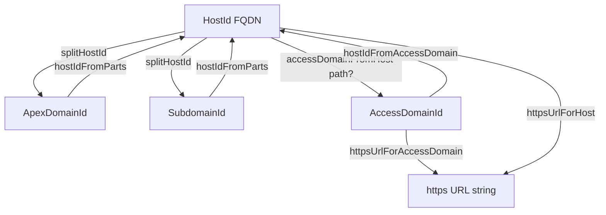

# Branded domain values

FactoryWager uses nominal string brands for domain identities, keys, and
validated codes. After a wire, CLI, form, or environment boundary, domain-valued
text must not travel through the harness as a bare `string`.

## Current contract

- **Stable import:** [`lib/types/branded.ts`](../branded.ts)
- **Source catalog:** [`index.ts`](./index.ts) → `BRAND_CATALOG`
- **Generated record:** [`brand-manifest.json`](../brand-manifest.json) — never
  hand-edit
- **Inventory:** 57 values across 9 domains: 51 IDs, 1 key, and 5 codes
- **Runtime:** branded values remain ordinary strings; the nominal tag is
  type-only
- **Shape guards:** `BRAND_GUARDS.isX(value)` and `isBrandedValue(name, value)`
- **Portal glossary:** [`/portal/brands/`](../../../public/portal/brands/)
  backed by [`brand-keymap.json`](../../../public/registry/brand-keymap.json)
- **Boundary:** [`docs/WIRE_BOUNDARY.md`](../../../docs/WIRE_BOUNDARY.md)
- **Agent workflow:**
  [`.agents/skills/branded-ids/SKILL.md`](../../../.agents/skills/branded-ids/SKILL.md)

Use `bun tools/brand-catalog.ts <domain|BrandName>` for the live inventory.
Counts in prose are orientation only; the catalog and generated manifest are
authoritative.

## Domain routing

| Domain     | Values                                                                  | Module                             |
| ---------- | ----------------------------------------------------------------------- | ---------------------------------- |
| session    | 5 session, terminal, request, correlation, and snapshot IDs             | [`session.ts`](./session.ts)       |
| identity   | 5 user, account, identity, access-key, and token IDs                    | [`identity.ts`](./identity.ts)     |
| documents  | 3 document, zone, and Bun documentation-token IDs                       | [`documents.ts`](./documents.ts)   |
| security   | 2 challenge and policy IDs                                              | [`security.ts`](./security.ts)     |
| deployment | 1 deployment ID                                                         | [`deployment.ts`](./deployment.ts) |
| audit      | 6 version, audit, finding, concept, entry, and evidence IDs             | [`audit.ts`](./audit.ts)           |
| operations | 21 operational IDs plus `PartnerProfileKey`, `StateCode`, and `ZipCode` | [`operations.ts`](./operations.ts) |
| portal     | 4 portal tenant, Telegram user, portal account, and link-nonce IDs      | [`portal.ts`](./portal.ts)         |
| surfaces   | 10 host/apex/subdomain/surface/Pages/publish/Access IDs + status/access/backend codes | [`surfaces.ts`](./surfaces.ts) |

`StateCode` and `ZipCode` have format-aware constructors. Do not replace those
constructors with the generic factory. `HostId` / `AccessDomainId` are also
format-aware (FQDN vs host/path) — never use a path-bearing Access domain as a
`HostId`. Keep these shortcodes separate:

| Brand | Is | Is not |
|-------|----|--------|
| `SubdomainId` | DNS left-of-apex (`score`, `@`) | `SurfaceId` inventory key |
| `PagesProjectId` | CF Pages project (`project-r-score`) | operations `ProjectId` |
| `SurfaceStatusCode` | live/vanity/… | free-form string |
| `SurfaceAccessCode` | public/applied/… | free-form string |

**Surfaces helpers** ([`surfaces.ts`](./surfaces.ts)):

| Helper | Role |
|--------|------|
| `splitHostId` / `hostIdFromParts` | apex + subdomain ↔ `HostId` |
| `FACTORY_WAGER_APEX` / `PROJECT_R_SCORE_PAGES` | canonical apex + Pages project |
| `tryPagesProjectIdFromBackend` | parse `cloudflare-pages:…` backend field |
| `accessDomainFromHost(host, path?)` | compose Access domain from `HostId` |
| `hostIdFromAccessDomain` / `pathFromAccessDomain` | split Access domain |
| `isPathScopedAccessDomain` | path-bearing vs whole-host |
| `hostIdFromUrl` / `tryHostIdFromUrl` | extract FQDN from URL or bare host |
| `httpsUrlForHost` / `httpsUrlForAccessDomain` | probe URLs |

Inventory (parse once): [`lib/surfaces/inventory.ts`](../../surfaces/inventory.ts) ·
`loadSurfacesInventory` · `appliedAccessDomains` · `findSurfaceByHost` ·
`hostPartsForSurface`.

**Bind vs DNS:** `Bun.serve({ hostname })` is the **bind** plane (`0.0.0.0` /
`localhost`) — not a `HostId`. Cross-map:
[`lib/http/host-planes.ts`](../../http/host-planes.ts) ·
[`serve-public-bind.md`](../../../docs/harness/tenants/serve-public-bind.md) ·
`bun run brand:status:once`.

### DNS / Access lineage

Identity stays scheme- and path-free. Transitions are only through the helpers
below — never cast `AccessDomainId` to `HostId` or stuff `/portal` into a FQDN
brand.



| Rule | Detail |
|------|--------|
| `HostId` | Full FQDN (`score.factory-wager.com`) — no scheme, no path |
| `ApexDomainId` | Zone apex (`factory-wager.com`) |
| `SubdomainId` | Left labels (`score`) or `@` for bare apex |
| Scheme | Only on URL helpers (`httpsUrlForHost` / `httpsUrlForAccessDomain`) |
| Path | Only on `AccessDomainId` or the URL path argument — never inside `HostId` |
| Assignability | `AccessDomainId` ≇ `HostId` — cross only via `hostIdFromAccessDomain` |
| Ops scope | Cookie / TLS / CORS follow `HostId`, not `SurfaceId` |

Compose: `hostIdFromParts(apex, '@')` → bare apex host; otherwise `sub.apex`.
Split: `splitHostId` prefers `FACTORY_WAGER_APEX` over the public-suffix
heuristic. Access: `accessDomainFromHost(host, '/portal' | 'portal')` — both
normalize to a single path segment (no `//` in probe URLs).

## Constructor tiers

Every catalog entry exports the same public trio:

| Tier            | Input                         | Use                                           | Failure                                     |
| --------------- | ----------------------------- | --------------------------------------------- | ------------------------------------------- |
| `asX(value)`    | required `string`             | trusted interior value or system mint         | throws `BrandValidationError` when invalid  |
| `tryX(value)`   | `string \| null \| undefined` | optional config and soft merges               | returns `undefined` when missing or invalid |
| `parseX(value)` | `unknown`                     | wire, JSON, CLI, form, or environment ingress | throws `BrandValidationError` when invalid  |

Generic `try*` and `parse*` constructors trim input. Generic `as*` constructors
reject blank strings but otherwise preserve the known value. Format-aware brands
may normalize further; `StateCode`, for example, uppercases before validation.

Missing is not a brand. Never write `'' as AccountId` or forge a value with a
type assertion.

## Runtime shape guards

`BRAND_GUARDS` is generated from the literal catalog:

```ts
if (BRAND_GUARDS.isStateCode(raw)) {
  // raw narrows to StateCode and is already in canonical uppercase form
}

if (isBrandedValue('SessionId', raw)) {
  // raw narrows to SessionId
}
```

Guards prove canonical runtime shape, not provenance or entity existence.
Generic ID guards accept nonblank strings. Pattern brands use catalog metadata:
`StateCode` requires canonical uppercase letters and `ZipCode` requires ZIP or
ZIP+4. Use `parse*` when input needs trimming or normalization.

## Aggregate types

- `AnyId` is the union of all 44 catalog values whose names end in `Id`.
- `AnyBrandedValue` is the complete union:
  `AnyId | PartnerProfileKey | StateCode | ZipCode`.
- `unbrand(value)` deliberately returns a plain `string` for serialization,
  persistence, URLs, and other outbound boundaries.

Prefer the narrow domain type in application APIs. Aggregate types are for
telemetry and serialization edges that truly accept heterogeneous values.

## Mint authority

Each manifest row declares one or more authorities:

- `system-internal`: generators, clocks, factories, and owned persistence.
- `user-input`: accepted user or operator input after domain validation.
- `wire-input`: external payloads through `parse*`.

The authority list documents who may originate a value; it does not weaken the
constructor tier. A wire value still enters through `parse*`.

## Audit distinctions

`AuditId` identifies an audit-log row. `AuditFindingId` and `AuditConceptId`
identify audit SSOT entities. `AuditEntryId` is the polymorphic reference used
by relations. They are intentionally non-assignable. Convert through the owned
audit boundary rather than casting between them.

## Adding or changing a brand

1. Query the catalog first; reuse an existing brand when the meaning matches.
2. Add the type and constructor trio to the owning domain module.
3. Add its `BrandSpec` with accurate domain, authority, and meaning.
4. Add the type to `AnyId` or `AnyBrandedValue` in [`index.ts`](./index.ts).
5. Extend
   [`tests/branded-types.test-d.ts`](../../../tests/branded-types.test-d.ts) and
   [`tests/branded-catalog.test.ts`](../../../tests/branded-catalog.test.ts).
6. Regenerate the manifest with `bun tools/brand-manifest.ts`.
7. Run `bun run check:brands:all`.

Do not create a second barrel or domain-local brand primitive. `_core.ts` owns
the nominal type and constructor semantics.

## Enforcement

| Gate                                              | Contract                                                           |
| ------------------------------------------------- | ------------------------------------------------------------------ |
| `bun tools/branded-id-check.ts --staged --strict` | blocks new bare-string ID declarations on added lines; no baseline |
| `bun tools/branded-id-check.ts --smart --strict`  | keeps the repository-wide actionable count at zero                 |
| `bun tools/brand-manifest.ts --check`             | proves generated metadata matches `BRAND_CATALOG`                  |
| `bun run check:brands:types`                      | proves nominal separation and aggregate coverage                   |
| `bun test tests/branded-catalog.test.ts`          | proves catalog uniqueness, constructor exports, and runtime tiers  |
| `bun tools/brand-coverage.ts --attention`         | reports unused and referenced-but-unconstructed brands             |
| `bun tools/brand-keymap.ts --check`               | proves the portal glossary and project adoption map are current    |

Intentional opaque third-party primary keys require an inline decision:

```ts
id: string; // brand-ok — opaque provider primary key
```

### Project-wide adoption

Coverage loads Git-tracked TypeScript across the harness spine and `projects/`.
It excludes tests, fixtures, generated output, caches, nested dependencies, and
frozen archives. This keeps independent repositories and third-party snapshots
from masquerading as FactoryWager adoption.

Every staged TypeScript file is governed by the strict no-baseline gate,
including nested projects. The keymap separates that universal governance from
current adoption:

- `adopted`: imports the canonical forge and calls a constructor or guard.
- `local-pattern`: owns a project-local nominal brand implementation that should
  converge on the canonical distribution boundary.
- `types-only`: imports canonical types without a visible construction path.
- `governed-no-usage`: tracked by the gate but not yet using the canonical
  vocabulary.
- `external-or-untracked`: catalogued project whose source belongs to another
  repository or is absent locally.

The portal is evidence, not a bulk-cast queue. Migrate an owned boundary,
constructor, and interior path together.

## Operable commands

```bash
bun tools/brand-catalog.ts
bun tools/brand-catalog.ts operations
bun tools/brand-catalog.ts StateCode
bun tools/brand-catalog.ts portal --json
bun tools/brand-coverage.ts --attention
bun tools/brand-coverage.ts --json
bun tools/brand-keymap.ts
bun tools/brand-keymap.ts --check
bun tools/brand-manifest.ts
bun tools/brand-manifest.ts --check
bun run check:brands
bun run check:brands:types
bun run check:brands:all
```
