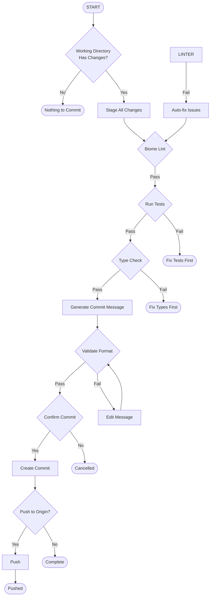

# Tier-1380 Commit Flow

Flow diagram for the Tier-1380 OMEGA commit governance workflow.

## Flow Definition



## Node Definitions

### BEGIN
- **Type**: START
- **Description**: Entry point for commit flow

### CHECK
- **Type**: DECISION
- **Description**: Check if working directory has changes
- **Condition**: `git status --short` returns non-empty

### STAGE
- **Type**: ACTION
- **Description**: Stage all changes
- **Command**: `git add -A`

### LINT
- **Type**: DECISION
- **Description**: Run Biome lint check
- **Command**: `bunx @biomejs/biome check --staged`
- **Auto-fix**: `bunx @biomejs/biome check --write --staged`

### TEST
- **Type**: DECISION
- **Description**: Run test suite
- **Command**: `bun test`

### TYPE
- **Type**: DECISION
- **Description**: TypeScript type check
- **Command**: `bun tsc --noEmit`

### MSG
- **Type**: ACTION
- **Description**: Generate commit message
- **Command**: `bun scripts/generate-message.ts`

### VALIDATE
- **Type**: DECISION
- **Description**: Validate commit message format
- **Command**: `bun scripts/validate-message.ts "[message]"`

### CONFIRM
- **Type**: DECISION
- **Description**: Confirm commit creation
- **Prompt**: "Create commit with this message?"

### COMMIT
- **Type**: ACTION
- **Description**: Create the commit
- **Command**: `git commit -m "[message]"`

### PUSH
- **Type**: DECISION
- **Description**: Push to origin
- **Prompt**: "Push to origin/main?"

### REMOTE
- **Type**: ACTION
- **Description**: Push commit
- **Command**: `git push origin main`

## End States

| State | Description |
|-------|-------------|
| END1 | No changes to commit |
| END2 | Tests failed - must fix |
| END3 | Type check failed - must fix |
| END4 | User cancelled |
| END5 | Commit created, not pushed |
| END6 | Commit created and pushed |

## Variables

| Variable | Description | Default |
|----------|-------------|---------|
| AUTO_FIX | Auto-fix lint issues | true |
| SKIP_TESTS | Skip test execution | false |
| SKIP_TYPE | Skip type check | false |
| AUTO_PUSH | Auto-push after commit | false |
| MESSAGE | Commit message | (generated) |

## Usage

### As Flow Skill
```
/flow:tier1380-commit-flow
```

### As Standard Skill
```
/skill:tier1380-commit-flow
```

### With Parameters
```
/flow:tier1380-commit-flow --fix --push
```
