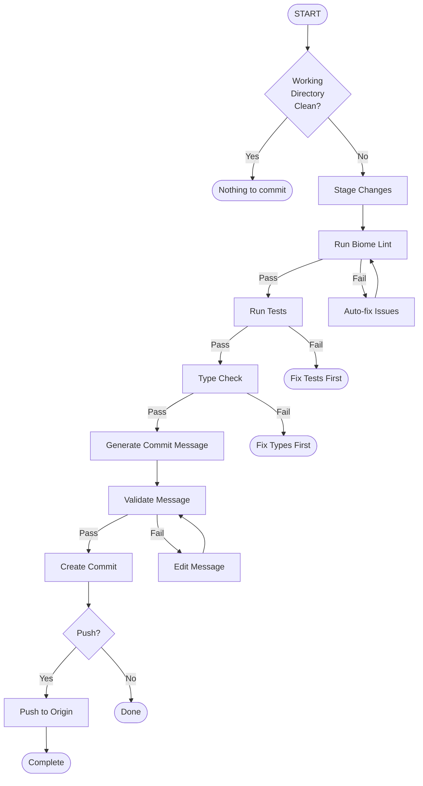

# Tier-1380 OMEGA Commit Governance Flow

Automated commit workflow ensuring perfect commits every time.

## Flow Overview



## Quick Start

### Option 0: Automated Setup (Easiest)

```bash
# Run the setup script
bun ~/.kimi/skills/tier1380-commit-flow/setup.ts

# This will:
# - Check prerequisites
# - Install all git hooks
# - Initialize configuration
# - Create shell alias (`tier1380`)
```

### Option 1: Unified CLI (Recommended)

```bash
# Using the CLI
bun ~/.kimi/skills/tier1380-commit-flow/cli.ts <command>

# Or create a shortcut
alias tier1380="bun ~/.kimi/skills/tier1380-commit-flow/cli.ts"

# Then use:
tier1380 commit "[RUNTIME][CHROME][TIER:1380] Add entropy caching"
tier1380 generate-msg
tier1380 check --fix
tier1380 dashboard
```

### Option 2: Individual Scripts

```bash
# Install Git Hooks
bun ~/.kimi/skills/tier1380-commit-flow/scripts/install-hooks.ts install

# Generate message
bun ~/.kimi/skills/tier1380-commit-flow/scripts/generate-message.ts

# Run checks
bun ~/.kimi/skills/tier1380-commit-flow/scripts/pre-commit-hook.ts

# View dashboard
bun ~/.kimi/skills/tier1380-commit-flow/scripts/governance-dashboard.ts
```

### Git Hooks Installation

```bash
# Install all hooks
bun ~/.kimi/skills/tier1380-commit-flow/scripts/install-hooks.ts install

This installs:
- **pre-commit**: Runs lint, type check, secrets scan, Col-89 check
- **commit-msg**: Validates commit message format
- **post-commit**: Records commit to analytics history
```

## Essential Commands

### `/commit` - Perfect Commit

Complete commit workflow with validation:

```
/commit [message]
```

Without message: auto-generates based on changes.
With message: validates and enhances provided message.

### `/governance` - Run Governance Checks

Validates code against Tier-1380 standards:

```
/governance [scope]
```

Scopes: `all`, `staged`, `file <path>`, `matrix`, `skills`

### `/flow` - Execute Flow Step

Execute specific flow step:

```
/flow [step]
```

Steps: `lint`, `test`, `type-check`, `commit-msg`, `full`

## Commit Message Format

### Standard Template

```
[DOMAIN][COMPONENT][TIER:XXXX] Brief description

Detailed explanation (optional):
- What changed
- Why it changed
- Impact assessment

Refs: #issue-number
```

### Extended Template (Rich Metadata)

```
[DOMAIN][SCOPE][TYPE][META:{TIER:1380}][CLASS][FUNCTION] Brief description

[INTERFACE] [BUN-NATIVE] [#REF:#123]

Detailed explanation:
- What changed
- Why it changed
- Impact assessment
```

### Segment Reference

| Segment | Example Values | Purpose |
|:--------|:---------------|:--------|
| `[DOMAIN]` | `SKILLS`, `SECURITY`, `MARKET`, `INFRA`, `MICROSTRUCTURE`, `RUNTIME`, `PLATFORM` | Business vertical |
| `[SCOPE]` | `FLOW`, `AUTH`, `ODDS`, `TCP`, `STORAGE`, `CHROME`, `MATRIX`, `BLAST` | System component |
| `[TYPE]` | `FEAT`, `FIX`, `REFACTOR`, `PERF`, `DOCS`, `CHORE` | Change classification |
| `[META:{PROPERTY}]` | `META:{TIER:1380}`, `META:{RISK:HIGH}`, `META:{REGION:APAC}` | Key-value metadata |
| `[CLASS]` | `QuantumResistantSecureDataRepository`, `AgentWorkflow` | Primary class affected |
| `[FUNCTION]` | `encrypt`, `verifySeal`, `driftDetect`, `checkSemver` | Method signature |
| `[INTERFACE]` | `SkillPattern`, `ArrayBufferView`, `Col89AuditEntry` | Type contracts |
| `[#REF:*]` | `[#REF:51]`, `[#REF:#123]` | Issue/PR/Commit linkage |
| `[BUN-NATIVE]` | Flag | Zero-dependency Bun API usage |

### Examples

**Standard:**
```
[RUNTIME][COMPONENT:CHROME][TIER:1380] Add entropy caching for col_72
```

**Extended:**
```
[RUNTIME][AGENT][FEAT][META:{TIER:1380}][AgentWorkflow][enforceCol89] Add R2 integration

[Col89AuditEntry] [BUN-NATIVE] [#REF:#123]

- Upload Col-89 violations to R2 fw-audit-logs bucket
- Dynamic import of agent-r2-integration module
- Presigned URLs for audit report retrieval
```

### Domains

| Domain | Use For |
|--------|---------|
| RUNTIME | Core runtime, Bun features |
| PLATFORM | Infrastructure, deployment |
| SECURITY | Authentication, encryption |
| API | Endpoints, schemas |
| UI | Frontend, dashboards |
| DOCS | Documentation, guides |
| CONFIG | Settings, configs |
| TEST | Test files, coverage |
| BENCH | Benchmarks, performance |
| STYLE | Formatting, linting |

### Components

| Component | Description |
|-----------|-------------|
| CHROME | Chrome State (Cols 71-75) |
| MATRIX | Matrix columns (Cols 0-96) |
| BLAST | Bun BLAST suite |
| TELEMETRY | wss:// live telemetry |
| SKILLS | Skills standards (Cols 89-95) |
| KIMI | Kimi CLI integration |
| BUILD | Build system |
| DEPLOY | Deployment pipeline |
| COLOR | Color system (Tier-1380) |
| PALETTE | Theme palettes |
| ACCESSIBILITY | WCAG/a11y validation |
| WEBSOCKET | Real-time sync |
| R2 | R2 storage |
| CLI | CLI tools |
| OPENCLAW | OpenClaw Gateway |
| MATRIX | Matrix Agent |
| TELEGRAM | Telegram Bot |

### Examples

```
[RUNTIME][COMPONENT:CHROME][TIER:1380] Add entropy caching for col_72

- Implements 50% faster Buffer operations
- Adds LRU cache for repeated calculations
- Backwards compatible with existing API

Refs: #phase-3-9-apex
```

```
[PLATFORM][COMPONENT:MATRIX][TIER:1380] Update column 45 tension threshold

- Adjusts anomaly detection sensitivity
- Reduces false positives by 23%
- Validated against production data
```

```
[RUNTIME][COMPONENT:COLOR][TIER:1380] Add Tier1380Colors team palette generation

- Implements deterministic color variation per team member
- Uses Bun.color() for ANSI conversion
- Adds support for quantum, status, terminal, dashboard teams

Refs: #color-system
```

```
[PLATFORM][COMPONENT:ACCESSIBILITY][TIER:1380] Implement WCAG contrast validation

- Adds AA/AAA compliance checking
- Includes color blindness simulation
- Provides auto-fix suggestions for failing pairs

Refs: #a11y #wcag
```

## CLI Reference

### Unified CLI

The `cli.ts` provides a single entry point for all commands:

```bash
bun cli.ts <command> [options]
```

| Command | Description | Options |
|---------|-------------|---------|
| `commit` | Create commit with validation | `[message] [--sign] [--amend]` |
| `generate-msg` | Generate message from staged changes | - |
| `validate` | Validate commit message format | `<message>` |
| `check` | Run pre-commit checks | `[--fix] [--quick]` |
| `governance` | Run governance checks | `[scope]` |
| `hooks` | Manage git hooks | `<install\|uninstall\|status>` |
| `history` | View commit history | `<sync\|analytics\|history>` |
| `dashboard` | Open governance dashboard | `[--once] [--interval=<sec>]` |
| `flow` | Execute flow steps | `<lint\|test\|type-check\|full>` |
| `branch` | Validate branch name | `[branch-name]` |
| `squash` | Squash commits interactively | `<count> [message] [--confirm]` |
| `pr` | Create GitHub PR | `[--draft] [--base=<branch>]` |
| `config` | Manage configuration | `<show\|set\|reset>` |

### Shell Completion

```bash
# Add to .bashrc/.zshrc
eval "$(bun ~/.kimi/skills/tier1380-commit-flow/cli.ts --completions)"
```

### Keyboard Shortcuts

| Shortcut | Command | Example |
|----------|---------|---------|
| `c` | `commit` | `tier1380 c "[MSG]"` |
| `g` | `generate-msg` | `tier1380 g` |
| `v` | `validate` | `tier1380 v "[MSG]"` |
| `chk` | `check` | `tier1380 chk --fix` |
| `b` | `branch` | `tier1380 b` |
| `sq` | `squash` | `tier1380 sq 3 "[MSG]"` |
| `p` | `pr` | `tier1380 p --draft` |
| `cfg` | `config` | `tier1380 cfg show` |

## Bun-Native Utilities

Located in `lib/utils.ts`:

| Function | Description | Bun API Used |
|----------|-------------|--------------|
| `assertCol89()` | Validate line width ≤ 89 | `Bun.stringWidth()` |
| `wrapCol89()` | Wrap text to Col-89 | `Bun.wrapAnsi()` |
| `calculateHash()` | Calculate content hash | `Bun.hash.wyhash()` |
| `Timer` | High-resolution timing | `Bun.nanoseconds()` |
| `colorize()` | ANSI color output | `Bun.color()` |
| `checkBunVersion()` | Semver validation | `Bun.semver.satisfies()` |
| `printTable()` | Formatted tables | `Bun.inspect.table()` |

### Usage Example

```typescript
import { assertCol89, Timer, colorize } from "./lib/utils";

// Col-89 check
if (!assertCol89(longText, "my-file.ts")) {
  console.log(colorize("Width violation!", "red"));
}

// Timing
const timer = new Timer();
await doWork();
console.log(`Done in ${timer.elapsed().toFixed(2)}ms`);
```

## Scripts Reference

### Core Scripts

| Script | Purpose | Usage |
|--------|---------|-------|
| `validate-message.ts` | Validate commit message format | `bun validate-message.ts "[MSG]"` |
| `generate-message.ts` | Auto-generate commit message | `bun generate-message.ts` |
| `governance-check.ts` | Run governance validation | `bun governance-check.ts [scope]` |
| `flow-executor.ts` | Execute flow steps | `bun flow-executor.ts [step]` |
| `git-commit.ts` | Create commit with validation | `bun git-commit.ts "[MSG]"` |
| `pre-commit-hook.ts` | Pre-commit validation | `bun pre-commit-hook.ts [--fix]` |
| `commit-history.ts` | Track commit analytics | `bun commit-history.ts [sync\|analytics]` |
| `governance-dashboard.ts` | Real-time dashboard | `bun governance-dashboard.ts` |
| `install-hooks.ts` | Install git hooks | `bun install-hooks.ts [install\|uninstall\|status]` |
| `branch-validator.ts` | Validate branch naming | `bun branch-validator.ts [branch]` |
| `pre-push-hook.ts` | Pre-push validation | `bun pre-push-hook.ts [--force]` |
| `prepare-commit-msg.ts` | Commit message helper | `bun prepare-commit-msg.ts <file>` |
| `commit-squash.ts` | Interactive squash | `bun commit-squash.ts <count> "[MSG]"` |
| `pr-create.ts` | GitHub PR creator | `bun pr-create.ts [--draft]` |
| `setup.ts` | One-time setup | `bun setup.ts [--no-hooks] [--no-alias]` |

### Pre-Commit Checks

The pre-commit hook runs these checks in order:

1. **Secrets Scan** - Detects hardcoded passwords, API keys, tokens
2. **Col-89 Compliance** - Validates line width ≤ 89 characters
3. **Biome Lint** - Code style and formatting
4. **TypeScript Check** - Type validation
5. **Tests** - Runs relevant test files

```bash
# Run with auto-fix
bun ~/.kimi/skills/tier1380-commit-flow/scripts/pre-commit-hook.ts --fix

# Quick mode (skip tests/type check)
bun ~/.kimi/skills/tier1380-commit-flow/scripts/pre-commit-hook.ts --quick
```

### Git Commit with Options

```bash
# Basic commit
bun ~/.kimi/skills/tier1380-commit-flow/scripts/git-commit.ts "[RUNTIME][CHROME][TIER:1380] Fix entropy"

# Signed commit (GPG)
bun ~/.kimi/skills/tier1380-commit-flow/scripts/git-commit.ts "[MSG]" --sign

# Amend last commit
bun ~/.kimi/skills/tier1380-commit-flow/scripts/git-commit.ts "[MSG]" --amend

# With co-author
bun ~/.kimi/skills/tier1380-commit-flow/scripts/git-commit.ts "[MSG]" --co-author "Name <email>"
```

### Analytics & History

```bash
# Sync commits from git
bun ~/.kimi/skills/tier1380-commit-flow/scripts/commit-history.ts sync

# Show analytics
bun ~/.kimi/skills/tier1380-commit-flow/scripts/commit-history.ts analytics

# View recent history
bun ~/.kimi/skills/tier1380-commit-flow/scripts/commit-history.ts history
```

## Slash Commands

### Quick Actions

| Command | Description |
|---------|-------------|
| `/lint` | Run Biome lint on staged files |
| `/test` | Run relevant tests |
| `/typecheck` | Run TypeScript type checking |
| `/stage` | Stage all changes |
| `/unstage` | Unstage all changes |
| `/status` | Show git status |

### Governance

| Command | Description |
|---------|-------------|
| `/governance` | Full governance check |
| `/matrix-check` | Validate matrix columns |
| `/skills-check` | Validate skills compliance |
| `/blast-check` | Validate Bun BLAST suite |

### Commit Helpers

| Command | Description |
|---------|-------------|
| `/commit-msg` | Generate commit message |
| `/validate-msg "msg"` | Validate message format |
| `/suggest-domain` | Suggest domain for changes |
| `/suggest-component` | Suggest component for changes |

### Dashboard

| Command | Description |
|---------|-------------|
| `/dashboard` | Open governance dashboard |
| `/dashboard-once` | One-time dashboard view |

## Pre-Commit Checklist

- [ ] Biome lint passes
- [ ] TypeScript type checks
- [ ] Tests pass
- [ ] Commit message follows format
- [ ] No secrets in code
- [ ] Skills compliance (Col 89-95)
- [ ] Col-89 line width validated

## Advanced Features

### SQLite Analytics

Commits and pre-commit checks are stored in `~/.matrix/commit-history.db`:

```sql
-- View recent commits
SELECT * FROM commits ORDER BY date DESC LIMIT 10;

-- View compliance rate
SELECT AVG(valid_format) * 100 FROM commits;

-- View pre-commit check history
SELECT * FROM precommit_checks ORDER BY timestamp DESC LIMIT 10;
```

### Dashboard Controls

When running the interactive dashboard:

- `r` - Refresh data
- `s` - Sync from git
- `q` - Quit

### Hook Installation Options

```bash
# Install all hooks
bun ~/.kimi/skills/tier1380-commit-flow/scripts/install-hooks.ts install

# Install with auto-fix enabled
bun ~/.kimi/skills/tier1380-commit-flow/scripts/install-hooks.ts install --auto-fix

# Install only specific hooks
bun ~/.kimi/skills/tier1380-commit-flow/scripts/install-hooks.ts install --no-post-commit

# Check status
bun ~/.kimi/skills/tier1380-commit-flow/scripts/install-hooks.ts status

# Uninstall
bun ~/.kimi/skills/tier1380-commit-flow/scripts/install-hooks.ts uninstall
```

## Flow Execution

### Automatic Flow

```
/flow full
```

Executes complete workflow:
1. Stage changes
2. Run lint
3. Run type check
4. Run tests
5. Generate commit message
6. Create commit
7. Optional: Push

### Manual Steps

```
/flow lint      # Just linting
/flow test      # Just tests
/flow type-check # Just type check
/flow commit-msg # Just generate message
```

## References

- **[GOVERNANCE.md](references/GOVERNANCE.md)** - Complete governance rules
- **[COMMIT_FORMAT.md](references/COMMIT_FORMAT.md)** - Commit message format spec
- **[SLASH_CMDS.md](references/SLASH_CMDS.md)** - All slash commands reference

## Related Skills

| Skill | Path | Commit Usage |
|-------|------|--------------|
| tier1380-openclaw | `~/.kimi/skills/tier1380-openclaw/` | `[OPENCLAW][GATEWAY][TIER:1380]` |
| tier1380-omega | `~/.kimi/skills/tier1380-omega/` | `[PLATFORM][OMEGA][TIER:1380]` |
| tier1380-infra | `~/.kimi/skills/tier1380-infra/` | `[INFRA][STATUS][TIER:1380]` |

### Cross-Skill Commit Examples
```bash
# OpenClaw changes
/commit "[OPENCLAW][GATEWAY][TIER:1380] Add health monitoring endpoint"

# Omega deployment
/commit "[PLATFORM][OMEGA][DEPLOY][TIER:1380] Deploy to staging"

# Infrastructure updates
/commit "[INFRA][MONITORING][TIER:1380] Add Prometheus alerts"

# Full workflow
governance check openclaw && /commit "[OPENCLAW][HEALTH][TIER:1380] Fix status reporting"
```

### Component Mapping

| Skill | Domain | Components |
|-------|--------|------------|
| tier1380-openclaw | `OPENCLAW` | `GATEWAY`, `AGENT`, `TELEGRAM`, `MONITORING` |
| tier1380-omega | `PLATFORM` | `OMEGA`, `REGISTRY`, `DEPLOY` |
| tier1380-infra | `INFRA` | `STATUS`, `MONITORING`, `LOGS` |
| tier1380-commit-flow | `PLATFORM` | `FLOW`, `GOVERNANCE`, `CLI` |

## CI/CD Integration

### GitHub Actions

A workflow is provided in `.github/workflows/commit-governance.yml`:

```yaml
name: Tier-1380 OMEGA Commit Governance

on:
  push:
    branches: [main, master, develop]
  pull_request:
    branches: [main, master, develop]

jobs:
  commit-governance:
    runs-on: ubuntu-latest
    steps:
      - uses: actions/checkout@v4
        with:
          fetch-depth: 0
      - uses: oven-sh/setup-bun@v1
      - run: bun ~/.kimi/skills/tier1380-commit-flow/scripts/validate-commits.ts origin/main HEAD
      - run: bun ~/.kimi/skills/tier1380-commit-flow/scripts/pre-commit-hook.ts
      - run: bun ~/.kimi/skills/tier1380-commit-flow/scripts/governance-check.ts all
```

### Validate Commit Range

For CI/CD pipelines:

```bash
# Validate all commits in a PR
bun ~/.kimi/skills/tier1380-commit-flow/scripts/validate-commits.ts \
  origin/main HEAD

# Generate report
bun ~/.kimi/skills/tier1380-commit-flow/scripts/validate-commits.ts \
  ${{ github.event.pull_request.base.sha }} \
  ${{ github.event.pull_request.head.sha }}
```

## VS Code Integration

### Recommended Extensions

Install these extensions for best experience:

- **Biome** (`biomejs.biome`) - Formatting and linting
- **Bun for VS Code** (`oven.bun-vscode`) - Bun runtime support
- **GitHub Actions** (`github.vscode-github-actions`) - Workflow validation

### Tasks

Available tasks (Ctrl+Shift+P → Run Task):

| Task | Command |
|------|---------|
| `Tier1380: Generate Commit Message` | `bun generate-message.ts` |
| `Tier1380: Run Pre-commit Checks` | `bun pre-commit-hook.ts` |
| `Tier1380: Run Tests` | `bun test` |
| `Tier1380: Open Dashboard` | `bun governance-dashboard.ts --once` |
| `Tier1380: Validate Current Branch` | `bun branch-validator.ts` |

### Settings

VS Code settings are configured in `.vscode/settings.json`:

- Auto-format on save with Biome
- Import organization
- File exclusions for cache directories

## Migration Tools

### From Conventional Commits

Migrate existing conventional commits to Tier-1380 format:

```bash
# Preview migration (dry run)
bun ~/.kimi/skills/tier1380-commit-flow/scripts/migrate-from-conventional.ts

# Apply migration (requires manual rebase)
bun ~/.kimi/skills/tier1380-commit-flow/scripts/migrate-from-conventional.ts --apply
```

Mapping:

| Conventional | Tier-1380 |
|--------------|-----------|
| `feat(scope)` | `[PLATFORM][COMPONENT:SCOPE][TIER:1380]` |
| `fix(scope)` | `[RUNTIME][COMPONENT:SCOPE][TIER:1380]` |
| `docs(scope)` | `[DOCS][COMPONENT:SCOPE][TIER:1380]` |
| `chore(scope)` | `[CONFIG][COMPONENT:SCOPE][TIER:1380]` |
| `test(scope)` | `[TEST][COMPONENT:SCOPE][TIER:1380]` |

## Testing

Run the test suite:

```bash
cd ~/.kimi/skills/tier1380-commit-flow

# Run all tests
bun test

# Run specific test file
bun test __tests__/utils.test.ts
bun test __tests__/branch-validator.test.ts

# Run with coverage
bun test --coverage
```

### Test Coverage

| Module | Tests | Description |
|--------|-------|-------------|
| `utils.test.ts` | 15 | Bun-native utilities (Col-89, hash, timer) |
| `validate-message.test.ts` | 17 | Commit format validation |
| `branch-validator.test.ts` | 13 | Branch naming validation |
| `config.test.ts` | 8 | Configuration management |
| **Total** | **53** | **93 assertions** |

### Adding Tests

```typescript
import { describe, it, expect } from "bun:test";
import { myFunction } from "../lib/my-module";

describe("My feature", () => {
  it("should work correctly", () => {
    expect(myFunction()).toBe(expected);
  });
});
```

## Troubleshooting

### Pre-commit hook fails

```bash
# Run with auto-fix
bun ~/.kimi/skills/tier1380-commit-flow/scripts/pre-commit-hook.ts --fix

# Skip hooks for emergency commit
git commit -m "[URGENT] Fix production issue" --no-verify
```

### Invalid commit message format

```bash
# Validate your message
bun ~/.kimi/skills/tier1380-commit-flow/scripts/validate-message.ts "[YOUR MESSAGE]"

# Generate a valid message
bun ~/.kimi/skills/tier1380-commit-flow/scripts/generate-message.ts
```

### Dashboard not showing data

```bash
# Sync from git
bun ~/.kimi/skills/tier1380-commit-flow/scripts/commit-history.ts sync

# Check database
ls -la ~/.matrix/commit-history.db
```

## Environment Variables

| Variable | Description | Default |
|----------|-------------|---------|
| `TIER1380_AUTO_FIX` | Auto-fix lint issues | `false` |
| `TIER1380_SKIP_TESTS` | Skip test execution | `false` |
| `TIER1380_GPG_SIGN` | Sign commits with GPG | `false` |
| `TIER1380_COMMIT_DB` | Path to SQLite database | `~/.matrix/commit-history.db` |
