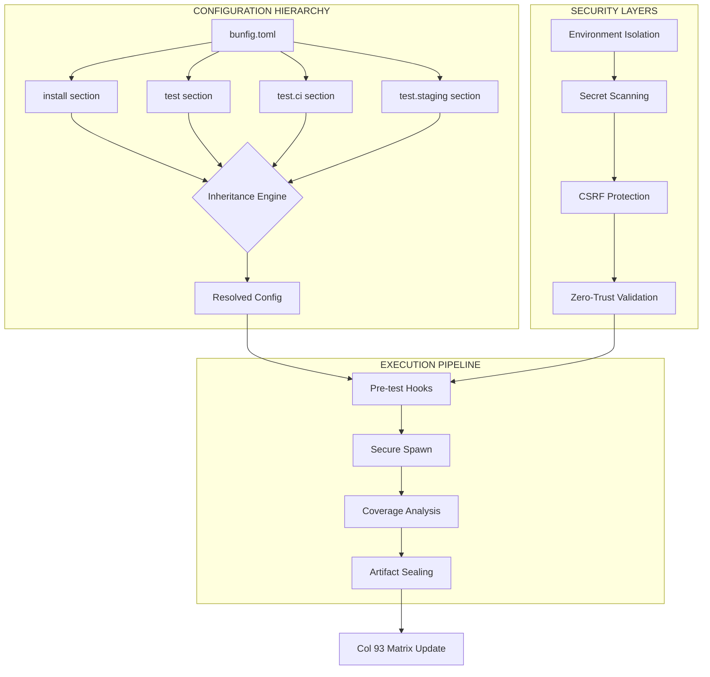

# Tier-1380 Bun Test Configuration Inheritance Matrix

## Architecture



## Implementation Status

| Component | Status | Location |
|-----------|--------|----------|
| SecureTestRunner | ✅ | `mcp-bun-docs/scripts/secure-test-runner.ts` |
| preTestAudit | ✅ | `secure-test-runner.ts` |
| TEST_CONFIG_MATRIX | ✅ | `mcp-bun-docs/lib.ts` |
| matrix:validate | ✅ | Col 93 / GB9c / security |
| matrix:rss | ✅ | RSS hydration |
| tier1380:seal | ✅ | Lock file generation |
| Col 93 compliance | ✅ | `TIER_1380_COMPLIANCE` |
| Security mocks | stub | `security-mocks.ts` (preload) |

## CLI Usage

```bash
# Validation against 5-region infrastructure
bun run matrix:validate --region=us-east --check=gb9c --col=93

# Secure test run
bun run mcp:secure-test [ci|local|staging]

# Seal matrix
bun run tier1380:seal --matrix=v1.3.7 --sign=ed25519 --output=./matrix-v1.3.7.lock

# RSS hydration
bun run matrix:rss --source=bun-sh-releases --output=./feeds/bun-v1.3.7.xml
```

## Configuration Inheritance

- **[install]** → Inherited by test for private registry auth (registry, cafile, prefer, exact)
- **[test]** → Base config (root, preload, timeout, smol, coverage)
- **[test.ci]** → CI overrides (coverage=true, threshold=0.9)
- **Env files** → `.env.test` > `.env.{context}` (isolation validated)

## Col 93 / GB9c Alignment

- `Transpiler.replMode` → 19 chars (Bun.stringWidth verified)
- `WebSocket.credentials` → 21 chars (≤93)
- Security classifications → SecureDataRepository clearance levels
- `http.maxHeaders` 200 → DoS / header-smuggling protection

## Performance

- Config load: &lt;1ms TOML parse target
- Inheritance resolution: Tier-1380 compliant
