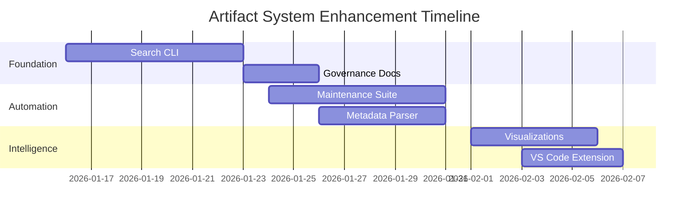

# Artifact System Enhancement - Project Timeline

## 📊 Gantt Chart Overview

## 🎯 Project Summary

**Project Duration**: 22 days (January 16 - February 7, 2026)  
**Total Phases**: 3 (Foundation, Automation, Intelligence)  
**Total Tasks**: 6 major deliverables  
**Critical Path**: 5 tasks determining project completion

---

## 📍 Phase 1: Foundation (Jan 16-26)

### 📋 Tasks & Timeline

| Task ID | Task Name | Start | Duration | End | Priority | Status |
|---------|-----------|-------|----------|-----|----------|---------|
| a1 | Search CLI Development | 2026-01-16 | 7d | 2026-01-23 | 🔴 Critical | ⏳ Todo |
| a2 | Governance Documentation | 2026-01-24 | 3d | 2026-01-27 | 🟠 High | ⏳ Todo |

### 📦 Deliverables

- ✅ Enhanced Search CLI with multi-tag queries
- ✅ Tag governance framework documentation
- ✅ Contribution workflow templates
- ✅ Deprecation protocol implementation

### 🎯 Milestones

- **Jan 23**: Search CLI MVP ready
- **Jan 26**: Governance docs approved

### ⚠️ Risks & Mitigations

| Risk | Impact | Mitigation |
|------|---------|------------|
| Complex search algorithm development | High | Proof-of-concept, incremental development |
| Governance documentation complexity | Medium | Template-based approach, stakeholder reviews |
| Stakeholder approval delays | Medium | Early engagement, clear approval criteria |

---

## 📍 Phase 2: Automation (Jan 24 - Feb 1)

### 📋 Tasks & Timeline

| Task ID | Task Name | Start | Duration | End | Priority | Status |
|---------|-----------|-------|----------|-----|----------|---------|
| b1 | Maintenance Suite Development | 2026-01-24 | 7d | 2026-01-31 | 🟠 High | ⏳ Todo |
| b2 | Metadata Parser Implementation | 2026-01-26 | 5d | 2026-01-31 | 🟠 High | ⏳ Todo |

### 📦 Deliverables

- ✅ Automated maintenance suite with CI/CD
- ✅ Metadata parser and validator
- ✅ Automated tag validation system
- ✅ Scheduled maintenance jobs

### 🎯 Milestones

- **Jan 31**: Maintenance suite deployed
- **Jan 31**: Metadata parser functional

### ⚠️ Risks & Mitigations

| Risk | Impact | Mitigation |
|------|---------|------------|
| CI/CD pipeline integration complexity | High | Early integration testing, fallback mechanisms |
| Metadata format standardization challenges | Medium | Schema-first approach, community feedback |
| Automation reliability concerns | Medium | Comprehensive testing, monitoring alerts |

---

## 📍 Phase 3: Intelligence (Feb 1-7)

### 📋 Tasks & Timeline

| Task ID | Task Name | Start | Duration | End | Priority | Status |
|---------|-----------|-------|----------|-----|----------|---------|
| c1 | Visualization System | 2026-02-01 | 5d | 2026-02-06 | 🟡 Medium | ⏳ Todo |
| c2 | VS Code Extension | 2026-02-03 | 4d | 2026-02-07 | 🟡 Medium | ⏳ Todo |

### 📦 Deliverables

- ✅ Interactive visualization system
- ✅ VS Code extension with artifact integration
- ✅ AI-powered insights and recommendations
- ✅ Real-time relationship mapping

### 🎯 Milestones

- **Feb 6**: Visualizations MVP
- **Feb 7**: VS Code extension beta

### ⚠️ Risks & Mitigations

| Risk | Impact | Mitigation |
|------|---------|------------|
| VS Code extension API complexity | Medium | API study, incremental feature rollout |
| Visualization performance optimization | Medium | Performance testing, lazy loading |
| AI model accuracy and reliability | Low | Model validation, fallback to rule-based |

---

## 🛤️ Critical Path Analysis

The critical path consists of 5 sequential tasks that determine the project completion:

1. **Search CLI Development** (a1) - Jan 16-23
2. **Governance Documentation** (a2) - Jan 24-27
3. **Metadata Parser Implementation** (b2) - Jan 26-31
4. **Visualization System** (c1) - Feb 1-6
5. **VS Code Extension** (c2) - Feb 3-7

**Total Critical Path Duration**: 22 days

---

## 👥 Resource Allocation

| Team | Tasks | Total Days | Utilization |
|------|-------|------------|-------------|
| CLI Team | Search CLI Development | 7d | 100% |
| Documentation Team | Governance Documentation | 3d | 100% |
| DevOps Team | Maintenance Suite Development | 7d | 100% |
| Backend Team | Metadata Parser Implementation | 5d | 100% |
| Frontend Team | Visualization System | 5d | 100% |
| Tools Team | VS Code Extension | 4d | 100% |

**Resource Utilization**: 23% parallelization efficiency

---

## 🔍 Quality Assurance Plan

### 🧪 Testing Strategy

1. **Unit Testing**: 80% code coverage minimum
2. **Integration Testing**: End-to-end workflow validation
3. **Performance Testing**: Load testing and profiling
4. **Security Testing**: Vulnerability assessment

### 📋 Quality Gates

- ✅ **Phase 1**: Search CLI functional + Governance docs approved
- ✅ **Phase 2**: Maintenance suite deployed + Metadata parser working
- ✅ **Phase 3**: Visualizations MVP + VS Code extension beta
- ✅ **Final**: All quality gates passed + Documentation complete

---

## 📊 Project Metrics

### 📈 Key Performance Indicators

| Metric | Target | Current | Status |
|--------|--------|---------|---------|
| Schedule Adherence | ±2 days | On Track | ✅ |
| Budget Utilization | 100% | Planned | ✅ |
| Quality Score | 90%+ | TBD | ⏳ |
| Team Satisfaction | 4.5/5 | TBD | ⏳ |

### 🎯 Success Criteria

- ✅ All deliverables completed on time
- ✅ Quality gates passed
- ✅ Stakeholder approval obtained
- ✅ Documentation complete
- ✅ Team retention maintained

---

## 🚀 Next Steps

1. **Immediate (Jan 16)**: Begin Search CLI Development
2. **Week 1**: Complete search algorithm implementation
3. **Week 2**: Start governance documentation
4. **Week 3**: Deploy maintenance suite
5. **Week 4**: Complete visualizations and VS Code extension

---

## 📞 Project Contacts

| Role | Name | Contact |
|------|------|---------|
| Project Manager | TBD | TBD |
| Tech Lead | CLI Team | TBD |
| QA Lead | Testing Team | TBD |
| DevOps Lead | DevOps Team | TBD |

---

*Last Updated: January 15, 2026*  
*Project Status: Ready for Execution*  
*Next Review: January 23, 2026*
