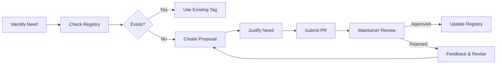

# Tag Governance Framework

## 📋 Overview

This document establishes the governance framework for the artifact tagging system, ensuring consistency, maintainability, and long-term value of our metadata infrastructure.

---

## 🎯 Governance Objectives

1. **Consistency**: Ensure tags follow standardized patterns and meanings
2. **Discoverability**: Maintain high-quality, meaningful tags for effective search
3. **Maintainability**: Prevent tag fragmentation and metadata bloat
4. **Evolution**: Enable systematic tag evolution and deprecation

---

## 📚 Tag Registry

### Primary Tag Categories

| Category | Pattern | Examples | Description |
|----------|---------|----------|-------------|
| **Type** | `#[a-z]+` | `#api`, `#cli`, `#dashboard`, `#library` | Artifact type/function |
| **Domain** | `#[a-z-]+` | `#security`, `#config-management`, `#monitoring` | Business domain |
| **Status** | `#[a-z]+` | `#ready`, `#wip`, `#review`, `#blocked` | Workflow status |
| **Priority** | `#[a-z]+` | `#critical`, `#high`, `#medium`, `#low` | Priority level |
| **Audience** | `#[a-z]+` | `#developers`, `#devops`, `#security`, `#users` | Target audience |
| **Technology** | `#[a-z]+` | `#typescript`, `#bun`, `#react`, `#docker` | Technology stack |
| **Environment** | `#[a-z]+` | `#production`, `#staging`, `#development` | Deployment environment |

### Standardized Tag Values

#### Status Tags (Required)
- `#ready` - Production-ready, fully tested
- `#wip` - Work in progress, under active development
- `#review` - Awaiting code review or approval
- `#blocked` - Blocked by dependencies or issues
- `#deprecated` - Deprecated, planned for removal

#### Priority Tags (Optional)
- `#critical` - Critical path, blocking other work
- `#high` - High priority, important for current sprint
- `#medium` - Medium priority, standard backlog item
- `#low` - Low priority, nice to have

#### Domain Tags (At least one required)
- `#security` - Security, authentication, authorization
- `#config-management` - Configuration, settings, deployment
- `#devops` - CI/CD, infrastructure, automation
- `#monitoring` - Metrics, logging, observability
- `#api` - REST APIs, GraphQL, endpoints
- `#ui` - User interface, components, styling
- `#database` - Data storage, queries, migrations
- `#testing` - Unit tests, integration tests, e2e
- `#documentation` - Docs, guides, README files
- `#performance` - Optimization, caching, speed

#### Technology Tags (Optional)
- `#typescript`, `#javascript`, `#bun`, `#react`, `#vue`
- `#docker`, `#kubernetes`, `#aws`, `#gcp`, `#azure`
- `#postgresql`, `#redis`, `#mongodb`, `#mysql`

---

## 🔄 Tag Lifecycle Management

### 1. Tag Proposal Process



#### Proposal Requirements
- **Clear Justification**: Why this tag is needed
- **Category Assignment**: Which category it belongs to
- **Usage Examples**: At least 3 example artifacts
- **Relationship Analysis**: How it relates to existing tags
- **Maintenance Plan**: Who will maintain this tag

#### PR Template
```markdown
## Tag Proposal: #[new-tag]

### Justification
[Explain why this tag is needed]

### Category
[Select from: Type, Domain, Status, Priority, Audience, Technology, Environment]

### Usage Examples
1. [Artifact path 1]
2. [Artifact path 2]
3. [Artifact path 3]

### Relationship to Existing Tags
[Explain how this relates to current tags]

### Maintenance Owner
[Who will maintain this tag]
```

### 2. Tag Approval Process

#### Review Criteria
- **Necessity**: Is this tag truly needed?
- **Clarity**: Is the tag name clear and unambiguous?
- **Consistency**: Does it follow naming conventions?
- **Duplication**: Does it duplicate existing functionality?
- **Scalability**: Will it scale with future needs?

#### Approval Workflow
1. **Initial Review**: Automated validation of format and conflicts
2. **Maintainer Review**: Manual review by tag governance team
3. **Community Feedback**: Optional community comment period
4. **Final Decision**: Approve, request changes, or reject

### 3. Tag Deprecation Protocol

#### Deprecation Triggers
- **Low Usage**: Tag used in < 5 artifacts for 90 days
- **Redundancy**: Better alternative tags exist
- **Irrelevance**: No longer relevant to current architecture
- **Confusion**: Causes confusion or misuse

#### Deprecation Process
1. **Identification**: Automated detection of candidates
2. **Evaluation**: Manual review of deprecation candidates
3. **Notification**: 30-day notice to maintainers
4. **Migration**: Automated migration suggestions
5. **Removal**: Final removal from registry

---

## 🛠️ Implementation Guidelines

### Required Tags per Artifact Type

#### Code Files (.ts, .js, .tsx, .jsx)
```typescript
/**
 * #api #security #typescript #ready
 * @description Authentication service for user management
 * @domain #security
 * @status #ready
 * @audience #developers
 */
```

#### Documentation Files (.md)
```markdown
---
tags: #documentation #api #security #ready
status: #ready
domain: #security
audience: #developers
---
```

#### Configuration Files (.json, .yaml, .toml)
```yaml
# config-management #devops #production #critical
# Database configuration for production environment
```

### Tag Placement Guidelines

#### Markdown Files
- **Frontmatter**: Use YAML frontmatter for structured metadata
- **Inline**: Use inline tags for quick reference
- **Headers**: Include relevant tags in section headers

#### Code Files
- **JSDoc Comments**: Use structured comments for classes and functions
- **File Headers**: Include tags at the top of files
- **Inline Comments**: Use inline tags for specific features

#### Configuration Files
- **File Headers**: Include tags at the top of configuration files
- **Comments**: Use inline tags for specific configurations

---

## 🔍 Quality Assurance

### Automated Validation

#### Pre-commit Hooks
```bash
#!/bin/sh
# .git/hooks/pre-commit
bun run scripts/validate-tags.ts
bun run scripts/check-tag-coverage.ts
```

#### CI/CD Pipeline
```yaml
# .github/workflows/tag-validation.yml
name: Tag Validation
on: [push, pull_request]
jobs:
  validate:
    runs-on: ubuntu-latest
    steps:
      - uses: actions/checkout@v4
      - uses: oven-sh/setup-bun@v1
      - run: bun run scripts/validate-tags.ts --strict
      - run: bun run scripts/audit-tags.ts --fail-on-error
```

### Validation Rules

#### Required Tags
- Every artifact must have at least 3 tags
- Must include: type, domain, status
- Audience tag required for user-facing artifacts

#### Tag Format
- Tags must start with `#`
- Only lowercase letters, numbers, and hyphens
- No spaces or special characters
- Maximum length: 50 characters

#### Tag Consistency
- No duplicate tags in same artifact
- Related tags should be grouped together
- Status tags should reflect actual state

---

## 📊 Monitoring & Reporting

### Metrics Dashboard

#### Tag Health Metrics
- **Coverage**: Percentage of artifacts with proper tagging
- **Consistency**: Adherence to naming conventions
- **Usage**: Tag frequency and distribution
- **Quality**: Validation error rates

#### Automated Reports
- **Daily**: Tag validation results
- **Weekly**: Tag usage statistics
- **Monthly**: Governance compliance report
- **Quarterly**: Tag registry review

### Alerting

#### Critical Issues
- Broken tag validation rules
- Significant drop in tag coverage
- Unauthorized tag modifications
- Registry synchronization failures

#### Warnings
- Low-usage tags (deprecation candidates)
- Inconsistent tag patterns
- Missing required tags
- Orphaned artifacts (no tags)

---

## 🤝 Community Guidelines

### Contribution Process

#### For Developers
1. **Learn Standards**: Read this documentation thoroughly
2. **Use Tools**: Leverage CLI tools for tag management
3. **Request Help**: Ask for guidance when unsure
4. **Review Changes**: Participate in tag review process

#### For Maintainers
1. **Lead by Example**: Follow tagging standards consistently
2. **Mentor Others**: Help team members improve tagging
3. **Review Proposals**: Participate in tag proposal reviews
4. **Monitor Quality**: Watch for tag quality issues

### Best Practices

#### Tag Selection
- **Be Specific**: Use specific tags rather than generic ones
- **Be Consistent**: Follow established patterns
- **Be Thoughtful**: Consider long-term maintenance
- **Be Collaborative**: Discuss tag changes with team

#### Tag Maintenance
- **Regular Reviews**: Periodically review and update tags
- **Cleanup**: Remove unused or deprecated tags
- **Documentation**: Keep tag documentation current
- **Automation**: Use tools to automate maintenance

---

## 📋 Governance Checklist

### Before Adding a Tag
- [ ] Checked existing tag registry
- [ ] Prepared justification document
- [ ] Identified usage examples
- [ ] Considered alternatives
- [ ] Planned maintenance strategy

### Before Removing a Tag
- [ ] Identified all affected artifacts
- [ ] Prepared migration plan
- [ ] Notified stakeholders
- [ ] Scheduled deprecation timeline
- [ ] Updated documentation

### Monthly Review
- [ ] Review tag usage statistics
- [ ] Identify deprecation candidates
- [ ] Validate tag compliance
- [ ] Update documentation
- [ ] Report on governance health

---

## 🔗 Resources

### Tools & Scripts
- `scripts/find-artifact.ts` - Advanced artifact search
- `scripts/validate-tags.ts` - Tag validation
- `scripts/audit-tags.ts` - Tag audit and analysis
- `scripts/migrate-tags.ts` - Tag migration utility

### Documentation
- `docs/TAG_REGISTRY.json` - Official tag registry
- `docs/METADATA_SCHEMA.json` - Metadata schema
- `docs/ORGANIZATION_SUMMARY.md` - Organization overview

### Support
- **Slack**: #tag-governance
- **Email**: tag-governance@company.com
- **Issues**: GitHub Issues with `tag-governance` label

---

## 📈 Evolution Plan

### Phase 1: Foundation (Current)
- Establish governance framework
- Deploy validation tools
- Train development team

### Phase 2: Automation (Next Quarter)
- Implement automated tag suggestions
- Deploy advanced monitoring
- Integrate with IDE extensions

### Phase 3: Intelligence (Future)
- AI-powered tag recommendations
- Predictive tag usage analytics
- Automated relationship discovery

---

*This governance framework is a living document. It will evolve based on community feedback and changing needs. All changes follow the same proposal and approval process outlined above.*
