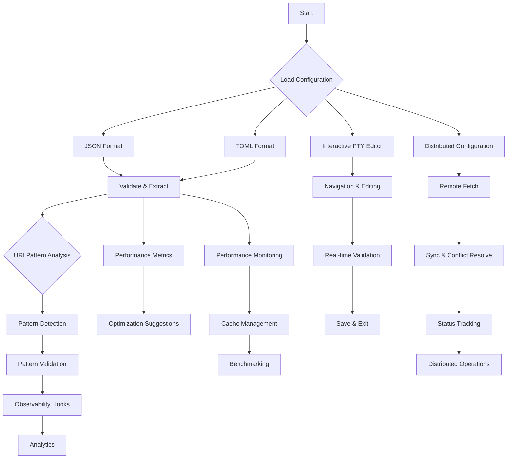

# Nebula Flow Configuration Manager v3.6 - Implementation Plan

## 🚀 Overview

This plan outlines the implementation of future enhancements for Nebula Flow Configuration Manager v3.6, focusing on:

1. **TOML Support with Dual-Format Bridge**
2. **Interactive PTY Editor with Bun.Terminal**
3. **Distributed Configuration Support**
4. **Enhanced URLPattern Observability Hooks**
5. **Performance Optimization Features**

## 📋 Detailed Implementation Plan

### 1. TOML Support with Dual-Format Bridge (Priority: High)

**Files to Modify:** `scripts/nebula-flow.ts`

**Key Features:**
- Implement TOML parser using Bun's built-in `bun:toml` module
- Create bidirectional JSON ↔ TOML conversion
- Support both formats as first-class citizens
- Add `import-toml` and `export-toml` commands
- Maintain backward compatibility with existing JSON configuration

**Implementation Steps:**
1. Add TOML parsing and serialization using `bun:toml`
2. Implement dual-format configuration loading
3. Create `export-toml` and `import-toml` CLI commands
4. Add validation for TOML configuration files
5. Update help documentation

### 2. Interactive PTY Editor with Bun.Terminal (Priority: High)

**Files to Modify:** `scripts/nebula-flow.ts`

**Key Features:**
- Build interactive terminal interface using Bun.Terminal
- Implement navigation, editing, and validation
- Support real-time configuration management
- Provide syntax highlighting and auto-completion
- Integrate with existing validation and indexing features

**Implementation Steps:**
1. Implement PTY editor framework using Bun.Terminal
2. Add navigation and selection capabilities
3. Implement configuration editing functionality
4. Add real-time validation and error feedback
5. Provide exit and save options

### 3. Distributed Configuration Support (Priority: Medium)

**Files to Modify:** `scripts/nebula-flow.ts`

**Key Features:**
- Support for remote configuration storage (Redis, HTTP, etc.)
- Add configuration syncing mechanism
- Implement conflict resolution strategies
- Provide status tracking for distributed configurations
- Add CLI commands for remote operations

**Implementation Steps:**
1. Add remote configuration fetching
2. Implement configuration syncing logic
3. Add conflict resolution mechanisms
4. Create status tracking and monitoring
5. Add CLI commands for remote operations

### 4. Enhanced URLPattern Observability Hooks (Priority: Medium)

**Files to Modify:** `scripts/nebula-flow.ts`

**Key Features:**
- Improved URLPattern detection and extraction
- Enhanced pattern validation and classification
- Add observability hooks for pattern usage
- Implement pattern suggestion and auto-fix
- Add pattern analytics and reporting

**Implementation Steps:**
1. Enhance URLPattern extraction algorithm
2. Add advanced pattern validation
3. Implement observability hooks
4. Add pattern suggestion functionality
5. Create analytics and reporting features

### 5. Performance Optimization Features (Priority: Medium)

**Files to Modify:** `scripts/nebula-flow.ts`

**Key Features:**
- Enhanced configuration loading performance
- Optimized validation and indexing
- Add performance metrics and monitoring
- Implement cache mechanism for frequent operations
- Add benchmarking capabilities

**Implementation Steps:**
1. Optimize configuration loading and parsing
2. Enhance validation and indexing performance
3. Add performance metrics collection
4. Implement caching mechanism
5. Add benchmarking and comparison features

## 🔄 Workflow Diagram

## 📊 Timeline & Dependencies

| Phase | Task | Estimated Effort | Dependencies |
|-------|------|-----------------|--------------|
| 1 | TOML Support | 2-3 days | Bun 1.0+ |
| 2 | PTY Editor | 3-4 days | Bun.Terminal support |
| 3 | Distributed Configuration | 3-5 days | Redis/HTTP integration |
| 4 | URLPattern Enhancements | 2-3 days | Bun's URLPattern API |
| 5 | Performance Optimizations | 2-3 days | Node.js perf APIs |
| 6 | Integration & Testing | 2-3 days | All features implemented |

## 🎯 Success Criteria

- ✅ Both JSON and TOML formats supported with bidirectional conversion
- ✅ Interactive PTY editor with full configuration management capabilities
- ✅ Distributed configuration support with conflict resolution
- ✅ Enhanced URLPattern observability and analytics
- ✅ Significant performance improvements in configuration operations
- ✅ Comprehensive test coverage for all new features
- ✅ Up-to-date documentation and examples

## 🛠️ Technical Stack

- **Language:** TypeScript with Bun runtime
- **Parser:** Bun's built-in `bun:toml` module
- **Terminal:** Bun.Terminal for interactive PTY
- **Storage:** Redis for distributed configurations
- **Validation:** Zod schema validation
- **Testing:** Bun's built-in test runner

## 📚 Documentation Updates

- Update `README.md` with new features
- Create detailed documentation for each enhancement
- Add examples for TOML configuration format
- Document PTY editor usage and commands
- Update CLI help documentation
