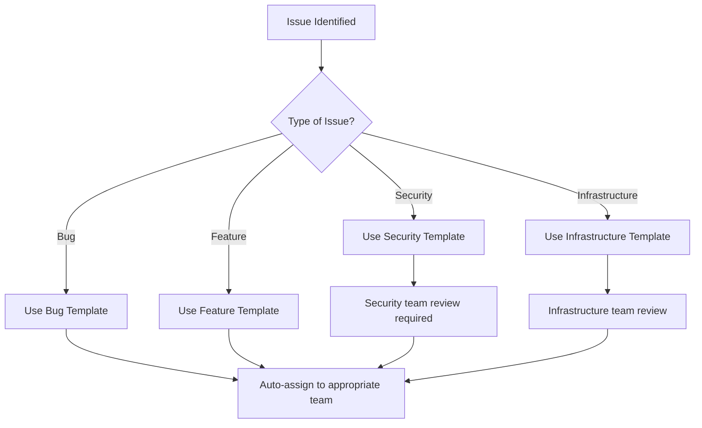
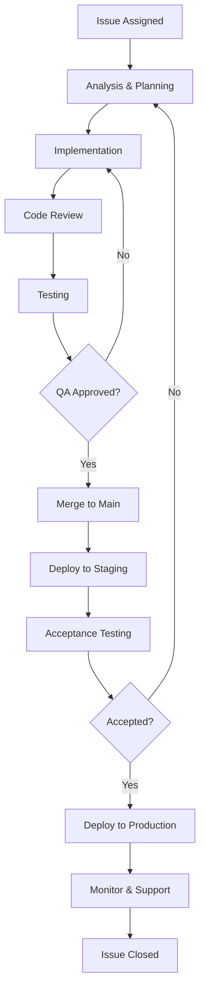
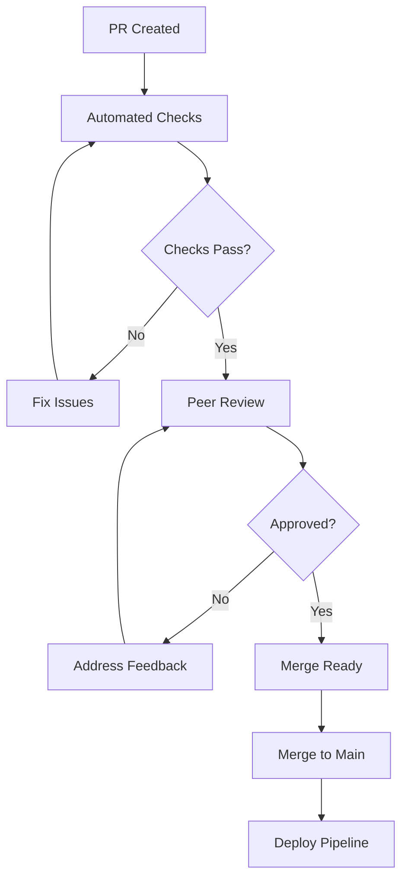
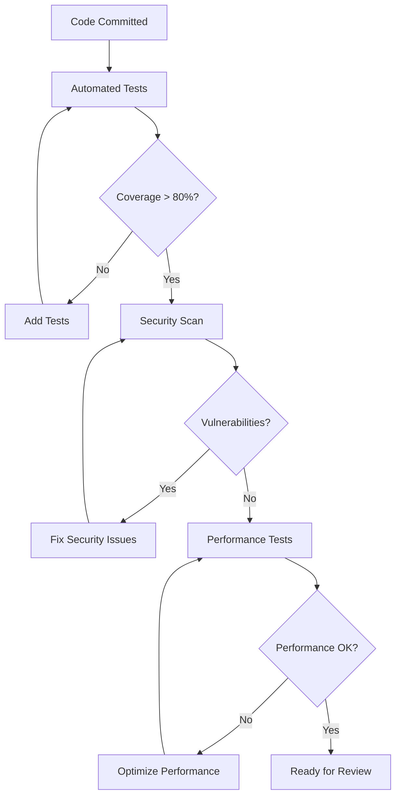
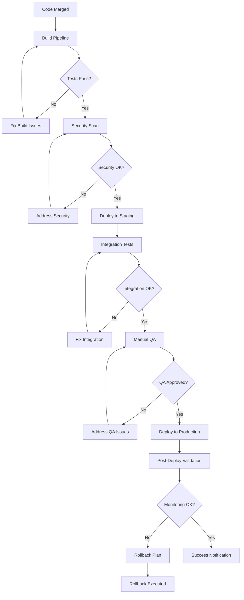
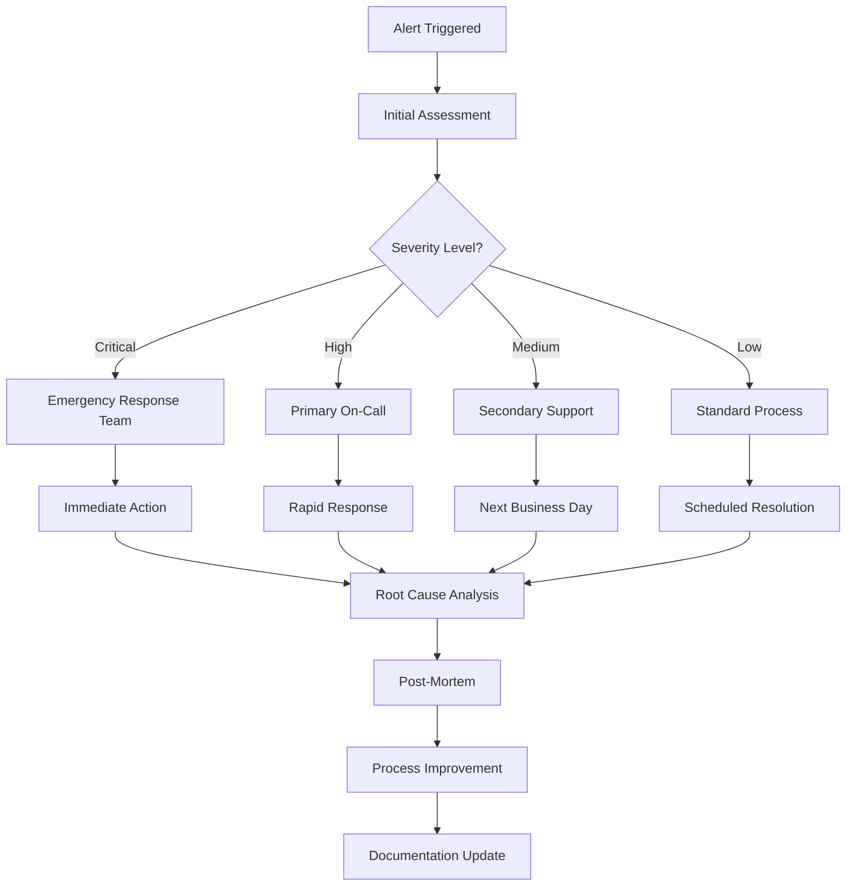
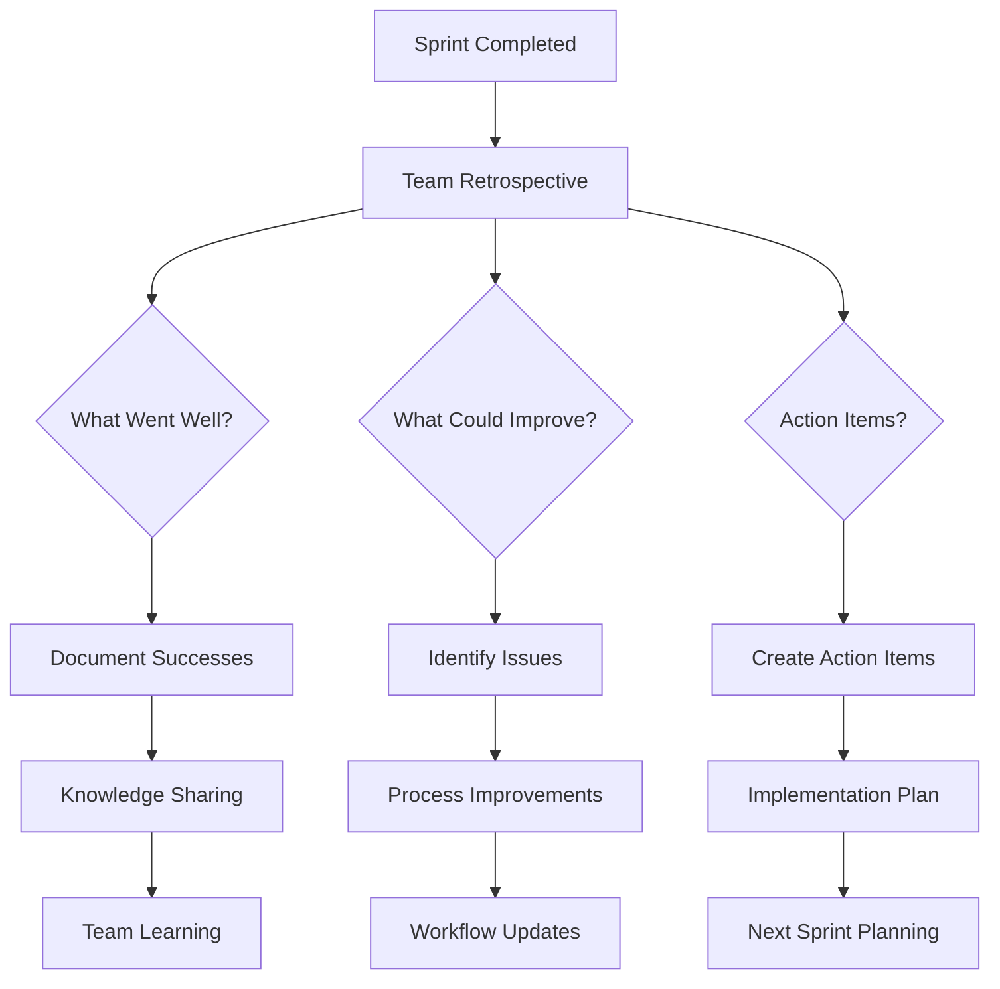
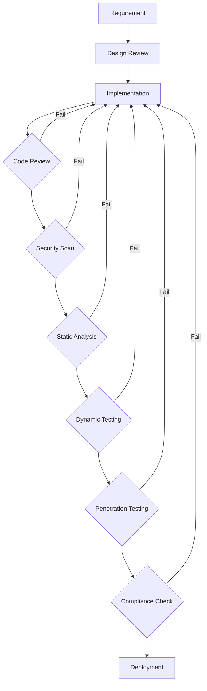

# 🚀 Enterprise Workflow Overview

## **Fantasy42-Fire22 Development & Operations Workflow**

### **1. Strategic Planning Phase**

#### **Quarterly Planning**

- **Business Objectives:** Define enterprise goals and KPIs
- **Technical Roadmap:** Align technology with business strategy
- **Resource Planning:** Allocate team capacity and budget
- **Risk Assessment:** Identify strategic and technical risks

#### **Monthly Planning**

- **Sprint Planning:** Define sprint goals and capacity
- **Backlog Refinement:** Prioritize and estimate user stories
- **Dependency Management:** Resolve cross-team dependencies
- **Milestone Setting:** Establish measurable objectives

### **2. Sprint Execution Phase**

#### **Sprint Structure (2 weeks)**

```
Week 1: Development Focus
├── Day 1: Sprint Planning & Kickoff
├── Day 2-4: Development & Testing
├── Day 5: Mid-Sprint Review

Week 2: Integration & Delivery
├── Day 6-8: Integration & QA
├── Day 9: Sprint Review & Demo
├── Day 10: Sprint Retrospective & Planning
```

#### **Daily Workflow**

```
9:00 AM - Standup Meeting (15 min)
├── What completed yesterday?
├── What working on today?
├── Any blockers?

9:15 AM - Focused Development
├── Code implementation
├── Testing and validation
├── Documentation updates

4:45 PM - End of Day Review
├── Progress assessment
├── Blocker identification
└── Next day planning
```

### **3. Issue Management Workflow**

#### **Issue Creation**



#### **Issue Resolution Process**



### **4. Development Workflow**

#### **Git Workflow**

```bash
# Feature Development
git checkout -b feature/ISSUE-123-feature-name
# Make changes with TDD approach
bun test --watch
# Commit with conventional format
git commit -m "✨ Add feature with enterprise standards"
# Push and create PR
gh pr create --template enterprise-pr-template
```

#### **Code Review Process**



### **5. Quality Assurance Workflow**

#### **Testing Strategy**

- **Unit Tests:** 80%+ coverage required
- **Integration Tests:** API and database testing
- **E2E Tests:** Critical user journey validation
- **Performance Tests:** Load and stress testing
- **Security Tests:** Automated vulnerability scanning

#### **Quality Gates**



### **6. Deployment Workflow**

#### **Environment Strategy**

- **Development:** Local development and testing
- **Staging:** Pre-production validation
- **Production:** Live customer environment
- **Disaster Recovery:** Backup and failover systems

#### **Deployment Pipeline**



### **7. Monitoring & Support Workflow**

#### **Production Monitoring**

- **Application Performance:** Response times, error rates
- **Infrastructure:** CPU, memory, disk usage
- **Business Metrics:** User engagement, conversion rates
- **Security Events:** Suspicious activity detection

#### **Incident Response**



### **8. Continuous Improvement Workflow**

#### **Sprint Retrospective**



#### **Metrics & KPIs**

- **Velocity:** Story points completed per sprint
- **Quality:** Defect rates, test coverage, security issues
- **Efficiency:** Deployment frequency, lead time
- **Customer Satisfaction:** NPS scores, support tickets
- **Team Health:** Satisfaction surveys, retention rates

### **9. Communication Workflow**

#### **Team Communication**

- **Daily Standups:** 15-minute progress sync
- **Sprint Planning:** 2-hour capacity and backlog planning
- **Sprint Reviews:** 1-hour demo and feedback session
- **Sprint Retrospectives:** 1-hour improvement discussion

#### **Stakeholder Communication**

- **Weekly Updates:** Sprint progress and blockers
- **Monthly Reports:** KPI dashboards and trend analysis
- **Quarterly Reviews:** Strategic alignment and roadmap updates
- **Incident Reports:** Critical issue communication

### **10. Compliance & Security Workflow**

#### **Security Development Lifecycle**



#### **Regulatory Compliance**

- **GDPR:** Data protection and privacy
- **PCI DSS:** Payment card security
- **SOX:** Financial reporting controls
- **AML:** Anti-money laundering

---

## 🎯 **Enterprise Workflow Success Metrics**

### **Process Efficiency**

- **Sprint Completion Rate:** 95%+ stories completed
- **Code Review Time:** < 4 hours average
- **Deployment Frequency:** Multiple times per day
- **Mean Time to Resolution:** < 24 hours for critical issues

### **Quality Metrics**

- **Defect Density:** < 0.5 defects per 1000 lines
- **Test Coverage:** > 85% automated coverage
- **Security Vulnerabilities:** Zero critical issues
- **Performance Benchmarks:** Meet or exceed targets

### **Team Metrics**

- **Sprint Satisfaction:** > 4.0/5.0 average
- **Knowledge Sharing:** Weekly technical sessions
- **Innovation Index:** New ideas implemented quarterly
- **Retention Rate:** > 95% annual retention

---

## 🚀 **Workflow Optimization**

### **Continuous Improvement**

- **Sprint Retrospectives:** Weekly improvement identification
- **Process Metrics:** Monthly workflow analysis
- **Tool Evaluation:** Quarterly tool and process review
- **Best Practice Sharing:** Cross-team knowledge exchange

### **Automation Opportunities**

- **CI/CD Pipelines:** Fully automated deployment
- **Code Quality Gates:** Automated quality checks
- **Security Scanning:** Continuous vulnerability assessment
- **Performance Monitoring:** Real-time performance tracking

---

**Fantasy42-Fire22 Enterprise Workflow Overview v1.0**

**Workflow Maturity:** Enterprise-grade processes and automation **Quality
Standard:** Zero-defect delivery with security compliance **Team Empowerment:**
Clear processes with decision-making authority
