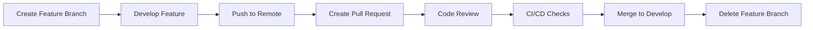
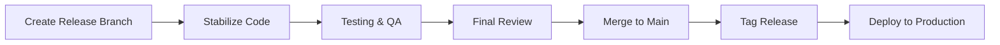
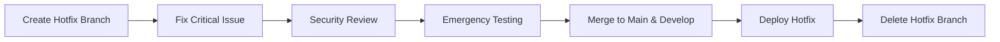

# 🌿 Fantasy42-Fire22 Branch Management Guide

**Enterprise Branch Strategy | Git Flow Enhanced | Version 5.1.0**

---

## 🎯 **Branch Strategy Overview**

This guide outlines the comprehensive branch management strategy for the
Fantasy42-Fire22 enterprise platform, designed to support:

- 🚀 **Continuous Deployment** to multiple environments
- 🔒 **Enterprise Security** with strict access controls
- 👥 **Team Collaboration** across 35+ specialized teams
- 📋 **Compliance** with regulatory requirements
- ⚡ **Rapid Development** with automated quality gates

---

## 🌳 **Branch Hierarchy**

```text
main (production)
├── enterprise (enterprise features)
├── develop (integration branch)
│   ├── feature/* (feature branches)
│   ├── hotfix/* (critical fixes)
│   └── release/* (release preparation)
└── staging (pre-production)
```

---

## 📋 **Branch Types & Usage**

### **1. Main Branch** (`main`)

| Property             | Configuration                            |
| -------------------- | ---------------------------------------- |
| **Purpose**          | Production releases                      |
| **Protection**       | 🔴 **MAXIMUM**                           |
| **Required Reviews** | 2 approvals + CODEOWNERS                 |
| **Status Checks**    | Build, Test, Security, Dependency Review |
| **Merge Strategy**   | Squash and merge                         |
| **Push Access**      | Restricted to release managers           |
| **Auto-deployment**  | ✅ Production                            |

**Usage Guidelines:**

- Only production-ready code
- Must pass all quality gates
- Requires enterprise admin approval
- Automatic deployment to production

### **2. Enterprise Branch** (`enterprise`)

| Property             | Configuration                            |
| -------------------- | ---------------------------------------- |
| **Purpose**          | Enterprise-grade features and compliance |
| **Protection**       | 🔴 **HIGH**                              |
| **Required Reviews** | 3 approvals + CODEOWNERS                 |
| **Status Checks**    | Enterprise build, Security, Compliance   |
| **Merge Strategy**   | Merge commit                             |
| **Push Access**      | Enterprise team only                     |
| **Auto-deployment**  | ❌ Manual deployment                     |

**Usage Guidelines:**

- Critical enterprise features
- Compliance-sensitive changes
- High-risk modifications
- Requires security team review

### **3. Develop Branch** (`develop`)

| Property             | Configuration           |
| -------------------- | ----------------------- |
| **Purpose**          | Development integration |
| **Protection**       | 🟡 **MEDIUM**           |
| **Required Reviews** | 1 approval              |
| **Status Checks**    | Build, Unit tests       |
| **Merge Strategy**   | Merge commit            |
| **Push Access**      | Development team        |
| **Auto-deployment**  | ❌ Staging environment  |

**Usage Guidelines:**

- Daily development integration
- Feature branch merging point
- Continuous integration target
- Staging deployment trigger

### **4. Staging Branch** (`staging`)

| Property             | Configuration          |
| -------------------- | ---------------------- |
| **Purpose**          | Pre-production testing |
| **Protection**       | 🟡 **MEDIUM**          |
| **Required Reviews** | 1 approval             |
| **Status Checks**    | Build, E2E tests       |
| **Merge Strategy**   | Merge commit           |
| **Push Access**      | QA team                |
| **Auto-deployment**  | ✅ Staging environment |

**Usage Guidelines:**

- Pre-production validation
- End-to-end testing
- Performance testing
- User acceptance testing

### **5. Feature Branches** (`feature/*`)

| Property             | Configuration           |
| -------------------- | ----------------------- |
| **Purpose**          | Feature development     |
| **Protection**       | 🟢 **STANDARD**         |
| **Required Reviews** | 1 approval + CODEOWNERS |
| **Status Checks**    | Build, Unit tests, Lint |
| **Merge Strategy**   | Squash and merge        |
| **Push Access**      | Feature developers      |
| **Auto-deployment**  | ❌ Local development    |

**Naming Convention:**

```text
feature/FEATURE-123-user-authentication
feature/FEATURE-456-payment-integration
feature/FEATURE-789-mobile-responsive-design
```

### **6. Hotfix Branches** (`hotfix/*`)

| Property             | Configuration                         |
| -------------------- | ------------------------------------- |
| **Purpose**          | Critical bug fixes                    |
| **Protection**       | 🟡 **HIGH**                           |
| **Required Reviews** | 2 approvals + CODEOWNERS              |
| **Status Checks**    | Build, Test, Security, Critical tests |
| **Merge Strategy**   | Merge commit                          |
| **Push Access**      | Development + Security teams          |
| **Auto-deployment**  | ✅ Emergency deployment               |

**Naming Convention:**

```text
hotfix/HOTFIX-123-security-vulnerability
hotfix/HOTFIX-456-payment-processing-bug
hotfix/HOTFIX-789-database-connection-issue
```

### **7. Release Branches** (`release/*`)

| Property             | Configuration                              |
| -------------------- | ------------------------------------------ |
| **Purpose**          | Release preparation                        |
| **Protection**       | 🔴 **HIGH**                                |
| **Required Reviews** | 2 approvals + CODEOWNERS                   |
| **Status Checks**    | Full test suite, Security, Compliance, E2E |
| **Merge Strategy**   | Merge commit                               |
| **Push Access**      | Release managers                           |
| **Auto-deployment**  | ✅ Release environment                     |

**Naming Convention:**

```text
release/v5.1.0-release-preparation
release/v5.2.0-enterprise-release
release/v6.0.0-major-release
```

---

## 🔄 **Branch Lifecycle**

### **Feature Development Flow**



### **Release Flow**



### **Hotfix Flow**



---

## 📝 **Branch Naming Standards**

### **General Rules**

- Use lowercase letters
- Use hyphens (-) to separate words
- Include ticket/issue number when applicable
- Keep names descriptive but concise
- Maximum 50 characters

### **Examples**

#### ✅ **Good Examples**

```text
feature/user-profile-enhancement
hotfix/security-patch-2025-01-15
release/v5.1.0-enterprise-edition
bugfix/payment-validation-error
```

#### ❌ **Bad Examples**

```text
feature/my-awesome-feature-that-does-a-lot-of-things
HOTFIX/SECURITY/PATCH
release/version-5.1.0-final-final
f/user-profile (too abbreviated)
```

---

## 🔒 **Protection Rules Configuration**

### **GitHub Branch Protection JSON**

```json
{
  "branch_protection_rules": [
    {
      "pattern": "main",
      "required_status_checks": {
        "strict": true,
        "contexts": [
          "ci/circleci: build",
          "ci/circleci: test",
          "security/codeql",
          "dependency-review"
        ]
      },
      "required_pull_request_reviews": {
        "required_approving_review_count": 2,
        "require_code_owner_reviews": true
      },
      "restrictions": {
        "users": ["nolarose1968-pixel"],
        "teams": ["enterprise-team"]
      }
    }
  ]
}
```

### **Automated Enforcement**

- **Branch Creation**: Automatic protection application
- **Pull Request**: Required checks and reviews
- **Merge**: Only through approved PRs
- **Deletion**: Restricted to administrators
- **Force Push**: Disabled on protected branches

---

## 👥 **Team Access Matrix**

| Team              | main      | enterprise | develop   | staging   | feature/\* | hotfix/\* | release/\* |
| ----------------- | --------- | ---------- | --------- | --------- | ---------- | --------- | ---------- |
| enterprise-admins | ✅ Full   | ✅ Full    | ✅ Full   | ✅ Full   | ✅ Full    | ✅ Full   | ✅ Full    |
| security-team     | 🔒 Review | ✅ Full    | ✅ Push   | ✅ Push   | ✅ Push    | ✅ Full   | 🔒 Review  |
| devops-team       | 🔒 Review | 🔒 Review  | ✅ Full   | ✅ Full   | ✅ Push    | ✅ Push   | ✅ Push    |
| development-team  | ❌ None   | ❌ None    | ✅ Push   | 🔒 Review | ✅ Full    | ❌ None   | ❌ None    |
| qa-team           | ❌ None   | ❌ None    | 🔒 Review | ✅ Full   | 🔒 Review  | ❌ None   | 🔒 Review  |
| release-managers  | ✅ Merge  | 🔒 Review  | 🔒 Review | 🔒 Review | ❌ None    | 🔒 Review | ✅ Full    |

---

## 🔧 **Automation & CI/CD**

### **Automated Workflows**

#### **Branch Creation**

```yaml
name: Branch Protection
on:
  create:
    branches: ['feature/*', 'hotfix/*', 'release/*']

jobs:
  protect-branch:
    runs-on: ubuntu-latest
    steps:
      - name: Apply branch protection
        uses: actions/github-script@v6
        with:
          script: |
            // Apply appropriate protection rules
```

#### **Pull Request Validation**

```yaml
name: PR Validation
on:
  pull_request:
    branches: [main, enterprise, develop, staging]

jobs:
  validate:
    runs-on: ubuntu-latest
    steps:
      - name: Checkout code
      - name: Run tests
      - name: Security scan
      - name: Code quality check
```

#### **Auto-merge**

```yaml
name: Auto Merge
on:
  pull_request_review:
    types: [submitted]

jobs:
  auto-merge:
    if: github.event.review.state == 'approved'
    runs-on: ubuntu-latest
    steps:
      - name: Auto-merge for bots
        uses: pascalgn/auto-merge-action@v0.15.0
```

---

## 📊 **Branch Health Metrics**

### **Key Performance Indicators**

| Metric             | Target     | Description                |
| ------------------ | ---------- | -------------------------- |
| **PR Review Time** | < 24 hours | Time to first review       |
| **PR Merge Time**  | < 48 hours | Time to merge approved PR  |
| **Branch Age**     | < 7 days   | Maximum feature branch age |
| **Test Coverage**  | > 90%      | Required test coverage     |
| **Security Score** | A+         | Minimum security rating    |

### **Monitoring Dashboards**

- **Branch Activity**: Creation, merge, deletion rates
- **PR Metrics**: Review times, approval rates
- **Quality Gates**: Test pass rates, security scan results
- **Team Performance**: Branch management efficiency

---

## 🚨 **Emergency Procedures**

### **Critical Hotfix Process**

1. **Create Hotfix Branch**

   ```bash
   git checkout -b hotfix/HOTFIX-123-critical-security-fix
   ```

2. **Implement Fix**

   ```bash
   # Make minimal, targeted changes
   # Include security team review
   ```

3. **Emergency Review**

   ```bash
   # Security team + DevOps review
   # Critical test execution
   ```

4. **Deploy & Merge**
   ```bash
   # Deploy to production
   # Merge to main and develop
   # Tag emergency release
   ```

### **Branch Lockdown**

In case of security incidents:

1. Lock all branches except main
2. Enable admin-only mode
3. Conduct security audit
4. Restore normal operations

---

## 📚 **Best Practices**

### **Commit Guidelines**

- **Atomic Commits**: One change per commit
- **Clear Messages**: Descriptive commit messages
- **Ticket References**: Include issue/ticket numbers
- **Sign Commits**: Use GPG signing for security

### **Pull Request Guidelines**

- **Template Usage**: Use PR templates
- **Description**: Detailed change description
- **Testing**: Include test results
- **Documentation**: Update docs as needed
- **Breaking Changes**: Clearly mark breaking changes

### **Code Review Guidelines**

- **Timely Reviews**: Review within 24 hours
- **Constructive Feedback**: Provide actionable feedback
- **Approval Criteria**: Meet team standards
- **Documentation**: Review documentation changes

---

## 📞 **Support & Resources**

- **📧 Branch Management**: devops@fire22.com
- **🐙 GitHub Issues**:
  [Branch Issues](https://github.com/fantasy42-fire22/registry/labels/branch-management)
- **📖 Documentation**: https://docs.fire22.com/branches
- **🆘 Emergency**: emergency@fire22.com

---

## 🔄 **Version History**

| Version | Date     | Changes                                   |
| ------- | -------- | ----------------------------------------- |
| 5.1.0   | Jan 2025 | Pure Bun ecosystem integration            |
| 5.0.0   | Dec 2024 | Enterprise branch strategy implementation |
| 4.5.0   | Nov 2024 | Enhanced protection rules                 |
| 4.0.0   | Oct 2024 | Git Flow adoption                         |

---

**Built with ❤️ using Pure Bun Ecosystem**
