# 🚀 Fire22 Registry Release Flow: Department Heads Guide

**Enterprise Registry Release System with Department Validation**

*Published: 8/30/2025 | Author: Fire22 Registry Team*

## 📋 **Announcement to All Department Heads**

This comprehensive guide introduces the new **Department-Driven Registry Release Flow** that revolutionizes how we ensure enterprise quality, security, and compliance in our package releases.

## 🎯 **Why This Matters**

As Department Heads, you are now **critical gatekeepers** in our enterprise release process:

- **Domain Expertise**: Validate packages in your area of expertise
- **Quality Assurance**: Ensure enterprise standards are met
- **Compliance**: Enforce department-specific compliance requirements
- **Accountability**: Your validation is tracked and auditable

## 🏛️ **Department Responsibilities**

| Department | Primary Lead | Validation Focus | Critical Gates |
|------------|--------------|------------------|----------------|
| Security & Compliance | Lisa Anderson | SOC2, GDPR, PCI-DSS, HIPAA | Security audits, compliance checks |
| Technology | David Kim | Performance, scalability, architecture | Tech reviews, performance tests |
| Design | Isabella Martinez | WCAG AA/AAA, accessibility, UX | Design audits, accessibility checks |
| Product Management | Samantha Rivera | Features, requirements, acceptance | Product reviews, acceptance tests |
| Operations | Robert Garcia | Deployment, monitoring, reliability | Ops reviews, infrastructure checks |
| Finance | Sarah Thompson | Cost analysis, budget compliance | Financial reviews, ROI validation |
| Management | John Smith | Strategic alignment, risk assessment | Executive reviews, strategic fit |
| Marketing | Amanda Foster | Brand compliance, documentation | Marketing reviews, brand alignment |
| Team Contributors | Alex Chen | Code quality, testing, documentation | Code reviews, test coverage |
| Onboarding | Natasha Cooper | Process compliance, training | Process reviews, documentation |

## 🔧 **How the New System Works**

### **Phase 1: Pre-Release Validation**

```mermaid
graph TD
    A[🚀 Release Initiation] --> B[🔍 Environment Check]
    B --> C[📦 Bun Semver Validation]
    C --> D[🏛️ Department Validation]
    D --> E[✅ Validation Complete]
```


### **Phase 2: Your Department Validation**
```bash
# Run validation for your department
bun run department:YOUR_DEPARTMENT

# Examples:
bun run department:security      # Security & Compliance
bun run department:technology    # Technology
bun run department:design        # Design
```

### **Phase 3: Validation Results**
```json
{
  "department": "Technology",
  "head": "David Kim",
  "validators": ["Sarah Johnson", "Robert Garcia"],
  "summary": {
    "totalPackages": 3,
    "passed": 3,
    "failed": 0,
    "warnings": 0,
    "overallStatus": "PASSED"
  }
}
```

## 📊 **Your Performance Metrics**

Track your department's validation performance:

- **Validation Success Rate**: Target >90%
- **Time to Complete**: Target <2 hours
- **First-Time Pass Rate**: Target >95%
- **Compliance Adherence**: Target 100%

## 📞 **Support & Resources**

### **Getting Help**
- **Department Escalation**: Contact your secondary validator
- **Technical Issues**: Create GitHub issue in registry repo
- **Process Questions**: Email enterprise@fire22.com
- **Training**: Monthly department head sessions

### **Available Resources**
- **REGISTRY-RELEASE-README.md**: Complete technical documentation
- **REGISTRY-RELEASE-WALKTHROUGH.md**: Step-by-step guide
- **GitHub Repository**: https://github.com/fantasy42-fire22/registry
- **Enterprise Support**: Premium support for critical issues

## ⏰ **Timeline & Requirements**

### **Immediate Actions (This Week)**
1. **Read this walkthrough completely** (15-20 minutes)
2. **Run test validation** for your department
3. **Confirm understanding** via email/RSS/blog comment
4. **Join department validation training**

### **Short-term Goals (Next Sprint)**
1. **Master validation commands** for your department
2. **Establish validation cadence** for your team
3. **Document department procedures**
4. **Train secondary validators**

## ✅ **Confirmation Required**

**Please confirm you've read and understood this guide by:**

1. **Email**: Reply to your notification with "CONFIRMED"
2. **RSS Feed**: Comment on the announcements RSS feed item
3. **Blog Comment**: Leave a confirmation comment below

---

## 🎉 **Welcome to Enterprise Registry Validation!**

You are now empowered to ensure the highest quality standards for packages in your domain. Your validation is critical to maintaining enterprise security, compliance, and performance standards.

**Questions?** Contact your secondary validator or email enterprise@fire22.com

**Ready to validate?** Run: `bun run department:YOUR_DEPARTMENT`

---

*🚀 Fire22 Registry Release System v5.1.0*
*🏛️ Department-Driven • 🔒 Security-First • ⚡ Performance-Optimized*

**Tags:** registry, department-heads, validation, enterprise, compliance, walkthrough
**Categories:** Announcements, Training, Enterprise Systems