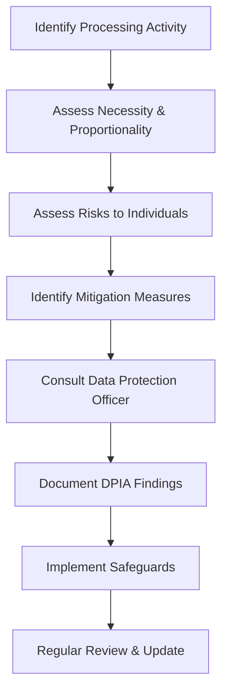

# 🇪🇺 GDPR Compliance Guide

## **Fantasy42-Fire22 GDPR Implementation**

_Complete guide to General Data Protection Regulation compliance for our
enterprise platform_

---

## 📋 **GDPR Overview**

### **What is GDPR?**

The General Data Protection Regulation (GDPR) is a comprehensive data protection
law that regulates how personal data is collected, processed, and protected
within the European Union (EU) and European Economic Area (EEA).

### **GDPR Applicability**

- ✅ **Geographic Scope:** Applies to EU/EEA residents regardless of location
- ✅ **Business Size:** Applies to all businesses processing EU personal data
- ✅ **Data Types:** Covers all personal data processing activities
- ✅ **Online/Offline:** Applies to both digital and physical data processing

### **Key Principles**

1. **Lawfulness, Fairness, and Transparency**
2. **Purpose Limitation**
3. **Data Minimization**
4. **Accuracy**
5. **Storage Limitation**
6. **Integrity and Confidentiality**
7. **Accountability**

---

## 🏢 **Data Protection Officer (DPO)**

### **DPO Responsibilities**

- **📋 Compliance Oversight:** Monitor GDPR compliance across the organization
- **🔍 Data Audits:** Conduct regular data processing audits
- **📞 Stakeholder Liaison:** Communicate with supervisory authorities
- **🎓 Training:** Provide data protection training to staff
- **📊 Risk Assessment:** Identify and mitigate data protection risks

### **DPO Contact Information**

- **Name:** [DPO Name]
- **Email:** dpo@fantasy42-fire22.com
- **Phone:** [DPO Phone Number]
- **Response Time:** Within 24 hours for urgent matters

---

## 📊 **Data Processing Inventory**

### **Personal Data Categories**

#### **User Profile Data**

```json
{
  "dataCategory": "User Profile",
  "dataTypes": [
    "Name",
    "Email address",
    "Phone number",
    "Date of birth",
    "Nationality",
    "Address"
  ],
  "legalBasis": "Contract (Article 6(1)(b))",
  "retentionPeriod": "Account active + 7 years",
  "securityMeasures": "Encrypted at rest and in transit"
}
```

#### **Financial Data**

```json
{
  "dataCategory": "Financial Information",
  "dataTypes": [
    "Payment card details",
    "Bank account information",
    "Transaction history",
    "KYC documents"
  ],
  "legalBasis": "Contract (Article 6(1)(b))",
  "retentionPeriod": "7 years (AML requirements)",
  "securityMeasures": "PCI DSS Level 1 compliance"
}
```

#### **Gaming Data**

```json
{
  "dataCategory": "Gaming Activity",
  "dataTypes": [
    "Betting history",
    "Fantasy league participation",
    "Game preferences",
    "Performance analytics"
  ],
  "legalBasis": "Consent (Article 6(1)(a))",
  "retentionPeriod": "Account active + 7 years",
  "securityMeasures": "Encrypted with user-specific keys"
}
```

### **Data Processing Activities**

| Processing Activity | Purpose                    | Legal Basis                   | Data Categories    |
| ------------------- | -------------------------- | ----------------------------- | ------------------ |
| User Registration   | Account creation           | Contract (6(1)(b))            | Profile, Contact   |
| Payment Processing  | Transaction handling       | Contract (6(1)(b))            | Financial, Profile |
| Gaming Services     | Fantasy/betting platform   | Consent (6(1)(a))             | Gaming, Profile    |
| Marketing           | Promotional communications | Consent (6(1)(a))             | Contact, Profile   |
| Analytics           | Service improvement        | Legitimate interest (6(1)(f)) | Usage, Profile     |
| Compliance          | Legal obligations          | Legal obligation (6(1)(c))    | All categories     |

---

## 🔐 **Data Subject Rights**

### **Right to Information (Article 13-14)**

- **📋 Privacy Notice:** Clear, concise information about data processing
- **🔍 Data Categories:** Specific types of personal data collected
- **⏰ Retention Periods:** How long data is kept and why
- **🔒 Security Measures:** Technical and organizational protections

### **Right of Access (Article 15)**

- **📊 Data Copy:** Free copy of all personal data in portable format
- **📝 Processing Details:** Purposes, categories, recipients, retention
- **🔍 Source Information:** Where data was obtained from
- **⚡ Response Time:** Within one month (extendable by two months)

### **Right to Rectification (Article 16)**

- **✏️ Data Correction:** Inaccurate personal data must be corrected
- **📝 Data Completion:** Incomplete data must be completed
- **🔍 Additional Statement:** Right to provide supplementary statement

### **Right to Erasure (Article 17)**

- **🗑️ Data Deletion:** "Right to be forgotten" implementation
- **❌ Consent Withdrawal:** Data deletion when consent withdrawn
- **📊 Automated Processing:** Deletion in automated decision-making
- **⚖️ Legal Exceptions:** Limited grounds for refusal

### **Right to Restriction (Article 18)**

- **⏸️ Processing Suspension:** Temporary processing restriction
- **🔍 Accuracy Disputes:** While accuracy is being verified
- **⚖️ Legal Claims:** During legal proceedings
- **🔒 Unlawful Processing:** When processing is unlawful

### **Right to Data Portability (Article 20)**

- **📤 Data Export:** Receive data in structured, machine-readable format
- **🔄 Direct Transfer:** Transmit data to another controller
- **📊 Structured Format:** Commonly used, machine-readable format
- **⚡ Response Time:** Within one month

### **Right to Object (Article 21)**

- **🚫 Direct Marketing:** Object to direct marketing processing
- **⚖️ Legitimate Interests:** Object to processing based on legitimate
  interests
- **🤖 Automated Processing:** Object to automated decision-making
- **📞 Contact Channels:** Multiple ways to exercise this right

---

## 🛡️ **Data Protection Impact Assessment (DPIA)**

### **DPIA Requirements**

- **🔍 High-Risk Processing:** DPIA required for high-risk processing activities
- **📊 Risk Evaluation:** Systematic assessment of data protection risks
- **🛡️ Mitigation Measures:** Implementation of appropriate safeguards
- **📋 Documentation:** Comprehensive DPIA documentation

### **High-Risk Processing Activities**

- [ ] Large-scale systematic monitoring of individuals
- [ ] Large-scale processing of sensitive data
- [ ] Large-scale processing of personal data relating to criminal convictions
- [ ] Large-scale, systematic processing with high risk to rights and freedoms
- [ ] Processing for matching or combining datasets
- [ ] Processing of data concerning health, racial/ethnic origin, etc.

### **DPIA Process**



---

## 🚨 **Data Breach Notification**

### **Breach Response Timeline**

- **🔔 Detection:** Immediate internal notification
- **⏱️ Assessment:** Within 72 hours of detection
- **📢 Notification:** Within 72 hours to supervisory authority
- **👥 Communication:** Without undue delay to individuals

### **Breach Notification Requirements**

```json
{
  "notificationElements": [
    "Nature of the personal data breach",
    "Categories and approximate number of data subjects",
    "Categories and approximate number of personal data records",
    "Likely consequences of the breach",
    "Measures taken or proposed to address the breach",
    "Contact details of the data protection officer"
  ],
  "notificationDeadline": "72 hours",
  "individualNotification": "Without undue delay"
}
```

### **Breach Response Plan**

1. **🚨 Immediate Response:** Contain the breach and assess impact
2. **📋 Documentation:** Record all breach details and response actions
3. **🔍 Investigation:** Determine root cause and scope of breach
4. **📢 Notification:** Notify supervisory authority and affected individuals
5. **🛡️ Remediation:** Implement corrective measures and prevent recurrence
6. **📊 Post-Mortem:** Conduct thorough review and update procedures

---

## 🔒 **Data Security Measures**

### **Technical Safeguards**

- ✅ **Encryption:** Data encrypted at rest and in transit
- ✅ **Access Controls:** Role-based access with principle of least privilege
- ✅ **Network Security:** Firewalls, intrusion detection, and monitoring
- ✅ **Data Masking:** Sensitive data masked in non-production environments

### **Organizational Safeguards**

- ✅ **Staff Training:** Regular data protection training for all employees
- ✅ **Access Management:** Strict access control procedures
- ✅ **Vendor Management:** Third-party vendor data protection assessments
- ✅ **Incident Response:** Documented breach response procedures

### **Physical Safeguards**

- ✅ **Facility Security:** Secure data center facilities
- ✅ **Device Security:** Endpoint protection and mobile device management
- ✅ **Paper Records:** Secure handling and disposal of physical records

---

## 📊 **Data Retention & Deletion**

### **Retention Schedule**

| Data Category  | Retention Period         | Legal Basis         | Disposal Method    |
| -------------- | ------------------------ | ------------------- | ------------------ |
| User Profile   | Account active + 7 years | Contract            | Secure deletion    |
| Financial Data | 7 years                  | AML regulations     | Secure deletion    |
| Gaming History | Account active + 7 years | Consent             | Secure deletion    |
| Marketing Data | Until consent withdrawn  | Consent             | Immediate deletion |
| Log Files      | 2 years                  | Legitimate interest | Secure deletion    |

### **Automated Deletion Process**

```typescript
// Example automated deletion workflow
async function processDataDeletion(userId: string) {
  // 1. Verify deletion request
  const request = await verifyDeletionRequest(userId);

  // 2. Suspend processing
  await suspendDataProcessing(userId);

  // 3. Create data export (if requested)
  if (request.exportData) {
    await createDataExport(userId);
  }

  // 4. Delete data across all systems
  await deleteUserData(userId);

  // 5. Confirm deletion
  await confirmDeletion(userId);

  // 6. Log deletion activity
  await logDeletionActivity(userId);
}
```

---

## 🌐 **International Data Transfers**

### **Adequacy Decisions**

- ✅ **EEA Countries:** Automatic adequacy
- ✅ **UK:** Adequate protection after Brexit
- ✅ **Switzerland:** Adequate protection
- ✅ **Adequacy Findings:** Specific countries with adequate protection

### **Transfer Safeguards**

- ✅ **Standard Contractual Clauses:** Approved SCCs for transfers
- ✅ **Binding Corporate Rules:** BCRs for intra-group transfers
- ✅ **Adequacy Decisions:** Countries with adequate protection
- ✅ **Certification Mechanisms:** Approved certification schemes

### **Transfer Impact Assessment**

```json
{
  "transferAssessment": {
    "recipientCountry": "United States",
    "dataCategories": ["User Profile", "Financial Data"],
    "safeguards": "Standard Contractual Clauses",
    "riskLevel": "Medium",
    "mitigationMeasures": [
      "SCC Implementation",
      "Data Encryption",
      "Access Controls"
    ]
  }
}
```

---

## 👥 **Data Protection Training**

### **Employee Training Program**

- **📚 Initial Training:** All new employees receive data protection training
- **🔄 Refresher Training:** Annual refresher training for all staff
- **🎯 Role-Specific Training:** Specialized training for different roles
- **📊 Training Records:** Maintain comprehensive training records

### **Training Topics**

- [ ] GDPR principles and requirements
- [ ] Data subject rights and handling
- [ ] Security best practices
- [ ] Incident reporting procedures
- [ ] Compliance monitoring and auditing

### **Training Effectiveness**

- **📊 Assessment:** Pre and post-training assessments
- **📈 Metrics:** Training completion rates and knowledge retention
- **🔄 Updates:** Training materials updated with regulatory changes

---

## 📞 **Contact & Support**

### **Data Protection Contacts**

- **📧 DPO Email:** dpo@fantasy42-fire22.com
- **📞 DPO Phone:** [Contact Number]
- **🌐 Website:** https://fantasy42-fire22.com/privacy
- **📬 Postal:** [Official Address]

### **Supervisory Authority**

- **🇪🇺 EU Countries:** Local data protection authority
- **🇬🇧 UK:** Information Commissioner's Office (ICO)
- **📞 ICO Contact:** ico.org.uk/global/contact-us/

### **Support Resources**

- **📚 Privacy Portal:** Self-service privacy dashboard
- **💬 Help Center:** Comprehensive FAQ and guides
- **🎯 Training Portal:** Online data protection training
- **📞 Support Line:** 24/7 privacy support

---

## 📋 **GDPR Compliance Checklist**

### **Organizational Measures**

- [ ] Data Protection Officer appointed
- [ ] Data processing inventory maintained
- [ ] Privacy notices published and updated
- [ ] Data protection training implemented
- [ ] Incident response procedures documented

### **Technical Measures**

- [ ] Data encryption implemented
- [ ] Access controls configured
- [ ] Audit logging enabled
- [ ] Data minimization applied
- [ ] Consent management system implemented

### **Procedural Measures**

- [ ] Data subject rights procedures established
- [ ] DPIA process implemented for high-risk processing
- [ ] Breach notification procedures documented
- [ ] Data retention schedules established
- [ ] International transfer safeguards implemented

---

<div align="center">

**🇪🇺 Fantasy42-Fire22 GDPR Compliance**

_Enterprise-grade data protection for EU residents_

---

**🏆 GDPR Compliance Achievements:**

- ✅ **Data Protection Officer** - Dedicated compliance leadership
- ✅ **Comprehensive Inventory** - Complete data processing documentation
- ✅ **Rights Implementation** - Full data subject rights support
- ✅ **Security Measures** - Enterprise-grade data protection
- ✅ **Training Program** - Ongoing staff education and awareness
- ✅ **Incident Response** - Documented breach handling procedures

---

**📞 Need GDPR Assistance?**

[DPO Contact](mailto:dpo@fantasy42-fire22.com) •
[Privacy Portal](https://fantasy42-fire22.com/privacy) •
[Support Center](https://support.fantasy42-fire22.com)

---

_GDPR compliance maintained by Fantasy42-Fire22 Compliance Team_

</div>
