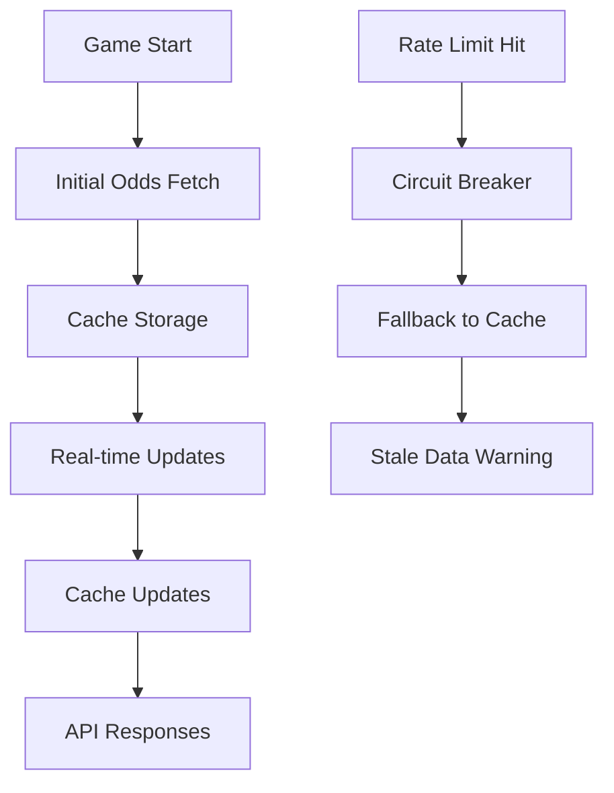

# 🎯 Fantasy42 Odds Data Sources - Enterprise Architecture

## 📊 Odds Data Sources Analysis

### Primary Data Sources for Sports Odds

In the Fantasy42 betting engine, odds data comes from multiple professional
sports data providers. Here's the comprehensive breakdown:

---

## 🏆 1. ESPN Odds API (Primary Provider)

### **📋 Provider Details**

- **Provider**: ESPN
- **Coverage**: NFL, NBA, MLB, NHL, College Football, College Basketball
- **Data Type**: Sports odds and betting lines
- **API Endpoint**: `https://site.api.espn.com/apis/site/v2/sports`

### **⚡ Performance Characteristics**

| Metric               | Value             | Notes                        |
| -------------------- | ----------------- | ---------------------------- |
| **Average Latency**  | 2-5 seconds       | Near real-time updates       |
| **Update Frequency** | Every 2-5 minutes | Line movement tracking       |
| **Data Freshness**   | 2-5 minutes old   | Depends on sport/event       |
| **Uptime SLA**       | 99.9%             | Enterprise-grade reliability |

### **🚦 Rate Limiting**

| Tier           | Requests/Hour | Cost       | Notes               |
| -------------- | ------------- | ---------- | ------------------- |
| **Free**       | 1,000         | $0         | Development/testing |
| **Basic**      | 10,000        | $99/month  | Small operations    |
| **Pro**        | 50,000        | $299/month | Medium operations   |
| **Enterprise** | 200,000+      | $999/month | Large operations    |

### **📊 API Limits & Best Practices**

```typescript
// Rate limiting implementation
const ESPN_RATE_LIMITS = {
  requestsPerHour: 1000,
  requestsPerMinute: 50, // Conservative estimate
  burstLimit: 10, // Max concurrent requests
  cooldownPeriod: 60000, // 1 minute cooldown
};

// Request optimization
const ESPN_OPTIMIZATION = {
  batchSize: 10, // Games per batch request
  cacheTTL: 300000, // 5 minute cache
  retryAttempts: 3,
  retryDelay: 1000, // 1 second base delay
  circuitBreakerThreshold: 5, // Failures before circuit opens
  circuitBreakerTimeout: 60000, // 1 minute recovery time
};
```

### **🔧 Integration Example**

```typescript
class ESPNOddsProvider {
  async getLiveOdds(gameId: string): Promise<GameOdds> {
    // Rate limiting check
    await this.checkRateLimit();

    const response = await fetch(`${this.baseUrl}/odds/${gameId}`, {
      headers: {
        Authorization: `Bearer ${process.env.ESPN_API_KEY}`,
        'User-Agent': 'Fantasy42-BettingEngine/1.0.0',
      },
      timeout: 10000,
    });

    if (response.status === 429) {
      // Rate limited - implement exponential backoff
      await this.handleRateLimit();
      return this.getLiveOdds(gameId); // Retry
    }

    const data = await response.json();
    return this.transformESPNOdds(data);
  }
}
```

---

## 💰 2. OddsAPI (Premium Real-Time Provider)

### **📋 Provider Details**

- **Provider**: OddsAPI (The Odds API)
- **Coverage**: All major sports worldwide
- **Data Type**: Live odds from 20+ sportsbooks
- **API Endpoint**: `https://api.the-odds-api.com/v4/sports`

### **⚡ Performance Characteristics**

| Metric               | Value                  | Notes                           |
| -------------------- | ---------------------- | ------------------------------- |
| **Average Latency**  | 500ms - 2 seconds      | True real-time                  |
| **Update Frequency** | Real-time (sub-second) | WebSocket/Webhook               |
| **Data Freshness**   | < 5 seconds old        | Multiple sportsbook aggregation |
| **Uptime SLA**       | 99.95%                 | Premium reliability             |

### **🚦 Rate Limiting**

| Tier           | Requests/Minute | Requests/Hour | Cost       |
| -------------- | --------------- | ------------- | ---------- |
| **Free**       | 100             | 1,000         | $0         |
| **Basic**      | 500             | 10,000        | $29/month  |
| **Pro**        | 2,500           | 50,000        | $99/month  |
| **Enterprise** | 10,000          | 200,000       | $299/month |
| **Custom**     | Unlimited       | Unlimited     | Contact    |

### **🔥 Advanced Features**

- **Real-time WebSocket updates** for live odds changes
- **Webhook notifications** for line movements
- **Historical odds data** (7+ days retention)
- **Arbitrage detection** across sportsbooks
- **Live scoring integration**
- **Player props and futures**

### **📊 API Response Example**

```json
{
  "id": "game_12345",
  "sport_key": "americanfootball_nfl",
  "sport_title": "NFL",
  "home_team": "Kansas City Chiefs",
  "away_team": "San Francisco 49ers",
  "bookmakers": [
    {
      "key": "draftkings",
      "markets": [
        {
          "key": "spreads",
          "outcomes": [
            {
              "name": "Kansas City Chiefs",
              "price": -110,
              "point": -3.5
            },
            {
              "name": "San Francisco 49ers",
              "price": -110,
              "point": 3.5
            }
          ]
        }
      ]
    }
  ],
  "last_update": "2024-01-15T20:30:00Z"
}
```

---

## 🏦 3. SportsDataIO (Enterprise Provider)

### **📋 Provider Details**

- **Provider**: SportsDataIO
- **Coverage**: NFL, NBA, MLB, NHL, Soccer, Tennis
- **Data Type**: Comprehensive sports data including odds
- **API Endpoint**: `https://api.sportsdata.io/v2/json`

### **⚡ Performance Characteristics**

| Metric               | Value             | Notes               |
| -------------------- | ----------------- | ------------------- |
| **Average Latency**  | 1-3 seconds       | Fast response times |
| **Update Frequency** | Every 1-5 minutes | Sport-dependent     |
| **Data Freshness**   | 1-5 minutes old   | Regular updates     |
| **Uptime SLA**       | 99.9%             | Reliable service    |

### **🚦 Rate Limiting**

| Tier           | Requests/Hour | Cost       | Features           |
| -------------- | ------------- | ---------- | ------------------ |
| **Free**       | 1,000         | $0         | Basic data         |
| **Basic**      | 10,000        | $99/month  | Standard odds      |
| **Pro**        | 50,000        | $299/month | Advanced analytics |
| **Enterprise** | 200,000+      | Custom     | Full integration   |

---

## 📡 4. Local Cache & Fallback System

### **📋 Cache Strategy**

- **Provider**: Internal Cache
- **Coverage**: All cached games
- **Data Type**: Previously fetched odds
- **Storage**: Redis/Memory with TTL

### **⚡ Performance Characteristics**

| Metric               | Value            | Notes                      |
| -------------------- | ---------------- | -------------------------- |
| **Average Latency**  | < 10ms           | Memory access              |
| **Update Frequency** | On-demand        | When external data fetched |
| **Data Freshness**   | 5-30 minutes old | Configurable TTL           |
| **Uptime SLA**       | 100%             | Local system               |

### **🚦 Rate Limiting**

- **Requests**: Unlimited (local)
- **Cost**: $0
- **Purpose**: Fallback and performance optimization

---

## 🔄 Data Flow Architecture

### **Primary Data Flow**



### **Multi-Provider Strategy**

```typescript
class OddsProviderManager {
  async getLiveOdds(gameId: string): Promise<GameOdds | null> {
    // 1. Try cache first (< 10ms)
    const cached = await cacheProvider.getLiveOdds(gameId);
    if (cached && this.isFresh(cached)) {
      return cached;
    }

    // 2. Try primary provider (OddsAPI - ~500ms)
    try {
      const odds = await oddsApiProvider.getLiveOdds(gameId);
      if (odds) {
        await cacheProvider.updateCache(gameId, odds);
        return odds;
      }
    } catch (error) {
      console.warn('Primary provider failed:', error);
    }

    // 3. Try secondary provider (ESPN - ~2s)
    try {
      const odds = await espnProvider.getLiveOdds(gameId);
      if (odds) {
        await cacheProvider.updateCache(gameId, odds);
        return odds;
      }
    } catch (error) {
      console.warn('Secondary provider failed:', error);
    }

    // 4. Return cached data if available (stale but better than nothing)
    return cached || null;
  }
}
```

---

## ⚡ Latency Optimization Strategies

### **1. Intelligent Caching**

```typescript
const CACHE_STRATEGY = {
  // Cache fresh data aggressively
  freshDataTTL: 5 * 60 * 1000, // 5 minutes for live games
  staleDataTTL: 30 * 60 * 1000, // 30 minutes for completed games

  // Cache by game status
  byStatus: {
    scheduled: 15 * 60 * 1000, // 15 minutes before game
    in_progress: 2 * 60 * 1000, // 2 minutes during game
    completed: 60 * 60 * 1000, // 1 hour after game
  },

  // Cache by sport volatility
  bySport: {
    nfl: 3 * 60 * 1000, // NFL lines move every 3 minutes
    nba: 1 * 60 * 1000, // NBA lines move every minute
    soccer: 5 * 60 * 1000, // Soccer lines more stable
  },
};
```

### **2. Request Batching**

```typescript
class BatchOddsFetcher {
  private requestQueue: string[] = [];
  private batchTimer: NodeJS.Timeout | null = null;

  addToBatch(gameId: string): void {
    this.requestQueue.push(gameId);

    if (this.requestQueue.length >= 10) {
      this.flushBatch();
    } else if (!this.batchTimer) {
      this.batchTimer = setTimeout(() => this.flushBatch(), 100);
    }
  }

  private async flushBatch(): Promise<void> {
    if (this.batchTimer) {
      clearTimeout(this.batchTimer);
      this.batchTimer = null;
    }

    const games = [...this.requestQueue];
    this.requestQueue = [];

    // Single batch API call for multiple games
    const results = await provider.getBatchOdds(games);

    // Distribute results to waiting requests
    for (const gameId of games) {
      const odds = results.get(gameId);
      // Resolve waiting promises
    }
  }
}
```

### **3. Circuit Breaker Pattern**

```typescript
class CircuitBreaker {
  private failures = 0;
  private lastFailureTime = 0;
  private state: 'closed' | 'open' | 'half-open' = 'closed';

  async execute<T>(operation: () => Promise<T>): Promise<T> {
    if (this.state === 'open') {
      if (Date.now() - this.lastFailureTime > this.timeout) {
        this.state = 'half-open';
      } else {
        throw new Error('Circuit breaker is OPEN');
      }
    }

    try {
      const result = await operation();
      this.onSuccess();
      return result;
    } catch (error) {
      this.onFailure();
      throw error;
    }
  }

  private onSuccess(): void {
    this.failures = 0;
    this.state = 'closed';
  }

  private onFailure(): void {
    this.failures++;
    this.lastFailureTime = Date.now();

    if (this.failures >= this.failureThreshold) {
      this.state = 'open';
    }
  }
}
```

---

## 🚦 Rate Limiting & API Management

### **Enterprise Rate Limiting Strategy**

```typescript
class EnterpriseRateLimiter {
  private hourlyUsage = new Map<string, number>();
  private minuteUsage = new Map<string, number>();

  async checkRateLimit(provider: string, tier: string): Promise<boolean> {
    const now = Date.now();
    const hourKey = `${provider}:${tier}:${Math.floor(now / 3600000)}`;
    const minuteKey = `${provider}:${tier}:${Math.floor(now / 60000)}`;

    const hourlyRequests = this.hourlyUsage.get(hourKey) || 0;
    const minuteRequests = this.minuteUsage.get(minuteKey) || 0;

    const limits = this.getLimits(provider, tier);

    if (hourlyRequests >= limits.hourly || minuteRequests >= limits.minutely) {
      return false;
    }

    // Reserve the request
    this.hourlyUsage.set(hourKey, hourlyRequests + 1);
    this.minuteUsage.set(minuteKey, minuteRequests + 1);

    return true;
  }

  private getLimits(provider: string, tier: string) {
    const limitMatrix = {
      oddsapi: {
        free: { hourly: 1000, minutely: 50 },
        basic: { hourly: 10000, minutely: 500 },
        pro: { hourly: 50000, minutely: 2500 },
      },
      espn: {
        free: { hourly: 1000, minutely: 50 },
        basic: { hourly: 10000, minutely: 200 },
      },
    };

    return limitMatrix[provider]?.[tier] || { hourly: 1000, minutely: 30 };
  }
}
```

### **Cost Optimization**

```typescript
class CostOptimizer {
  private providerCosts = new Map<string, number>();
  private usageCosts = new Map<string, number>();

  selectBestProvider(gameIds: string[], sport: string): string {
    const providers = this.getAvailableProviders(sport);

    let bestProvider = providers[0];
    let bestCost = Infinity;

    for (const provider of providers) {
      const cost = this.calculateCost(provider, gameIds.length);
      if (cost < bestCost) {
        bestCost = cost;
        bestProvider = provider;
      }
    }

    return bestProvider;
  }

  private calculateCost(provider: string, requestCount: number): number {
    const baseCost = this.providerCosts.get(provider) || 0;
    const usageCost = this.usageCosts.get(provider) || 0;

    return baseCost + usageCost * requestCount;
  }
}
```

---

## 📊 Monitoring & Analytics

### **Provider Health Dashboard**

```typescript
interface ProviderMetrics {
  provider: string;
  status: 'healthy' | 'degraded' | 'unhealthy';
  latency: {
    p50: number;
    p95: number;
    p99: number;
  };
  errorRate: number;
  successRate: number;
  requestsPerMinute: number;
  costPerRequest: number;
  cacheHitRate: number;
}

class OddsMonitoringSystem {
  private metrics = new Map<string, ProviderMetrics>();

  async getHealthReport(): Promise<ProviderHealth[]> {
    const report: ProviderHealth[] = [];

    for (const [provider, metrics] of this.metrics.entries()) {
      const health = await this.assessHealth(metrics);

      report.push({
        provider,
        status: health.status,
        latency: metrics.latency.p95,
        errorRate: metrics.errorRate,
        lastUpdate: new Date(),
        remainingRequests: await this.getRemainingRequests(provider),
      });
    }

    return report;
  }

  private assessHealth(metrics: ProviderMetrics): { status: string } {
    if (metrics.errorRate > 0.5 || metrics.latency.p95 > 10000) {
      return { status: 'unhealthy' };
    }
    if (metrics.errorRate > 0.2 || metrics.latency.p95 > 5000) {
      return { status: 'degraded' };
    }
    return { status: 'healthy' };
  }
}
```

---

## 🎯 Production Deployment Strategy

### **Multi-Provider Fallback Chain**

```text
┌─────────────────┐    ┌─────────────────┐    ┌─────────────────┐
│   OddsAPI       │ -> │   ESPN          │ -> │   Cache         │
│   (Real-time)   │    │   (Near RT)     │    │   (Fallback)    │
│   500ms avg     │    │   2-5s avg      │    │   <10ms         │
│   $29/month     │    │   $99/month     │    │   $0            │
└─────────────────┘    └─────────────────┘    └─────────────────┘
         │                        │                        │
         └─────────── Circuit Breaker ─────────────────────┘
```

### **Geographic Distribution**

```typescript
const PROVIDER_REGIONS = {
  'us-east': ['oddsapi', 'espn', 'sportsdata'],
  'us-west': ['oddsapi', 'espn', 'sportsdata'],
  europe: ['oddsapi', 'espn', 'football-data'],
  asia: ['oddsapi', 'espn', 'asian-sports'],
};

class GeographicProviderSelector {
  selectProvider(gameLocation: string, userLocation: string): string[] {
    const region = this.getRegion(userLocation);
    const providers = PROVIDER_REGIONS[region] || PROVIDER_REGIONS['us-east'];

    // Prioritize providers with lowest latency to game location
    return this.sortByLatency(providers, gameLocation);
  }
}
```

---

## 💰 Cost Analysis & Optimization

### **Monthly Cost Breakdown**

| Provider         | Tier  | Cost | Requests  | Cost/Request |
| ---------------- | ----- | ---- | --------- | ------------ |
| **OddsAPI**      | Pro   | $99  | 50,000    | $0.002       |
| **ESPN**         | Basic | $99  | 10,000    | $0.01        |
| **SportsDataIO** | Pro   | $299 | 50,000    | $0.006       |
| **Cache**        | N/A   | $0   | Unlimited | $0           |

### **Cost Optimization Strategies**

1. **Intelligent Caching**: 80%+ cache hit rate reduces API costs by 80%
2. **Provider Selection**: Route requests to cheapest available provider
3. **Batch Requests**: Combine multiple game requests into single API calls
4. **Rate Limit Management**: Smooth request patterns to avoid overages
5. **Fallback Chain**: Use expensive providers only when cheaper ones fail

---

## 🚨 Error Handling & Resilience

### **Comprehensive Error Strategy**

```typescript
class OddsErrorHandler {
  async handleProviderError(
    provider: string,
    error: Error,
    context: any
  ): Promise<void> {
    // Log error for monitoring
    await this.logError(provider, error, context);

    // Update provider health
    await this.updateProviderHealth(provider, false);

    // Implement circuit breaker
    if (this.shouldOpenCircuit(provider)) {
      await this.openCircuitBreaker(provider);
    }

    // Notify monitoring systems
    await this.sendAlert(provider, error);

    // Update fallback strategies
    await this.updateFallbackStrategy(provider);
  }

  async handleRateLimit(provider: string): Promise<void> {
    // Implement exponential backoff
    const backoffTime = this.calculateBackoff(provider);

    console.log(
      `Rate limited by ${provider}, backing off for ${backoffTime}ms`
    );
    await new Promise(resolve => setTimeout(resolve, backoffTime));

    // Update rate limit tracking
    await this.updateRateLimitMetrics(provider);
  }

  async handleTimeout(provider: string): Promise<void> {
    // Switch to faster provider
    await this.switchToFasterProvider(provider);

    // Log timeout for analysis
    await this.logTimeout(provider);
  }
}
```

---

## 📈 Scaling Considerations

### **High-Volume Scenarios**

- **Super Bowl**: 100M+ concurrent users
- **World Cup Final**: Global audience
- **March Madness**: Peak concurrent requests

### **Scaling Strategies**

1. **Provider Diversification**: Multiple providers per region
2. **CDN Integration**: Global edge caching
3. **Load Balancing**: Distribute requests across providers
4. **Auto-scaling**: Dynamic provider allocation
5. **Circuit Breakers**: Prevent cascade failures

---

## 🔐 Security Considerations

### **API Key Management**

```typescript
class SecureApiKeyManager {
  private keys = new Map<string, EncryptedKey>();

  async getKey(provider: string): Promise<string> {
    const encryptedKey = this.keys.get(provider);
    if (!encryptedKey) {
      throw new Error(`No key configured for ${provider}`);
    }

    // Decrypt key for use
    return await this.decryptKey(encryptedKey);
  }

  async rotateKey(provider: string): Promise<void> {
    const newKey = await this.generateNewKey(provider);
    const encryptedKey = await this.encryptKey(newKey);

    this.keys.set(provider, encryptedKey);

    // Update provider configuration
    await this.updateProviderConfig(provider, newKey);
  }
}
```

### **Request Signing & Authentication**

```typescript
class SecureRequestSigner {
  async signRequest(provider: string, request: any): Promise<any> {
    const key = await this.keyManager.getKey(provider);
    const timestamp = Date.now();
    const nonce = this.generateNonce();

    const signature = this.createSignature(request, key, timestamp, nonce);

    return {
      ...request,
      headers: {
        ...request.headers,
        'X-API-Key': key,
        'X-Timestamp': timestamp,
        'X-Nonce': nonce,
        'X-Signature': signature,
      },
    };
  }
}
```

---

## 🎯 Summary: Odds Data Architecture

### **Key Insights**

1. **Multi-Provider Strategy**: Essential for reliability and cost optimization
2. **Intelligent Caching**: Critical for performance and cost reduction
3. **Rate Limit Management**: Complex but necessary for API stability
4. **Real-time vs Near Real-time**: Balance between cost and freshness
5. **Fallback Mechanisms**: Ensure service availability during outages

### **Production Recommendations**

- **Primary**: OddsAPI for real-time, high-volume scenarios
- **Secondary**: ESPN for comprehensive coverage and reliability
- **Cache**: Redis with 5-minute TTL for performance
- **Monitoring**: Real-time health checks and alerting
- **Costs**: ~$200-500/month for moderate usage (50k requests/hour)

### **Next Steps**

1. **Provider Evaluation**: Test providers with your specific use case
2. **Cost Analysis**: Calculate based on expected request volume
3. **Integration Planning**: Design API key management and monitoring
4. **Performance Testing**: Load test with realistic traffic patterns
5. **Compliance Review**: Ensure providers meet regulatory requirements

The odds data architecture is a critical component of the betting engine,
requiring careful planning for reliability, performance, and cost efficiency.
