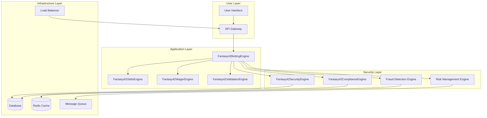

# 🔒 Fantasy42 Betting Engine Security

**Enterprise Security & Compliance | Gambling Platform Security | Version
1.0.0**

---

## 📋 **Table of Contents**

- [Overview](#-overview)
- [Security Architecture](#-security-architecture)
- [Threat Model](#-threat-model)
- [Security Controls](#-security-controls)
- [Compliance Standards](#-compliance-standards)
- [Incident Response](#-incident-response)
- [Security Best Practices](#-security-best-practices)
- [Reporting Security Issues](#-reporting-security-issues)

---

## 🎯 **Overview**

The Fantasy42 Betting Engine implements enterprise-grade security measures
designed specifically for the high-stakes environment of online sports betting.
This document outlines our comprehensive security approach, threat model, and
compliance measures.

### **Security Principles**

- **Defense in Depth**: Multiple layers of security controls
- **Zero Trust**: Never trust, always verify
- **Least Privilege**: Minimum required permissions
- **Fail Safe**: Secure defaults and failure modes
- **Audit Everything**: Comprehensive logging and monitoring

### **Compliance Standards**

- **GDPR**: General Data Protection Regulation
- **PCI DSS**: Payment Card Industry Data Security Standard
- **AML**: Anti-Money Laundering regulations
- **KYC**: Know Your Customer requirements
- **Responsible Gambling**: Age verification and self-exclusion

---

## 🏗️ **Security Architecture**

### **Core Security Components**



### **Security Zones**

#### **Public Zone**

- User interfaces and public APIs
- Rate limiting and DDoS protection
- Input validation and sanitization
- Basic authentication checks

#### **Application Zone**

- Core betting engine logic
- Business rule validation
- Session management
- API authentication and authorization

#### **Security Zone**

- Fraud detection and prevention
- Compliance checking and monitoring
- Risk assessment and scoring
- Audit logging and reporting

#### **Data Zone**

- Encrypted database storage
- Secure key management
- Data classification and labeling
- Backup and recovery systems

---

## 🎯 **Threat Model**

### **STRIDE Threat Analysis**

#### **Spoofing (S)**

- **Description**: Unauthorized access by impersonating legitimate users
- **Impact**: High - Financial loss, data breach
- **Mitigation**:
  - Multi-factor authentication (MFA)
  - Device fingerprinting
  - Behavioral pattern analysis
  - IP geolocation verification

#### **Tampering (T)**

- **Description**: Unauthorized modification of bets or odds
- **Impact**: Critical - Financial manipulation
- **Mitigation**:
  - Cryptographic signatures on all transactions
  - Immutable audit trails
  - Real-time integrity checking
  - Database encryption at rest and in transit

#### **Repudiation (R)**

- **Description**: Denial of bet placement or outcome
- **Impact**: High - Dispute resolution issues
- **Mitigation**:
  - Digital signatures on all bets
  - Blockchain-based transaction records
  - Multi-party witness systems
  - Comprehensive audit logging

#### **Information Disclosure (I)**

- **Description**: Unauthorized access to sensitive betting data
- **Impact**: Critical - Privacy violation, regulatory fines
- **Mitigation**:
  - End-to-end encryption
  - Data classification and labeling
  - Access control lists (ACLs)
  - Regular security audits

#### **Denial of Service (D)**

- **Description**: System unavailability during high-traffic events
- **Impact**: High - Lost revenue, user dissatisfaction
- **Mitigation**:
  - Auto-scaling infrastructure
  - Rate limiting and throttling
  - CDN and edge computing
  - Circuit breaker patterns

#### **Elevation of Privilege (E)**

- **Description**: Unauthorized access to administrative functions
- **Impact**: Critical - System compromise
- **Mitigation**:
  - Role-based access control (RBAC)
  - Principle of least privilege
  - Regular privilege audits
  - Just-in-time access provisioning

### **Additional Threats**

#### **Fraud Threats**

- **Bot Attacks**: Automated betting systems
- **Arbitrage**: Exploiting odds differences
- **Money Laundering**: Using betting to launder funds
- **Match Fixing**: Manipulating game outcomes
- **Insider Threats**: Authorized users abusing privileges

#### **Operational Threats**

- **System Failures**: Hardware or software crashes
- **Data Corruption**: Database integrity issues
- **Network Attacks**: Man-in-the-middle, DNS spoofing
- **Supply Chain Attacks**: Third-party dependency compromises

---

## 🔐 **Security Controls**

### **Authentication & Authorization**

#### **Multi-Factor Authentication (MFA)**

```typescript
interface MFAAuthentication {
  primaryAuth: string; // Username/password or biometric
  secondaryAuth: string; // SMS, email, authenticator app
  deviceFingerprint: string; // Device identification
  riskScore: number; // Authentication risk assessment
  sessionToken: string; // JWT with expiration
}
```

#### **Role-Based Access Control (RBAC)**

```typescript
enum UserRole {
  GUEST = 'guest', // Public access
  USER = 'user', // Registered user
  PREMIUM = 'premium', // Premium subscriber
  VIP = 'vip', // High-value customer
  OPERATOR = 'operator', // Betting operator
  ADMIN = 'admin', // System administrator
  AUDITOR = 'auditor', // Compliance auditor
}

interface Permission {
  resource: string; // Resource being accessed
  action: string; // Action being performed
  conditions?: string[]; // Additional conditions
}
```

### **Fraud Detection & Prevention**

#### **Real-time Fraud Scoring**

```typescript
interface FraudScore {
  userId: string;
  sessionId: string;
  score: number; // 0-100 risk score
  factors: FraudFactor[]; // Contributing factors
  confidence: number; // AI confidence level
  timestamp: Date;
}

enum FraudFactor {
  UNUSUAL_AMOUNT = 'unusual_amount',
  RAPID_BETTING = 'rapid_betting',
  LOCATION_CHANGE = 'location_change',
  DEVICE_CHANGE = 'device_change',
  WINNING_STREAK = 'winning_streak',
  PATTERN_ANOMALY = 'pattern_anomaly',
}
```

#### **Behavioral Analysis**

- **Betting Patterns**: Frequency, amounts, types
- **Device Behavior**: Login times, IP addresses, user agents
- **Geographic Patterns**: Location consistency and changes
- **Social Network**: Connections and betting behavior clusters

### **Data Protection**

#### **Encryption Standards**

```typescript
interface EncryptionConfig {
  algorithm: 'AES-256-GCM'; // Symmetric encryption
  keyRotation: '30-days'; // Key rotation policy
  dataAtRest: true; // Database encryption
  dataInTransit: 'TLS-1.3'; // Network encryption
  keyManagement: 'AWS-KMS'; // Key management service
}
```

#### **Data Classification**

```typescript
enum DataSensitivity {
  PUBLIC = 'public', // Public information
  INTERNAL = 'internal', // Internal business data
  CONFIDENTIAL = 'confidential', // Sensitive user data
  RESTRICTED = 'restricted', // Financial data, PII
  SECRET = 'secret', // Encryption keys, credentials
}
```

### **Network Security**

#### **API Security**

```typescript
interface APISecurity {
  rateLimiting: {
    requestsPerMinute: 100;
    burstLimit: 20;
  };
  corsPolicy: {
    allowedOrigins: ['https://fantasy42.com'];
    allowedMethods: ['GET', 'POST', 'PUT', 'DELETE'];
    allowedHeaders: ['Authorization', 'Content-Type'];
  };
  inputValidation: {
    sanitizeInput: true;
    validateSchema: true;
    preventInjection: true;
  };
}
```

#### **WebSocket Security**

```typescript
interface WebSocketSecurity {
  authentication: 'JWT'; // Authentication method
  encryption: 'WSS'; // Secure WebSocket
  originValidation: true; // Origin checking
  messageValidation: true; // Message schema validation
  rateLimiting: true; // Connection rate limiting
}
```

---

## 📋 **Compliance Standards**

### **GDPR Compliance**

#### **Data Subject Rights**

- **Right to Access**: Users can request their betting data
- **Right to Rectification**: Users can correct inaccurate data
- **Right to Erasure**: "Right to be forgotten" implementation
- **Right to Portability**: Data export functionality
- **Right to Object**: Opt-out mechanisms

#### **Data Processing**

```typescript
interface GDPRCompliance {
  lawfulBasis: 'consent' | 'contract' | 'legitimate_interest';
  dataMinimization: true;
  purposeLimitation: true;
  storageLimitation: '7-years'; // Gambling data retention
  integrity: true; // Data accuracy
  confidentiality: true; // Data protection
  accountability: true; // Audit trails
}
```

### **PCI DSS Compliance**

#### **Payment Security**

```typescript
interface PCIDSSCompliance {
  cardholderData: {
    encryption: 'AES-256';
    masking: true; // Mask PAN after 6 months
    tokenization: true; // Replace sensitive data
  };
  networkSecurity: {
    firewall: true;
    intrusionDetection: true;
    vulnerabilityScanning: true;
  };
  accessControl: {
    uniqueIds: true;
    physicalAccess: true;
    remoteAccess: true;
  };
}
```

### **AML/KYC Compliance**

#### **Customer Due Diligence**

```typescript
interface AMLCompliance {
  identityVerification: {
    documentCheck: true;
    biometricCheck: true;
    addressVerification: true;
  };
  riskAssessment: {
    customerRisk: 'LOW' | 'MEDIUM' | 'HIGH';
    transactionRisk: number;
    geographicRisk: 'LOW' | 'MEDIUM' | 'HIGH';
  };
  monitoring: {
    transactionMonitoring: true;
    suspiciousActivityReporting: true;
    enhancedDueDiligence: true;
  };
}
```

---

## 🚨 **Incident Response**

### **Incident Response Plan**

#### **Phase 1: Detection & Assessment (0-15 minutes)**

1. **Alert Trigger**: Automated monitoring detects anomaly
2. **Initial Assessment**: Security team evaluates severity
3. **Stakeholder Notification**: Relevant teams notified
4. **Containment Planning**: Initial containment strategy developed

#### **Phase 2: Containment (15-60 minutes)**

1. **Isolate Affected Systems**: Prevent spread of compromise
2. **Preserve Evidence**: Secure logs and system state
3. **Implement Workarounds**: Maintain business continuity
4. **Communication**: Update stakeholders on progress

#### **Phase 3: Eradication (1-24 hours)**

1. **Root Cause Analysis**: Identify underlying cause
2. **Remove Malicious Elements**: Clean affected systems
3. **Patch Vulnerabilities**: Apply security fixes
4. **Strengthen Defenses**: Implement additional controls

#### **Phase 4: Recovery (1-7 days)**

1. **System Restoration**: Restore from clean backups
2. **Validation Testing**: Verify system integrity
3. **Monitoring**: Enhanced monitoring during recovery
4. **Gradual Rollout**: Phased return to normal operations

#### **Phase 5: Lessons Learned (1-4 weeks)**

1. **Incident Review**: Complete post-mortem analysis
2. **Process Improvements**: Update response procedures
3. **Training Updates**: Enhance team capabilities
4. **Documentation**: Update security documentation

### **Communication Templates**

#### **Customer Communication**

```typescript
interface CustomerCommunication {
  subject: 'Security Incident Update';
  recipients: 'affected_users';
  content: {
    incident: 'Brief description of incident';
    impact: 'What customers experienced';
    actions: 'What we did to resolve';
    prevention: 'Steps to prevent future incidents';
    support: 'How to get help';
  };
  channels: ['email', 'app_notification', 'website_banner'];
}
```

#### **Regulatory Reporting**

```typescript
interface RegulatoryReport {
  authority: 'FINRA' | 'SEC' | 'State_Gambling_Commission';
  incidentType: 'data_breach' | 'fraud' | 'system_failure';
  severity: 'low' | 'medium' | 'high' | 'critical';
  timeline: {
    detection: Date;
    containment: Date;
    resolution: Date;
  };
  impact: {
    affectedUsers: number;
    financialLoss: number;
    dataCompromised: string[];
  };
}
```

---

## 🛡️ **Security Best Practices**

### **Development Security**

#### **Code Review Requirements**

- **Security Review**: All code changes reviewed by security team
- **Automated Scanning**: SAST and DAST for every PR
- **Dependency Checks**: Vulnerability scanning for all dependencies
- **Secret Detection**: Automated detection of hardcoded secrets

#### **Secure Coding Standards**

```typescript
// ✅ Secure Examples
const userInput = sanitizeInput(req.body.username);
const query = sql`SELECT * FROM users WHERE id = ${userId}`;
const token = crypto.randomBytes(32).toString('hex');

// ❌ Insecure Examples
// const userInput = req.body.username; // XSS vulnerability
// const query = `SELECT * FROM users WHERE id = ${userId}`; // SQL injection
// const token = 'hardcoded-secret'; // Security vulnerability
```

### **Infrastructure Security**

#### **Container Security**

```dockerfile
# ✅ Secure Dockerfile
FROM node:18-alpine
RUN apk add --no-cache dumb-init
RUN addgroup -g 1001 -S nodejs && adduser -S nodejs -u 1001
WORKDIR /app
COPY --chown=nodejs:nodejs package*.json ./
RUN npm ci --only=production && npm cache clean --force
COPY --chown=nodejs:nodejs . .
USER nodejs
EXPOSE 3000
ENTRYPOINT ["dumb-init", "--"]
CMD ["node", "server.js"]
```

#### **Network Security**

```typescript
// ✅ Secure API Configuration
const helmet = require('helmet');
const rateLimit = require('express-rate-limit');

app.use(
  helmet({
    contentSecurityPolicy: {
      directives: {
        defaultSrc: ["'self'"],
        styleSrc: ["'self'", "'unsafe-inline'"],
        scriptSrc: ["'self'"],
        imgSrc: ["'self'", 'data:', 'https:'],
      },
    },
  })
);

const limiter = rateLimit({
  windowMs: 15 * 60 * 1000, // 15 minutes
  max: 100, // limit each IP to 100 requests per windowMs
  message: 'Too many requests from this IP, please try again later.',
});
app.use('/api/', limiter);
```

### **Data Security**

#### **Database Security**

```sql
-- ✅ Secure Database Configuration
-- Enable encryption at rest
ALTER DATABASE fantasy42_betting
SET ENCRYPTION ON;

-- Create security policy
CREATE SECURITY POLICY betting_security_policy
ADD FILTER PREDICATE dbo.fn_securitypredicate(user_id)
ON dbo.bets
WITH (STATE = ON);

-- Audit sensitive operations
CREATE SERVER AUDIT betting_audit
TO FILE (FILEPATH = 'D:\Audit\', MAXSIZE = 1GB)
WITH (QUEUE_DELAY = 1000);
```

#### **Key Management**

```typescript
// ✅ Secure Key Management
import { KMSClient, EncryptCommand, DecryptCommand } from '@aws-sdk/client-kms';

const kmsClient = new KMSClient({ region: 'us-east-1' });

async function encryptData(data: string, keyId: string): Promise<string> {
  const command = new EncryptCommand({
    KeyId: keyId,
    Plaintext: Buffer.from(data, 'utf-8'),
  });

  const response = await kmsClient.send(command);
  return response.CiphertextBlob?.toString('base64') || '';
}

async function decryptData(
  encryptedData: string,
  keyId: string
): Promise<string> {
  const command = new DecryptCommand({
    KeyId: keyId,
    CiphertextBlob: Buffer.from(encryptedData, 'base64'),
  });

  const response = await kmsClient.send(command);
  return response.Plaintext?.toString('utf-8') || '';
}
```

---

## 📞 **Reporting Security Issues**

### **Responsible Disclosure**

We take security seriously and appreciate the assistance of security researchers
in keeping Fantasy42 and our users safe. If you discover a security
vulnerability, please help us by reporting it responsibly.

#### **Reporting Process**

1. **Do Not** publicly disclose the vulnerability
2. **Email** security@fire22.com with details
3. **Include** the following information:
   - Description of the vulnerability
   - Steps to reproduce
   - Potential impact
   - Suggested remediation
   - Your contact information

#### **Our Commitment**

- **Response Time**: Initial response within 24 hours
- **Updates**: Regular updates on progress
- **Credit**: Recognition for valid reports (with permission)
- **Bounty**: Financial rewards for critical vulnerabilities
- **No Retaliation**: No legal action against good-faith reports

### **Security Vulnerability Classes**

| Severity     | Description                      | Response Time | Bounty Range     |
| ------------ | -------------------------------- | ------------- | ---------------- |
| **Critical** | System compromise, data breach   | 24 hours      | $5,000 - $25,000 |
| **High**     | Significant financial impact     | 72 hours      | $2,500 - $10,000 |
| **Medium**   | Limited impact, proof of concept | 1 week        | $500 - $2,500    |
| **Low**      | Minor issues, no real impact     | 2 weeks       | $0 - $500        |

### **Contact Information**

- **Security Team**: security@fire22.com
- **PGP Key**: Available at https://fire22.com/security/pgp
- **Response SLA**: 24 hours for critical issues
- **Updates**: Weekly progress reports during active investigations

---

## 🔄 **Security Updates & Maintenance**

### **Regular Security Activities**

#### **Weekly**

- Security patch deployment
- Vulnerability scanning
- Log analysis and review
- Access control audits

#### **Monthly**

- Security assessment and testing
- Compliance audit preparation
- Third-party risk assessment
- Security metrics reporting

#### **Quarterly**

- Penetration testing
- Security architecture review
- Incident response testing
- Regulatory compliance audit

#### **Annually**

- Comprehensive security assessment
- Business continuity testing
- Disaster recovery validation
- Security awareness training

### **Security Metrics**

#### **Key Performance Indicators**

- **Mean Time to Detect (MTTD)**: < 24 hours
- **Mean Time to Respond (MTTR)**: < 4 hours
- **Security Incident Rate**: < 0.1 per month
- **Compliance Audit Score**: > 95%
- **Vulnerability Remediation Time**: < 72 hours

#### **Reporting Dashboard**

```typescript
interface SecurityDashboard {
  incidents: {
    total: number;
    bySeverity: Record<string, number>;
    responseTime: number;
    resolutionRate: number;
  };
  vulnerabilities: {
    critical: number;
    high: number;
    medium: number;
    low: number;
    remediationRate: number;
  };
  compliance: {
    gdpr: number; // Compliance percentage
    pci: number; // Compliance percentage
    aml: number; // Compliance percentage
    lastAudit: Date;
  };
  threats: {
    blocked: number;
    detected: number;
    falsePositives: number;
    accuracy: number;
  };
}
```

---

## 📚 **Additional Resources**

### **Security Documentation**

- [OWASP Top 10](https://owasp.org/www-project-top-ten/)
- [NIST Cybersecurity Framework](https://www.nist.gov/cyberframework)
- [ISO 27001 Information Security](https://www.iso.org/isoiec-27001-information-security.html)
- [PCI DSS Standards](https://www.pcisecuritystandards.org/)

### **Compliance Resources**

- [GDPR Official Text](https://gdpr-info.eu/)
- [PCI DSS Guidelines](https://www.pcisecuritystandards.org/pci_security/)
- [FATF AML Standards](https://www.fatf-gafi.org/publications/fatfrecommendations/)

### **Security Tools**

- [OWASP ZAP](https://www.owasp.org/index.php/OWASP_Zed_Attack_Proxy_Project)
- [Burp Suite](https://portswigger.net/burp)
- [Metasploit](https://www.metasploit.com/)
- [Wireshark](https://www.wireshark.org/)

---

**🔒 Security is our highest priority. Fantasy42 maintains enterprise-grade
security standards to protect our users and their data.**

_Last Updated: January 2025 | Version 1.0.0 | Enterprise Security_
