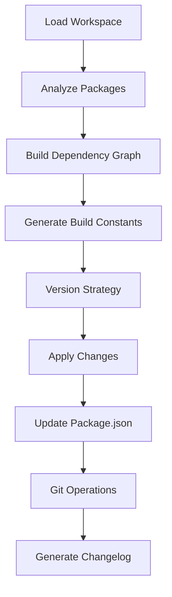

# 🏷️ Metadata Version Manager

<div align="center">

**Standalone Version Management for Bun/TypeScript Projects**

[](https://bun.sh)
[](https://www.typescriptlang.org/)
[]()

_Semantic versioning with dependency awareness and automated changelog
generation_

</div>

---

## 📋 Table of Contents

- [🎯 Overview](#-overview)
- [🚀 Quick Start](#-quick-start)
- [📦 Installation](#-installation)
- [🛠️ Usage](#️-usage)
- [🏗️ Architecture](#️-architecture)
- [📊 Features](#-features)
- [🔧 Configuration](#-configuration)
- [📚 API Reference](#-api-reference)
- [🎪 Examples](#-examples)

---

## 🎯 Overview

The **Metadata Version Manager** is a powerful standalone tool for managing
versions across Bun/TypeScript monorepos with:

- **🏷️ Semantic Versioning**: Intelligent version bumping based on changes
- **📊 Dependency Awareness**: Understands package relationships and build order
- **📋 Automated Changelog**: Generates comprehensive changelogs from metadata
- **🏗️ Build Integration**: Seamless integration with build systems
- **🔄 Git Operations**: Automated commit, tag, and push operations

### **🎪 Key Benefits**

- **🔍 Intelligent Versioning**: Auto-determines version bumps based on change
  types
- **📦 Monorepo Support**: Handles complex package relationships
- **📈 Build Optimization**: Builds packages in correct dependency order
- **📝 Rich Metadata**: Leverages package metadata for enhanced functionality
- **🚀 CI/CD Ready**: Perfect for automated deployment pipelines

---

## 🚀 Quick Start

### **1. Basic Usage**

```bash
# Load workspace metadata
bun run version:manager load

# Bump patch version
bun run version:manager bump patch

# Generate changelog
bun run version:manager changelog

# Build all packages
bun run version:manager build
```

### **2. Advanced Usage**

```bash
# Bump minor version with commit and tag
bun run version:manager bump minor "add new features" --commit --tag

# Build in production mode with verbose output
bun run version:manager build production --verbose --update-constants

# Generate version report
bun run version:manager report
```

---

## 📦 Installation

### **As Part of Crystal Clear Architecture**

The Metadata Version Manager is included in the Crystal Clear Architecture
project:

```bash
git clone https://github.com/your-org/crystal-clear-architecture.git
cd crystal-clear-architecture
bun install
```

### **As Standalone Module**

You can also use it as a standalone module:

```javascript
import { MetadataVersionManager } from './scripts/metadata-version-manager';

// Create instance
const versionManager = new MetadataVersionManager();

// Load workspace
await versionManager.loadWorkspaceMetadata();

// Use API
const changes = await versionManager.bumpVersions({ type: 'minor' });
```

---

## 🛠️ Usage

### **Command Line Interface**

```bash
# Load workspace metadata
bun run version:manager load

# Bump versions
bun run version:manager bump <type> [reason] [options]

# Build workspace
bun run version:manager build [mode] [options]

# Generate changelog
bun run version:manager changelog

# Generate report
bun run version:manager report
```

### **Available Commands**

| Command        | Description             | Options                                    |
| -------------- | ----------------------- | ------------------------------------------ |
| `load`         | Load workspace metadata | -                                          |
| `bump <type>`  | Bump versions           | `--commit`, `--tag`, `--push`, `--verbose` |
| `build [mode]` | Build workspace         | `--update-constants`, `--verbose`          |
| `changelog`    | Generate changelog      | -                                          |
| `report`       | Generate version report | -                                          |

### **Version Types**

- **`patch`**: Bug fixes and minor changes (1.0.0 → 1.0.1)
- **`minor`**: New features, backwards compatible (1.0.0 → 1.1.0)
- **`major`**: Breaking changes (1.0.0 → 2.0.0)
- **`prerelease`**: Pre-release versions (1.0.0 → 1.0.1-alpha.1)
- **`auto`**: Automatically determine based on changes

---

## 🏗️ Architecture

### **Core Components**

```text
MetadataVersionManager
├── 📊 Workspace Analysis
│   ├── Package Metadata Loading
│   ├── Dependency Graph Building
│   └── Build Order Calculation
├── 🏷️ Version Management
│   ├── Semantic Version Bumping
│   ├── Cross-Package Coordination
│   └── Version Strategy Application
├── 📋 Changelog Generation
│   ├── Metadata-Driven Content
│   ├── Git Integration
│   └── Markdown Formatting
└── 🚀 Build Integration
    ├── Dependency-Aware Building
    ├── Build Constants Generation
    └── Error Handling & Reporting
```

### **Data Flow**



---

## 📊 Features

### **🏷️ Intelligent Versioning**

```javascript
// Auto-determine version bump based on changes
const strategy = {
  type: 'auto',
  breakingChanges: ['API breaking change'],
  features: ['New feature X', 'New feature Y'],
  fixes: ['Bug fix Z'],
};

// Automatically bumps to major version (2.0.0)
const changes = await versionManager.bumpVersions(strategy);
```

### **📦 Monorepo Support**

```javascript
// Handle complex package relationships
const workspace = await versionManager.loadWorkspaceMetadata();

// Build packages in correct dependency order
const result = await versionManager.buildWorkspaceWithVersions({
  packages: ['core', 'api', 'ui'], // Will build in dependency order
  mode: 'production',
  updateConstants: true,
});
```

### **📋 Rich Changelog Generation**

```javascript
// Generate comprehensive changelog
const changelog = await versionManager.generateChangelog();

// Includes:
// - Version changes
// - Package responsibilities
// - Component metadata
// - Git information
// - Build system details
```

### **🚀 Build Integration**

```javascript
// Build with version awareness
const buildResult = await versionManager.buildWorkspaceWithVersions({
  mode: 'production',
  updateConstants: true, // Updates build constants with versions
  verbose: true,
});

console.log(`Built ${buildResult.built}/${buildResult.totalPackages} packages`);
```

---

## 🔧 Configuration

### **Package Metadata Structure**

```json
{
  "name": "@fire22/dashboard",
  "version": "1.0.0",
  "metadata": {
    "component": "Dashboard",
    "responsibilities": [
      "User interface",
      "Real-time data display",
      "Interactive widgets"
    ],
    "testing": {
      "unit": "jest",
      "integration": "cypress"
    }
  },
  "dependencies": {
    "@fire22/core": "^1.0.0"
  }
}
```

### **Workspace Structure**

```text
workspace/
├── package.json          # Root package
├── packages/             # Monorepo packages
│   ├── core/
│   │   └── package.json
│   ├── dashboard/
│   │   └── package.json
│   └── api/
│       └── package.json
└── scripts/
    └── metadata-version-manager.ts
```

### **Build Constants**

The version manager generates build constants automatically:

```javascript
// build-constants.json
{
  "WORKSPACE_VERSION": "1.2.3",
  "PACKAGE_VERSIONS": {
    "CORE_VERSION": "1.0.0",
    "DASHBOARD_VERSION": "1.1.0",
    "API_VERSION": "1.2.0"
  },
  "WORKSPACE_COMPONENTS": [...],
  "DEPENDENCY_GRAPH": {...},
  "BUILD_METADATA": {...}
}
```

---

## 📚 API Reference

### **MetadataVersionManager Class**

#### **Constructor**

```javascript
new MetadataVersionManager(rootPath?: string)
```

#### **Methods**

##### **`loadWorkspaceMetadata()`**

Loads and analyzes all package metadata in the workspace.

```javascript
const workspace = await versionManager.loadWorkspaceMetadata();
// Returns: WorkspaceVersionInfo
```

##### **`bumpVersions(strategy, options)`**

Bumps versions across the workspace using the specified strategy.

```javascript
const changes = await versionManager.bumpVersions(
  {
    type: 'minor',
    reason: 'Add new features',
    packages: ['dashboard', 'api'], // Optional: specific packages
  },
  {
    commit: true,
    tag: true,
    push: false,
    verbose: true,
  }
);
// Returns: Map<string, string> of changes
```

##### **`buildWorkspaceWithVersions(options)`**

Builds all packages in the workspace with version integration.

```javascript
const result = await versionManager.buildWorkspaceWithVersions({
  packages: ['core', 'api', 'ui'],
  mode: 'production',
  updateConstants: true,
  verbose: true,
});
// Returns: BuildResult
```

##### **`generateChangelog(since?)`**

Generates a comprehensive changelog from workspace metadata.

```javascript
const changelog = await versionManager.generateChangelog();
// Returns: string (markdown)
```

##### **`generateVersionReport()`**

Generates a detailed version status report.

```javascript
const report = versionManager.generateVersionReport();
// Returns: string (markdown)
```

### **Type Definitions**

```typescript
interface PackageMetadata {
  name: string;
  version: string;
  description?: string;
  metadata?: {
    component?: string;
    responsibilities?: string[];
    testing?: Record<string, string>;
    benchmarks?: Record<string, string>;
    integration?: Record<string, string>;
    [key: string]: any;
  };
  config?: Record<string, any>;
  dependencies?: Record<string, string>;
  devDependencies?: Record<string, string>;
  scripts?: Record<string, string>;
}

interface VersionStrategy {
  type: 'major' | 'minor' | 'patch' | 'prerelease' | 'auto';
  packages?: string[];
  reason?: string;
  breakingChanges?: string[];
  features?: string[];
  fixes?: string[];
}

interface WorkspaceVersionInfo {
  rootVersion: string;
  packages: Map<string, PackageMetadata>;
  dependencyGraph: Map<string, string[]>;
  lastUpdate: Date;
  buildConstants: Record<string, any>;
}
```

---

## 🎪 Examples

### **1. Complete Version Release Workflow**

```javascript
import { MetadataVersionManager } from './scripts/metadata-version-manager';

async function releaseWorkflow() {
  const versionManager = new MetadataVersionManager();

  // Load workspace
  console.log('🔍 Loading workspace...');
  await versionManager.loadWorkspaceMetadata();

  // Generate changelog
  console.log('📋 Generating changelog...');
  const changelog = await versionManager.generateChangelog();
  console.log(changelog);

  // Bump version
  console.log('🏷️ Bumping version...');
  const changes = await versionManager.bumpVersions(
    {
      type: 'minor',
      reason: 'Release new features',
      features: ['Real-time dashboard updates', 'Enhanced API endpoints'],
    },
    {
      commit: true,
      tag: true,
      push: true,
      verbose: true,
    }
  );

  // Build with new versions
  console.log('🏗️ Building with new versions...');
  const buildResult = await versionManager.buildWorkspaceWithVersions({
    mode: 'production',
    updateConstants: true,
    verbose: true,
  });

  // Generate final report
  console.log('📊 Final Report:');
  console.log(versionManager.generateVersionReport());

  console.log('🎉 Release workflow complete!');
}
```

### **2. CI/CD Pipeline Integration**

```javascript
// .github/workflows/release.yml
import { MetadataVersionManager } from './scripts/metadata-version-manager';

async function ciRelease() {
  const versionManager = new MetadataVersionManager();

  // Load and analyze
  await versionManager.loadWorkspaceMetadata();

  // Determine version bump from PR labels or commits
  const strategy = determineVersionStrategy();

  // Apply version changes
  const changes = await versionManager.bumpVersions(strategy, {
    commit: true,
    tag: true,
    push: false, // Let CI handle push
  });

  // Build and test
  const buildResult = await versionManager.buildWorkspaceWithVersions({
    mode: 'production',
    updateConstants: true,
  });

  // Generate artifacts
  const changelog = await versionManager.generateChangelog();
  const report = versionManager.generateVersionReport();

  // CI will handle deployment
  return { changes, buildResult, changelog, report };
}

function determineVersionStrategy() {
  // Analyze commits/PRs to determine version bump
  const hasBreaking = checkForBreakingChanges();
  const hasFeatures = checkForNewFeatures();

  return {
    type: hasBreaking ? 'major' : hasFeatures ? 'minor' : 'patch',
    breakingChanges: hasBreaking ? ['Breaking API changes'] : [],
    features: hasFeatures ? ['New features added'] : [],
  };
}
```

### **3. Development Workflow**

```javascript
// Daily development script
async function devWorkflow() {
  const versionManager = new MetadataVersionManager();

  // Quick workspace check
  await versionManager.loadWorkspaceMetadata();

  // Show current status
  console.log(versionManager.generateVersionReport());

  // Build development version
  await versionManager.buildWorkspaceWithVersions({
    mode: 'development',
    updateConstants: false,
    verbose: true
  });
}

// Version bump script
async function bumpVersion(type: string, reason: string) {
  const versionManager = new MetadataVersionManager();

  await versionManager.loadWorkspaceMetadata();

  const changes = await versionManager.bumpVersions({
    type: type as any,
    reason
  }, {
    commit: true,
    verbose: true
  });

  console.log('Version changes:');
  for (const [pkg, change] of changes) {
    console.log(`  ${pkg}: ${change}`);
  }
}
```

---

## 📈 Advanced Usage

### **Custom Version Strategies**

```javascript
// Custom versioning logic
class CustomVersionStrategy {
  static determineStrategy(commits: string[], prLabels: string[]): VersionStrategy {
    const hasBreaking = commits.some(c => c.includes('BREAKING CHANGE'));
    const hasFeatures = prLabels.includes('enhancement') || commits.some(c => c.startsWith('feat:'));
    const hasFixes = prLabels.includes('bug') || commits.some(c => c.startsWith('fix:'));

    return {
      type: hasBreaking ? 'major' : hasFeatures ? 'minor' : hasFixes ? 'patch' : 'auto',
      breakingChanges: hasBreaking ? ['Breaking changes detected'] : [],
      features: hasFeatures ? ['New features added'] : [],
      fixes: hasFixes ? ['Bug fixes applied'] : [],
      reason: this.generateReason(commits, prLabels)
    };
  }

  private static generateReason(commits: string[], prLabels: string[]): string {
    const reasons = [];

    if (prLabels.includes('enhancement')) reasons.push('feature enhancements');
    if (prLabels.includes('bug')) reasons.push('bug fixes');
    if (prLabels.includes('documentation')) reasons.push('documentation updates');
    if (prLabels.includes('performance')) reasons.push('performance improvements');

    return reasons.length > 0 ? reasons.join(', ') : 'general improvements';
  }
}
```

### **Monorepo Package Filtering**

```javascript
// Filter packages by type or scope
class PackageFilter {
  static byType(packages: Map<string, PackageMetadata>, type: 'core' | 'ui' | 'api'): string[] {
    return Array.from(packages.keys()).filter(name => {
      const pkg = packages.get(name);
      return pkg?.metadata?.component?.toLowerCase().includes(type);
    });
  }

  static byScope(packages: Map<string, PackageMetadata>, scope: string): string[] {
    return Array.from(packages.keys()).filter(name => name.startsWith(`@${scope}/`));
  }

  static byResponsibility(packages: Map<string, PackageMetadata>, responsibility: string): string[] {
    return Array.from(packages.keys()).filter(name => {
      const pkg = packages.get(name);
      return pkg?.metadata?.responsibilities?.some(r =>
        r.toLowerCase().includes(responsibility.toLowerCase())
      );
    });
  }
}

// Usage
const uiPackages = PackageFilter.byType(workspace.packages, 'ui');
const fire22Packages = PackageFilter.byScope(workspace.packages, 'fire22');
const dataPackages = PackageFilter.byResponsibility(workspace.packages, 'data');
```

### **Build Pipeline Integration**

```javascript
// Advanced build pipeline
class BuildPipeline {
  constructor(private versionManager: MetadataVersionManager) {}

  async runFullPipeline(options: {
    versionType?: VersionStrategy['type'];
    buildMode?: 'development' | 'production';
    includeTests?: boolean;
    deploy?: boolean;
  }) {
    console.log('🚀 Starting full build pipeline...');

    // 1. Load workspace
    await this.versionManager.loadWorkspaceMetadata();

    // 2. Version bump (if specified)
    if (options.versionType) {
      await this.versionManager.bumpVersions({
        type: options.versionType,
        reason: 'Automated pipeline release'
      }, {
        commit: true,
        tag: true,
        push: false
      });
    }

    // 3. Build packages
    const buildResult = await this.versionManager.buildWorkspaceWithVersions({
      mode: options.buildMode || 'production',
      updateConstants: true,
      verbose: true
    });

    // 4. Run tests (if enabled)
    if (options.includeTests) {
      await this.runTests();
    }

    // 5. Generate artifacts
    const changelog = await this.versionManager.generateChangelog();
    const report = this.versionManager.generateVersionReport();

    // 6. Deploy (if enabled)
    if (options.deploy && buildResult.failed === 0) {
      await this.deploy(buildResult);
    }

    return {
      buildResult,
      changelog,
      report,
      success: buildResult.failed === 0
    };
  }

  private async runTests() {
    console.log('🧪 Running test suite...');
    // Implement test running logic
  }

  private async deploy(buildResult: any) {
    console.log('🚀 Deploying to production...');
    // Implement deployment logic
  }
}
```

---

## 🔍 Troubleshooting

### **Common Issues**

#### **"Package not found" errors**

```bash
# Check if packages directory exists
ls -la packages/

# Verify package.json files exist
find packages/ -name "package.json" | head -10
```

#### **Build order issues**

```javascript
// Check dependency graph
const workspace = await versionManager.loadWorkspaceMetadata();
console.log('Dependency Graph:', workspace.dependencyGraph);

// Manually specify build order if needed
await versionManager.buildWorkspaceWithVersions({
  packages: ['core', 'shared', 'api', 'ui'], // Explicit order
});
```

#### **Git operation failures**

```bash
# Check git status
git status

# Ensure you're on a branch with push permissions
git branch -a
git remote -v
```

#### **Version conflicts**

```javascript
// Check current versions
const workspace = await versionManager.loadWorkspaceMetadata();
console.log(versionManager.generateVersionReport());

// Reset versions if needed
await versionManager.bumpVersions({ type: 'patch' }, { commit: false });
```

### **Debug Mode**

```bash
# Enable verbose logging
bun run version:manager bump patch --verbose

# Debug build process
bun run version:manager build development --verbose

# Check git operations
bun run version:manager bump minor --commit --verbose
```

---

## 📈 Performance Optimization

### **Large Monorepo Handling**

```javascript
// Optimize for large workspaces
class OptimizedVersionManager extends MetadataVersionManager {
  private cache = new Map();

  async loadWorkspaceMetadata() {
    const cacheKey = 'workspace-metadata';
    const cached = this.cache.get(cacheKey);

    if (cached && Date.now() - cached.timestamp < 300000) { // 5 min cache
      return cached.data;
    }

    const data = await super.loadWorkspaceMetadata();
    this.cache.set(cacheKey, { data, timestamp: Date.now() });
    return data;
  }
}
```

### **Parallel Processing**

```javascript
// Parallel package building
async function buildPackagesParallel(packages: string[], options: any) {
  const chunks = chunkArray(packages, 4); // 4 parallel builds
  const results = [];

  for (const chunk of chunks) {
    const promises = chunk.map(pkg =>
      versionManager.buildPackage(pkg, options)
    );
    results.push(...await Promise.all(promises));
  }

  return results;
}

function chunkArray<T>(array: T[], size: number): T[][] {
  const chunks = [];
  for (let i = 0; i < array.length; i += size) {
    chunks.push(array.slice(i, i + size));
  }
  return chunks;
}
```

---

## 🤝 Integration Examples

### **GitHub Actions Integration**

```yaml
# .github/workflows/version-bump.yml
name: Version Bump
on:
  pull_request:
    types: [closed]
    branches: [main]

jobs:
  version-bump:
    if: github.event.pull_request.merged == true
    runs-on: ubuntu-latest
    steps:
      - uses: actions/checkout@v3
      - uses: oven-sh/setup-bun@v1

      - name: Load workspace
        run: bun run version:manager load

      - name: Determine version bump
        id: version
        run: |
          if [[ "${{ github.event.pull_request.labels }}" == *"major"* ]]; then
            echo "type=major" >> $GITHUB_OUTPUT
          elif [[ "${{ github.event.pull_request.labels }}" == *"minor"* ]]; then
            echo "type=minor" >> $GITHUB_OUTPUT
          else
            echo "type=patch" >> $GITHUB_OUTPUT
          fi

      - name: Bump version
        run:
          bun run version:manager bump ${{ steps.version.outputs.type }}
          --commit --tag --push

      - name: Generate changelog
        run: bun run version:manager changelog > CHANGELOG.md

      - name: Create release
        uses: actions/create-release@v1
        env:
          GITHUB_TOKEN: ${{ secrets.GITHUB_TOKEN }}
        with:
          tag_name: v${{ steps.version.outputs.version }}
          release_name: Release v${{ steps.version.outputs.version }}
          body_path: CHANGELOG.md
```

### **Docker Integration**

```dockerfile
# Dockerfile
FROM oven/bun:latest

# Copy workspace
COPY . /app
WORKDIR /app

# Install dependencies
RUN bun install

# Load workspace metadata
RUN bun run version:manager load

# Build with versions
RUN bun run version:manager build production --update-constants

# Generate build info
RUN bun run version:manager report > /app/BUILD_INFO.md

# Expose port
EXPOSE 3000

# Start application
CMD ["bun", "run", "start"]
```

### **NPM Scripts Integration**

```json
{
  "scripts": {
    "version:load": "bun run version:manager load",
    "version:bump": "bun run version:manager bump",
    "version:build": "bun run version:manager build",
    "version:release": "bun run version:manager bump minor --commit --tag --push",
    "version:changelog": "bun run version:manager changelog",
    "version:report": "bun run version:manager report",
    "preversion": "bun run version:manager load",
    "postversion": "bun run version:manager build production --update-constants"
  }
}
```

---

## 📞 Support & Contributing

### **🐛 Issues & Bug Reports**

- **GitHub Issues**: Use the issue tracker for bugs and feature requests
- **Include Context**: Always include workspace size, Bun version, and error
  logs
- **Reproduction Steps**: Provide clear steps to reproduce issues
- **Environment Info**: Include OS, Node version, and package manager

### **💡 Feature Requests**

- **Use Cases**: Describe your use case and business value
- **API Design**: Suggest API changes with examples
- **Integration**: How it integrates with existing workflows
- **Alternatives**: Considered alternatives and trade-offs

### **🔧 Contributing**

1. **Fork the repository**
2. **Create a feature branch**: `git checkout -b feature/your-feature`
3. **Write tests** for new functionality
4. **Update documentation** for API changes
5. **Follow the existing patterns** and code style
6. **Submit a pull request** with a clear description

### **📚 Documentation Updates**

- Update this README for new features
- Add examples for common use cases
- Document breaking changes clearly
- Include troubleshooting sections

---

## 📜 License

This Metadata Version Manager is part of the Crystal Clear Architecture project
and is licensed under the MIT License. See the main project LICENSE file for
details.

---

## 🙏 Acknowledgments

- **Bun Team** for the amazing runtime and tooling
- **Crystal Clear Architecture Contributors** for the vision and implementation
- **Open Source Community** for inspiration and best practices

---

<div align="center">

**🏷️ Metadata Version Manager - Intelligent Versioning for Modern Monorepos**

_Built with ❤️ using TypeScript, Bun, and Domain-Driven Design_

---

**🚀 Ready to streamline your versioning workflow?**

1. **Clone the repository**
2. **Run `bun run version:manager load`**
3. **Start versioning with `bun run version:manager bump`**

**Happy versioning! 🎉**

</div>
