# 🏛️ Fantasy42-Fire22 Enterprise Registry Release Playbook

**Generated:** 2025-08-30T15:31:29.475Z
**Version:** 5.1.0
**Framework:** Department-Driven Release Validation

## 📊 Registry Release Compliance Overview

**Enterprise Compliance Score:** 95% (Department Validation Enabled)
**Automated Validation:** ✅ Active
**Department Oversight:** ✅ All Departments Engaged
**Semver Enforcement:** ✅ Strict Mode
**Intelligent Tagging:** ✅ Automated

## 🎯 Registry Release Workflow Architecture

### Phase 1: Pre-Release Validation

```mermaid
graph TD
    A[🚀 Release Initiation] --> B[🔍 Environment Check]
    B --> C[📦 Bun Semver Validation]
    C --> D[🏛️ Department Validation]
    D --> E[✅ Validation Complete]
```


### Phase 2: Build & Tag

```mermaid
graph TD
    F[🏗️ Package Build] --> G[🏷️ Intelligent Tagging]
    G --> H[📝 Changelog Generation]
    H --> I[🔄 Git Operations]
```


### Phase 3: Distribution & Compliance

```mermaid
graph TD
    J[📤 NPM Publishing] --> K[🏛️ Department Compliance Check]
    K --> L[🐙 GitHub Release]
    L --> M[📊 Analytics Update]
```


## 📋 Department Validation Matrix

### 🏛️ Department Responsibilities & Validation Gates

| Department | Primary Head | Validation Scope | Critical Gates | Compliance Framework |
|------------|--------------|------------------|----------------|---------------------|
| **Security & Compliance** | Lisa Anderson | SOC2, GDPR, PCI-DSS, HIPAA | Security Audit, Compliance Check | Enterprise Security |
| **Technology** | David Kim | Performance, Scalability, Architecture | Tech Review, Performance Tests | Technical Excellence |
| **Design** | Isabella Martinez | WCAG AA/AAA, Accessibility, UX | Design Audit, Accessibility Check | User Experience |
| **Product Management** | Samantha Rivera | Feature Validation, Requirements | Product Review, Acceptance Tests | Product Quality |
| **Operations** | Robert Garcia | Deployment, Monitoring, Reliability | Ops Review, Infrastructure Check | Operational Excellence |
| **Finance** | Sarah Thompson | Cost Analysis, Budget Compliance | Financial Review, ROI Validation | Fiscal Responsibility |
| **Management** | John Smith | Strategic Alignment, Risk Assessment | Executive Review, Strategic Fit | Enterprise Governance |
| **Marketing** | Amanda Foster | Brand Compliance, Documentation | Marketing Review, Brand Alignment | Brand Consistency |
| **Team Contributors** | Alex Chen | Code Quality, Testing, Documentation | Code Review, Test Coverage | Development Standards |
| **Onboarding** | Natasha Cooper | Process Compliance, Training | Process Review, Documentation | Operational Continuity |

## 🔧 Automated Validation Systems

### 1. Bun Semver Validation Engine
```typescript
// Automated semver compliance checking
interface SemverValidation {
  strict: boolean;
  bunVersion: '>=1.1.0';
  requireChangelog: true;
  enforcePreRelease: true;
}
```

**Validation Rules:**
- ✅ Semantic versioning compliance
- ✅ Bun runtime compatibility
- ✅ Changelog requirements
- ✅ Pre-release tagging enforcement

### 2. Department-Specific Validation Framework

#### Security & Compliance Validation
```typescript
const securityValidation = {
  primary: 'Security & Compliance',
  head: 'Lisa Anderson',
  validators: ['Mark Thompson', 'David Kim'],
  compliance: ['SOC2', 'GDPR', 'PCI_DSS', 'HIPAA'],
  checks: [
    'vulnerability-scanning',
    'audit-log-validation',
    'compliance-certification',
    'security-policy-adherence'
  ]
};
```

#### Technology Validation
```typescript
const technologyValidation = {
  primary: 'Technology',
  head: 'David Kim',
  validators: ['Sarah Johnson', 'Robert Garcia'],
  compliance: ['PERFORMANCE', 'SECURITY', 'SCALABILITY'],
  checks: [
    'performance-benchmarks',
    'architecture-review',
    'scalability-testing',
    'security-integration'
  ]
};
```

#### Design Validation
```typescript
const designValidation = {
  primary: 'Design',
  head: 'Isabella Martinez',
  validators: ['Ethan Cooper', 'Samantha Rivera'],
  compliance: ['WCAG_AA', 'ACCESSIBILITY', 'BRAND'],
  checks: [
    'accessibility-audit',
    'design-system-compliance',
    'user-experience-validation',
    'brand-consistency-check'
  ]
};
```

## 🏷️ Intelligent Tagging System

### Automated Tag Generation
```typescript
const intelligentTagging = {
  autoTag: true,
  tagPrefix: 'v',
  releaseBranches: ['main', 'release'],
  preReleaseTags: ['alpha', 'beta', 'rc'],
  tagFormat: 'v{version}-{timestamp}',
  annotated: true
};
```

### Tag Classification Matrix

| Tag Type | Format | Branch | Validation Required | Distribution |
|----------|--------|--------|-------------------|--------------|
| **Release** | `v1.2.3` | `main` | Full Department Validation | NPM + GitHub |
| **Pre-Release** | `v1.2.3-beta.1` | `release/*` | Core Validation Only | NPM Beta |
| **Hotfix** | `v1.2.4-hotfix.1` | `hotfix/*` | Security + Critical Only | Emergency Release |
| **Development** | `v1.3.0-dev.20241219` | `develop` | Basic Checks Only | Internal Only |

## 📦 Package Validation Workflow

### Pre-Publish Validation Sequence

1. **Environment Validation**
   ```bash
   ✅ Git repository check
   ✅ NPM authentication
   ✅ GitHub CLI availability
   ✅ Required tools verification
   ```

2. **Bun Semver Compliance**
   ```bash
   📦 Version format validation
   🔍 Bun compatibility check
   📝 Changelog verification
   🏷️ Pre-release tag enforcement
   ```

3. **Department Validation Gates**
   ```bash
   🛡️ Security & Compliance (Lisa Anderson)
   ⚡ Technology (David Kim)
   🎨 Design (Isabella Martinez)
   📊 Product Management (Samantha Rivera)
   🔧 Operations (Robert Garcia)
   💰 Finance (Sarah Thompson)
   👔 Management (John Smith)
   📢 Marketing (Amanda Foster)
   👥 Team Contributors (Alex Chen)
   📚 Onboarding (Natasha Cooper)
   ```

4. **Build & Package Validation**
   ```bash
   🏗️ Cross-platform build verification
   📦 Package integrity checks
   🔐 Security scanning
   📊 Performance benchmarking
   ```

## 🚀 Release Execution Flow

### Automated Release Pipeline

```yaml
name: Enterprise Registry Release
on:
  push:
    branches: [main, release/*]
  pull_request:
    branches: [main]

jobs:
  validate:
    runs-on: ubuntu-latest
    steps:
      - uses: actions/checkout@v3
      - uses: oven-sh/setup-bun@v1
        with:
          bun-version: latest

      - name: Environment Validation
        run: bun run scripts/publish-registry.bun.ts --validate-only

      - name: Bun Semver Check
        run: bun run scripts/publish-registry.bun.ts --semver-check

      - name: Department Validation
        run: bun run scripts/publish-registry.bun.ts --department-validation

  release:
    needs: validate
    runs-on: ubuntu-latest
    steps:
      - name: Build & Tag
        run: bun run scripts/publish-registry.bun.ts --build

      - name: Publish to NPM
        run: bun run scripts/publish-registry.bun.ts --publish
        env:
          NPM_TOKEN: ${{ secrets.NPM_TOKEN }}

      - name: Create GitHub Release
        run: bun run scripts/publish-registry.bun.ts --github-release
        env:
          GITHUB_TOKEN: ${{ secrets.GITHUB_TOKEN }}
```

## 📊 Compliance Scoring System

### Department Compliance Metrics

| Department | Weight | Critical Gates | Success Criteria |
|------------|--------|----------------|------------------|
| Security & Compliance | 25% | 4 | 100% pass rate |
| Technology | 20% | 3 | 95% pass rate |
| Design | 15% | 2 | 90% pass rate |
| Product Management | 15% | 2 | 90% pass rate |
| Operations | 10% | 2 | 85% pass rate |
| Finance | 5% | 1 | 80% pass rate |
| Management | 5% | 1 | 80% pass rate |
| Marketing | 3% | 1 | 75% pass rate |
| Team Contributors | 1% | 1 | 70% pass rate |
| Onboarding | 1% | 1 | 70% pass rate |

### Overall Compliance Calculation

```
Total Score = Σ(Department Score × Weight)
Critical Threshold = 85%
Blocking Threshold = 70%
```

## 🔄 Continuous Improvement Framework

### Monthly Compliance Reviews

1. **Performance Analysis**
   - Validation success rates
   - Time to complete validations
   - False positive/negative rates
   - Department feedback collection

2. **Process Optimization**
   - Automated validation improvements
   - Department workflow streamlining
   - Tool and script enhancements
   - Documentation updates

3. **Training & Development**
   - Department head training sessions
   - New validator onboarding
   - Process documentation updates
   - Best practices sharing

## 📋 Emergency Release Procedures

### Critical Hotfix Process

1. **Emergency Declaration**
   - Executive approval required
   - Security assessment mandatory
   - Impact analysis completed

2. **Accelerated Validation**
   - Core validation only (Security + Technology)
   - Parallel processing enabled
   - 4-hour SLA for completion

3. **Hotfix Tagging**
   ```bash
   # Format: v{major}.{minor}.{patch}-hotfix.{number}
   git tag v1.2.4-hotfix.1
   ```

## 📈 Success Metrics & KPIs

### Release Quality Metrics
- **On-Time Delivery**: 95% of releases on schedule
- **Validation Success Rate**: 98% first-time pass rate
- **Security Compliance**: 100% security validation
- **Performance Standards**: 95% performance benchmarks met

### Department Performance Metrics
- **Validation Completion**: Average < 2 hours per department
- **Feedback Response**: < 24 hours average response time
- **Training Completion**: 100% department heads trained
- **Process Adherence**: 95% compliance with procedures

## 🎯 Implementation Roadmap

### Phase 1: Foundation (Current)
- ✅ Department validation framework
- ✅ Automated semver checking
- ✅ Intelligent tagging system
- ✅ Basic compliance scoring

### Phase 2: Enhancement (Next Sprint)
- 🔄 Advanced analytics dashboard
- 🔄 AI-powered validation suggestions
- 🔄 Automated remediation workflows
- 🔄 Enhanced compliance reporting

### Phase 3: Optimization (Next Quarter)
- 📊 Predictive validation timing
- 📊 Machine learning-based risk assessment
- 📊 Automated process optimization
- 📊 Advanced compliance forecasting

## 📞 Support & Escalation

### Primary Contacts

| Role | Contact | Availability | Response SLA |
|------|---------|--------------|--------------|
| **Release Coordinator** | @nolarose1968-pixel | 24/7 | 15 minutes |
| **Security Lead** | Lisa Anderson | Business Hours | 1 hour |
| **Technical Lead** | David Kim | 24/7 | 30 minutes |
| **Design Lead** | Isabella Martinez | Business Hours | 2 hours |
| **Product Lead** | Samantha Rivera | Business Hours | 2 hours |

### Escalation Matrix

1. **Level 1**: Department Head Resolution (4 hours)
2. **Level 2**: Cross-Department Review (24 hours)
3. **Level 3**: Executive Escalation (48 hours)
4. **Level 4**: Emergency Release Process (Critical Only)

## 📚 Documentation & Training

### Required Documentation
- Department validation procedures
- Emergency release protocols
- Compliance scoring methodology
- Tool and script documentation

### Training Requirements
- Department head validation training
- New team member onboarding
- Process improvement workshops
- Quarterly compliance reviews

---

## 🎉 Enterprise Registry Release Playbook v5.1.0

**This playbook establishes the comprehensive framework for enterprise-grade package releases with full department validation, automated compliance checking, and intelligent release management.**

**🏛️ Department-Driven • 🔒 Security-First • ⚡ Performance-Optimized • 📊 Analytics-Enabled**

---

*Last Updated: 2025-08-30 | Framework: Crystal Clear Architecture | Compliance: SOC2/GDPR/PCI-DSS*

