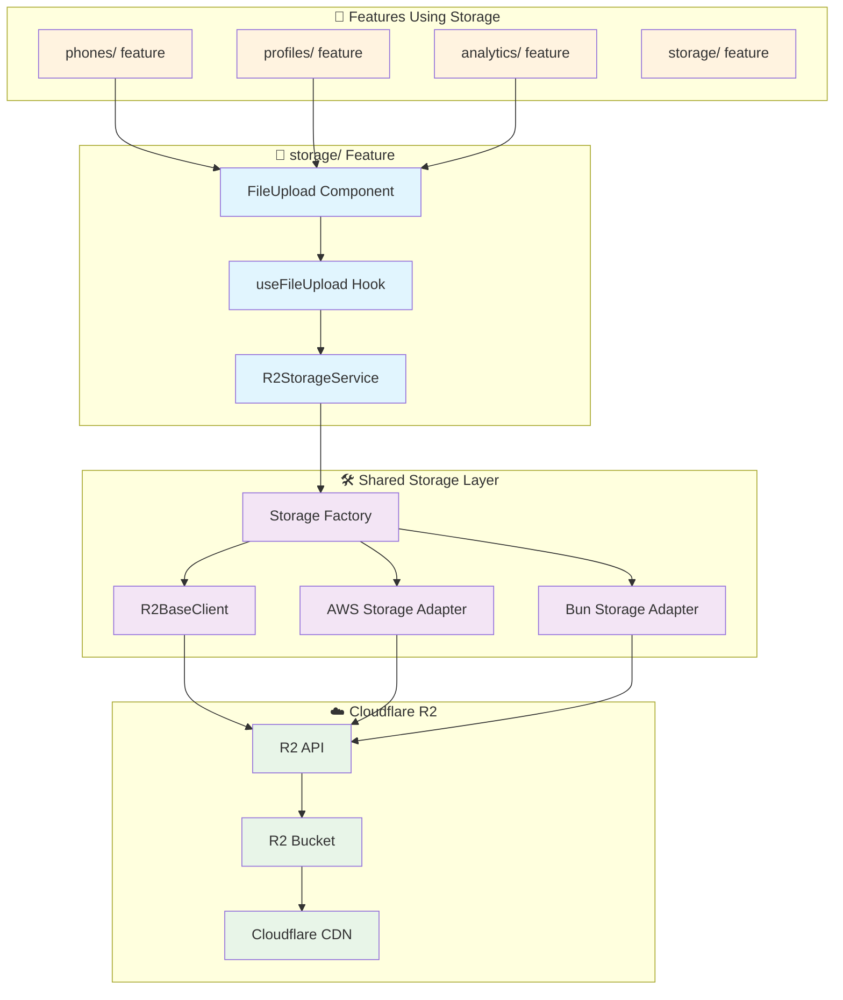

# R2 Storage Integration in Refactored Architecture

## 🔗 **Current R2 Storage Connections**

### **Current Implementation:**

```text
📁 Current R2 Integration:
├── 📄 utils/r2/base.ts (8.1)           ← Base R2 client
├── 📄 utils/r2/aws-client.ts (8.2)     ← AWS SDK implementation
├── 📄 utils/r2/bun-client.ts (8.3)     ← Bun native implementation
├── 📄 components/BunFileUpload.tsx (4.1) ← Uses Bun client
├── 📄 components/FileUpload.tsx (4.2)    ← Uses AWS client
└── 📄 utils/constants/r2.ts (11.2)      ← R2 configuration
```

### **Current Connection Points:**

```typescript
// Current scattered usage:
// 4.1 BunFileUpload → 8.3 BunClient → 8.1 R2BaseClient → Cloudflare R2
// 4.2 FileUpload   → 8.2 AWSClient  → 8.1 R2BaseClient → Cloudflare R2
// Multiple pages directly import file upload components
```

---

## 🏗️ **Refactored R2 Storage Architecture**

### **New Feature-Based Organization:**

```text
📁 Refactored R2 Integration:
├── 📁 features/storage/                    🆕
│   ├── 📁 components/
│   │   ├── FileUpload.tsx                 ← Unified file upload
│   │   ├── FileList.tsx                   ← File management UI
│   │   ├── StorageStatus.tsx              ← Storage status display
│   │   └── index.ts
│   ├── 📁 hooks/
│   │   ├── useFileUpload.ts               ← Upload logic
│   │   ├── useFileManagement.ts           ← CRUD operations
│   │   ├── useStorageQuota.ts             ← Quota tracking
│   │   └── index.ts
│   ├── 📁 services/
│   │   ├── r2StorageService.ts            ← Main storage service
│   │   ├── fileManager.ts                 ← File operations
│   │   └── index.ts
│   ├── 📁 types/
│   │   ├── storage.ts                     ← Storage types
│   │   └── index.ts
│   └── 📄 index.ts                        ← Clean exports
│
├── 📁 shared/services/                    🆕
│   ├── r2BaseClient.ts                    ← Extracted from 8.1
│   ├── awsStorageAdapter.ts               ← Extracted from 8.2
│   ├── bunStorageAdapter.ts               ← Extracted from 8.3
│   └── storageFactory.ts                 ← Adapter factory
│
└── 📁 shared/types/                       🆕
    ├── storage.ts                         ← Common storage types
    └── adapters.ts                        ← Adapter interfaces
```

---

## 🔄 **R2 Storage Flow Diagram**



---

## 🎯 **Detailed R2 Integration Points**

### **1. Storage Feature (New Central Hub)**

```typescript
// features/storage/index.ts
export { FileUpload } from "./components/FileUpload";
export { FileList } from "./components/FileList";
export { useFileUpload } from "./hooks/useFileUpload";
export { useFileManagement } from "./hooks/useFileManagement";
export { R2StorageService } from "./services/r2StorageService";
export type { StorageConfig, FileMetadata } from "./types/storage";

// Usage in other features:
import { FileUpload, useFileUpload } from "../features/storage";
```

### **2. Shared Storage Adapters**

```typescript
// shared/services/storageFactory.ts
export class StorageFactory {
  static create(type: "aws" | "bun", config: StorageConfig) {
    switch (type) {
      case "aws":
        return new AWSStorageAdapter(config);
      case "bun":
        return new BunStorageAdapter(config);
      default:
        throw new Error(`Unsupported storage type: ${type}`);
    }
  }
}

// shared/services/r2BaseClient.ts
export abstract class R2BaseClient {
  abstract upload(file: File, options?: UploadOptions): Promise<string>;
  abstract download(key: string): Promise<Blob>;
  abstract list(prefix?: string): Promise<FileMetadata[]>;
  abstract delete(key: string): Promise<void>;
}
```

### **3. Feature Integration Examples**

```typescript
// features/phones/components/PhoneControl.tsx
import { FileUpload, useFileUpload } from '../storage';

export function PhoneControl() {
  const { uploadFile, uploading, progress } = useFileUpload({
    storageType: 'bun', // or 'aws'
    path: 'phones/'
  });

  return (
    <div>
      <FileUpload
        onUpload={uploadFile}
        accept=".apk,.txt"
        maxSize={10 * 1024 * 1024} // 10MB
      />
      {uploading && <ProgressBar progress={progress} />}
    </div>
  );
}
```

---

## 📊 **R2 Storage Connection Matrix**

| Feature        | Storage Component | Hook              | Service          | Adapter    | Use Case           |
| -------------- | ----------------- | ----------------- | ---------------- | ---------- | ------------------ |
| **phones/**    | FileUpload        | useFileUpload     | R2StorageService | BunAdapter | APK uploads, logs  |
| **profiles/**  | FileUpload        | useFileUpload     | R2StorageService | AWSAdapter | Config exports     |
| **analytics/** | FileList          | useFileManagement | R2StorageService | AWSAdapter | Report downloads   |
| **storage/**   | All               | All               | R2StorageService | Both       | Storage management |

---

## 🔄 **Migration Path for R2 Storage**

### **Phase 1: Extract Shared Layer**

```typescript
// Move from utils/r2/ to shared/services/
8.1 R2BaseClient     → shared/services/r2BaseClient.ts
8.2 AWSClient       → shared/services/awsStorageAdapter.ts
8.3 BunClient       → shared/services/bunStorageAdapter.ts
11.2 R2_CONFIG      → shared/types/storage.ts
```

### **Phase 2: Create Storage Feature**

```typescript
// Create new features/storage/ directory
// Extract and enhance file upload logic
// Create unified storage service
```

### **Phase 3: Update Features**

```typescript
// Update phone feature to use storage feature
// Update profile feature to use storage feature
// Remove old scattered imports
```

---

## 🎯 **Benefits of Refactored R2 Integration**

### **Current Issues:**

❌ Duplicate upload logic (4.1 vs 4.2)  
❌ Scattered R2 clients (8.1, 8.2, 8.3)  
❌ Tight coupling to specific implementations  
❌ No unified storage interface

### **Refactored Benefits:**

✅ **Centralized storage logic** in features/storage/  
✅ **Adapter pattern** for multiple storage backends  
✅ **Reusable hooks** for common storage operations  
✅ **Type-safe interfaces** for all storage operations  
✅ **Easy testing** with mock adapters  
✅ **Flexible configuration** per feature

---

## 📁 **Final Directory Structure**

```text
packages/dashboard/src/
├── features/
│   ├── phones/
│   │   └── components/PhoneControl.tsx    ← Uses storage feature
│   ├── profiles/
│   │   └── components/ProfileExport.tsx   ← Uses storage feature
│   ├── storage/                          🆕
│   │   ├── components/FileUpload.tsx
│   │   ├── hooks/useFileUpload.ts
│   │   ├── services/r2StorageService.ts
│   │   └── types/storage.ts
│   └── analytics/
│       └── components/ReportDownload.tsx ← Uses storage feature
│
├── shared/
│   ├── services/
│   │   ├── r2BaseClient.ts               🔄 Extracted from 8.1
│   │   ├── awsStorageAdapter.ts          🔄 Extracted from 8.2
│   │   ├── bunStorageAdapter.ts          🔄 Extracted from 8.3
│   │   └── storageFactory.ts             🆕
│   └── types/
│       └── storage.ts                    🆕
│
└── pages/
    ├── PhonesPage.tsx                     ← Simplified
    ├── ProfilesPage.tsx                   ← Simplified
    └── AnalyticsPage.tsx                  ← Simplified
```

The R2 storage becomes a **first-class feature** with clean interfaces, reusable components, and proper separation of concerns, while maintaining all existing functionality and adding flexibility for future storage needs.
