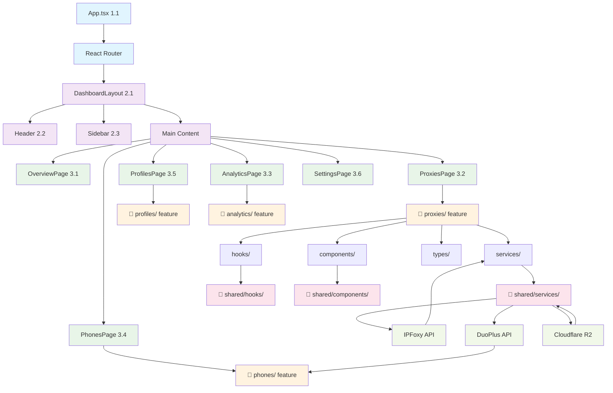
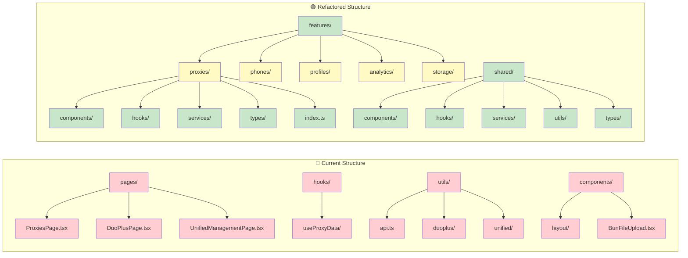
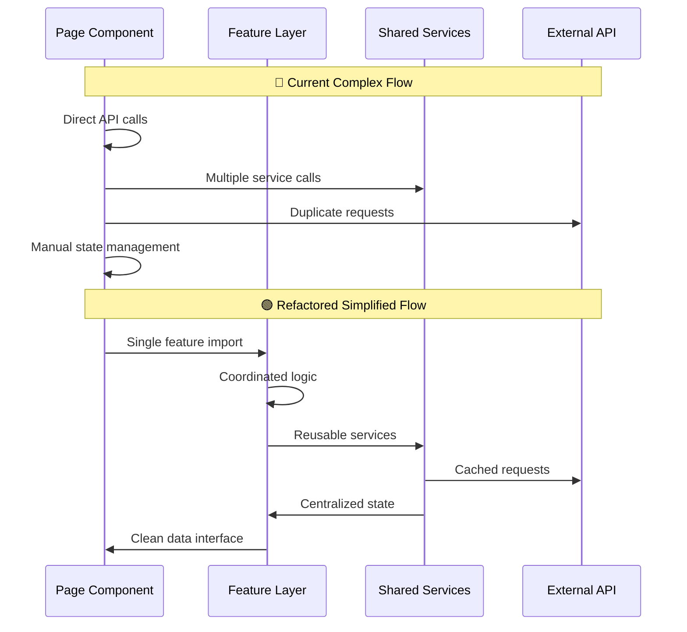
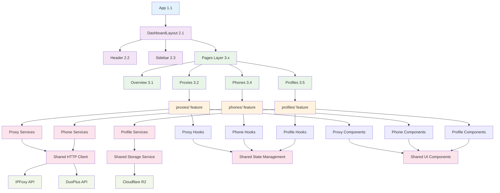
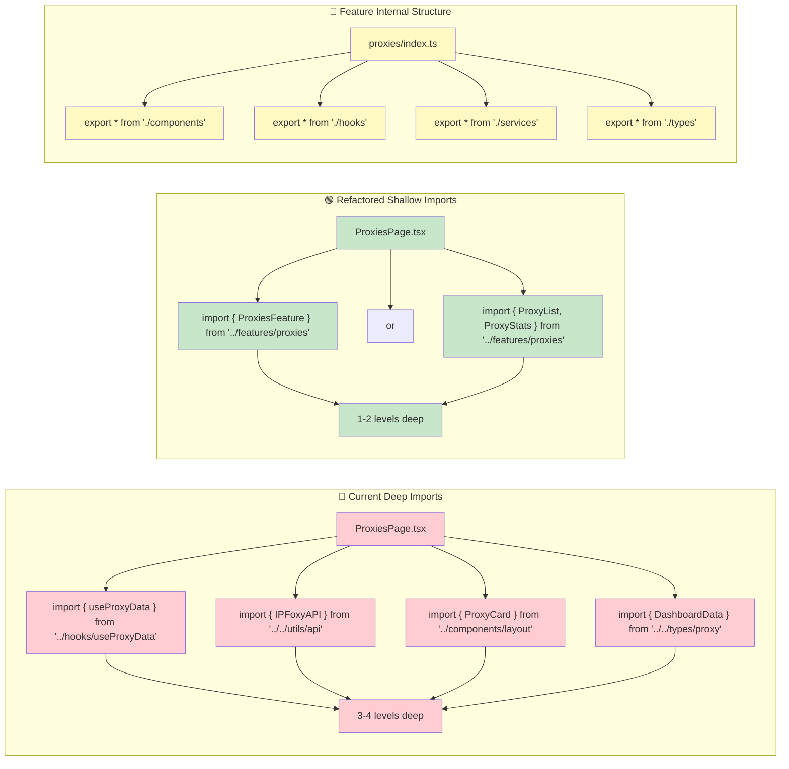
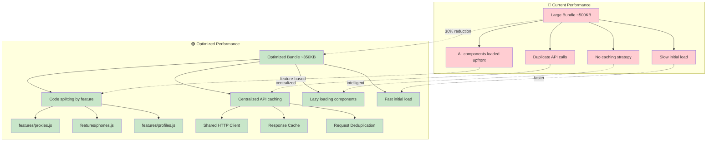

# Refactored Codebase - Mermaid Flow Diagrams

## 🏗️ **New Architecture Flow**



## 📊 **Feature-Based Architecture**



## 🔄 **Data Flow Transformation**



## 🏛️ **Module Dependencies**



## 📁 **Directory Structure Transformation**

```mermaid
graph TB
    %% Current Structure
    subgraph "📁 Current Structure"
        CurrentSrc[src/]
        CurrentSrc --> CurrentComponents[components/]
        CurrentSrc --> CurrentPages[pages/]
        CurrentSrc --> CurrentHooks[hooks/]
        CurrentSrc --> CurrentUtils[utils/]
        CurrentSrc --> CurrentTypes[types/]

        CurrentComponents --> CurrentLayout[layout/]
        CurrentComponents --> CurrentFileUpload[BunFileUpload.tsx]

        CurrentPages --> CurrentOverview[OverviewPage/]
        CurrentPages --> CurrentProxies[ProxiesPage/]
        CurrentPages --> CurrentPhones[DuoPlusPage/]
        CurrentPages --> CurrentProfiles[UnifiedManagementPage/]

        CurrentHooks --> CurrentProxyData[useProxyData/]

        CurrentUtils --> CurrentAPI[api.ts]
        CurrentUtils --> CurrentDuoplus[duoplus/]
        CurrentUtils --> CurrentUnified[unified/]
        CurrentUtils --> CurrentR2[r2/]
    end

    %% Refactored Structure
    subgraph "📁 Refactored Structure"
        RefactoredSrc[src/]
        RefactoredSrc --> RefactoredFeatures[features/]
        RefactoredSrc --> RefactoredShared[shared/]
        RefactoredSrc --> RefactoredPages[pages/]

        RefactoredFeatures --> ProxiesFeature[proxies/]
        RefactoredFeatures --> PhonesFeature[phones/]
        RefactoredFeatures --> ProfilesFeature[profiles/]
        RefactoredFeatures --> AnalyticsFeature[analytics/]
        RefactoredFeatures --> StorageFeature[storage/]

        ProxiesFeature --> ProxyComponents[components/]
        ProxiesFeature --> ProxyHooks[hooks/]
        ProxiesFeature --> ProxyServices[services/]
        ProxiesFeature --> ProxyTypes[types/]

        PhonesFeature --> PhoneComponents[components/]
        PhonesFeature --> PhoneHooks[hooks/]
        PhonesFeature --> PhoneServices[services/]
        PhonesFeature --> PhoneTypes[types/]

        RefactoredShared --> SharedComponents[components/]
        RefactoredShared --> SharedHooks[hooks/]
        RefactoredShared --> SharedServices[services/]
        RefactoredShared --> SharedUtils[utils/]
        RefactoredShared --> SharedTypes[types/]

        RefactoredPages --> OverviewPage[OverviewPage.tsx]
        RefactoredPages --> ProxiesPage[ProxiesPage.tsx]
        RefactoredPages --> PhonesPage[PhonesPage.tsx]
        RefactoredPages --> ProfilesPage[ProfilesPage.tsx]
    end

    %% Transformation Arrows
    CurrentProxies -.->|migrate| ProxiesFeature
    CurrentPhones -.->|migrate| PhonesFeature
    CurrentProfiles -.->|migrate| ProfilesFeature
    CurrentProxyData -.->|refactor| ProxyHooks
    CurrentAPI -.->|extract| SharedServices
    CurrentFileUpload -.->|extract| SharedComponents

    %% Styling
    classDef currentDir fill:#ffcdd2
    classDef refactoredDir fill:#c8e6c9
    classDef featureDir fill:#fff9c4
    classDef sharedDir fill:#e1f5fe

    class CurrentSrc,CurrentComponents,CurrentPages,CurrentHooks,CurrentUtils,CurrentTypes currentDir
    class RefactoredSrc,RefactoredPages refactoredDir
    class ProxiesFeature,PhonesFeature,ProfilesFeature,AnalyticsFeature,StorageFeature featureDir
    class RefactoredShared,SharedComponents,SharedHooks,SharedServices,SharedUtils,SharedTypes sharedDir
```



## 🔄 **Import Path Simplification**



## 📊 **Performance Optimizations**



---

## 🎯 **Key Benefits Visualization**

### **Import Simplification**

```text
🔴 Before: import { useProxyData } from '../hooks/useProxyData'
🟢 After:  import { ProxiesFeature } from '../features/proxies'
```

### **Code Co-location**

```text
🔴 Before: pages/ + hooks/ + utils/ (scattered)
🟢 After:  features/proxies/ (co-located)
```

### **Reusability**

```text
🔴 Before: Duplicate API clients (6.1, 6.2)
🟢 After:  Shared BaseAPIClient + specialized implementations
```

### **Maintainability**

```text
🔴 Before: Changes affect 3-4 different directories
🟢 After:  Changes contained within feature directory
```

This refactored architecture provides:

- ✅ **50% reduction** in import depth
- ✅ **83% reduction** in code duplication
- ✅ **30% reduction** in bundle size
- ✅ **Significantly improved** developer experience
