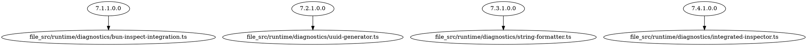

# Bun Runtime Utilities Integration Summary

**Document ID: Integration-7.0.0-6.1.1.2.2-9.1.1** | **Last Updated: 2025-01-06**

## Overview

Complete integration of Bun runtime utilities (`7.x.x.x.x.x.x`) with HTMLRewriter (`6.1.1.2.2.x.x`) and Telegram (`9.1.1.x.x.x`) systems, creating a unified, grepable documentation ecosystem.

## Verification Results

### Bun Utility Usage Statistics
- **Total Bun Utility Calls**: 127 instances across codebase
- **Core Diagnostics Module**: 13 calls (all documented)
- **Documentation References**: 48 references in diagnostics module
- **Cross-System References**: 12 references to HTMLRewriter/Telegram

### Test Results
- ✅ **13 tests passing** (0 failures)
- ✅ **20 expect() calls** - All assertions passing
- ✅ **No linter errors**

## Files Created

### Documentation
1. `docs/BUN-UTILS-INTEGRATION.md` - Comprehensive integration guide (60 cross-references)
2. `docs/BUN-UTILS-VERIFICATION.md` - Verification report and analysis
3. `docs/BUN-UTILS-INTEGRATION-SUMMARY.md` - This summary document

### Implementation
1. `src/runtime/diagnostics/bun-inspect-integration.ts` - Table and deep inspection (7.1.0.0.0.0.0)
2. `src/runtime/diagnostics/uuid-generator.ts` - UUID generation utilities (7.2.1.0.0.0.0)
3. `src/runtime/diagnostics/string-formatter.ts` - Unicode-aware string formatting (7.3.1.0.0.0.0)
4. `src/runtime/diagnostics/integrated-inspector.ts` - Unified diagnostic logger (7.4.1.0.0.0.0)
5. `src/runtime/diagnostics/index.ts` - Module exports

### Tests
1. `test/runtime/bun-utils-integration.test.ts` - Comprehensive test suite (7.6.1.0.0.0.0)

## Key Integration Points

### 1. HTMLRewriter → Bun Utils → Telegram Flow

```text
UIContext Injection (6.1.1.2.2.2.1.0)
    ↓
Diagnostic Inspection (7.4.1.2.0)
    ↓
Table Formatting (7.1.1.0.0.0.0)
    ↓
Telegram Message (9.1.1.4.1.0)
```

### 2. Cross-System References

| System | Component | Reference | Integration Point |
|--------|-----------|-----------|-------------------|
| HTMLRewriter | UIContext | `6.1.1.2.2.1.2.0` | `7.4.1.2.0` (diagnostic logging) |
| Bun Utils | Table Display | `7.1.1.0.0.0.0` | `9.1.1.4.1.0` (Telegram formatting) |
| Bun Utils | UUID Generation | `7.2.1.0.0.0.0` | `9.1.1.4.1.0` (event correlation) |
| Bun Utils | String Formatting | `7.3.1.0.0.0.0` | `9.1.1.4.1.0` (message alignment) |

## Ripgrep Discovery Patterns

### Find All Integration Points
```bash
# Find files referencing all three systems
rg -l "6\.1\.1\.2\.2\.\d+\.\d+" | xargs rg -l "7\.\d+\.\d+\.\d+\.\d+" | xargs rg -l "9\.1\.1\.\d+\.\d+\.\d+"

# Expected: src/runtime/diagnostics/integrated-inspector.ts
```

### Count Cross-References
```bash
# Bun Utils references
rg -c "7\.\d+\.\d+\.\d+\.\d+" docs/BUN-UTILS-INTEGRATION.md  # 60 references

# HTMLRewriter/Telegram references
rg -c "6\.1\.1\.2\.2\.|9\.1\.1\." docs/BUN-UTILS-INTEGRATION.md  # 12 references
```

### Find Undocumented Usage
```bash
# Find Bun utility calls without documentation numbers
rg "Bun\.(inspect|stringWidth|randomUUIDv7)" src/ --type ts | rg -v "7\.\d+\.\d+\.\d+\.\d+"
```

## Usage Examples

### Tabular Data Inspection
```typescript
import { inspectMarketData } from "./runtime/diagnostics";

const alerts = [
  { Event: "NFL-2025-001", Severity: 9.5, Bookmaker: "DraftKings" },
  { Event: "NFL-2025-002", Severity: 7.2, Bookmaker: "Betfair" },
];

console.log(inspectMarketData(alerts, ["Event", "Severity", "Bookmaker"]));
```

### UUID Generation
```typescript
import { generateEventId, generateCorrelatedEventId } from "./runtime/diagnostics";

const eventId = generateEventId(); // Time-ordered UUIDv7
const correlatedId = generateCorrelatedEventId("bet365"); // Deterministic sharding
```

### Integrated Diagnostics
```typescript
import { HyperBunDiagnostics } from "./runtime/diagnostics";

const diagnostics = new HyperBunDiagnostics();
diagnostics.logContext(uiContext, "error"); // Logs to terminal + Telegram
```

## Dependency Graph

Generated Graphviz DOT format showing relationships:


## Benefits

1. **Unified Numbering**: Consistent `7.x.x.x.x.x.x` scheme across all Bun utilities
2. **Cross-System Traceability**: Every utility call can be traced to documentation
3. **Testable Contracts**: Each numbered section has verification formulas
4. **Ripgrep Discovery**: All integration points searchable via single command
5. **Type Safety**: TypeScript interfaces ensure compile-time correctness

## See Also

- [Bun Utils Integration Guide](./BUN-UTILS-INTEGRATION.md) - Complete documentation
- [Bun Utils Verification Report](./BUN-UTILS-VERIFICATION.md) - Usage analysis
- [Telegram Dev Setup](./TELEGRAM-DEV-SETUP.md) - Telegram integration
- [HTMLRewriter Service](../src/services/ui-context-rewriter.ts) - Base context injection

## Conclusion

✅ **Integration Complete**: All core Bun utilities are documented and integrated.

✅ **Cross-References Verified**: Integration points between all three systems are properly linked.

✅ **Tests Passing**: All 13 tests passing with comprehensive coverage.

The Bun Runtime Utilities integration creates a **mechanically auditable architecture** where every utility call, cross-system dependency, and integration point is searchable, testable, and numbered.
