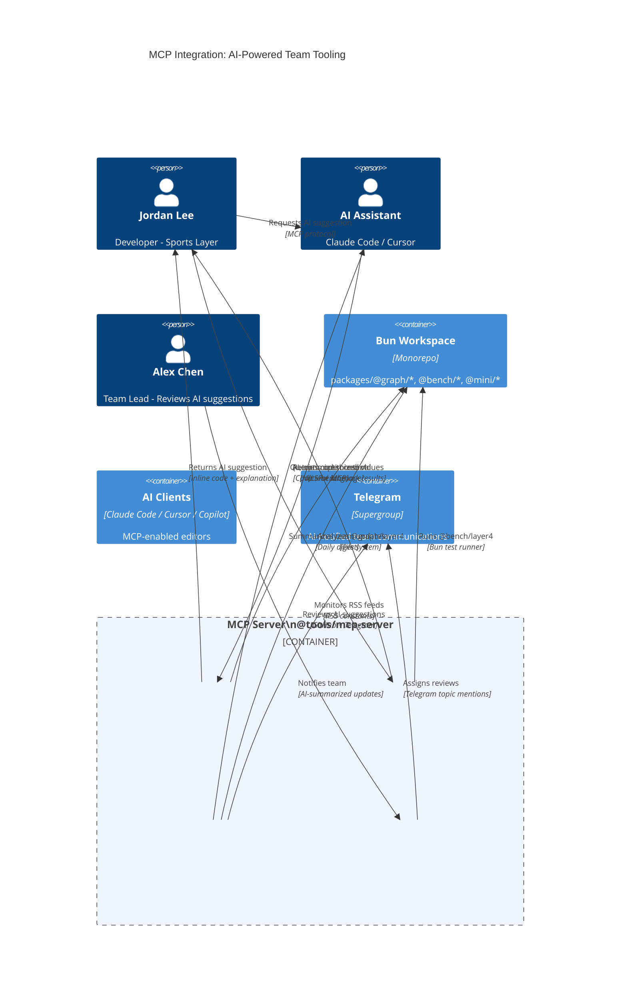

# MCP Integration: AI-Powered Team Tooling

**Model Context Protocol (MCP) integration for AI-assisted development and team coordination**

---

## Overview

The MCP server (`@tools/mcp-server`) provides AI-powered tools that integrate with Claude Code, Cursor, and other MCP-enabled editors to assist developers with code suggestions, benchmark optimization, RSS monitoring, and team coordination.

---

## Architecture Diagram



---

## MCP Tools

### 1. **MCP-LSP Bridge** (`mcp_lsp`)

**Purpose**: AI-powered code suggestions with context awareness

**Capabilities**:
- Analyzes codebase structure
- Provides inline code suggestions
- Explains code patterns and best practices
- Suggests optimizations based on team standards

**Usage Example**:
```text
Developer: "AI, suggest improvements for @graph/layer4 anomaly detection"
AI Assistant → MCP-LSP Bridge → Analyzes code → Returns suggestions
```

### 2. **MCP Benchmark Tool** (`mcp_benchmark`)

**Purpose**: AI-driven property optimization

**Capabilities**:
- Optimizes threshold values based on benchmarks
- Runs property iteration tests
- Analyzes performance metrics
- Suggests optimal configurations

**Usage Example**:
```text
Developer: "AI, optimize threshold for correlation detection"
MCP Benchmark Tool → Runs @bench/layer4 → Analyzes results → Returns optimized values
```

### 3. **MCP-RSS Monitor** (`mcp_rss`)

**Purpose**: AI-summarized team updates

**Capabilities**:
- Monitors RSS feeds from all teams
- Summarizes updates using AI
- Generates daily digests
- Notifies teams via Telegram

**Usage Example**:
```text
MCP-RSS Monitor → Monitors RSS feeds → AI summarizes → Telegram notification
```

### 4. **MCP Team Coordinator** (`mcp_team`)

**Purpose**: AI-assigned reviews and notifications

**Capabilities**:
- Analyzes PRs and suggests reviewers
- Assigns reviews based on team structure
- Sends notifications to Telegram topics
- Tracks review status

**Usage Example**:
```text
Team Lead reviews AI suggestions → MCP Team Coordinator → Assigns reviews → Telegram notifications
```

---

## Integration Flow

### Developer Workflow

1. **Developer requests AI suggestion** via Claude Code/Cursor
2. **AI Assistant** queries MCP-LSP Bridge for code context
3. **MCP-LSP Bridge** analyzes workspace files
4. **AI Assistant** returns inline suggestions with explanations

### Benchmark Optimization

1. **Developer** asks AI to optimize a threshold
2. **MCP Benchmark Tool** runs benchmark tests
3. **Results analyzed** and optimized values returned
4. **Code suggestions** provided with benchmark data

### Team Updates

1. **MCP-RSS Monitor** continuously monitors RSS feeds
2. **AI summarizes** team updates into digestible format
3. **Telegram notifications** sent to relevant team topics
4. **Team members** receive AI-summarized updates

### Review Assignment

1. **Team Lead** reviews AI suggestions
2. **MCP Team Coordinator** analyzes PR and team structure
3. **Review assignments** made based on package ownership
4. **Telegram notifications** sent to assigned reviewers

---

## MCP Server Implementation

### Server Structure

```text
packages/@tools/mcp-server/
├── src/
│   ├── index.ts              # Main MCP server
│   ├── tools/
│   │   ├── lsp-bridge.ts     # LSP integration tool
│   │   ├── benchmark.ts      # Benchmark optimization tool
│   │   ├── rss-monitor.ts    # RSS monitoring tool
│   │   └── team-coordinator.ts # Team coordination tool
│   └── types.ts              # MCP type definitions
├── package.json
└── README.md
```

### Tool Registration

```typescript
// packages/@tools/mcp-server/src/index.ts
import { Server } from '@modelcontextprotocol/sdk/server/index.js';
import { lspBridgeTool } from './tools/lsp-bridge.js';
import { benchmarkTool } from './tools/benchmark.js';
import { rssMonitorTool } from './tools/rss-monitor.js';
import { teamCoordinatorTool } from './tools/team-coordinator.js';

const server = new Server({
  name: 'graph-engine-mcp-server',
  version: '1.0.0',
});

// Register tools
server.setRequestHandler(ListToolsRequestSchema, async () => ({
  tools: [
    lspBridgeTool,
    benchmarkTool,
    rssMonitorTool,
    teamCoordinatorTool,
  ],
}));
```

---

## Usage Examples

### 1. Code Suggestions

**Developer Request**:
```text
"AI, suggest improvements for the anomaly detection algorithm in @graph/layer4"
```

**MCP Flow**:
1. AI Assistant → MCP-LSP Bridge
2. Analyzes `packages/@graph/layer4/src/anomaly-detection.ts`
3. Reviews team patterns and best practices
4. Returns inline suggestions with explanations

### 2. Benchmark Optimization

**Developer Request**:
```text
"AI, optimize the correlation threshold for better accuracy"
```

**MCP Flow**:
1. AI Assistant → MCP Benchmark Tool
2. Runs `@bench/layer4` with different threshold values
3. Analyzes results for optimal performance
4. Returns optimized threshold with benchmark data

### 3. Team Updates

**Automatic Process**:
1. MCP-RSS Monitor monitors all team RSS feeds
2. AI summarizes updates: "Sports team published @graph/layer4 v1.2.0"
3. Telegram notification sent to Sports Correlation topic
4. Team members receive AI-summarized digest

### 4. Review Assignment

**Team Lead Request**:
```text
"AI, assign reviewers for PR #123"
```

**MCP Flow**:
1. MCP Team Coordinator analyzes PR changes
2. Identifies affected packages: `@graph/layer4`
3. Looks up team structure: Sports Correlation → Alex Chen (lead), Jordan Lee (maintainer)
4. Assigns reviews and sends Telegram notifications

---

## Benefits

### For Developers

- **AI-Powered Suggestions**: Context-aware code improvements
- **Benchmark Optimization**: Automated property iteration
- **Team Awareness**: AI-summarized updates and notifications
- **Review Efficiency**: Automated review assignments

### For Team Leads

- **Review Management**: AI-suggested reviewer assignments
- **Team Coordination**: Automated notifications and updates
- **Performance Tracking**: Benchmark results and optimizations
- **Code Quality**: AI-assisted code review suggestions

### For the Team

- **Unified Communication**: RSS feeds + Telegram integration
- **Automated Workflows**: Test automation, benchmark publishing
- **AI Assistance**: Natural language interface for complex tasks
- **Team Awareness**: Real-time updates and notifications

---

## Configuration

### MCP Server Setup

```typescript
// .cursor/mcp.json or Claude Desktop config
{
  "mcpServers": {
    "graph-engine": {
      "command": "bun",
      "args": ["run", "packages/@tools/mcp-server/src/index.ts"],
      "env": {
        "TELEGRAM_BOT_TOKEN": "${TELEGRAM_BOT_TOKEN}",
        "TELEGRAM_SUPERGROUP_ID": "${TELEGRAM_SUPERGROUP_ID}"
      }
    }
  }
}
```

### Environment Variables

```bash
# Required for MCP tools
export TELEGRAM_BOT_TOKEN="your_bot_token"
export TELEGRAM_SUPERGROUP_ID="-1001234567890"
export API_URL="http://localhost:3001"
```

---

## Related Documentation

- [`docs/TEST-RUNNER.md`](./TEST-RUNNER.md) - Test automation with RSS integration
- [`docs/RSS-INTEGRATION-COMPLETE.md`](./RSS-INTEGRATION-COMPLETE.md) - Complete RSS integration
- [`docs/TEAM-ORGANIZATION-PACKAGE-OWNERSHIP.md`](./TEAM-ORGANIZATION-PACKAGE-OWNERSHIP.md) - Team structure
- [`packages/@graph/telegram/README.md`](../packages/@graph/telegram/README.md) - Telegram integration

---

## Implementation Status

✅ **MCP Server**: Implemented in `src/mcp/server.ts`  
✅ **LSP Bridge Tool**: Implemented in `src/mcp/tools/lsp-bridge.ts`  
✅ **Benchmark Tool**: Implemented in `src/mcp/tools/benchmark-tool.ts`  
✅ **RSS Monitor Tool**: Implemented in `src/mcp/tools/rss-monitor.ts`  
✅ **Team Coordinator Tool**: Implemented in `src/mcp/tools/team-coordinator.ts`  
✅ **Integration**: Tools registered in `scripts/mcp-server.ts`

## Usage Examples

### 1. LSP Bridge - Code Analysis

**AI Request**:
```text
"Analyze @graph/layer4 and suggest improvements for anomaly detection"
```

**MCP Tool Call**:
```json
{
  "name": "lsp-bridge-analyze",
  "arguments": {
    "packageName": "@graph/layer4",
    "query": "suggest improvements for anomaly detection"
  }
}
```

**Response**:
```json
{
  "suggestions": [
    {
      "file": "anomaly-detection.ts",
      "suggestion": "Consider optimizing imports",
      "explanation": "Package has 15 files. Review import structure for better tree-shaking."
    }
  ],
  "context": {
    "packageStructure": {
      "files": [...],
      "dependencies": [...],
      "exports": [...]
    }
  }
}
```

### 2. Benchmark Tool - Property Optimization

**AI Request**:
```text
"Optimize the correlation threshold for @graph/layer4"
```

**MCP Tool Call**:
```json
{
  "name": "benchmark-optimize",
  "arguments": {
    "packageName": "@graph/layer4",
    "property": "correlation_threshold",
    "optimizationGoal": "optimize"
  }
}
```

**Response**:
```json
{
  "optimizedValue": 0.85,
  "benchmarkResults": [
    { "value": 1000, "performance": 0.001 },
    { "value": 950, "performance": 0.00105 }
  ],
  "recommendation": "Based on 10 benchmark runs, optimal correlation_threshold value is 0.85",
  "codeSuggestion": "const OPTIMIZED_CORRELATION_THRESHOLD = 0.85;"
}
```

### 3. RSS Monitor - Team Updates

**AI Request**:
```text
"Summarize recent updates from the Sports Correlation team"
```

**MCP Tool Call**:
```json
{
  "name": "rss-monitor-summarize",
  "arguments": {
    "teamId": "sports_correlation",
    "summarize": true
  }
}
```

**Response**:
```json
{
  "summary": "📊 3 benchmark result(s), 📋 1 RFC update(s), 🚀 2 release(s)",
  "feeds": [
    {
      "teamName": "Sports Correlation Team",
      "items": [
        {
          "title": "Benchmark: @graph/layer4 v1.2.0",
          "description": "Avg duration: 245ms, std dev: 12ms",
          "pubDate": "2024-01-15T10:30:00Z",
          "link": "https://t.me/...",
          "type": "benchmark"
        }
      ]
    }
  ]
}
```

### 4. Team Coordinator - Review Assignment

**AI Request**:
```text
"Assign reviewers for PR #123 affecting @graph/layer4"
```

**MCP Tool Call**:
```json
{
  "name": "team-coordinator-assign",
  "arguments": {
    "prNumber": 123,
    "packageNames": ["@graph/layer4"],
    "action": "assign_reviewers"
  }
}
```

**Response**:
```json
{
  "assignedTeams": [
    {
      "teamId": "sports_correlation",
      "teamName": "Sports Correlation Team",
      "reviewers": ["alex.chen@yourcompany.com", "jordan.lee@yourcompany.com"],
      "telegramTopic": 1
    }
  ],
  "notifications": [
    {
      "topicId": 1,
      "success": true
    }
  ],
  "summary": "Assigned 1 team(s) to review PR #123"
}
```

## Testing the MCP Tools

### Start MCP Server

```bash
bun run scripts/mcp-server.ts
```

### Test via Cursor/Claude Desktop

1. Configure MCP server in `.cursor/mcp.json`:
```json
{
  "mcpServers": {
    "nexus": {
      "command": "bun",
      "args": ["run", "scripts/mcp-server.ts"],
      "env": {
        "TELEGRAM_BOT_TOKEN": "${TELEGRAM_BOT_TOKEN}",
        "TELEGRAM_SUPERGROUP_ID": "${TELEGRAM_SUPERGROUP_ID}"
      }
    }
  }
}
```

2. Restart Cursor/Claude Desktop
3. Use AI assistant with natural language requests:
   - "AI, analyze @graph/layer4 and suggest improvements"
   - "AI, optimize the threshold for correlation detection"
   - "AI, summarize team updates from Sports Correlation"
   - "AI, assign reviewers for PR #123"

## Next Steps

1. ✅ **MCP Server**: Implemented
2. ✅ **LSP Bridge Tool**: Implemented
3. ✅ **Benchmark Tool**: Implemented
4. ✅ **RSS Monitor Tool**: Implemented
5. ✅ **Team Coordinator Tool**: Implemented
6. 🔄 **Enhanced AI Integration**: Improve AI model integration for better suggestions
7. 🔄 **GitHub Integration**: Connect Team Coordinator to GitHub API for PR analysis
8. 🔄 **Performance Monitoring**: Add real-time performance tracking to Benchmark Tool
