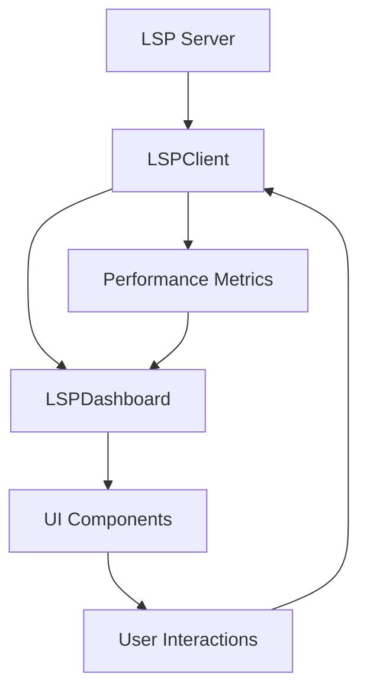

# 🚀 LSP Development Dashboard

A sophisticated real-time Language Server Protocol (LSP) integration
dashboard that provides comprehensive development environment monitoring,
diagnostics, and performance metrics.

---

## ⚡ Quick Start

```typescript
import { LSPDashboard } from './LSPDashboard';
import { LSPClient } from './LSPClient';
import { Dashboard } from './Dashboard';

// Initialize the dashboard
const dashboard = new Dashboard({ title: 'LSP Development Environment' });
const lspClient = new LSPClient({
  serverCommand: ['typescript-language-server'],
  serverArgs: ['--stdio'],
  workspaceFolders: ['/path/to/your/project']
});

const lspDashboard = new LSPDashboard(dashboard, lspClient);

// Initialize and render
await dashboard.initialize('dashboard-root');
await lspDashboard.initialize();

// Set active file
lspDashboard.setActiveFile('src/index.ts');
```

---

## 🎯 Features

### **Real-time Diagnostics**
- ✅ Live error, warning, and info detection
- ✅ Quick fix suggestions with one-click application
- ✅ Diagnostic severity filtering and sorting
- ✅ Source attribution (TypeScript, ESLint, etc.)

### **Performance Monitoring**
- ✅ Response time tracking
- ✅ Memory usage monitoring
- ✅ CPU usage metrics
- ✅ Request/error counting

### **Interactive Editor Integration**
- ✅ Monaco editor placeholder
- ✅ Real-time completion suggestions
- ✅ Document formatting
- ✅ Theme switching (light/dark)

### **Advanced Features**
- ✅ WebSocket-style event updates
- ✅ Configurable LSP server connections
- ✅ Multi-file workspace support
- ✅ Extensible plugin architecture

---

## 🏗️ Architecture

### **Core Components**

```
src/lsp/
├── LSPDashboard.ts      # Main dashboard component
├── LSPClient.ts         # LSP server client
├── Dashboard.ts         # Base dashboard class
├── types.ts             # TypeScript definitions
├── LSPDashboard.module.css  # Styled components
├── demo.html            # Interactive demo
└── README.md            # This documentation
```

### **Data Flow**



---

## 📊 API Reference

### **LSPDashboard Class**

#### Constructor
```typescript
constructor(dashboard: Dashboard, lspClient: LSPClient, theme?: ThemeConfig)
```

#### Public Methods
```typescript
// Initialize the dashboard
async initialize(): Promise<void>

// Set active file for analysis
setActiveFile(filename: string): void

// Get current diagnostics
getDiagnostics(): Diagnostic[]

// Clear all diagnostics
clearDiagnostics(): void

// Update theme
updateTheme(theme: ThemeConfig): void
```

### **LSPClient Class**

#### Client Constructor
```typescript
constructor(config: LSPClientConfig)
```

#### Client Methods
```typescript
// Initialize LSP connection
async initialize(): Promise<void>

// Open file for analysis
openFile(filename: string): void

// Get completion items
async getCompletions(filename: string, position: Position): Promise<CompletionItem[]>

// Apply quick fix
async applyQuickFix(code: string): Promise<void>

// Format document
async formatDocument(filename: string): Promise<void>

// Performance metrics
getAverageResponseTime(): number
getMemoryUsage(): number
getCpuUsage(): number
```

---

## 🎨 Styling & Theming

### **CSS Modules**
The dashboard uses CSS Modules for scoped styling:

```css
/* LSPDashboard.module.css */
.lsp-dashboard {
  /* Main dashboard container */
}

.diagnostic-item {
  /* Individual diagnostic styling */
}

.metric-item {
  /* Performance metric styling */
}
```

### **Theme Configuration**
```typescript
interface ThemeConfig {
  mode: 'light' | 'dark';
  primaryColor: string;
  backgroundColor?: string;
  textColor?: string;
  accentColor?: string;
}
```

### **Dynamic Theming**
```typescript
// Switch to light theme
lspDashboard.updateTheme({
  mode: 'light',
  primaryColor: '#007acc'
});

// Switch to dark theme
lspDashboard.updateTheme({
  mode: 'dark',
  primaryColor: '#007acc'
});
```

---

## 🔧 Configuration

### **LSP Client Configuration**
```typescript
const lspConfig: LSPClientConfig = {
  serverCommand: ['typescript-language-server'],
  serverArgs: ['--stdio'],
  initializationOptions: {
    preferences: {
      includeCompletionsForModuleExports: true,
      includeCompletionsWithInsertText: true
    }
  },
  workspaceFolders: [
    '/path/to/project/src',
    '/path/to/project/lib'
  ]
};
```

### **Dashboard Configuration**
```typescript
const dashboardConfig: DashboardConfig = {
  title: 'My LSP Dashboard',
  width: 1200,
  height: 800,
  theme: 'dark'
};
```

---

## 📈 Performance Monitoring

### **Metrics Tracked**
- **Response Time**: Average LSP request response time
- **Memory Usage**: Current memory consumption
- **CPU Usage**: Processor utilization percentage
- **Request Count**: Total requests made
- **Error Count**: Failed requests tracked

### **Performance Optimization**
```typescript
// Enable performance monitoring
lspClient.on('performance', (metrics) => {
  console.log('LSP Performance:', metrics);

  // Alert on high response times
  if (metrics.responseTime > 100) {
    console.warn('High LSP response time detected');
  }
});
```

---

## 🧪 Testing

### **Unit Tests**
```typescript
import { LSPDashboard } from './LSPDashboard';

describe('LSPDashboard', () => {
  it('should initialize correctly', async () => {
    const dashboard = new LSPDashboard(mockDashboard, mockLSPClient);
    await dashboard.initialize();
    expect(dashboard.isReady()).toBe(true);
  });

  it('should handle diagnostics', () => {
    const dashboard = new LSPDashboard(mockDashboard, mockLSPClient);
    const diagnostics = dashboard.getDiagnostics();
    expect(Array.isArray(diagnostics)).toBe(true);
  });
});
```

### **Integration Tests**
```typescript
describe('LSP Integration', () => {
  it('should connect to LSP server', async () => {
    const client = new LSPClient(testConfig);
    await client.initialize();
    expect(client.isConnected()).toBe(true);
  });
});
```

---

## 🚀 Deployment

### **Production Build**
```bash
# Build the dashboard
npm run build:lsp-dashboard

# The build output will be in dist/lsp-dashboard/
```

### **Docker Deployment**
```dockerfile
FROM node:18-alpine

WORKDIR /app
COPY src/lsp/ ./src/lsp/
COPY package*.json ./

RUN npm ci --only=production

EXPOSE 3000
CMD ["npm", "start"]
```

### **Environment Variables**
```bash
# LSP Server Configuration
LSP_SERVER_COMMAND=typescript-language-server
LSP_SERVER_ARGS=--stdio
LSP_WORKSPACE_FOLDERS=/workspace/src

# Dashboard Configuration
DASHBOARD_THEME=dark
DASHBOARD_WIDTH=1200
DASHBOARD_HEIGHT=800
```

---

## 🔌 Extensions

### **Custom Diagnostic Providers**
```typescript
class CustomDiagnosticProvider {
  async getDiagnostics(filename: string): Promise<Diagnostic[]> {
    // Custom diagnostic logic
    return [
      {
        range: { start: { line: 0, character: 0 }, end: { line: 0, character: 10 } },
        severity: 'warning',
        code: 'custom-rule',
        source: 'CustomLinter',
        message: 'Custom diagnostic message'
      }
    ];
  }
}
```

### **Custom Metrics**
```typescript
class CustomMetricsCollector {
  collectMetrics(): CustomMetrics {
    return {
      customMetric1: this.calculateCustomMetric(),
      customMetric2: this.getAnotherMetric()
    };
  }
}
```

---

## 🐛 Troubleshooting

### **Common Issues**

#### LSP Server Connection Failed
```typescript
// Check server configuration
console.log('LSP Config:', lspConfig);

// Verify server is available
const serverExists = await checkServerExists(lspConfig.serverCommand[0]);
if (!serverExists) {
  console.error('LSP server not found');
}
```

#### Performance Issues
```typescript
// Monitor performance metrics
setInterval(() => {
  const metrics = lspClient.getPerformanceMetrics();
  if (metrics.responseTime > 200) {
    console.warn('LSP performance degradation detected');
  }
}, 5000);
```

#### Diagnostic Not Showing
```typescript
// Check file is opened
if (!lspClient.getActiveFile()) {
  console.warn('No active file set');
  lspDashboard.setActiveFile('src/index.ts');
}
```

---

## 🤝 Contributing

### **Development Setup**
```bash
# Clone the repository
git clone <repository-url>

# Install dependencies
npm install

# Start development server
npm run dev:lsp-dashboard

# Run tests
npm test
npm run test:lsp
```

### **Code Style**
- Use TypeScript for all new code
- Follow ESLint configuration
- Add unit tests for new features
- Update documentation for API changes

---

## 📄 License

MIT License - see LICENSE file for details.

---

## 🎉 Acknowledgments

- **Language Server Protocol** - Microsoft for the LSP specification
- **Monaco Editor** - Microsoft for the editor foundation
- **TypeScript** - Microsoft for the type system
- **CSS Modules** - For scoped styling solutions

---

## 📞 Support

For issues, questions, or contributions:
- 🐛 Report bugs via GitHub Issues
- 💬 Join discussions in GitHub Discussions  
- 📧 Email support@example.com

### Built with ❤️ for the developer community
