# Phase 3: Visual Representations

## 📊 Mermaid Diagrams

### 1. Recommendation Lifecycle Flow

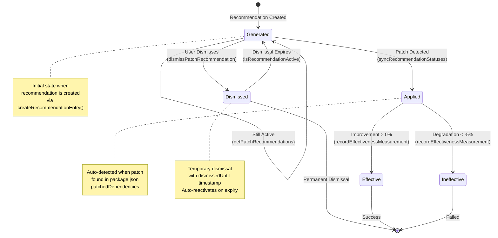

---

### 2. Data Flow Architecture

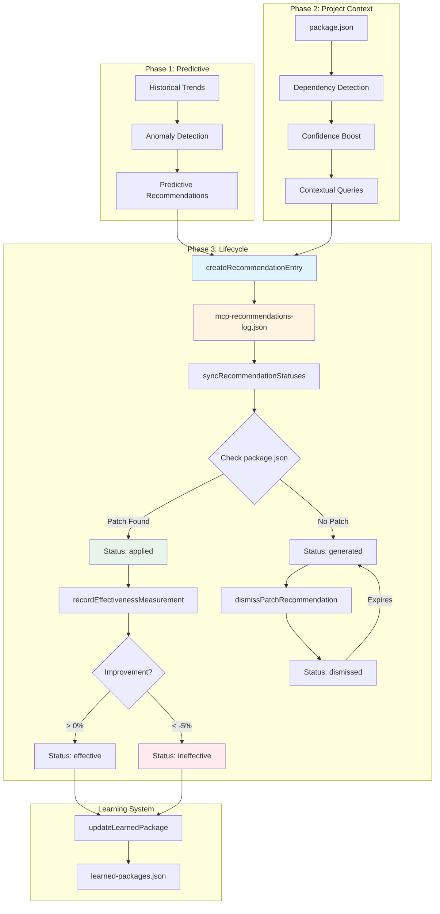

---

### 3. Status Transition Diagram

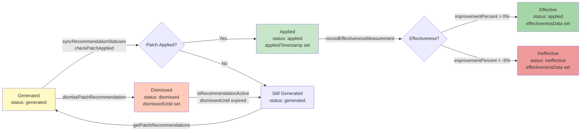

---

### 4. System Component Architecture

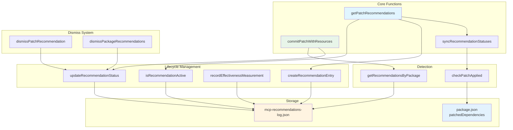

---

### 5. Complete Workflow Sequence

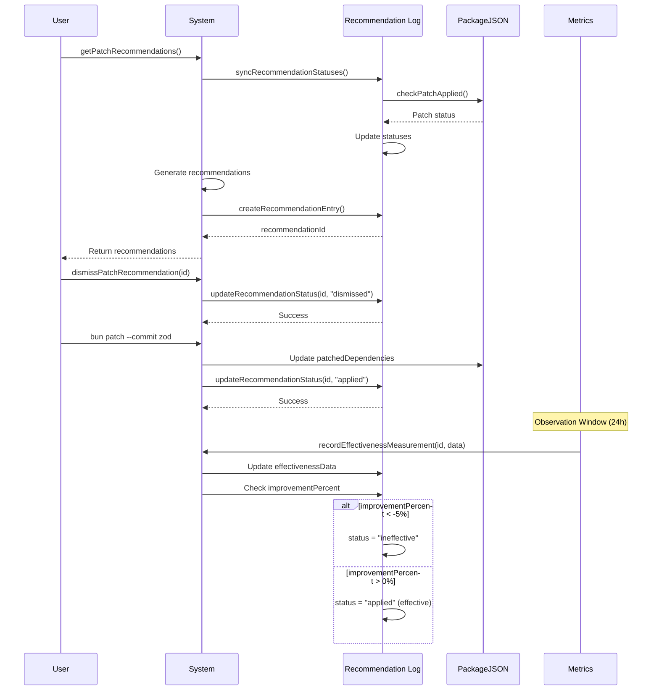

---

### 6. Node Graph: Recommendation States

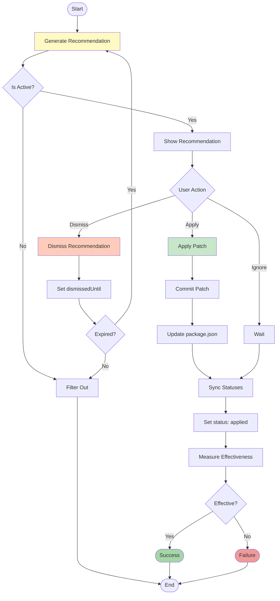

---

### 7. Data Model Relationships

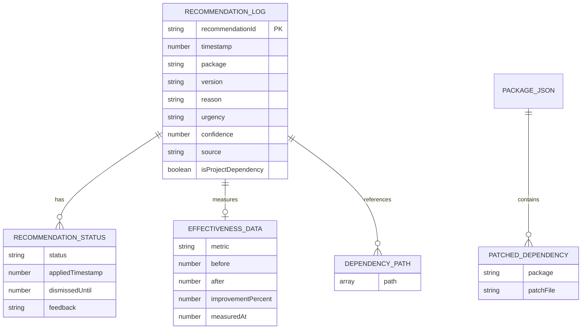

---

### 8. Integration Points Flow

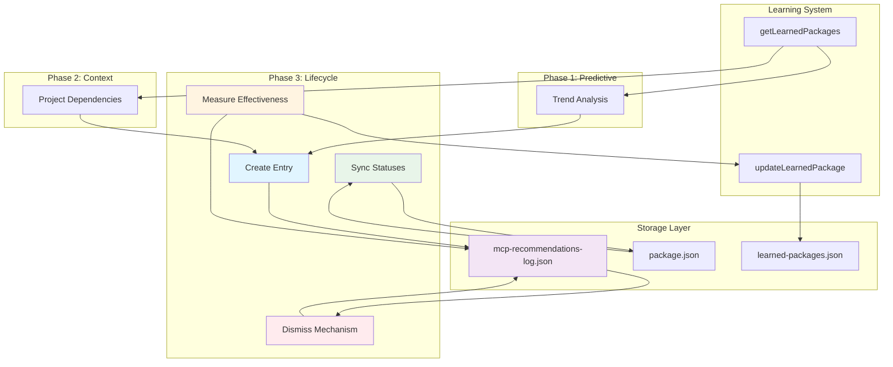

---

### 9. Status Decision Tree

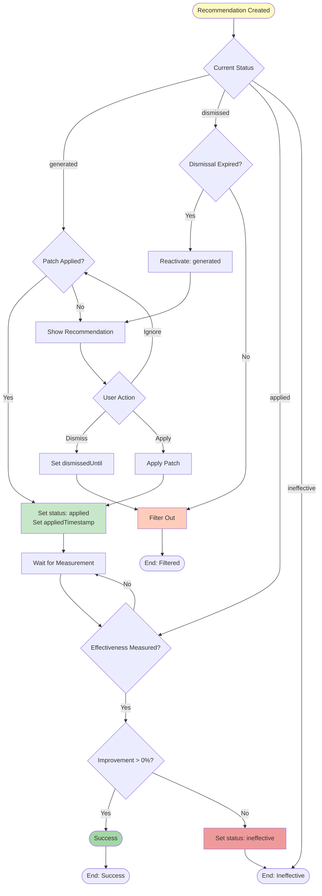

---

### 10. Complete System Overview

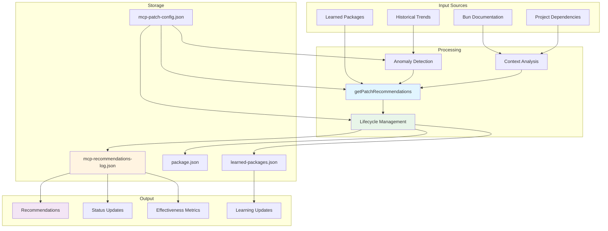

---

## 📝 Usage in Documentation

These diagrams can be embedded in:

1. **Markdown files** - GitHub, GitLab, etc. support Mermaid
2. **Documentation sites** - MkDocs, Docusaurus, etc.
3. **Notion/Obsidian** - With Mermaid plugins
4. **VS Code** - With Mermaid preview extensions

### Example Embedding

```markdown
# My Documentation

Here's the lifecycle flow:

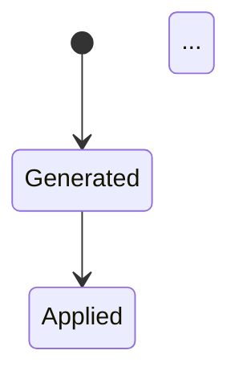

```

---

## 🎨 Diagram Types

1. **State Diagram** - Status transitions
2. **Flowchart** - Decision trees and workflows
3. **Sequence Diagram** - Interaction sequences
4. **Graph** - Component relationships
5. **ER Diagram** - Data model relationships

All diagrams use Mermaid syntax and can be rendered in any Mermaid-compatible viewer.

