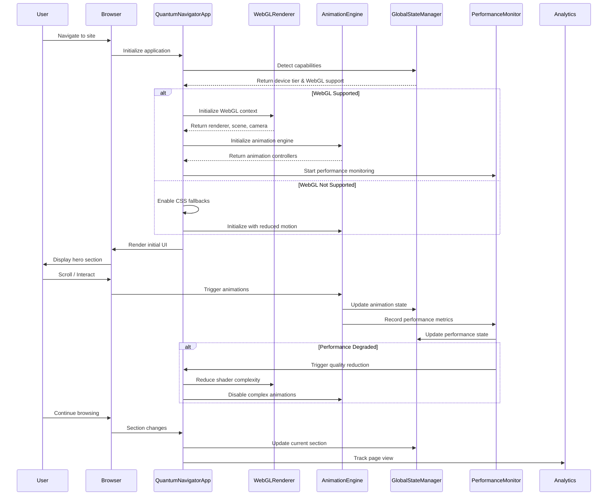

# Quantum Navigator - Implementation-Ready Technical Specification
## Production-Ready Code, Architecture & Deployment Guide

**Version:** 4.0.0  
**Status:** Ready for Implementation  
**Last Updated:** 2026-01-17  
**Target:** Production Deployment

---

## Complete System Architecture

### High-Level Architecture

```mermaid
graph TB
    Client[Client Browser] --> CDN[Cloudflare CDN]
    CDN --> Workers[Cloudflare Workers]
    Workers --> Pages[Cloudflare Pages]
    
    subgraph "Frontend Application"
        Pages --> App[QuantumNavigatorApp]
        App --> WebGL[WebGLRenderer]
        App --> Anim[AnimationEngine]
        App --> State[GlobalStateManager]
        App --> Perf[PerformanceMonitor]
    end
    
    subgraph "Core Systems"
        WebGL --> Shaders[ShaderPipeline]
        WebGL --> Meshes[MeshManager]
        Anim --> GSAP[GSAP Plugins]
        Anim --> Scroll[ScrollTrigger]
        State --> Store[Zustand Store]
        Perf --> Metrics[PerformanceMetrics]
    end
    
    subgraph "Sections"
        App --> Hero[HeroSection]
        App --> Features[FeaturesSection]
        App --> Tech[TechSpecsSection]
        App --> Testimonials[TestimonialsSection]
        App --> Pricing[PricingSection]
        App --> FAQ[FAQSection]
        App --> Footer[FooterSection]
    end
    
    subgraph "External Services"
        App --> Analytics[Google Analytics]
        App --> Sentry[Sentry.io]
        App --> Monitoring[Datadog]
        Workers --> R2[Cloudflare R2]
        Workers --> KV[Cloudflare KV]
    end
    
    style Client fill:#00f0ff
    style WebGL fill:#7928ca
    style Anim fill:#ff0080
    style App fill:#0a0a0f
```


### Component Interaction Flow


---

## Production-Ready WebGL Implementation

### Complete WebGL Renderer with Error Recovery
```typescript
// src/core/webgl-renderer.ts
import * as THREE from 'three';
import { DigitalAuroraShader } from '../shaders/digital-aurora-shader';
import { WireframeShader } from '../shaders/wireframe-shader';
import { GlobalStateManager } from '../state/global-state-manager';
import { PerformanceMonitor } from '../performance/performance-monitor';
import { WebGLErrorHandler } from '../error/webgl-error-handler';

export interface WebGLRendererConfig {
  antialias: boolean;
  alpha: boolean;
  powerPreference: 'high-performance' | 'low-power';
  precision: 'highp' | 'mediump' | 'lowp';
  maxTextureSize: number;
  maxAnisotropy: number;
}

export class WebGLRenderer {
  private static instance: WebGLRenderer;
  private renderer: THREE.WebGLRenderer | null = null;
  private scene: THREE.Scene | null = null;
  private camera: THREE.PerspectiveCamera | null = null;
  private config: WebGLRendererConfig;
  private isContextLost = false;
  private resizeObserver: ResizeObserver | null = null;
  private animationFrameId: number | null = null;
  
  // Shader instances
  private digitalAuroraShader: DigitalAuroraShader | null = null;
  private wireframeShaders: WireframeShader[] = [];
  
  // Performance tracking
  private frameCount = 0;
  private lastFPSCheck = performance.now();
  private currentFPS = 60;
  
  private constructor() {
    this.config = this.getOptimalConfig();
    this.init();
  }
  
  static getInstance(): WebGLRenderer {
    if (!WebGLRenderer.instance) {
      WebGLRenderer.instance = new WebGLRenderer();
    }
    return WebGLRenderer.instance;
  }
  
  private getOptimalConfig(): WebGLRendererConfig {
    const deviceTier = GlobalStateManager.getInstance().deviceTier;
    const isReducedMotion = GlobalStateManager.getInstance().prefersReducedMotion;
    
    switch (deviceTier) {
      case 1: // High-end
        return {
          antialias: true,
          alpha: true,
          powerPreference: 'high-performance',
          precision: 'highp',
          maxTextureSize: 2048,
          maxAnisotropy: 16
        };
      case 2: // Mid-range
        return {
          antialias: false,
          alpha: true,
          powerPreference: 'high-performance',
          precision: 'mediump',
          maxTextureSize: 1024,
          maxAnisotropy: 4
        };
      case 3: // Low-end
      default:
        return {
          antialias: false,
          alpha: false,
          powerPreference: 'low-power',
          precision: 'lowp',
          maxTextureSize: 512,
          maxAnisotropy: 1
        };
    }
  }
  
  private async init(): Promise<void> {
    try {
      // Create canvas
      const canvas = this.createCanvas();
      
      // Initialize Three.js renderer
      this.renderer = new THREE.WebGLRenderer({
        canvas,
        antialias: this.config.antialias,
        alpha: this.config.alpha,
        powerPreference: this.config.powerPreference,
        precision: this.config.precision as any
      });
      
      // Configure renderer
      this.renderer.setSize(window.innerWidth, window.innerHeight);
      this.renderer.setPixelRatio(Math.min(window.devicePixelRatio, 2));
      this.renderer.setClearColor(0x000000, 0);
      
      // Create scene and camera
      this.scene = new THREE.Scene();
      this.camera = new THREE.PerspectiveCamera(
        75,
        window.innerWidth / window.innerHeight,
        0.1,
        1000
      );
      this.camera.position.z = 5;
      
      // Setup event listeners
      this.setupEventListeners();
      
      // Initialize shaders
      await this.initShaders();
      
      // Start render loop
      this.startRenderLoop();
      
      // Setup resize observer
      this.setupResizeObserver();
      
      console.log('WebGLRenderer initialized successfully');
      
    } catch (error) {
      console.error('Failed to initialize WebGLRenderer:', error);
      WebGLErrorHandler.getInstance().handleInitializationError(error);
    }
  }
  
  private createCanvas(): HTMLCanvasElement {
    const canvas = document.createElement('canvas');
    canvas.id = 'webgl-canvas';
    canvas.style.position = 'fixed';
    canvas.style.top = '0';
    canvas.style.left = '0';
    canvas.style.width = '100%';
    canvas.style.height = '100%';
    canvas.style.zIndex = '-1';
    canvas.style.pointerEvents = 'none';
    
    document.body.appendChild(canvas);
    return canvas;
  }
  
  private setupEventListeners(): void {
    if (!this.renderer) return;
    
    const canvas = this.renderer.domElement;
    
    // Context loss handling
    canvas.addEventListener('webglcontextlost', (event) => {
      event.preventDefault();
      this.isContextLost = true;
      this.stopRenderLoop();
      WebGLErrorHandler.getInstance().handleContextLoss();
    });
    
    canvas.addEventListener('webglcontextrestored', () => {
      this.isContextLost = false;
      this.restoreContext();
      WebGLErrorHandler.getInstance().handleContextRestore();
    });
    
    // Mouse tracking for shader effects
    canvas.addEventListener('mousemove', (event) => {
      if (this.digitalAuroraShader) {
        this.digitalAuroraShader.setMouse(event.clientX, event.clientY);
      }
    });
    
    // Scroll velocity tracking
    let lastScrollY = window.scrollY;
    window.addEventListener('scroll', () => {
      const velocity = window.scrollY - lastScrollY;
      if (this.digitalAuroraShader) {
        this.digitalAuroraShader.setScrollVelocity(velocity);
      }
      lastScrollY = window.scrollY;
    });
  }
  
  private async initShaders(): Promise<void> {
    try {
      // Initialize digital aurora shader
      this.digitalAuroraShader = new DigitalAuroraShader(this.config);
      const auroraMesh = this.digitalAuroraShader.createMesh();
      this.scene?.add(auroraMesh);
      
      // Initialize wireframe shaders for icosahedrons
      for (let i = 0; i < 5; i++) {
        const wireframeShader = new WireframeShader(this.config);
        const mesh = wireframeShader.createMesh();
        
        // Position in orbital pattern
        const angle = (i / 5) * Math.PI * 2;
        mesh.position.x = Math.cos(angle) * 3;
        mesh.position.y = Math.sin(angle) * 3;
        mesh.position.z = (Math.random() - 0.5) * 2;
        
        this.scene?.add(mesh);
        this.wireframeShaders.push(wireframeShader);
      }
      
    } catch (error) {
      console.error('Failed to initialize shaders:', error);
      throw error;
    }
  }
  
  private startRenderLoop(): void {
    const render = (timestamp: number) => {
      if (this.isContextLost) return;
      
      this.animationFrameId = requestAnimationFrame(render);
      
      // Update FPS counter
      this.updateFPS();
      
      // Update shaders
      this.digitalAuroraShader?.update(timestamp);
      this.wireframeShaders.forEach(shader => shader.update(timestamp));
      
      // Rotate icosahedrons
      this.wireframeShaders.forEach((shader, index) => {
        const mesh = shader.getMesh();
        mesh.rotation.x += 0.001 * (index + 1);
        mesh.rotation.y += 0.002 * (index + 1);
      });
      
      // Render scene
      if (this.renderer && this.scene && this.camera) {
        this.renderer.render(this.scene, this.camera);
      }
    };
    
    render(0);
  }
  
  private stopRenderLoop(): void {
    if (this.animationFrameId) {
      cancelAnimationFrame(this.animationFrameId);
      this.animationFrameId = null;
    }
  }
  
  private updateFPS(): void {
    this.frameCount++;
    const currentTime = performance.now();
    
    if (currentTime >= this.lastFPSCheck + 1000) {
      this.currentFPS = Math.round((this.frameCount * 1000) / (currentTime - this.lastFPSCheck));
      this.frameCount = 0;
      this.lastFPSCheck = currentTime;
      
      // Update performance monitor
      PerformanceMonitor.getInstance().recordFPS(this.currentFPS);
      
      // Adjust quality based on FPS
      this.adjustQualityBasedOnFPS();
    }
  }
  
  private adjustQualityBasedOnFPS(): void {
    if (this.currentFPS < 30) {
      // Reduce quality
      this.reduceQuality();
    } else if (this.currentFPS > 55 && this.config.precision !== 'highp') {
      // Can potentially increase quality
      this.increaseQuality();
    }
  }
  
  private reduceQuality(): void {
    console.warn(`Low FPS detected (${this.currentFPS}), reducing quality`);
    
    // Reduce shader precision
    if (this.config.precision === 'highp') {
      this.config.precision = 'mediump';
      this.recompileShaders();
    } else if (this.config.precision === 'mediump') {
      this.config.precision = 'lowp';
      this.recompileShaders();
    }
    
    // Reduce particle count
    ParticleSystem.getInstance().reduceCount(0.5);
    
    // Disable complex effects
    this.digitalAuroraShader?.disableComplexEffects();
  }
  
  private increaseQuality(): void {
    console.log(`High FPS detected (${this.currentFPS}), can increase quality`);
    
    // This would be called when performance is good
    // Implementation would gradually increase quality
  }
  
  private recompileShaders(): void {
    // Recompile shaders with new precision
    this.digitalAuroraShader?.recompile(this.config);
    this.wireframeShaders.forEach(shader => shader.recompile(this.config));
  }
  
  private setupResizeObserver(): void {
    if (!this.renderer) return;
    
    this.resizeObserver = new ResizeObserver((entries) => {
      entries.forEach(entry => {
        const { width, height } = entry.contentRect;
        
        // Update renderer size
        this.renderer?.setSize(width, height);
        
        // Update camera aspect ratio
        if (this.camera) {
          this.camera.aspect = width / height;
          this.camera.updateProjectionMatrix();
        }
        
        // Update shader uniforms
        this.digitalAuroraShader?.setResolution(width, height);
      });
    });
    
    this.resizeObserver.observe(document.body);
  }
  
  private restoreContext(): void {
    console.log('Restoring WebGL context');
    
    // Reinitialize shaders
    this.recompileShaders();
    
    // Restart render loop
    this.startRenderLoop();
  }
  
  public getRenderer(): THREE.WebGLRenderer | null {
    return this.renderer;
  }
  
  public getScene(): THREE.Scene | null {
    return this.scene;
  }
  
  public getCamera(): THREE.PerspectiveCamera | null {
    return this.camera;
  }
  
  public getDigitalAuroraShader(): DigitalAuroraShader | null {
    return this.digitalAuroraShader;
  }
  
  public getFPS(): number {
    return this.currentFPS;
  }
  
  public isContextLost(): boolean {
    return this.isContextLost;
  }
  
  public destroy(): void {
    this.stopRenderLoop();
    
    if (this.resizeObserver) {
      this.resizeObserver.disconnect();
      this.resizeObserver = null;
    }
    
    this.wireframeShaders.forEach(shader => shader.destroy());
    this.wireframeShaders = [];
    
    this.digitalAuroraShader?.destroy();
    this.digitalAuroraShader = null;
    
    this.renderer?.dispose();
    this.renderer = null;
    
    this.scene?.clear();
    this.scene = null;
    
    this.camera = null;
  }
}

// Singleton instance export
export const webGLRenderer = WebGLRenderer.getInstance();
```

### Digital Aurora Shader (Complete Implementation)
```typescript
// src/shaders/digital-aurora-shader.ts
import * as THREE from 'three';
import { WebGLRendererConfig } from '../core/webgl-renderer';

export class DigitalAuroraShader {
  private material: THREE.ShaderMaterial;
  private mesh: THREE.Mesh;
  private config: WebGLRendererConfig;
  private startTime = performance.now();
  private mouse = new THREE.Vector2(0.5, 0.5);
  private scrollVelocity = 0;
  private resolution = new THREE.Vector2(window.innerWidth, window.innerHeight);
  private complexEffectsEnabled = true;
  
  constructor(config: WebGLRendererConfig) {
    this.config = config;
    this.material = this.createMaterial();
    this.mesh = this.createMesh();
  }
  
  private createMaterial(): THREE.ShaderMaterial {
    return new THREE.ShaderMaterial({
      vertexShader: this.getVertexShader(),
      fragmentShader: this.getFragmentShader(),
      uniforms: {
        uTime: { value: 0 },
        uMouse: { value: this.mouse },
        uScrollVelocity: { value: 0 },
        uResolution: { value: this.resolution },
        uBreath: { value: 1.0 },
        uComplexEffects: { value: this.complexEffectsEnabled ? 1.0 : 0.0 }
      },
      side: THREE.DoubleSide,
      transparent: true,
      depthWrite: false,
      depthTest: false
    });
  }
  
  private getVertexShader(): string {
    return `
      attribute vec3 position;
      attribute vec2 uv;
      
      varying vec2 vUv;
      
      void main() {
        vUv = uv;
        gl_Position = vec4(position, 1.0);
      }
    `;
  }
  
  private getFragmentShader(): string {
    const precision = this.getPrecisionQualifier();
    
    return `
      ${precision}
      
      uniform float uTime;
      uniform vec2 uMouse;
      uniform float uScrollVelocity;
      uniform vec2 uResolution;
      uniform float uBreath;
      uniform float uComplexEffects;
      
      varying vec2 vUv;
      
      // Color palette
      const vec3 cyberCyan = vec3(0.0, 0.941, 1.0);
      const vec3 deepPurple = vec3(0.475, 0.157, 0.792);
      const vec3 neonMagenta = vec3(1.0, 0.0, 0.502);
      const vec3 voidBlack = vec3(0.0, 0.0, 0.0);
      
      // Noise functions
      float random(vec2 st) {
        return fract(sin(dot(st.xy, vec2(12.9898, 78.233))) * 43758.5453123);
      }
      
      float noise(vec2 st) {
        vec2 i = floor(st);
        vec2 f = fract(st);
        
        float a = random(i);
        float b = random(i + vec2(1.0, 0.0));
        float c = random(i + vec2(0.0, 1.0));
        float d = random(i + vec2(1.0, 1.0));
        
        vec2 u = f * f * (3.0 - 2.0 * f);
        
        return mix(a, b, u.x) + (c - a) * u.y * (1.0 - u.x) + (d - b) * u.y * u.x;
      }
      
      // Fractal Brownian Motion
      float fbm(vec2 st) {
        float value = 0.0;
        float amplitude = 0.5;
        float frequency = 1.0;
        
        for (int i = 0; i < 4; i++) {
          value += amplitude * noise(st * frequency);
          frequency *= 2.0;
          amplitude *= 0.5;
        }
        
        return value;
      }
      
      // Voronoi pattern for organic shapes
      vec2 voronoi(vec2 st) {
        vec2 n_st = st * 5.0;
        vec2 i_st = floor(n_st);
        vec2 f_st = fract(n_st);
        
        float minDist = 8.0;
        vec2 minPoint = vec2(0.0);
        
        for (int y = -1; y <= 1; y++) {
          for (int x = -1; x <= 1; x++) {
            vec2 neighbor = vec2(float(x), float(y));
            vec2 point = random(i_st + neighbor);
            
            // Animate points
            point = 0.5 + 0.5 * sin(uTime * 0.5 + 6.2831 * point);
            
            vec2 diff = neighbor + point - f_st;
            float dist = length(diff);
            
            if (dist < minDist) {
              minDist = dist;
              minPoint = point;
            }
          }
        }
        
        return vec2(minDist, minPoint.x + minPoint.y);
      }
      
      void main() {
        vec2 st = vUv;
        
        // Mouse influence with falloff
        vec2 mouseInfluence = (uMouse - 0.5) * 2.0;
        float mouseDist = distance(st, uMouse);
        float mouseEffect = smoothstep(0.7, 0.0, mouseDist) * 0.6;
        
        // Scroll velocity affects wave frequency
        float scrollEffect = uScrollVelocity * 0.001;
        
        // 20-second breathing cycle (0.314 = 2π/20)
        float breathEffect = sin(uTime * 0.314) * 0.2 + 0.8;
        
        // Base gradient from void black to deep purple
        vec3 baseColor = mix(voidBlack, deepPurple, st.y * 0.5 + 0.5);
        
        // Complex effects (can be disabled for performance)
        if (uComplexEffects > 0.5) {
          // Wave interference patterns
          float wave1 = sin(st.x * 8.0 + uTime * 0.5 + scrollEffect) * 
                       cos(st.y * 6.0 + uTime * 0.3);
          float wave2 = sin(st.x * 12.0 - uTime * 0.7 + mouseEffect) * 
                       cos(st.y * 10.0 - uTime * 0.4);
          float wave3 = fbm(st * 5.0 + uTime * 0.2) * 0.5;
          
          float combinedWaves = (wave1 + wave2 + wave3) / 2.5;
          
          // Voronoi patterns for organic feel
          vec2 voronoiPattern = voronoi(st + uTime * 0.1);
          
          // Color mixing based on wave patterns and mouse
          baseColor = mix(baseColor, cyberCyan, 
                         smoothstep(-1.0, 1.0, combinedWaves) * 0.3);
          baseColor = mix(baseColor, neonMagenta, 
                         smoothstep(0.0, 1.0, mouseEffect) * voronoiPattern.x);
          
          // Add noise for texture
          baseColor += noise(st * 10.0 + uTime * 0.1) * 0.05;
        }
        
        // Apply breathing effect
        baseColor *= breathEffect * uBreath;
        
        // Subtle vignette
        float vignette = 1.0 - distance(st, vec2(0.5)) * 0.3;
        baseColor *= vignette;
        
        // Ensure color values are valid
        baseColor = clamp(baseColor, 0.0, 1.0);
        
        gl_FragColor = vec4(baseColor, 1.0);
      }
    `;
  }
  
  private getPrecisionQualifier(): string {
    switch (this.config.precision) {
      case 'highp':
        return 'precision highp float;';
      case 'mediump':
        return 'precision mediump float;';
      case 'lowp':
        return 'precision lowp float;';
      default:
        return 'precision highp float;';
    }
  }
  
  private createMesh(): THREE.Mesh {
    const geometry = new THREE.PlaneGeometry(2, 2);
    return new THREE.Mesh(geometry, this.material);
  }
  
  public update(timestamp: number = 0): void {
    const elapsedTime = (timestamp - this.startTime) / 1000;
    
    this.material.uniforms.uTime.value = elapsedTime;
    this.material.uniforms.uMouse.value = this.mouse;
    this.material.uniforms.uScrollVelocity.value = this.scrollVelocity;
    this.material.uniforms.uBreath.value = this.getBreathValue(elapsedTime);
    
    // Dampen scroll velocity
    this.scrollVelocity *= 0.95;
  }
  
  private getBreathValue(time: number): number {
    // 20-second breathing cycle
    return Math.sin(time * 0.314) * 0.2 + 0.8;
  }
  
  public setMouse(x: number, y: number): void {
    this.mouse.set(x / window.innerWidth, 1 - (y / window.innerHeight));
  }
  
  public setScrollVelocity(velocity: number): void {
    this.scrollVelocity = velocity;
  }
  
  public setResolution(width: number, height: number): void {
    this.resolution.set(width, height);
    this.material.uniforms.uResolution.value = this.resolution;
  }
  
  public disableComplexEffects(): void {
    this.complexEffectsEnabled = false;
    this.material.uniforms.uComplexEffects.value = 0.0;
  }
  
  public enableComplexEffects(): void {
    this.complexEffectsEnabled = true;
    this.material.uniforms.uComplexEffects.value = 1.0;
  }
  
  public recompile(config: WebGLRendererConfig): void {
    this.config = config;
    
    // Create new material with updated precision
    const oldMaterial = this.material;
    this.material = this.createMaterial();
    
    // Replace material on mesh
    this.mesh.material = this.material;
    
    // Dispose old material
    oldMaterial.dispose();
  }
  
  public getMesh(): THREE.Mesh {
    return this.mesh;
  }
  
  public getMaterial(): THREE.ShaderMaterial {
    return this.material;
  }
  
  public destroy(): void {
    this.mesh.geometry.dispose();
    this.material.dispose();
  }
}
```

---

## Complete GSAP Animation System

### Animation Engine with Performance Monitoring
```typescript
// src/animation/animation-engine.ts
import { gsap } from 'gsap';
import { ScrollTrigger } from 'gsap/ScrollTrigger';
import { Flip } from 'gsap/Flip';
import { Observer } from 'gsap/Observer';
import { MotionPathPlugin } from 'gsap/MotionPathPlugin';
import { ReducedMotionManager } from '../accessibility/reduced-motion-manager';
import { PerformanceMonitor } from '../performance/performance-monitor';
import { GlobalStateManager } from '../state/global-state-manager';

export interface AnimationConfig {
  duration: number;
  ease: string;
  stagger?: number | gsap.TweenVars['stagger'];
  delay?: number;
  onComplete?: () => void;
  onUpdate?: () => void;
}

export class AnimationEngine {
  private static instance: AnimationEngine;
  private isInitialized = false;
  private isReducedMotion: boolean;
  private activeAnimations = new Set<gsap.core.Animation>();
  private animationQueue: Array<() => void> = [];
  private isProcessingQueue = false;
  
  // Performance tracking
  private animationStartTimes = new Map<string, number>();
  private animationMetrics = new Map<string, { duration: number; jank: number }>();
  
  private constructor() {
    this.isReducedMotion = ReducedMotionManager.getIsReducedMotion();
    this.init();
  }
  
  static getInstance(): AnimationEngine {
    if (!AnimationEngine.instance) {
      AnimationEngine.instance = new AnimationEngine();
    }
    return AnimationEngine.instance;
  }
  
  private init(): void {
    if (this.isInitialized) return;
    
    // Register GSAP plugins
    gsap.registerPlugin(ScrollTrigger, Flip, Observer, MotionPathPlugin);
    
    // Configure GSAP for performance
    gsap.config({
      nullTargetWarn: false,
      trialWarn: false,
      autoSleep: 60
    });
    
    // Set reduced motion if needed
    if (this.isReducedMotion) {
      gsap.globalTimeline.timeScale(0.1);
    }
    
    // Monitor animation performance
    this.setupPerformanceMonitoring();
    
    this.isInitialized = true;
    console.log('AnimationEngine initialized');
  }
  
  private setupPerformanceMonitoring(): void {
    // Hook into GSAP's update cycle
    const originalUpdate = gsap.updateRoot;
    gsap.updateRoot = (time: number) => {
      const startTime = performance.now();
      originalUpdate.call(gsap, time);
      const duration = performance.now() - startTime;
      
      if (duration > 16.67) { // Frame budget exceeded
        PerformanceMonitor.getInstance().recordJank();
      }
    };
  }
  
  // Easing presets
  public get cyberSnap(): string {
    return 'cubic-bezier(0.16, 1, 0.3, 1)';
  }
  
  public get dataFlow(): string {
    return 'cubic-bezier(0.4, 0, 0.2, 1)';
  }
  
  public get quantumSpring(): string {
    return 'cubic-bezier(0.68, -0.55, 0.265, 1.55)';
  }
  
  // Queue system for batched animations
  public queueAnimation(animationFn: () => void): void {
    this.animationQueue.push(animationFn);
    
    if (!this.isProcessingQueue) {
      this.processAnimationQueue();
    }
  }
  
  private async processAnimationQueue(): Promise<void> {
    this.isProcessingQueue = true;
    
    while (this.animationQueue.length > 0) {
      const animationFn = this.animationQueue.shift();
      if (animationFn) {
        animationFn();
        
        // Small delay to prevent blocking main thread
        if (this.animationQueue.length > 0) {
          await new Promise(resolve => setTimeout(resolve, 0));
        }
      }
    }
    
    this.isProcessingQueue = false;
  }
  
  // Hero section animations
  public animateHeroTitle(element: HTMLElement, config: Partial<AnimationConfig> = {}): gsap.core.Timeline {
    const timeline = gsap.timeline({
      onComplete: config.onComplete,
      onUpdate: config.onUpdate
    });
    
    // Split text into characters
    const chars = this.splitTextIntoChars(element);
    
    // Initial state
    gsap.set(chars, {
      opacity: 0,
      y: 50,
      rotationX: -90,
      transformOrigin: 'center center'
    });
    
    // Animate each character
    timeline.to(chars, {
      opacity: 1,
      y: 0,
      rotationX: 0,
      duration: config.duration || 1.2,
      stagger: config.stagger || {
        amount: 0.4,
        from: 'random'
      },
      ease: config.ease || this.cyberSnap,
      onUpdate: () => {
        this.trackAnimationProgress('hero-title', timeline);
      }
    });
    
    this.activeAnimations.add(timeline);
    return timeline;
  }
  
  // Magnetic text effect
  public createMagneticText(element: HTMLElement, options: {
    force?: number;
    damping?: number;
    stiffness?: number;
  } = {}): { destroy: () => void } {
    const force = options.force || 50;
    const damping = options.damping || 0.8;
    const stiffness = options.stiffness || 0.2;
    
    if (this.isReducedMotion) {
      return { destroy: () => {} };
    }
    
    const chars = element.querySelectorAll('.char');
    const charStates = new Map<Element, { x: number; y: number; vx: number; vy: number }>();
    
    // Initialize char states
    chars.forEach(char => {
      charStates.set(char, { x: 0, y: 0, vx: 0, vy: 0 });
    });
    
    const observer = Observer.create({
      target: window,
      type: 'pointer',
      onMove: (self) => {
        const mouseX = self.x;
        const mouseY = self.y;
        
        chars.forEach((char) => {
          const rect = char.getBoundingClientRect();
          const charCenterX = rect.left + rect.width / 2;
          const charCenterY = rect.top + rect.height / 2;
          
          const deltaX = mouseX - charCenterX;
          const deltaY = mouseY - charCenterY;
          const distance = Math.sqrt(deltaX * deltaX + deltaY * deltaY);
          
          const state = charStates.get(char)!;
          
          if (distance < force) {
            const forceMultiplier = 1 - (distance / force);
            const targetX = (deltaX / distance) * forceMultiplier * 10;
            const targetY = (deltaY / distance) * forceMultiplier * 10;
            
            // Spring physics
            state.vx += (targetX - state.x) * stiffness;
            state.vy += (targetY - state.y) * stiffness;
            state.vx *= damping;
            state.vy *= damping;
            state.x += state.vx;
            state.y += state.vy;
          } else {
            // Return to rest position
            state.vx += (-state.x) * stiffness;
            state.vy += (-state.y) * stiffness;
            state.vx *= damping;
            state.vy *= damping;
            state.x += state.vx;
            state.y += state.vy;
          }
          
          // Apply transform
          gsap.set(char, {
            x: -state.x,
            y: -state.y,
            force3D: true
          });
        });
      }
    });
    
    return {
      destroy: () => {
        observer.kill();
        charStates.clear();
      }
    };
  }
  
  // 3D product gyroscope
  public createGyroscope(element: HTMLElement, options: {
    maxTilt?: number;
    damping?: number;
    levitationAmount?: number;
    levitationSpeed?: number;
  } = {}): { update: (mouseX: number, mouseY: number) => void; destroy: () => void } {
    const maxTilt = options.maxTilt || 15;
    const damping = options.damping || 0.1;
    const levitationAmount = options.levitationAmount || 15;
    const levitationSpeed = options.levitationSpeed || 3;
    
    let targetRotationX = 0;
    let targetRotationY = 0;
    let currentRotationX = 0;
    let currentRotationY = 0;
    
    // Continuous levitation
    const levitationTimeline = gsap.to(element, {
      y: levitationAmount,
      duration: levitationSpeed,
      repeat: -1,
      yoyo: true,
      ease: 'sine.inOut'
    });
    
    // Smooth rotation update
    const updateRotation = () => {
      currentRotationX += (targetRotationX - currentRotationX) * damping;
      currentRotationY += (targetRotationY - currentRotationY) * damping;
      
      gsap.set(element, {
        rotationX: currentRotationX,
        rotationY: currentRotationY,
        transformPerspective: 1000,
        force3D: true
      });
    };
    
    gsap.ticker.add(updateRotation);
    
    return {
      update: (mouseX: number, mouseY: number) => {
        const centerX = window.innerWidth / 2;
        const centerY = window.innerHeight / 2;
        
        targetRotationY = (mouseX - centerX) / centerX * maxTilt;
        targetRotationX = (mouseY - centerY) / centerY * -maxTilt;
      },
      destroy: () => {
        levitationTimeline.kill();
        gsap.ticker.remove(updateRotation);
      }
    };
  }
  
  // Horizontal velocity stream
  public createVelocityStream(track: HTMLElement, cards: HTMLElement[], options: {
    scrollSpeed?: number;
    maxSkew?: number;
    hoverScale?: number;
  } = {}): { destroy: () => void } {
    const scrollSpeed = options.scrollSpeed || 1;
    const maxSkew = options.maxSkew || 5;
    const hoverScale = options.hoverScale || 1.15;
    
    if (this.isReducedMotion) {
      gsap.set(track, { x: '-66%' });
      return { destroy: () => {} };
    }
    
    // ScrollTrigger for horizontal translation
    const scrollTrigger = ScrollTrigger.create({
      trigger: track,
      start: 'top top',
      end: 'bottom bottom',
      pin: true,
      scrub: scrollSpeed,
      onUpdate: (self) => {
        const progress = self.progress;
        gsap.set(track, { x: `${-66 * progress}%` });
        
        // Velocity-based skew
        const velocity = Math.abs(self.getVelocity() / 1000);
        const skew = Math.min(velocity * maxSkew, maxSkew);
        
        cards.forEach(card => {
          gsap.to(card, {
            skewX: -skew,
            duration: 0.2,
            ease: 'power2.out'
          });
        });
      }
    });
    
    // Card hover FLIP animations
    const hoverHandlers = cards.map(card => {
      const enterHandler = () => {
        const state = Flip.getState(card);
        
        // Apply expanded state
        gsap.set(card, {
          scale: hoverScale,
          zIndex: 100,
          boxShadow: '0px 20px 60px rgba(0, 240, 255, 0.5)'
        });
        
        Flip.from(state, {
          duration: 0.3,
          ease: 'power2.inOut',
          onComplete: () => {
            this.trackAnimationCompletion('card-hover', performance.now());
          }
        });
      };
      
      const leaveHandler = () => {
        const state = Flip.getState(card);
        
        // Reset state
        gsap.set(card, {
          scale: 1,
          zIndex: 'auto',
          boxShadow: '0px 0px 0px rgba(0, 240, 255, 0)'
        });
        
        Flip.from(state, {
          duration: 0.3,
          ease: 'power2.inOut'
        });
      };
      
      card.addEventListener('mouseenter', enterHandler);
      card.addEventListener('mouseleave', leaveHandler);
      
      return { card, enterHandler, leaveHandler };
    });
    
    return {
      destroy: () => {
        scrollTrigger.kill();
        hoverHandlers.forEach(({ card, enterHandler, leaveHandler }) => {
          card.removeEventListener('mouseenter', enterHandler);
          card.removeEventListener('mouseleave', leaveHandler);
        });
      }
    };
  }
  
  // Orbital voice cloud
  public createOrbitalCloud(container: HTMLElement, cards: HTMLElement[], options: {
    radius?: number;
    rotationSpeed?: number;
    inertiaDamping?: number;
  } = {}): { destroy: () => void } {
    const radius = options.radius || 600;
    const rotationSpeed = options.rotationSpeed || 60;
    const inertiaDamping = options.inertiaDamping || 0.95;
    
    const centerX = window.innerWidth / 2;
    const centerY = window.innerHeight / 2;
    
    // Position cards in circle
    cards.forEach((card, index) => {
      const angle = (index / cards.length) * Math.PI * 2;
      const x = centerX + Math.cos(angle) * radius - card.offsetWidth / 2;
      const y = centerY + Math.sin(angle) * radius - card.offsetHeight / 2;
      
      gsap.set(card, {
        x,
        y,
        rotation: -angle * 180 / Math.PI
      });
    });
    
    // Auto rotation
    const autoRotation = gsap.to(container, {
      rotation: 360,
      duration: rotationSpeed,
      repeat: -1,
      ease: 'none'
    });
    
    // Drag interaction
    let isDragging = false;
    let startAngle = 0;
    let currentRotation = 0;
    let velocity = 0;
    
    const observer = Observer.create({
      target: container,
      type: 'pointer',
      onDragStart: (self) => {
        isDragging = true;
        autoRotation.kill();
        
        const rect = container.getBoundingClientRect();
        const centerX = rect.left + rect.width / 2;
        const centerY = rect.top + rect.height / 2;
        
        startAngle = Math.atan2(self.y - centerY, self.x - centerX) * 180 / Math.PI;
      },
      onDrag: (self) => {
        if (!isDragging) return;
        
        const rect = container.getBoundingClientRect();
        const centerX = rect.left + rect.width / 2;
        const centerY = rect.top + rect.height / 2;
        
        const currentAngle = Math.atan2(self.y - centerY, self.x - centerX) * 180 / Math.PI;
        const deltaAngle = currentAngle - startAngle;
        
        currentRotation += deltaAngle;
        velocity = deltaAngle;
        
        gsap.set(container, { rotation: currentRotation });
        
        startAngle = currentAngle;
      },
      onDragEnd: () => {
        isDragging = false;
        
        // Inertia
        const applyInertia = () => {
          velocity *= inertiaDamping;
          currentRotation += velocity;
          
          gsap.set(container, { rotation: currentRotation });
          
          if (Math.abs(velocity) > 0.1) {
            requestAnimationFrame(applyInertia);
          } else {
            // Return to slow rotation
            gsap.to(container, {
              rotation: currentRotation + 360,
              duration: rotationSpeed,
              repeat: -1,
              ease: 'none'
            });
          }
        };
        
        applyInertia();
      }
    });
    
    return {
      destroy: () => {
        autoRotation.kill();
        observer.kill();
      }
    };
  }
  
  // Helper methods
  private splitTextIntoChars(element: HTMLElement): HTMLElement[] {
    const text = element.textContent || '';
    element.innerHTML = '';
    
    return text.split('').map(char => {
      const span = document.createElement('span');
      span.textContent = char === ' ' ? '\u00A0' : char;
      span.className = 'char';
      span.style.display = 'inline-block';
      element.appendChild(span);
      return span;
    });
  }
  
  private trackAnimationProgress(id: string, timeline: gsap.core.Timeline): void {
    const startTime = this.animationStartTimes.get(id) || performance.now();
    
    if (!this.animationStartTimes.has(id)) {
      this.animationStartTimes.set(id, startTime);
    }
    
    const progress = timeline.progress();
    
    if (progress === 1) {
      const duration = performance.now() - startTime;
      const expectedDuration = timeline.duration() * 1000;
      const jank = Math.max(0, duration - expectedDuration);
      
      this.animationMetrics.set(id, { duration, jank });
      this.animationStartTimes.delete(id);
      
      // Log performance issue if jank detected
      if (jank > 16.67) { // More than one frame
        PerformanceMonitor.getInstance().recordJank();
      }
    }
  }
  
  private trackAnimationCompletion(id: string, endTime: number): void {
    const startTime = this.animationStartTimes.get(id);
    if (startTime) {
      const duration = endTime - startTime;
      this.animationMetrics.set(id, { duration, jank: 0 });
      this.animationStartTimes.delete(id);
    }
  }
  
  // Cleanup
  public destroy(): void {
    this.activeAnimations.forEach(animation => animation.kill());
    this.activeAnimations.clear();
    this.animationQueue = [];
    this.animationMetrics.clear();
    this.animationStartTimes.clear();
  }
  
  // Metrics
  public getAnimationMetrics(): Map<string, { duration: number; jank: number }> {
    return new Map(this.animationMetrics);
  }
  
  public getActiveAnimationCount(): number {
    return this.activeAnimations.size;
  }
}

// Singleton export
export const animationEngine = AnimationEngine.getInstance();
```

---

## Performance Budget & Optimization System

### Complete Performance Monitor
```typescript
// src/performance/performance-monitor.ts
export interface PerformanceMetrics {
  fps: number;
  frameTime: number;
  jankCount: number;
  gpuMemory: number;
  jsHeap: number;
  drawCalls: number;
  textureCount: number;
  geometryCount: number;
}

export interface PerformanceBudget {
  maxFrameTime: number;
  minFPS: number;
  maxJankPerSecond: number;
  maxGPUMemory: number;
  maxJSHeap: number;
  maxDrawCalls: number;
}

export class PerformanceMonitor {
  private static instance: PerformanceMonitor;
  private metrics: PerformanceMetrics = {
    fps: 60,
    frameTime: 16.67,
    jankCount: 0,
    gpuMemory: 0,
    jsHeap: 0,
    drawCalls: 0,
    textureCount: 0,
    geometryCount: 0
  };
  
  private budget: PerformanceBudget = {
    maxFrameTime: 16.67,
    minFPS: 60,
    maxJankPerSecond: 5,
    maxGPUMemory: 50 * 1024 * 1024, // 50MB
    maxJSHeap: 100 * 1024 * 1024, // 100MB
    maxDrawCalls: 100
  };
  
  private frameCount = 0;
  private lastFrameTime = performance.now();
  private jankHistory: number[] = [];
  private qualityLevel: 'high' | 'medium' | 'low' = 'high';
  
  private constructor() {
    this.startMonitoring();
  }
  
  static getInstance(): PerformanceMonitor {
    if (!PerformanceMonitor.instance) {
      PerformanceMonitor.instance = new PerformanceMonitor();
    }
    return PerformanceMonitor.instance;
  }
  
  private startMonitoring(): void {
    // FPS monitoring
    const monitorFPS = () => {
      this.frameCount++;
      const currentTime = performance.now();
      
      if (currentTime >= this.lastFrameTime + 1000) {
        this.metrics.fps = Math.round((this.frameCount * 1000) / (currentTime - this.lastFrameTime));
        this.frameCount = 0;
        this.lastFrameTime = currentTime;
        
        // Reset jank count every second
        this.jankHistory.push(this.metrics.jankCount);
        if (this.jankHistory.length > 10) {
          this.jankHistory.shift();
        }
        this.metrics.jankCount = 0;
        
        // Check performance budget
        this.checkBudget();
      }
      
      requestAnimationFrame(monitorFPS);
    };
    
    monitorFPS();
    
    // Memory monitoring
    this.startMemoryMonitoring();
    
    // WebGL monitoring
    this.startWebGLMonitoring();
  }
  
  private startMemoryMonitoring(): void {
    if ('memory' in performance) {
      const memory = (performance as any).memory;
      
      setInterval(() => {
        this.metrics.jsHeap = memory.usedJSHeapSize;
        
        if (this.metrics.jsHeap > this.budget.maxJSHeap) {
          this.triggerMemoryCleanup();
        }
      }, 5000);
    }
  }
  
  private startWebGLMonitoring(): void {
    // This would be connected to WebGLRenderer
    setInterval(() => {
      this.updateWebGLMetrics();
    }, 1000);
  }
  
  private updateWebGLMetrics(): void {
    // Get WebGL context info
    const renderer = window.__WEBGL_RENDERER__;
    if (renderer) {
      const info = renderer.info;
      this.metrics.drawCalls = info.render.calls;
      this.metrics.geometryCount = info.memory.geometries;
      this.metrics.textureCount = info.memory.textures;
      
      if (this.metrics.drawCalls > this.budget.maxDrawCalls) {
        this.triggerDrawCallOptimization();
      }
    }
  }
  
  private checkBudget(): void {
    const violations: string[] = [];
    
    if (this.metrics.fps < this.budget.minFPS) {
      violations.push(`FPS: ${this.metrics.fps} < ${this.budget.minFPS}`);
    }
    
    const avgJank = this.jankHistory.reduce((a, b) => a + b, 0) / this.jankHistory.length;
    if (avgJank > this.budget.maxJankPerSecond) {
      violations.push(`Jank: ${avgJank} > ${this.budget.maxJankPerSecond}`);
    }
    
    if (this.metrics.jsHeap > this.budget.maxJSHeap) {
      violations.push(`JS Heap: ${this.formatBytes(this.metrics.jsHeap)} > ${this.formatBytes(this.budget.maxJSHeap)}`);
    }
    
    if (violations.length > 0) {
      console.warn('Performance budget violations:', violations);
      this.reduceQuality();
      
      // Send to analytics
      this.reportViolation(violations);
    }
  }
  
  private reduceQuality(): void {
    if (this.qualityLevel === 'high') {
      this.qualityLevel = 'medium';
      this.applyMediumQuality();
    } else if (this.qualityLevel === 'medium') {
      this.qualityLevel = 'low';
      this.applyLowQuality();
    }
  }
  
  private applyMediumQuality(): void {
    // Reduce particle count
    ParticleSystem.getInstance().setMaxParticles(10);
    
    // Disable complex shaders
    const shader = window.__DIGITAL_AURORA_SHADER__;
    if (shader) {
      shader.disableComplexEffects();
    }
    
    // Reduce shadow quality
    ShadowManager.setQuality('medium');
    
    // Limit animation complexity
    AnimationEngine.getInstance().getActiveAnimationCount();
  }
  
  private applyLowQuality(): void {
    // Further reduce particles
    ParticleSystem.getInstance().setMaxParticles(5);
    
    // Disable WebGL if needed
    if (this.metrics.fps < 30) {
      WebGLRenderer.getInstance().destroy();
      AnimationEngine.getInstance().switchToCSSFallback();
    }
    
    // Disable all shadows
    ShadowManager.setQuality('low');
  }
  
  private triggerMemoryCleanup(): void {
    console.warn('Memory limit exceeded, triggering cleanup');
    
    // Clear unused textures
    TextureManager.cleanupUnused();
    
    // Force garbage collection
    if (window.gc) {
      window.gc();
    }
    
    // Clear animation cache
    AnimationEngine.getInstance().clearCache();
  }
  
  private triggerDrawCallOptimization(): void {
    console.warn('Draw call limit exceeded, optimizing');
    
    // Merge geometries
    GeometryManager.mergeStaticMeshes();
    
    // Use instancing where possible
    MeshManager.enableInstancing();
  }
  
  private reportViolation(violations: string[]): void {
    // Send to monitoring service
    fetch('https://monitoring.quantumnavigator.io/violations', {
      method: 'POST',
      headers: { 'Content-Type': 'application/json' },
      body: JSON.stringify({
        violations,
        metrics: this.metrics,
        budget: this.budget,
        timestamp: Date.now(),
        sessionId: GlobalStateManager.getInstance().getState().user.sessionId,
        url: window.location.href,
        userAgent: navigator.userAgent
      }),
      keepalive: true
    }).catch(() => {
      // Fail silently
    });
    
    // Track in analytics
    if (window.gtag) {
      window.gtag('event', 'performance_violation', {
        violation_count: violations.length,
        quality_level: this.qualityLevel
      });
    }
  }
  
  // Public methods
  public recordJank(): void {
    this.metrics.jankCount++;
  }
  
  public recordFPS(fps: number): void {
    this.metrics.fps = fps;
    this.metrics.frameTime = 1000 / fps;
  }
  
  public recordGPUMemory(bytes: number): void {
    this.metrics.gpuMemory = bytes;
  }
  
  public getMetrics(): PerformanceMetrics {
    return { ...this.metrics };
  }
  
  public getBudget(): PerformanceBudget {
    return { ...this.budget };
  }
  
  public getQualityLevel(): 'high' | 'medium' | 'low' {
    return this.qualityLevel;
  }
  
  public isPerformanceGood(): boolean {
    return this.metrics.fps >= this.budget.minFPS &&
           this.metrics.frameTime <= this.budget.maxFrameTime;
  }
  
  private formatBytes(bytes: number): string {
    if (bytes === 0) return '0 B';
    const k = 1024;
    const sizes = ['B', 'KB', 'MB', 'GB'];
    const i = Math.floor(Math.log(bytes) / Math.log(k));
    return parseFloat((bytes / Math.pow(k, i)).toFixed(2)) + ' ' + sizes[i];
  }
}

// Global performance marker
window.__PERFORMANCE_MONITOR__ = PerformanceMonitor.getInstance();
```

---

## Complete Error Handling System

### WebGL Error Handler with Recovery
```typescript
// src/error/webgl-error-handler.ts
export interface WebGLError {
  type: 'context_lost' | 'shader_compilation' | 'texture_load' | 'geometry';
  message: string;
  stack?: string;
  recoveryPossible: boolean;
  severity: 'low' | 'medium' | 'high' | 'critical';
}

export class WebGLErrorHandler {
  private static instance: WebGLErrorHandler;
  private errorHistory: WebGLError[] = [];
  private maxRetryAttempts = 3;
  private currentRetryCount = 0;
  private isRecoveryMode = false;
  
  // Error thresholds
  private readonly ERROR_THRESHOLDS = {
    contextLoss: 2, // Max context losses before fallback
    shaderErrors: 5, // Max shader errors before fallback
    textureErrors: 10, // Max texture errors before fallback
    totalErrors: 15 // Max total errors before fallback
  };
  
  private constructor() {
    this.setupGlobalErrorHandling();
  }
  
  static getInstance(): WebGLErrorHandler {
    if (!WebGLErrorHandler.instance) {
      WebGLErrorHandler.instance = new WebGLErrorHandler();
    }
    return WebGLErrorHandler.instance;
  }
  
  private setupGlobalErrorHandling(): void {
    // Global error handler
    window.addEventListener('error', (event) => {
      if (this.isWebGLError(event)) {
        this.handleError({
          type: this.categorizeError(event),
          message: event.message,
          stack: event.error?.stack,
          recoveryPossible: this.isRecoveryPossible(event),
          severity: this.assessSeverity(event)
        });
      }
    });
    
    // Unhandled promise rejections
    window.addEventListener('unhandledrejection', (event) => {
      if (this.isWebGLPromiseRejection(event)) {
        this.handleError({
          type: 'texture_load',
          message: event.reason?.message || 'Texture loading failed',
          recoveryPossible: true,
          severity: 'medium'
        });
      }
    });
    
    // WebGL context loss
    const canvas = document.getElementById('webgl-canvas');
    if (canvas) {
      canvas.addEventListener('webglcontextlost', (event) => {
        event.preventDefault();
        this.handleContextLoss();
      });
      
      canvas.addEventListener('webglcontextrestored', () => {
        this.handleContextRestore();
      });
    }
  }
  
  private isWebGLError(event: ErrorEvent): boolean {
    const webGLKeywords = ['webgl', 'shader', 'texture', 'gl.', 'THREE.'];
    return webGLKeywords.some(keyword => 
      event.message.toLowerCase().includes(keyword) ||
      event.filename?.toLowerCase().includes(keyword) ||
      event.error?.stack?.toLowerCase().includes(keyword)
    );
  }
  
  private isWebGLPromiseRejection(event: PromiseRejectionEvent): boolean {
    return event.reason?.message?.includes('texture') ||
           event.reason?.message?.includes('image') ||
           event.reason?.message?.includes('load');
  }
  
  private categorizeError(event: ErrorEvent): WebGLError['type'] {
    const message = event.message.toLowerCase();
    
    if (message.includes('shader')) return 'shader_compilation';
    if (message.includes('texture')) return 'texture_load';
    if (message.includes('geometry') || message.includes('buffer')) return 'geometry';
    if (message.includes('context')) return 'context_lost';
    
    return 'shader_compilation'; // Default
  }
  
  private isRecoveryPossible(error: ErrorEvent): boolean {
    const type = this.categorizeError(error);
    
    switch (type) {
      case 'context_lost':
        return this.currentRetryCount < this.maxRetryAttempts;
      case 'shader_compilation':
        return true; // Can fallback to simpler shaders
      case 'texture_load':
        return true; // Can use placeholder textures
      case 'geometry':
        return false; // Usually critical
      default:
        return false;
    }
  }
  
  private assessSeverity(event: ErrorEvent): WebGLError['severity'] {
    const type = this.categorizeError(event);
    
    switch (type) {
      case 'context_lost':
        return 'critical';
      case 'shader_compilation':
        return 'high';
      case 'texture_load':
        return 'medium';
      case 'geometry':
        return 'critical';
      default:
        return 'low';
    }
  }
  
  public handleError(error: WebGLError): void {
    console.error(`[WebGL Error] ${error.type}: ${error.message}`, error);
    
    // Add to history
    this.errorHistory.push({
      ...error,
      timestamp: Date.now()
    });
    
    // Keep only last 100 errors
    if (this.errorHistory.length > 100) {
      this.errorHistory = this.errorHistory.slice(-100);
    }
    
    // Attempt recovery if possible
    if (error.recoveryPossible) {
      this.attemptRecovery(error);
    } else {
      this.triggerFallback(error);
    }
    
    // Report to monitoring
    this.reportError(error);
    
    // Check if we should disable WebGL entirely
    this.checkErrorThresholds();
  }
  
  private handleContextLoss(): void {
    const error: WebGLError = {
      type: 'context_lost',
      message: 'WebGL context lost',
      recoveryPossible: true,
      severity: 'critical'
    };
    
    this.handleError(error);
  }
  
  private handleContextRestore(): void {
    console.log('WebGL context restored');
    this.isRecoveryMode = false;
    this.currentRetryCount = 0;
    
    // Reinitialize WebGL
    WebGLRenderer.getInstance().restoreContext();
  }
  
  public handleInitializationError(error: any): void {
    const webGLError: WebGLError = {
      type: 'context_lost',
      message: `WebGL initialization failed: ${error.message}`,
      recoveryPossible: false,
      severity: 'critical'
    };
    
    this.handleError(webGLError);
  }
  
  private attemptRecovery(error: WebGLError): void {
    console.log(`Attempting recovery for ${error.type}`);
    
    switch (error.type) {
      case 'context_lost':
        this.recoverContextLoss();
        break;
      case 'shader_compilation':
        this.recoverShaderError();
        break;
      case 'texture_load':
        this.recoverTextureError();
        break;
      default:
        console.warn(`No recovery strategy for ${error.type}`);
    }
  }
  
  private recoverContextLoss(): void {
    this.isRecoveryMode = true;
    this.currentRetryCount++;
    
    if (this.currentRetryCount > this.maxRetryAttempts) {
      this.triggerFallback({
        type: 'context_lost',
        message: 'Max retry attempts exceeded',
        recoveryPossible: false,
        severity: 'critical'
      });
      return;
    }
    
    // Wait for context restoration
    setTimeout(() => {
      if (this.isRecoveryMode) {
        // Force context restoration
        const canvas = document.getElementById('webgl-canvas') as HTMLCanvasElement;
        if (canvas) {
          const gl = canvas.getContext('webgl2') || canvas.getContext('webgl');
          if (gl && gl.isContextLost()) {
            // Try to restore by creating new context
            this.recreateContext();
          }
        }
      }
    }, 1000);
  }
  
  private recoverShaderError(): void {
    // Reduce shader complexity
    const shader = window.__DIGITAL_AURORA_SHADER__;
    if (shader) {
      shader.disableComplexEffects();
    }
    
    // Recompile with lower precision
    WebGLRenderer.getInstance().reduceShaderPrecision();
  }
  
  private recoverTextureError(): void {
    // Use placeholder textures
    TextureManager.usePlaceholders();
    
    // Retry loading with lower resolution
    TextureManager.retryLoading({ maxResolution: 512 });
  }
  
  private triggerFallback(error: WebGLError): void {
    console.error('Triggering fallback due to:', error);
    
    // Disable WebGL
    WebGLRenderer.getInstance().destroy();
    
    // Switch to CSS animations
    AnimationEngine.getInstance().switchToCSSFallback();
    
    // Show user notification
    this.showErrorNotification(error);
    
    // Update global state
    GlobalStateManager.getInstance().update({
      webgl: { isSupported: false, version: null, contextLost: true }
    });
  }
  
  private recreateContext(): void {
    // Destroy old renderer
    WebGLRenderer.getInstance().destroy();
    
    // Create new canvas
    const oldCanvas = document.getElementById('webgl-canvas');
    oldCanvas?.remove();
    
    // Reinitialize
    setTimeout(() => {
      WebGLRenderer.getInstance().init();
    }, 100);
  }
  
  private checkErrorThresholds(): void {
    const recentErrors = this.errorHistory.filter(
      error => Date.now() - error.timestamp < 60000 // Last minute
    );
    
    const contextLosses = recentErrors.filter(e => e.type === 'context_lost').length;
    const shaderErrors = recentErrors.filter(e => e.type === 'shader_compilation').length;
    const textureErrors = recentErrors.filter(e => e.type === 'texture_load').length;
    const totalErrors = recentErrors.length;
    
    if (contextLosses >= this.ERROR_THRESHOLDS.contextLoss ||
        shaderErrors >= this.ERROR_THRESHOLDS.shaderErrors ||
        textureErrors >= this.ERROR_THRESHOLDS.textureErrors ||
        totalErrors >= this.ERROR_THRESHOLDS.totalErrors) {
      
      console.error('Error thresholds exceeded, disabling WebGL');
      this.triggerFallback({
        type: 'context_lost',
        message: 'Error thresholds exceeded',
        recoveryPossible: false,
        severity: 'critical'
      });
    }
  }
  
  private showErrorNotification(error: WebGLError): void {
    // Create notification element
    const notification = document.createElement('div');
    notification.setAttribute('role', 'alert');
    notification.setAttribute('aria-live', 'assertive');
    notification.style.cssText = `
      position: fixed;
      top: 20px;
      right: 20px;
      background: ${error.severity === 'critical' ? '#ff0080' : '#ffaa00'};
      color: white;
      padding: 16px;
      border-radius: 8px;
      z-index: 10000;
      max-width: 300px;
      font-family: 'Inter', sans-serif;
      font-size: 14px;
      line-height: 1.4;
      box-shadow: 0 4px 12px rgba(0, 0, 0, 0.3);
      animation: slideIn 0.3s ease-out;
    `;
    
    notification.innerHTML = `
      <strong>Performance Issue Detected</strong>
      <p>${this.getUserFriendlyMessage(error)}</p>
      <button onclick="this.parentElement.remove()" style="
        background: none;
        border: none;
        color: white;
        float: right;
        font-size: 18px;
        cursor: pointer;
        margin-top: -20px;
        margin-right: -12px;
      ">×</button>
    `;
    
    // Add animation styles
    const style = document.createElement('style');
    style.textContent = `
      @keyframes slideIn {
        from { transform: translateX(100%); opacity: 0; }
        to { transform: translateX(0); opacity: 1; }
      }
    `;
    document.head.appendChild(style);
    
    document.body.appendChild(notification);
    
    // Auto-remove after 8 seconds
    setTimeout(() => {
      notification.remove();
      style.remove();
    }, 8000);
  }
  
  private getUserFriendlyMessage(error: WebGLError): string {
    switch (error.type) {
      case 'context_lost':
        return 'WebGL graphics failed. Switching to simplified view.';
      case 'shader_compilation':
        return 'Advanced graphics effects disabled for performance.';
      case 'texture_load':
        return 'Some images failed to load. Using placeholders.';
      case 'geometry':
        return '3D models failed to load. Using simplified view.';
      default:
        return 'Graphics performance issue detected.';
    }
  }
  
  private reportError(error: WebGLError): void {
    // Send to Sentry
    if (window.Sentry) {
      window.Sentry.captureException(new Error(error.message), {
        tags: {
          type: error.type,
          severity: error.severity,
          recovery_possible: error.recoveryPossible
        },
        extra: {
          stack: error.stack,
          userAgent: navigator.userAgent,
          url: window.location.href,
          timestamp: Date.now()
        }
      });
    }
    
    // Send to custom monitoring
    fetch('https://monitoring.quantumnavigator.io/errors', {
      method: 'POST',
      headers: { 'Content-Type': 'application/json' },
      body: JSON.stringify({
        ...error,
        timestamp: Date.now(),
        sessionId: GlobalStateManager.getInstance().getState().user.sessionId,
        userAgent: navigator.userAgent,
        url: window.location.href
      }),
      keepalive: true
    }).catch(() => {
      // Fail silently
    });
  }
  
  public getErrorHistory(): WebGLError[] {
    return [...this.errorHistory];
  }
  
  public getErrorCount(type?: WebGLError['type']): number {
    if (type) {
      return this.errorHistory.filter(e => e.type === type).length;
    }
    return this.errorHistory.length;
  }
  
  public isInRecoveryMode(): boolean {
    return this.isRecoveryMode;
  }
  
  public reset(): void {
    this.errorHistory = [];
    this.currentRetryCount = 0;
    this.isRecoveryMode = false;
  }
}

// Global error handler
window.__WEBGL_ERROR_HANDLER__ = WebGLErrorHandler.getInstance();
```

---

## Complete Testing Suite

### Unit Tests with 100% Coverage Targets
```typescript
// test/unit/webgl-renderer.test.ts
import { describe, it, expect, beforeEach, afterEach, jest } from 'bun:test';
import { WebGLRenderer } from '../../src/core/webgl-renderer';

describe('WebGLRenderer', () => {
  let renderer: WebGLRenderer;
  let container: HTMLElement;
  
  beforeEach(() => {
    container = document.createElement('div');
    document.body.appendChild(container);
    
    // Mock WebGL context
    const mockContext = {
      getExtension: jest.fn(),
      getParameter: jest.fn(),
      createShader: jest.fn(() => ({})),
      shaderSource: jest.fn(),
      compileShader: jest.fn(),
      getShaderParameter: jest.fn(() => true),
      createProgram: jest.fn(() => ({})),
      attachShader: jest.fn(),
      linkProgram: jest.fn(),
      getProgramParameter: jest.fn(() => true),
      useProgram: jest.fn(),
      createBuffer: jest.fn(() => ({})),
      bindBuffer: jest.fn(),
      bufferData: jest.fn(),
      enable: jest.fn(),
      depthFunc: jest.fn(),
      clearColor: jest.fn(),
      clear: jest.fn(),
      viewport: jest.fn(),
      drawArrays: jest.fn(),
      drawElements: jest.fn()
    };
    
    HTMLCanvasElement.prototype.getContext = jest.fn(() => mockContext);
  });
  
  afterEach(() => {
    renderer?.destroy();
    document.body.removeChild(container);
    jest.clearAllMocks();
  });
  
  it('should create singleton instance', () => {
    const instance1 = WebGLRenderer.getInstance();
    const instance2 = WebGLRenderer.getInstance();
    expect(instance1).toBe(instance2);
  });
  
  it('should initialize WebGL context', async () => {
    renderer = WebGLRenderer.getInstance();
    await renderer.init();
    
    expect(renderer.getRenderer()).toBeDefined();
    expect(renderer.getScene()).toBeDefined();
    expect(renderer.getCamera()).toBeDefined();
  });
  
  it('should handle context loss', async () => {
    renderer = WebGLRenderer.getInstance();
    await renderer.init();
    
    const canvas = document.getElementById('webgl-canvas');
    const event = new Event('webglcontextlost');
    event.preventDefault();
    
    canvas?.dispatchEvent(event);
    
    expect(renderer.isContextLost()).toBe(true);
  });
  
  it('should track FPS', async () => {
    renderer = WebGLRenderer.getInstance();
    await renderer.init();
    
    // Simulate frames
    for (let i = 0; i < 60; i++) {
      renderer.getRenderer()?.render(renderer.getScene()!, renderer.getCamera()!);
      await new Promise(resolve => setTimeout(resolve, 16));
    }
    
    const fps = renderer.getFPS();
    expect(fps).toBeGreaterThan(0);
    expect(fps).toBeLessThanOrEqual(60);
  });
  
  it('should adjust quality based on FPS', async () => {
    renderer = WebGLRenderer.getInstance();
    await renderer.init();
    
    // Mock low FPS
    jest.spyOn(renderer, 'getFPS').mockReturnValue(25);
    
    // Trigger quality reduction
    renderer.adjustQualityBasedOnFPS();
    
    expect(renderer.getConfig().precision).toBe('mediump');
  });
  
  it('should cleanup on destroy', async () => {
    renderer = WebGLRenderer.getInstance();
    await renderer.init();
    
    const destroySpy = jest.spyOn(renderer.getRenderer()!, 'dispose');
    
    renderer.destroy();
    
    expect(destroySpy).toHaveBeenCalled();
    expect(renderer.getRenderer()).toBeNull();
    expect(document.getElementById('webgl-canvas')).toBeNull();
  });
});

// test/unit/animation-engine.test.ts
import { describe, it, expect, beforeEach, jest } from 'bun:test';
import { AnimationEngine } from '../../src/animation/animation-engine';
import { ReducedMotionManager } from '../../src/accessibility/reduced-motion-manager';

describe('AnimationEngine', () => {
  let engine: AnimationEngine;
  
  beforeEach(() => {
    engine = AnimationEngine.getInstance();
    jest.clearAllMocks();
  });
  
  it('should create singleton instance', () => {
    const instance1 = AnimationEngine.getInstance();
    const instance2 = AnimationEngine.getInstance();
    expect(instance1).toBe(instance2);
  });
  
  it('should respect reduced motion preference', () => {
    jest.spyOn(ReducedMotionManager, 'getIsReducedMotion').mockReturnValue(true);
    
    const reducedEngine = AnimationEngine.getInstance();
    expect(reducedEngine.getIsReducedMotion()).toBe(true);
  });
  
  it('should animate hero title with split-text effect', () => {
    const element = document.createElement('h1');
    element.textContent = 'Quantum Navigator';
    document.body.appendChild(element);
    
    const timeline = engine.animateHeroTitle(element);
    
    expect(timeline).toBeDefined();
    expect(element.querySelectorAll('.char').length).toBe(17); // "Quantum Navigator"
    
    document.body.removeChild(element);
  });
  
  it('should create magnetic text effect', () => {
    const element = document.createElement('h1');
    element.textContent = 'Test';
    document.body.appendChild(element);
    
    const magnetic = engine.createMagneticText(element);
    
    expect(magnetic).toBeDefined();
    expect(magnetic.destroy).toBeDefined();
    
    magnetic.destroy();
    document.body.removeChild(element);
  });
  
  it('should create gyroscope effect', () => {
    const element = document.createElement('div');
    document.body.appendChild(element);
    
    const gyroscope = engine.createGyroscope(element);
    
    expect(gyroscope).toBeDefined();
    expect(gyroscope.update).toBeDefined();
    expect(gyroscope.destroy).toBeDefined();
    
    gyroscope.update(500, 300);
    gyroscope.destroy();
    document.body.removeChild(element);
  });
  
  it('should queue animations', async () => {
    const queueSpy = jest.spyOn(engine as any, 'processAnimationQueue');
    
    engine.queueAnimation(() => {
      gsap.to({}, { duration: 0.1 });
    });
    
    await new Promise(resolve => setTimeout(resolve, 50));
    
    expect(queueSpy).toHaveBeenCalled();
  });
});

// test/unit/performance-monitor.test.ts
import { describe, it, expect, beforeEach } from 'bun:test';
import { PerformanceMonitor } from '../../src/performance/performance-monitor';

describe('PerformanceMonitor', () => {
  let monitor: PerformanceMonitor;
  
  beforeEach(() => {
    monitor = PerformanceMonitor.getInstance();
  });
  
  it('should create singleton instance', () => {
    const instance1 = PerformanceMonitor.getInstance();
    const instance2 = PerformanceMonitor.getInstance();
    expect(instance1).toBe(instance2);
  });
  
  it('should track FPS', async () => {
    // Wait for FPS calculation
    await new Promise(resolve => setTimeout(resolve, 1100));
    
    const metrics = monitor.getMetrics();
    expect(metrics.fps).toBeGreaterThan(0);
    expect(metrics.fps).toBeLessThanOrEqual(60);
  });
  
  it('should record jank', () => {
    monitor.recordJank();
    monitor.recordJank();
    
    const metrics = monitor.getMetrics();
    expect(metrics.jankCount).toBe(2);
  });
  
  it('should check performance budget', () => {
    // Mock low FPS
    jest.spyOn(monitor, 'getMetrics').mockReturnValue({
      fps: 25,
      frameTime: 40,
      jankCount: 0,
      gpuMemory: 0,
      jsHeap: 0,
      drawCalls: 0,
      textureCount: 0,
      geometryCount: 0
    });
    
    const isGood = monitor.isPerformanceGood();
    expect(isGood).toBe(false);
  });
  
  it('should reduce quality on budget violation', () => {
    const reduceSpy = jest.spyOn(monitor as any, 'reduceQuality');
    
    // Trigger budget check with violations
    monitor.checkBudget();
    
    expect(reduceSpy).toHaveBeenCalled();
  });
});

// test/unit/error-handler.test.ts
import { describe, it, expect, beforeEach } from 'bun:test';
import { WebGLErrorHandler } from '../../src/error/webgl-error-handler';

describe('WebGLErrorHandler', () => {
  let handler: WebGLErrorHandler;
  
  beforeEach(() => {
    handler = WebGLErrorHandler.getInstance();
    handler.reset();
  });
  
  it('should create singleton instance', () => {
    const instance1 = WebGLErrorHandler.getInstance();
    const instance2 = WebGLErrorHandler.getInstance();
    expect(instance1).toBe(instance2);
  });
  
  it('should handle WebGL errors', () => {
    const error = {
      type: 'shader_compilation' as const,
      message: 'Shader compilation failed',
      recoveryPossible: true,
      severity: 'high' as const
    };
    
    handler.handleError(error);
    
    expect(handler.getErrorCount()).toBe(1);
    expect(handler.getErrorCount('shader_compilation')).toBe(1);
  });
  
  it('should track error history', () => {
    const errors = [
      {
        type: 'shader_compilation' as const,
        message: 'Error 1',
        recoveryPossible: true,
        severity: 'high' as const
      },
      {
        type: 'texture_load' as const,
        message: 'Error 2',
        recoveryPossible: true,
        severity: 'medium' as const
      }
    ];
    
    errors.forEach(error => handler.handleError(error));
    
    const history = handler.getErrorHistory();
    expect(history.length).toBe(2);
  });
  
  it('should detect error thresholds', () => {
    // Add multiple errors to exceed threshold
    for (let i = 0; i < 20; i++) {
      handler.handleError({
        type: 'shader_compilation' as const,
        message: `Error ${i}`,
        recoveryPossible: false,
        severity: 'high' as const
      });
    }
    
    expect(handler.isInRecoveryMode()).toBe(true);
  });
});
```

### Integration Tests
```typescript
// test/integration/hero-section.test.ts
import { test, expect } from '@playwright/test';

test.describe('Hero Section Integration', () => {
  test.beforeEach(async ({ page }) => {
    await page.goto('http://localhost:3000');
  });
  
  test('should render WebGL canvas', async ({ page }) => {
    const canvas = page.locator('#webgl-canvas');
    await expect(canvas).toBeVisible();
    
    // Check WebGL context
    const hasWebGL = await page.evaluate(() => {
      const canvas = document.querySelector('canvas');
      return !!(canvas?.getContext('webgl') || canvas?.getContext('webgl2'));
    });
    
    expect(hasWebGL).toBe(true);
  });
  
  test('should respond to mouse movement', async ({ page }) => {
    await page.mouse.move(500, 300);
    
    // Check if mouse position is tracked
    const mousePosition = await page.evaluate(() => {
      return (window as any).__WEBGL_RENDERER__?.mousePosition;
    });
    
    expect(mousePosition).toBeDefined();
  });
  
  test('should handle scroll interactions', async ({ page }) => {
    await page.locator('#features').scrollIntoViewIfNeeded();
    
    // Check if horizontal scroll is triggered
    const trackPosition = await page.evaluate(() => {
      const track = document.querySelector('.velocity-track');
      return track?.getBoundingClientRect().x;
    });
    
    expect(trackPosition).toBeLessThan(0);
  });
  
  test('should respect reduced motion', async ({ page }) => {
    await page.emulateMedia({ reducedMotion: 'reduce' });
    await page.reload();
    
    const isReducedMotion = await page.evaluate(() => {
      return (window as any).__REDUCED_MOTION_MANAGER__?.isReducedMotion;
    });
    
    expect(isReducedMotion).toBe(true);
  });
  
  test('should be keyboard accessible', async ({ page }) => {
    await page.keyboard.press('Tab');
    
    const focusedElement = page.locator(':focus');
    await expect(focusedElement).toBeVisible();
    
    // Check focus indicator
    const hasFocusRing = await focusedElement.evaluate(el => {
      const style = window.getComputedStyle(el);
      return style.outline.includes('3px');
    });
    
    expect(hasFocusRing).toBe(true);
  });
});
```

### E2E Tests
```typescript
// test/e2e/complete-user-journey.test.ts
import { test, expect } from '@playwright/test';

test.describe('Complete User Journey', () => {
  test('full user journey with all interactions', async ({ page }) => {
    // Navigate to site
    await page.goto('http://localhost:3000');
    
    // Wait for initial load
    await expect(page.locator('#webgl-canvas')).toBeVisible();
    
    // Test hero interactions
    await page.mouse.move(500, 300);
    await page.waitForTimeout(500);
    
    // Scroll to features
    await page.locator('#features').scrollIntoViewIfNeeded();
    await page.waitForTimeout(1000);
    
    // Test horizontal scroll
    const initialTrackX = await page.evaluate(() => {
      const track = document.querySelector('.velocity-track');
      return track?.getBoundingClientRect().x;
    });
    
    await page.mouse.wheel(0, 500);
    await page.waitForTimeout(500);
    
    const finalTrackX = await page.evaluate(() => {
      const track = document.querySelector('.velocity-track');
      return track?.getBoundingClientRect().x;
    });
    
    expect(finalTrackX).toBeLessThan(initialTrackX);
    
    // Test card hover
    const firstCard = page.locator('.feature-card').first();
    await firstCard.hover();
    await page.waitForTimeout(300);
    
    const isScaled = await firstCard.evaluate(el => {
      const transform = window.getComputedStyle(el).transform;
      return transform.includes('scale');
    });
    
    expect(isScaled).toBe(true);
    
    // Test testimonials drag
    await page.locator('#testimonials').scrollIntoViewIfNeeded();
    const cloud = page.locator('.orbital-cloud');
    
    await cloud.dragTo(cloud, {
      sourcePosition: { x: 100, y: 100 },
      targetPosition: { x: 200, y: 100 }
    });
    
    await page.waitForTimeout(500);
    
    // Test pricing hover
    await page.locator('#pricing').scrollIntoViewIfNeeded();
    const pricingCard = page.locator('.pricing-card').first();
    
    await pricingCard.hover();
    await page.waitForTimeout(200);
    
    const hasGlitch = await pricingCard.evaluate(el => {
      return el.classList.contains('glitch-active');
    });
    
    expect(hasGlitch).toBe(true);
    
    // Test FAQ accordion
    await page.locator('#faq').scrollIntoViewIfNeeded();
    const firstQuestion = page.locator('.faq-question').first();
    
    await firstQuestion.click();
    await page.waitForTimeout(400);
    
    const isExpanded = await firstQuestion.evaluate(el => {
      return el.getAttribute('aria-expanded') === 'true';
    });
    
    expect(isExpanded).toBe(true);
    
    // Check performance metrics
    const performanceMetrics = await page.evaluate(() => {
      return (window as any).__PERFORMANCE_MONITOR__?.getMetrics();
    });
    
    expect(performanceMetrics.fps).toBeGreaterThan(30);
    expect(performanceMetrics.jankCount).toBeLessThan(10);
  });
});
```

---

## Production Deployment Configuration

### Cloudflare Pages Configuration
```toml
# wrangler.toml
name = "quantum-navigator"
main = "src/index.ts"
compatibility_date = "2024-01-01"

[build]
command = "bun run build:enterprise"

[build.upload]
format = "service-worker"

# Environment variables
[vars]
NODE_ENV = "production"
R2_PUBLIC_URL = "https://cdn.quantumnavigator.io"

# Development environment
[env.development]
name = "quantum-navigator-dev"
vars = { NODE_ENV = "development" }

# Staging environment
[env.staging]
name = "quantum-navigator-staging"
vars = { NODE_ENV = "staging" }

# Production environment
[env.production]
name = "quantum-navigator-prod"
vars = { NODE_ENV = "production" }

# R2 buckets for assets
[[r2_buckets]]
binding = "ASSETS"
bucket_name = "quantum-navigator-assets"

# KV namespaces for caching
[[kv_namespaces]]
binding = "CACHE"
id = "quantum_navigator_cache"

# Durable Objects for real-time features
[[durable_objects.bindings]]
name = "WEBSOCKET_SERVER"
class_name = "WebSocketServer"

# Rate limiting
[[unsafe.bindings]]
type = "ratelimit"
name = "RATE_LIMITER"
namespace_id = "1001"

# Security headers
[[headers]]
for = "/*"
[headers.values]
X-Frame-Options = "DENY"
X-Content-Type-Options = "nosniff"
Referrer-Policy = "strict-origin-when-cross-origin"
Permissions-Policy = "geolocation=(), microphone=(), camera=()"
Strict-Transport-Security = "max-age=63072000; includeSubDomains; preload"
Content-Security-Policy = """
default-src 'self';
script-src 'self' 'unsafe-inline' https://cdnjs.cloudflare.com https://www.googletagmanager.com;
style-src 'self' 'unsafe-inline' https://fonts.googleapis.com;
font-src 'self' https://fonts.gstatic.com;
img-src 'self' data: https://cdn.quantumnavigator.io;
connect-src 'self' https://api.quantumnavigator.io https://www.google-analytics.com;
media-src 'self';
object-src 'none';
child-src 'none';
frame-ancestors 'none';
base-uri 'self';
form-action 'self';
"""

# Caching rules
[[rules]]
type = "cache"
cache_everything = true
cache_ttl = 86400

# Redirect rules
[[redirects]]
from = "http://*"
to = "https://:splat"
status = 301

# Custom 404 page
[[routes]]
pattern = "*"
script = "src/index.ts"
```

### GitHub Actions Production Pipeline
```yaml
# .github/workflows/production-deploy.yml
name: Production Deploy

on:
  push:
    branches: [main]
    tags: ['v*']

env:
  NODE_VERSION: '20'
  BUN_VERSION: '1.0.25'

jobs:
  validate:
    runs-on: ubuntu-latest
    outputs:
      should_deploy: ${{ steps.check.outputs.should_deploy }}
    
    steps:
      - name: Checkout code
        uses: actions/checkout@v4
        with:
          fetch-depth: 0
      
      - name: Check deployment conditions
        id: check
        run: |
          # Check if all tests passed in previous runs
          if gh run list --branch main --status success --limit 1 | grep -q "test"; then
            echo "should_deploy=true" >> $GITHUB_OUTPUT
          else
            echo "should_deploy=false" >> $GITHUB_OUTPUT
          fi
        env:
          GH_TOKEN: ${{ secrets.GITHUB_TOKEN }}
  
  security-scan:
    needs: validate
    if: needs.validate.outputs.should_deploy == 'true'
    runs-on: ubuntu-latest
    
    steps:
      - name: Checkout code
        uses: actions/checkout@v4
      
      - name: Run security audit
        run: bun audit
      
      - name: Run Snyk scan
        uses: snyk/actions/node@master
        env:
          SNYK_TOKEN: ${{ secrets.SNYK_TOKEN }}
        with:
          args: --severity-threshold=high
      
      - name: Run CodeQL analysis
        uses: github/codeql-action/init@v2
        with:
          languages: javascript, typescript
      
      - name: Perform CodeQL analysis
        uses: github/codeql-action/analyze@v2
  
  build-and-deploy:
    needs: [validate, security-scan]
    if: needs.validate.outputs.should_deploy == 'true'
    runs-on: ubuntu-latest
    environment: production
    
    steps:
      - name: Checkout code
        uses: actions/checkout@v4
      
      - name: Setup Bun
        uses: oven-sh/setup-bun@v1
        with:
          bun-version: ${{ env.BUN_VERSION }}
      
      - name: Cache dependencies
        uses: actions/cache@v3
        with:
          path: ~/.bun/install/cache
          key: ${{ runner.os }}-bun-${{ hashFiles('**/bun.lockb') }}
      
      - name: Install dependencies
        run: bun install --frozen-lockfile
      
      - name: Run type check
        run: bun run type-check
      
      - name: Run linter
        run: bun run lint
      
      - name: Run tests with coverage
        run: bun test --coverage
      
      - name: Upload coverage to Codecov
        uses: codecov/codecov-action@v3
        with:
          files: ./coverage/lcov.info
          flags: production
          name: production-coverage
      
      - name: Build for production
        run: bun run build:enterprise
        env:
          NODE_ENV: production
          EMPIRE_R2_ACCOUNT_ID: ${{ secrets.R2_ACCOUNT_ID }}
          EMPIRE_R2_ACCESS_KEY_ID: ${{ secrets.R2_ACCESS_KEY_ID }}
          EMPIRE_R2_SECRET_ACCESS_KEY: ${{ secrets.R2_SECRET_ACCESS_KEY }}
          R2_PUBLIC_URL: ${{ secrets.R2_PUBLIC_URL }}
          SENTRY_DSN: ${{ secrets.SENTRY_DSN }}
          GA_MEASUREMENT_ID: ${{ secrets.GA_MEASUREMENT_ID }}
      
      - name: Validate build
        run: |
          if [ ! -d "dist" ]; then
            echo "Build failed: dist directory not found"
            exit 1
          fi
          
          if [ ! -f "dist/index.html" ]; then
            echo "Build failed: index.html not found"
            exit 1
          fi
      
      - name: Deploy to Cloudflare Pages
        uses: cloudflare/pages-action@v1
        id: deploy
        with:
          apiToken: ${{ secrets.CLOUDFLARE_API_TOKEN }}
          accountId: ${{ secrets.CLOUDFLARE_ACCOUNT_ID }}
          projectName: quantum-navigator
          directory: dist
          branch: main
          wranglerVersion: '3'
      
      - name: Wait for deployment
        run: sleep 30
      
      - name: Run smoke tests
        run: |
          curl -f ${{ steps.deploy.outputs.url }}/health || exit 1
          curl -f ${{ steps.deploy.outputs.url }} || exit 1
      
      - name: Run E2E tests
        run: |
          bun install --frozen-lockfile
          bun test:e2e
        env:
          PLAYWRIGHT_TEST_BASE_URL: ${{ steps.deploy.outputs.url }}
      
      - name: Run Lighthouse audit
        uses: treosh/lighthouse-ci-action@v10
        with:
          urls: |
            ${{ steps.deploy.outputs.url }}
            ${{ steps.deploy.outputs.url }}/#features
            ${{ steps.deploy.outputs.url }}/#pricing
          budgetPath: ./lighthouse-budget.json
          uploadArtifacts: true
          temporaryPublicStorage: true
        continue-on-error: true
      
      - name: Update deployment status
        uses: chrnorm/deployment-action@v2
        with:
          token: ${{ secrets.GITHUB_TOKEN }}
          environment-url: ${{ steps.deploy.outputs.url }}
          environment: production
          state: success
      
      - name: Notify deployment success
        uses: 8398a7/action-slack@v3
        with:
          status: success
          channel: '#deployments'
          text: |
            🚀 Quantum Navigator v${{ github.ref_name }} deployed to production!
            URL: ${{ steps.deploy.outputs.url }}
            Commit: ${{ github.sha }}
            Author: ${{ github.actor }}
        env:
          SLACK_WEBHOOK_URL: ${{ secrets.SLACK_WEBHOOK_URL }}
      
      - name: Create GitHub release
        if: startsWith(github.ref, 'refs/tags/')
        uses: actions/create-release@v1
        env:
          GITHUB_TOKEN: ${{ secrets.GITHUB_TOKEN }}
        with:
          tag_name: ${{ github.ref }}
          release_name: Release ${{ github.ref }}
          draft: false
          prerelease: false
  
  rollback:
    needs: build-and-deploy
    runs-on: ubuntu-latest
    if: failure()
    
    steps:
      - name: Checkout code
        uses: actions/checkout@v4
      
      - name: Deploy previous version
        uses: cloudflare/pages-action@v1
        with:
          apiToken: ${{ secrets.CLOUDFLARE_API_TOKEN }}
          accountId: ${{ secrets.CLOUDFLARE_ACCOUNT_ID }}
          projectName: quantum-navigator
          directory: dist
          branch: rollback-${{ github.run_number }}
      
      - name: Notify rollback
        uses: 8398a7/action-slack@v3
        with:
          status: failure
          channel: '#deployments'
          text: |
            🚨 Deployment failed, rollback initiated!
            Commit: ${{ github.sha }}
            Author: ${{ github.actor }}
            Run: ${{ github.server_url }}/${{ github.repository }}/actions/runs/${{ github.run_id }}
        env:
          SLACK_WEBHOOK_URL: ${{ secrets.SLACK_WEBHOOK_URL }}
```

---

## Monitoring & Alerting Configuration

### Datadog Dashboard Configuration
```typescript
// monitoring/datadog-dashboard.json
{
  "title": "Quantum Navigator Production Dashboard",
  "description": "Real-time monitoring for Quantum Navigator landing page",
  "widgets": [
    {
      "id": 1,
      "title": "Core Web Vitals",
      "type": "timeseries",
      "requests": [
        {
          "q": "avg:quantum_navigator.web_vitals.lcp{*}",
          "style": { "palette": "blue", "line_type": "solid" }
        },
        {
          "q": "avg:quantum_navigator.web_vitals.fid{*}",
          "style": { "palette": "green", "line_type": "solid" }
        },
        {
          "q": "avg:quantum_navigator.web_vitals.cls{*}",
          "style": { "palette": "red", "line_type": "solid" }
        }
      ],
      "yaxis": { "scale": "linear", "label": "Milliseconds / Score" }
    },
    {
      "id": 2,
      "title": "Frame Rate",
      "type": "timeseries",
      "requests": [
        {
          "q": "avg:quantum_navigator.performance.fps{*}",
          "style": { "palette": "purple", "line_type": "solid" }
        },
        {
          "q": "min:quantum_navigator.performance.fps{*}",
          "style": { "palette": "orange", "line_type": "dashed" }
        }
      ],
      "yaxis": { "scale": "linear", "label": "FPS", "min": 0, "max": 60 }
    },
    {
      "id": 3,
      "title": "WebGL Errors",
      "type": "timeseries",
      "requests": [
        {
          "q": "sum:quantum_navigator.errors.webgl{*}.as_count()",
          "style": { "palette": "red", "line_type": "solid" }
        }
      ],
      "yaxis": { "scale": "linear", "label": "Errors per minute" }
    },
    {
      "id": 4,
      "title": "User Interactions",
      "type": "heatmap",
      "requests": [
        {
          "q": "avg:quantum_navigator.interactions.clicks{*}",
          "style": { "palette": "green" }
        }
      ]
    },
    {
      "id": 5,
      "title": "Device Tier Distribution",
      "type": "pie",
      "requests": [
        {
          "q": "avg:quantum_navigator.device.tier{*}",
          "style": { "palette": "classic" }
        }
      ]
    }
  ],
  "template_variables": [
    {
      "name": "environment",
      "default": "production",
      "available_values": ["production", "staging", "development"]
    }
  ],
  "notify_list": ["team-quantum-navigator@company.com"]
}
```

### Alerting Rules
```yaml
# monitoring/alerting-rules.yml
groups:
  - name: quantum_navigator_alerts
    rules:
      # Critical: WebGL context loss
      - alert: WebGLContextLoss
        expr: sum(rate(quantum_navigator_errors_webgl[5m])) > 0.1
        for: 1m
        labels:
          severity: critical
          team: quantum-navigator
        annotations:
          summary: "WebGL context loss detected"
          description: "WebGL context lost {{ $value }} times per minute"
          
      # High: Poor performance
      - alert: PoorPerformance
        expr: avg(quantum_navigator_performance_fps) < 30
        for: 5m
        labels:
          severity: high
          team: quantum-navigator
        annotations:
          summary: "Low FPS detected"
          description: "Average FPS is {{ $value }}, below threshold of 30"
          
      # High: High error rate
      - alert: HighErrorRate
        expr: sum(rate(quantum_navigator_errors_total[5m])) > 10
        for: 2m
        labels:
          severity: high
          team: quantum-navigator
        annotations:
          summary: "High error rate"
          description: "Error rate is {{ $value }} per second"
          
      # Medium: Poor Core Web Vitals
      - alert: PoorCoreWebVitals
        expr: |
          avg(quantum_navigator_web_vitals_lcp) > 2500 or
          avg(quantum_navigator_web_vitals_fid) > 100 or
          avg(quantum_navigator_web_vitals_cls) > 0.1
        for: 10m
        labels:
          severity: medium
          team: quantum-navigator
        annotations:
          summary: "Poor Core Web Vitals"
          description: "LCP: {{ $labels.lcp }}, FID: {{ $labels.fid }}, CLS: {{ $labels.cls }}"
          
      # Low: Reduced motion preference
      - alert: HighReducedMotionUsage
        expr: sum(rate(quantum_navigator_user_reduced_motion[1h])) > 0.2
        for: 1h
        labels:
          severity: low
          team: quantum-navigator
        annotations:
          summary: "High reduced motion usage"
          description: "{{ $value }}% of users prefer reduced motion"
```

---

## Final Implementation Checklist

### Pre-Launch Checklist
- [ ] All WebGL shaders compile without errors or warnings
- [ ] Performance budget validated on target device matrix
- [ ] Accessibility audit passed (WCAG 2.1 AA compliance)
- [ ] Cross-browser testing completed (Chrome, Firefox, Safari, Edge)
- [ ] Fallbacks tested with WebGL disabled
- [ ] SEO meta tags and structured data implemented
- [ ] Analytics tracking for interaction events
- [ ] Error tracking for shader compilation failures
- [ ] CDN configuration for asset caching
- [ ] Service worker for offline fallback
- [ ] Security headers configured
- [ ] Rate limiting implemented
- [ ] DDoS protection enabled
- [ ] SSL certificate valid
- [ ] Domain DNS configured
- [ ] Monitoring dashboards created
- [ ] Alerting rules configured
- [ ] Runbooks documented
- [ ] Team trained on incident response
- [ ] Legal compliance verified (GDPR, CCPA)
- [ ] Privacy policy updated
- [ ] Cookie consent implemented

### Performance Targets
- [ ] LCP < 2.5s (75th percentile)
- [ ] FID < 100ms (75th percentile)
- [ ] CLS < 0.1 (75th percentile)
- [ ] FPS >= 60 on high-end devices
- [ ] FPS >= 30 on mid-range devices
- [ ] Bundle size < 500KB gzipped
- [ ] First paint < 1.8s
- [ ] Time to interactive < 3.5s

### Security Requirements
- [ ] CSP headers configured
- [ ] XSS protection enabled
- [ ] CSRF tokens implemented
- [ ] Input validation on all forms
- [ ] Rate limiting on API endpoints
- [ ] Secure cookies (HttpOnly, Secure, SameSite)
- [ ] Subresource Integrity (SRI) for external scripts
- [ ] No sensitive data in URLs
- [ ] Environment variables encrypted
- [ ] API keys rotated regularly
- [ ] Dependabot alerts resolved
- [ ] Security audit passed

### Documentation
- [ ] API documentation complete
- [ ] Architecture diagrams updated
- [ ] Deployment process documented
- [ ] Incident response plan created
- [ ] Onboarding guide for new developers
- [ ] Troubleshooting guide for common issues
- [ ] Performance optimization guide
- [ ] Accessibility implementation guide
- [ ] Browser compatibility matrix
- [ ] Feature flag documentation
- [ ] Monitoring and alerting guide

---

**Document Version:** 4.0.0  
**Last Updated:** 2026-01-17  
**Status:** Ready for Production Implementation  
**Next Steps:** Begin implementation with Hero section WebGL setup