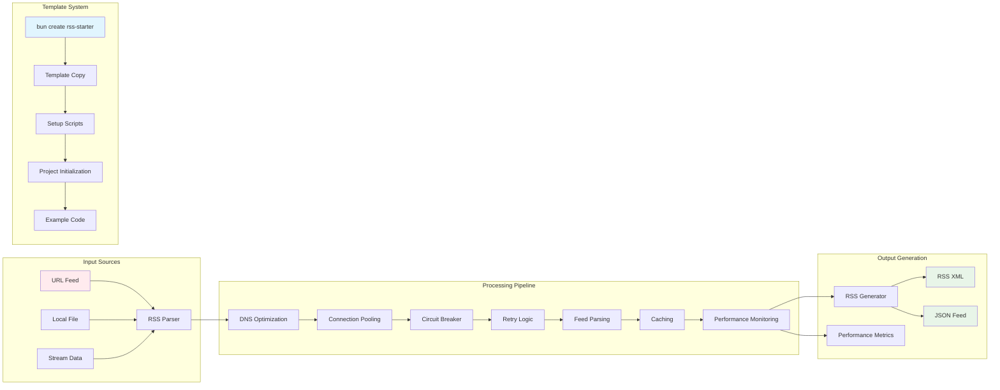
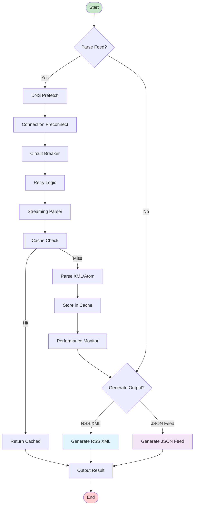
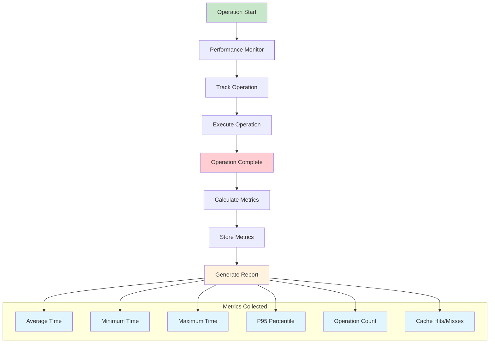

# RSS Feed Library Architecture

## System Overview

```mermaid
graph TB
    subgraph "RSS Feed Library Core"
        A[Package.json] --> B[Main Entry Point]
        B --> C[Config Manager]
        B --> D[Circuit Breaker]
        B --> E[Retry With Backoff]
        B --> F[DNS Optimizer]
        B --> G[Connection Optimizer]
        B --> H[Enhanced JSONL Streamer]
        B --> I[Optimized RSS Fetcher]
        
        B --> J[RSS Parser]
        B --> K[RSS Generator]
        B --> L[Performance Monitor]
    end
    
    subgraph "Bun Template System"
        M[.bun-create/rss-starter/]
        M --> N[package.json]
        M --> O[index.js]
        M --> P[examples/]
        M --> Q[README.md]
        
        N --> R[bun-create config]
        R --> S[preinstall script]
        R --> T[postinstall script]
        R --> U[start command]
    end
    
    subgraph "CLI Interface"
        V[cli.js]
        V --> W[Command Line Parser]
        W --> X[RSS Parser Integration]
        W --> Y[Performance Monitoring]
        W --> Z[Output Formatting]
    end
    
    subgraph "Testing & Validation"
        AA[tests/]
        AA --> BB[rss-parser.test.js]
        AA --> CC[jsonl-streaming.test.js]
        AA --> DD[performance-tracker.test.js]
        AA --> EE[buffer-optimization.test.js]
    end
    
    subgraph "Documentation"
        FF[README.md]
        FF --> GG[Usage Examples]
        FF --> HH[API Reference]
        FF --> II[Bun Template Guide]
        FF --> JJ[Performance Tips]
    end
    
    J --> KK[Feed Parsing]
    K --> LL[Feed Generation]
    L --> MM[Metrics Collection]
    
    KK --> NN[Streaming Parser]
    KK --> OO[Caching System]
    KK --> PP[Error Handling]
    
    LL --> QQ[RSS XML Output]
    LL --> RR[JSON Feed Output]
    
    MM --> SS[Average Times]
    MM --> TT[Min/Max Times]
    MM --> UU[P95 Percentiles]
    
    style A fill:#e1f5fe
    style M fill:#f3e5f5
    style V fill:#e8f5e8
    style AA fill:#fff3e0
    style FF fill:#fce4ec
```



## Component Relationships



## Data Flow Architecture



## Bun Template Creation Flow

```mermaid
sequenceDiagram
    participant User
    participant BunCLI
    participant Template
    participant Setup
    participant Project
    
    User->>BunCLI: bun create rss-starter my-app
    BunCLI->>Template: Load template from .bun-create/
    Template->>Setup: Execute preinstall script
    Setup->>User: "Setting up RSS Feed Library..."
    
    BunCLI->>Project: Create project directory
    Project->>Project: Copy template files
    BunCLI->>Setup: Execute postinstall script
    Setup->>User: "Project created successfully!"
    Setup->>User: "Next steps: bun dev, bun test"
    
    User->>Project: bun install
    User->>Project: bun dev
    Project->>User: Start development server
    
    alt Custom Directory
        User->>BunCLI: Set BUN_CREATE_DIR
        BunCLI->>Template: Load from custom location
    end
    
    alt CLI Flags
        User->>BunCLI: --force, --no-install, etc.
        BunCLI->>Setup: Apply flags to setup process
    end
    
    style User fill:#e3f2fd
    style BunCLI fill:#f1f8e9
    style Template fill:#fce4ec
    style Setup fill:#fff3e0
    style Project fill:#e8f5e8
```

## Performance Monitoring Architecture



## Error Handling Flow

```mermaid
graph TD
    A[Feed Request] --> B[DNS Resolution]
    B --> C{DNS Success?}
    C -->|No| D[DNS Error]
    C -->|Yes| E[Connection Attempt]
    
    E --> F{Connection Success?}
    F -->|No| G[Connection Error]
    F -->|Yes| H[Fetch Data]
    
    H --> I{Fetch Success?}
    I -->|No| J[Fetch Error]
    I -->|Yes| K[Parse Data]
    
    K --> L{Parse Success?}
    L -->|No| M[Parse Error]
    L -->|Yes| N[Success]
    
    D --> O[Retry Logic]
    G --> O
    J --> O
    M --> O
    
    O --> P{Retries Remaining?}
    P -->|Yes| Q[Wait & Retry]
    P -->|No| R[Final Error]
    
    Q --> A
    R --> S[Error Handling]
    N --> T[Return Result]
    
    style A fill:#e3f2fd
    style N fill:#c8e6c9
    style T fill:#c8e6c9
    style R fill:#ffcdd2
    style S fill:#ffcdd2