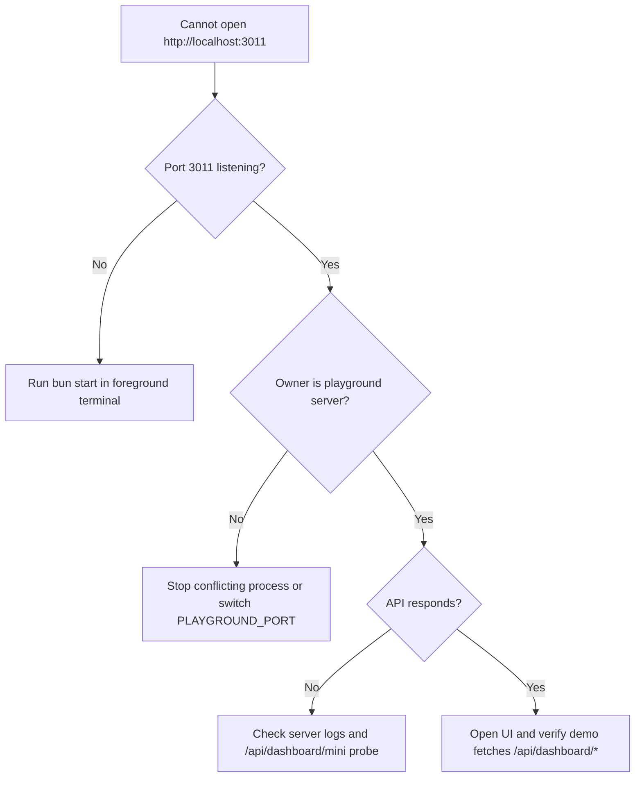
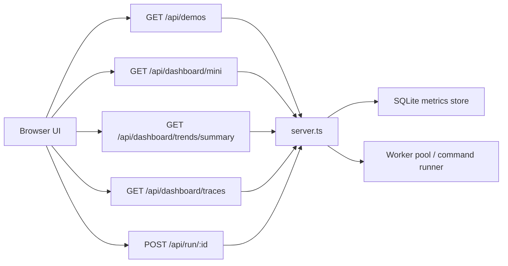
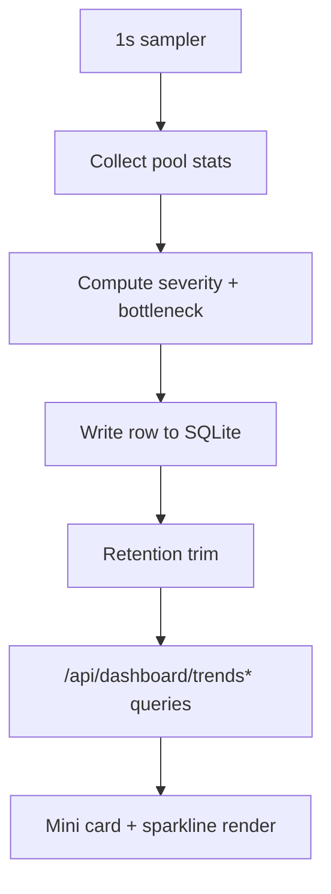
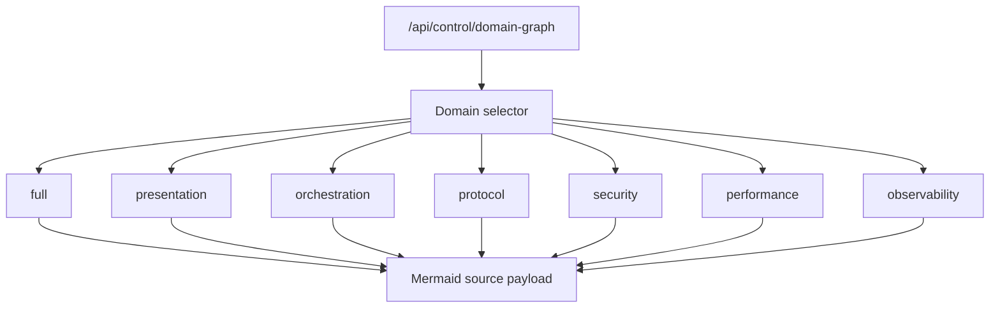
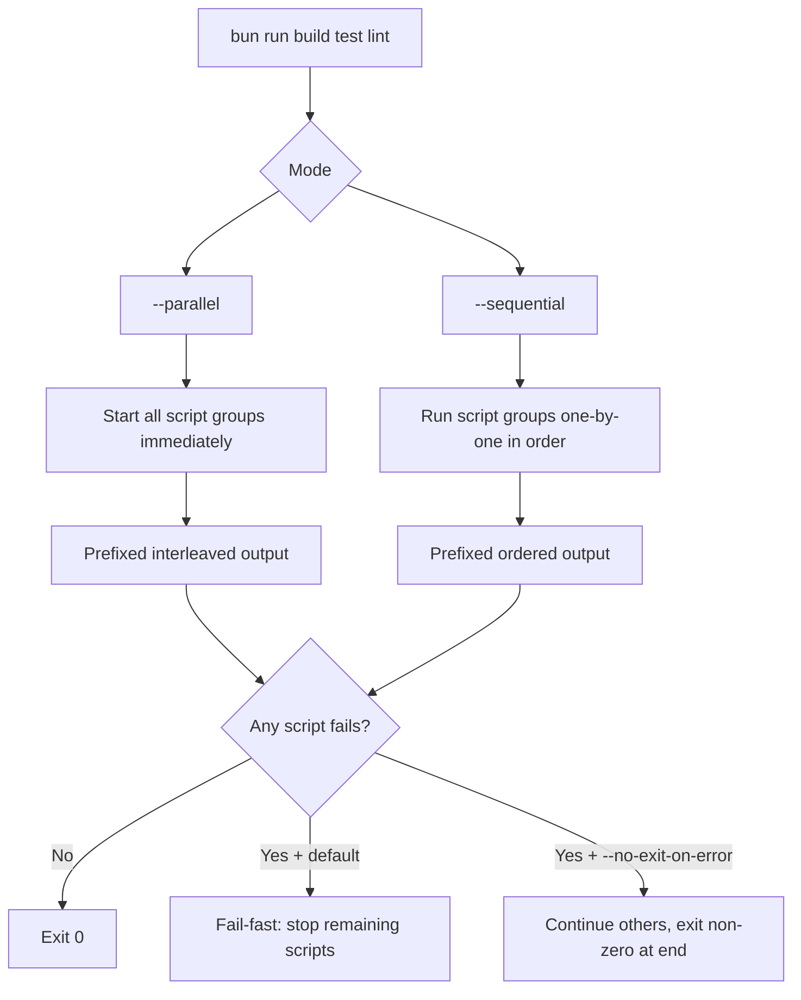

# Bun v1.3.9 Browser Playground

A beautiful, interactive web-based playground showcasing all Bun v1.3.9 features.

## 🚀 Quick Start

```bash
cd playground-web
bun install
bun start
```

Then open http://localhost:3011 in your browser!

## Port + Pooling Controls

Use a dedicated playground port with explicit fallback policy and bounded concurrency:

```bash
PLAYGROUND_PORT=3000 \
PLAYGROUND_ALLOW_PORT_FALLBACK=false \
PLAYGROUND_PORT_RANGE=3011-3020 \
PLAYGROUND_MAX_CONCURRENT_REQUESTS=200 \
PLAYGROUND_MAX_COMMAND_WORKERS=2 \
PLAYGROUND_PREFETCH_ENABLED=0 \
PLAYGROUND_PRECONNECT_ENABLED=0 \
PLAYGROUND_PREFETCH_HOSTS=api.example.com,r2.example.com \
PLAYGROUND_PRECONNECT_URLS=https://api.example.com,https://r2.example.com \
PLAYGROUND_SMOKE_TIMEOUT_MS=2000 \
PLAYGROUND_FETCH_TIMEOUT_MS=30000 \
PLAYGROUND_FETCH_DECOMPRESS=true \
PLAYGROUND_FETCH_VERBOSE=off \
PLAYGROUND_MAX_BODY_SIZE_MB=10 \
PLAYGROUND_BODY_TYPE=text \
PLAYGROUND_PROXY_URL=http://proxy.internal:8080 \
PLAYGROUND_PROXY_DEFAULT=http://proxy.internal:8080 \
PLAYGROUND_PROXY_AUTH_TOKEN=secret-token \
PLAYGROUND_SECRETS_SERVICE=com.factorywager.playground.dashboard \
PLAYGROUND_SECRETS_LEGACY_SERVICES=com.factorywager.playground \
PLAYGROUND_STREAM_CHUNK_SIZE=16384 \
PLAYGROUND_S3_DEFAULT_CONTENT_TYPE=application/octet-stream \
PLAYGROUND_SMOKE_URLS=http://localhost:3011/api/info,http://localhost:3011/api/brand/status \
bun start
```

- `DASHBOARD_PORT`: alias for `PLAYGROUND_PORT` (checked first when set)
- `PLAYGROUND_PORT`: preferred dedicated port (default: `3011` unless `PORT` set)
- `PLAYGROUND_ALLOW_PORT_FALLBACK`: when `true`, remap within `PLAYGROUND_PORT_RANGE` if requested port is busy (default: `false`, fail-fast)
- `PLAYGROUND_PORT_RANGE`: fallback range used only when `PLAYGROUND_ALLOW_PORT_FALLBACK=true`
- `PLAYGROUND_MAX_CONCURRENT_REQUESTS`: HTTP request cap before `503`
- `PLAYGROUND_MAX_COMMAND_WORKERS`: max concurrent demo command executions
- `PLAYGROUND_PREFETCH_ENABLED`: enable DNS prefetch warmup (`0|1`)
- `PLAYGROUND_PRECONNECT_ENABLED`: enable fetch preconnect warmup (`0|1`)
- `PLAYGROUND_PREFETCH_HOSTS`: comma-separated hostnames for DNS prefetch
- `PLAYGROUND_PRECONNECT_URLS`: comma-separated URLs for preconnect
- `PLAYGROUND_SMOKE_TIMEOUT_MS`: timeout per smoke test request
- `PLAYGROUND_FETCH_TIMEOUT_MS`: default fetch timeout for control-plane fetches
- `PLAYGROUND_FETCH_DECOMPRESS`: enable/disable automatic response decompression for smoke fetches
- `PLAYGROUND_FETCH_VERBOSE`: fetch debug output mode (`off|true|curl`)
- `PLAYGROUND_MAX_BODY_SIZE_MB`: response body size limit for smoke fetches
- `PLAYGROUND_BODY_TYPE`: base request body type (`text|json|form|multipart|binary`)
- `PLAYGROUND_PROXY_URL`: primary proxy URL (preferred over legacy/default proxy var)
- `PLAYGROUND_PROXY_DEFAULT`: optional default proxy URL for smoke fetches
- `PLAYGROUND_PROXY_AUTH_TOKEN`: optional proxy auth bearer token
- `PLAYGROUND_SECRETS_SERVICE`: primary Bun.secrets service namespace for playground integration
- `PLAYGROUND_SECRETS_LEGACY_SERVICES`: comma-separated legacy service namespaces for safe migration
- `PLAYGROUND_STREAM_CHUNK_SIZE`: byte window used in response size accounting
- `SEARCH_GOVERNANCE_FETCH_DEPTH`: governance git fetch depth used by policy checks (default `5`, shown in header as `Gov Depth`)
- `PLAYGROUND_S3_DEFAULT_CONTENT_TYPE`: fallback MIME when key extension is unknown
- `PLAYGROUND_SMOKE_URLS`: optional explicit smoke URL list (defaults to local info/status APIs)
- `PLAYGROUND_BRAND_STATUS_STRICT_PROBE`: enable strict benchmark probe in `/api/brand/status` (default `false` to avoid extra command load)
- `PLAYGROUND_IGNORE_SIGHUP`: ignore terminal hangup signal to reduce accidental shutdowns (default `true`)
- `PLAYGROUND_EXIT_ON_UNHANDLED_REJECTION`: treat unhandled promise rejections as fatal and exit (default `false`)
- `PLAYGROUND_EXIT_ON_UNCAUGHT_EXCEPTION`: treat uncaught exceptions as fatal and exit (default `true`)

Header/runtime metadata now includes:
- `Bun.version`
- `Bun.revision`
- `gitCommitHash` (from `GIT_COMMIT_HASH` env or macro fallback)
- `gitCommitHashSource` (`env|macro`)

Smoke endpoint:

```bash
curl -s http://localhost:<port>/api/control/network-smoke
curl -s http://localhost:<port>/api/control/secrets/runtime
curl -s http://localhost:<port>/api/control/features
curl -s http://localhost:<port>/api/control/protocol-matrix
curl -s http://localhost:<port>/api/control/component-status
curl -s http://localhost:<port>/api/control/deployment-readiness
curl -s http://localhost:<port>/api/control/performance-impact
curl -s http://localhost:<port>/api/control/security-posture
curl -s "http://localhost:<port>/api/control/domain-graph?domain=full"
curl -s http://localhost:<port>/api/control/protocol-scorecard
curl -s http://localhost:<port>/api/control/evidence-dashboard
curl -s http://localhost:<port>/api/control/decision-defense
curl -s http://localhost:<port>/api/control/governance-status
curl -s -X POST http://localhost:<port>/api/control/upload-progress \
  -H "content-type: application/json" \
  -d '{"bodyType":"multipart","sizeBytes":1048576,"chunkSize":131072}'
curl -s "http://localhost:<port>/api/control/s3-content-type?key=assets/logo.svg"
curl -s -X POST http://localhost:<port>/api/control/s3-content-type-batch \
  -H "content-type: application/json" \
  -d '{"keys":["app.js","styles.css","readme.md","archive.bin"]}'
curl -s http://localhost:<port>/api/dashboard/mini
curl -s "http://localhost:<port>/api/dashboard/severity-test?load=85"
curl -s "http://localhost:<port>/api/dashboard/traces?limit=20" | jq .
curl -s "http://localhost:<port>/api/dashboard/trends/summary?minutes=60&limit=120" | jq .
curl -s "http://localhost:<port>/api/trends/summary?minutes=60&limit=120" | jq .
curl -s "http://localhost:<port>/api/trend-summary?minutes=60&limit=120" | jq .
curl -s http://localhost:<port>/api/control/bundle/analyze | jq .
```

Mini dashboard APIs:
- `GET /api/dashboard/mini`: live pool snapshot plus mini-card friendly values:
  - `bottleneck`: `{ kind, severity }`
  - `capacity`: `{ connectionsPct, workersPct, summary, severity }`
  - `headroom.connections|workers`: `{ available, max, pct, severity }`
  - `workerQueue`: `{ queuedTasks, inFlightTasks, severity }`
  - `workerHardening`: `{ timedOutTasks, rejectedTasks, timedOutSeverity, rejectedSeverity }`
- `GET /api/dashboard/severity-test?load=<0-100>`: deterministic severity mapping for:
  - `utilization`: `ok|warn|fail` using `<50`, `50-80`, `>80`
  - `capacity`: `ok|warn|fail` using `>50`, `20-50`, `<20`
  - `headroom`: `ok|warn|fail` using `>30`, `10-30`, `<10`
- `GET /api/dashboard/trends?minutes=60&limit=120`: historical SQLite-backed capacity timeline
  - `summary`: `{ count, avgLoadMaxPct, avgCapacityPct, deltaLoadMaxPct, deltaCapacityPct, severityCounts, bottleneckChanges, windowCoveragePct, latest, oldest }`
  - `points[]`: rolling snapshot rows (`loadMaxPct`, `capacitySummary`, `bottleneck`, headroom percentages)
- `GET /api/dashboard/trends/summary?minutes=60&limit=120`: summary-only historical view for compact dashboard cards and trend health widgets
- `GET /api/trends/summary` and `GET /api/trend-summary`: aliases for `GET /api/dashboard/trends/summary`
- `GET /api/control/secrets/runtime`: Bun.secrets runtime diagnostics (platform backend + service contract + fallback policy)
- `WS /ws/capacity`: broadcasts `dashboard/mini`-shape payload every second for real-time mini-card updates

Governance component matrix API:
- `GET /api/control/component-status`: operational inventory with owner, test coverage, performance budget, security review, docs pointer, and production posture.

Deployment readiness API:
- `GET /api/control/deployment-readiness`: production-ready (12) vs beta-staging (2) matrix with deployment plans, blockers, and action plans.

Performance impact API:
- `GET /api/control/performance-impact`: Bun v1.3.9 before/after performance matrix with component-level gain/impact rows.

Security posture API:
- `GET /api/control/security-posture`: security review summary and component-level findings/blockers/compliance posture.

Domain topology API:
- `GET /api/control/domain-graph?domain=<full|presentation|orchestration|protocol|security|performance|observability>`: Mermaid-wrapped domain graph source for live topology panels.

Mini dashboard UI rows now include:
- `Bottleneck`
- `Capacity`
- `Headroom (Conn)`
- `Headroom (Workers)`
- `Worker Queue`
- `Worker Timeouts`
- `Worker Rejections`

Worker-pool diagnostics APIs:
- `GET /api/control/worker-pool`: full pool/config snapshot with queue severity and latest bench.
- `GET /api/control/worker-pool/diagnostics`: compact diagnostics payload:
  - `workers`, `busy`, `queued`, `inFlight`, `timedOutTasks`, `rejectedTasks`, `lastErrors[]`
- `POST /api/control/worker-pool/bench?iterations=<n>&concurrency=<n>`:
  - executes a persisted worker-pool benchmark snapshot with compare-vs-last gate result.

Validate mini dashboard contract from repo root:

```bash
bun run test:dashboard:mini
bun run test:dashboard:endpoints
bun run test:dashboard:websocket
bun run deployment:readiness
```

Local verify runbook (single green pass):

```bash
# Starts playground server if needed, then runs mini + endpoint checks
bun run test:dashboard:suite

# Snapshot sanity checks
curl -s http://localhost:3011/api/dashboard/mini | jq '{bottleneck,capacity,headroom}'
curl -s "http://localhost:3011/api/dashboard/trends?minutes=15&limit=20" | jq '{summary, points: (.points|length)}'
curl -s "http://localhost:3011/api/dashboard/severity-test?load=85" | jq '.severity'
curl -s "http://localhost:3011/api/dashboard/severity-test?load=60" | jq '.severity'
curl -s "http://localhost:3011/api/dashboard/severity-test?load=30" | jq '.severity'

# Optional websocket smoke (requires wscat)
wscat -c ws://localhost:3011/ws/capacity
```

Execution matrix:

```bash
# Required fail-fast lane
bun run --parallel build test lint

# Diagnostic lane (collect all failures)
bun run --parallel --no-exit-on-error build test lint

# Ordered execution (memory-constrained / deterministic ordering)
bun run --sequential build test lint
```

`--parallel` starts script groups immediately and fails fast by default.
`--sequential` runs script groups in order.
Use `--no-exit-on-error` when you need full failure inventory in one pass.

NO_PROXY behavior (Bun v1.3.9+):

```bash
NO_PROXY=localhost,127.0.0.1 bun test ./scratch
```

If code passes an explicit `proxy` option to `fetch()`/`WebSocket`, Bun still applies `NO_PROXY` matching before proxy routing.

## Bun Version + Demo Module Cross-Reference

Version checks:

```bash
# Declared playground baseline
cat ./VERSION | jq '{version,bunVersion,commit,date}'

# Runtime values from server
curl -s http://localhost:3011/api/control/features | jq .
```

Quick module map (demo id -> runnable module script):

| Bun v1.3.9 feature | Demo ID | Module script |
| --- | --- | --- |
| `bun run --parallel/--sequential` | `parallel` | `../playground/demos/parallel-scripts.ts` |
| HTTP/2 net.Server upgrade path | `http2` | `../playground/demos/http2-upgrade.ts` |
| `Symbol.dispose` in tests | `symbol-dispose` | `../playground/demos/symbol-dispose.ts` |
| NO_PROXY proxy-bypass behavior | `proxy` | `../playground/demos/no-proxy.ts` |
| CPU profiling (`--cpu-prof*`) | `profiling` | `../playground/demos/cpu-profiling.ts` |
| ESM bytecode compile | `bytecode` | `../playground/demos/esm-bytecode.ts` |
| Perf/JIT/runtime highlights | `performance` | `../playground/demos/performance.ts` |
| Bugfix spotlight set | `bugfixes` | `../playground/demos/bugfixes.ts` |

Contract validation/bench per demo ID:

```bash
# Validate module contract for one demo ID
curl -s "http://localhost:3011/api/control/demo-module/validate?id=parallel" | jq .

# Run contract bench for one demo ID
curl -s "http://localhost:3011/api/control/demo-module/bench?id=parallel" | jq .

# Full loop: validate + bench + demo run
curl -s "http://localhost:3011/api/control/demo-module/full-loop?id=parallel" | jq .
```

List all registered demo IDs and contract metadata:

```bash
curl -s http://localhost:3011/api/demos | jq '.demos[] | {id, language, flags, benchCommand, testCommand}'
```

Tier-1 baseline checks:

```bash
# Contract shape + per-demo tier-1 baseline enforcement
bun run demo:contract:validate

# Tier-1 source/provider coverage across all demos
bun run demo:tier1:check

# Benchmark all demos with source-backed gates
bun run demo:bench:all

# Benchmark a focused slice (protocol/governance ids)
bun run demo:bench:core

# Compare against last persisted snapshot and fail on regressions
bun run demo:bench:all:gate
bun run demo:bench:core:gate

# Single demo full loop (test + benchmark + source-backed baseline)
bun run validate:demo --id=parallel
```

Tier-1 source policy for demo baselines:
- Bun blog/release/docs:
  - [Bun v1.3.9 blog](https://bun.com/blog/bun-v1.3.9)
  - [Bun v1.3.9 release](https://github.com/oven-sh/bun/releases/tag/bun-v1.3.9)
  - [Bun test docs](https://bun.com/docs/test)
- MDN:
  - [Keep-Alive header](https://developer.mozilla.org/en-US/docs/Web/HTTP/Headers/Keep-Alive)
- Linux kernel docs:
  - [send_sig API reference](https://www.kernel.org/doc/html/latest/core-api/kernel-api.html#c.send_sig)

Benchmark snapshots are persisted to:
- `reports/demo-bench/latest.json`
- `reports/demo-bench/snapshot-<timestamp>.json`

Expected severity snapshots:
- `load=85`: `utilization=fail`, `capacity=fail`, `headroom=warn`
- `load=60`: `utilization=warn`, `capacity=warn`, `headroom=ok`
- `load=30`: `utilization=ok`, `capacity=ok`, `headroom=ok`

Historical store env overrides:
- `PLAYGROUND_METRICS_DB_PATH` (default: `/.cache/playground-dashboard-metrics.sqlite` under repo root)
- `PLAYGROUND_METRICS_RETENTION_ROWS` (default: `5000`)
- `PLAYGROUND_METRICS_INTERVAL_MS` (default: `1000`)

Scorecard rationale highlights:
- Unix sockets are preferred for sub-1KB same-host IPC due to low overhead and strong local boundary controls.
- Blob-based tiny payload paths benefit from Bun v1.3.9 small-buffer runtime optimizations.
- HTTPS over HTTP/2 reduces tiny-request overhead via multiplexed connection reuse.

Evidence governance for architecture decisions:
- `Tier`: confidence level of the claim (for example: `T1` validated runtime behavior).
- `Authority`: where the claim derives authority (runtime behavior, protocol design, release notes).
- `Verification Method`: how the team validated the claim.
- `Claim`: concise decision statement.
- `Sources`: docs/runtime traces used to support the claim.
- `Benchmark`: measurable check tied to the claim.
- `Council Risk`: review risk level if the claim is wrong (`Low|Medium|High`).

Use `GET /api/control/protocol-scorecard` and inspect `evidenceGovernance.entries` for traceable claim records.
Use `GET /api/control/governance-status` to view canonical decision status (`APPROVED/REVIEW_REQUIRED`), tier coverage (`T1+T2`), and benchmark gate cycle mode (`WARN n/5` or `STRICT`).

## Troubleshooting

- Server exits after terminal closes:
  - Keep the Bun process in a foreground terminal session; HTTP keep-alive preserves connections only, not process lifetime.
- `localhost:3011` shows nothing after restart:
  - Check port owner: `lsof -nP -iTCP:3011 -sTCP:LISTEN`
  - Re-run service in foreground: `bun start`
- Dashboard API not loading:
  - Verify health and mini endpoints:
    - `curl -s http://localhost:3011/api/dashboard/mini | jq .`
    - `curl -s "http://localhost:3011/api/dashboard/trends/summary?minutes=15&limit=20" | jq .`



## ✨ Features

- Responsive dashboard UI for local Bun demos
- Keyboard-first command menu flow in the demo viewer
- Live mini metrics (pool, bottleneck, headroom, trend summary)
- Real API-backed demos for Bun v1.3.9 release features
- Local governance/evidence endpoints for decision traceability

## 📈 Performance Improvements (v2.1.0)

### New in Bun v1.3.9
- **String#startsWith**: 1.42x faster (5.76x faster with constant folding)
- **Set#size and Map#size**: 2.24x to 2.74x faster
- **String#trim**: 1.10x to 1.42x faster
- **String#replace**: now returns ropes (lazy concatenation) to avoid unnecessary allocations

These improvements make our bundle analysis faster, especially when processing large numbers of files and strings.

## 📋 Available Demos

### Script Orchestration
- **Parallel & Sequential Scripts** - Run multiple scripts concurrently or sequentially

### Networking
- **HTTP/2 Connection Upgrades** - net.Server → Http2SecureServer pattern
- **NO_PROXY Environment Variable** - Proxy bypass for localhost

### Testing
- **Mock Auto-Cleanup** - Symbol.dispose with `using` keyword

### Performance
- **CPU Profiling Interval** - Configurable profiling intervals
- **Performance Optimizations** - RegExp JIT, Markdown, String optimizations

### Build
- **ESM Bytecode Compilation** - ESM bytecode support

### Bugfixes
- **Key Bugfixes** - Important compatibility and stability improvements

## 🎮 Usage

1. **Start the server:**
   ```bash
   bun start
   ```

2. **Open in browser:**
   ```
   http://localhost:3011
   ```

3. **Select a demo** from the sidebar

4. **View the code** and click "Run Demo" to execute it

5. **Copy code** using the "Copy" button

## 🛠️ Development

Run in development mode with hot reload:

```bash
bun run dev
```

Keep the process alive:
- Run `bun run start` in one terminal and keep it open.
- Use another terminal tab for tests/commands.
- HTTP keep-alive keeps connections open; it does not restart a process after exit.

## 📁 Structure

```
playground-web/
├── server.ts      # Bun server with API endpoints
├── index.html     # Main HTML page
├── styles.css     # Styling
├── app.js         # Frontend JavaScript
└── package.json   # Package configuration
```

## 🌐 API Endpoints

- `GET /api/demos` - list demo metadata and code blocks
- `GET /api/demo/:id` - fetch one demo payload
- `POST /api/run/:id` - execute a demo command
- `GET /api/dashboard/mini` - compact pool + headroom snapshot
- `GET /api/dashboard/severity-test?load=<0-100>` - threshold mapping check
- `GET /api/dashboard/traces?limit=<n>` - recent trace events
- `GET /api/dashboard/trends?minutes=60&limit=120` - time-window trend series
- `GET /api/dashboard/trends/summary?minutes=60&limit=120` - compact trend summary
- `GET /api/control/process/runtime` - server PID, shutdown state, command telemetry, and port-owner diagnostics
- `GET /api/control/socket/runtime` - WebSocket path/topic, client/message/broadcast counters, and socket error state
- `GET /api/control/udp/runtime` - UDP capability and latest self-test state (runs/failures/latency)
- `POST /api/control/udp/self-test` - local loopback UDP probe using `Bun.udpSocket()`
- `POST /api/control/udp/open` - open managed UDP control socket (host/port)
- `POST /api/control/udp/close` - close managed UDP control socket
- `POST /api/control/udp/options` - apply socket options (`broadcast`, `ttl`, `multicastTTL`, `multicastLoopback`, `multicastInterface`)
- `POST /api/control/udp/peer` - set default UDP destination (`hostname`, `port`)
- `POST /api/control/udp/send` - send one UDP datagram to configured/default peer
- `POST /api/control/udp/send-many` - send batched UDP datagrams using `sendMany()`
- `POST /api/control/udp/send` and `POST /api/control/udp/send-many` include packet-header metadata (`sequenceId`, `sourceId`, `timestampUs`) when UDP packet tracking is enabled
- `POST /api/control/udp/profile/select` - choose multicast address + TTL from named profile (`scope`, `reliability`, `security`, `scale`, `ipFamily`)
- `POST /api/control/udp/multicast/join` - join multicast group (`group`, optional `interfaceAddress`)
- `POST /api/control/udp/multicast/leave` - leave multicast group
- `POST /api/control/udp/ssm/join` - join source-specific multicast (`source`, `group`)
- `POST /api/control/udp/ssm/leave` - leave source-specific multicast
- `GET /api/control/bundle/analyze` - bundle analysis summary for dashboard panel
- `GET /api/control/domain-graph?domain=<full|presentation|orchestration|protocol|security|performance|observability>` - Mermaid-wrapped topology source

## 🧭 Mermaid Diagrams

### Runtime Request Path



### Trend Snapshot Pipeline



### Domain Topology Feed



### Script Execution Semantics (`--parallel` vs `--sequential`)



## 🎨 Features Showcased

All Bun v1.3.9 features are demonstrated with:
- ✅ Code examples
- ✅ Runnable demos
- ✅ Real output
- ✅ Copy-to-clipboard
- ✅ Beautiful UI

## 📚 Related

- [CLI Playground](../playground/) - Command-line version
- [Examples](../README.md) - All examples and documentation
- [Official Release Notes](https://bun.com/blog/bun-v1.3.9)

## Notes

- This is a local playground service, separate from public docs dashboards.
- For stable local behavior, keep one foreground server process and run tests from a second terminal.
