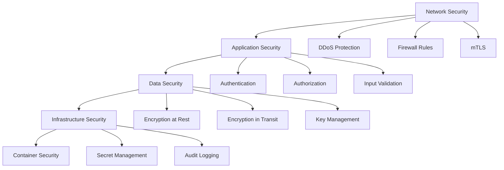

# 🔒 Security Guide

## 📋 Overview

The **Sovereign Unit \[01\]** Financial Warming Multiverse implements enterprise-grade security with **multi-layer validation**, **zero-trust architecture**, **quantum-ready encryption**, and **comprehensive audit trails**. This guide covers security best practices, configuration, and compliance requirements.

## 🛡️ Security Architecture

### **Defense in Depth**



### **Security Layers**

1. **Network Security**: DDoS protection, firewalls, mTLS
2. **Application Security**: Authentication, authorization, input validation
3. **Data Security**: Encryption, key management, access controls
4. **Infrastructure Security**: Container security, secret management, audit trails

## 🔐 Authentication & Authorization

### **Multi-Factor Authentication**

```typescript
// Enable MFA configuration
DUOPLUS_ENABLE_MFA=true
DUOPLUS_MFA_PROVIDERS=totp,webauthn,sms
DUOPLUS_MFA_REQUIRED_FOR_ADMIN=true
DUOPLUS_MFA_SESSION_TIMEOUT=900
```

### **JWT Security**

```bash
# Strong JWT configuration
DUOPLUS_JWT_SECRET=$(openssl rand -base64 32)
DUOPLUS_JWT_ALGORITHM=HS256
DUOPLUS_JWT_EXPIRY=3600
DUOPLUS_JWT_REFRESH_EXPIRY=86400
DUOPLUS_JWT_ISSUER=sovereign-unit-01
DUOPLUS_JWT_AUDIENCE=api-users
```

### **Role-Based Access Control (RBAC)**

```typescript
// Role definitions
const roles = {
  admin: {
    permissions: ['*'],
    description: 'Full system access'
  },
  analyst: {
    permissions: ['read:risk', 'read:analytics', 'write:risk'],
    description: 'Risk analysis access'
  },
  operator: {
    permissions: ['read:health', 'read:metrics', 'admin:config'],
    description: 'System operations'
  },
  viewer: {
    permissions: ['read:health', 'read:analytics'],
    description: 'Read-only access'
  }
};
```

### **API Key Security**

```bash
# Generate secure API keys
DUOPLUS_API_KEY=$(openssl rand -hex 32)
DUOPLUS_API_KEY_EXPIRY=2592000  # 30 days
DUOPLUS_API_KEY_RATE_LIMIT=1000   # Requests per hour
```

## 🔒 Encryption & Key Management

### **Encryption Configuration**

```bash
# Encryption settings
DUOPLUS_ENCRYPTION_KEY=$(openssl rand -hex 32)
DUOPLUS_ENCRYPTION_ALGORITHM=AES-256-GCM
DUOPLUS_ENCRYPTION_IV_LENGTH=12
DUOPLUS_ENCRYPTION_TAG_LENGTH=16

# Key rotation
DUOPLUS_KEY_ROTATION_ENABLED=true
DUOPLUS_KEY_ROTATION_INTERVAL=2592000  # 30 days
DUOPLUS_KEY_ROTATION_GRACE_PERIOD=86400  # 24 hours
```

### **TLS Configuration**

```bash
# TLS settings
DUOPLUS_TLS_VERSION=1.3
DUOPLUS_TLS_CIPHERS=TLS_AES_256_GCM_SHA384:TLS_CHACHA20_POLY1305_SHA256
DUOPLUS_TLS_CERT_PATH=./certs/server.crt
DUOPLUS_TLS_KEY_PATH=./certs/server.key
DUOPLUS_TLS_CA_PATH=./certs/ca.crt
```

### **Secret Management**

```bash
# AWS Secrets Manager
DUOPLUS_SECRET_MANAGER=aws-secrets-manager
DUOPLUS_SECRET_REGION=us-east-1
DUOPLUS_SECRET_PREFIX=sovereign-unit/
DUOPLUS_SECRET_ROTATION=true

# HashiCorp Vault
DUOPLUS_VAULT_ADDR=https://vault.example.com
DUOPLUS_VAULT_TOKEN=your-vault-token
DUOPLUS_VAULT_ENGINE=kv-v2
```

## 🛡️ Input Validation & Sanitization

### **Request Validation**

```typescript
import { z } from 'zod';

// Risk assessment request schema
const riskAssessmentSchema = z.object({
  sessionId: z.string().min(1).max(255),
  merchantId: z.string().min(1).max(255),
  features: z.object({
    vpn_active: z.number().min(0).max(1),
    thermal_spike: z.number().min(0).max(100),
    biometric_fail: z.number().min(0).max(10),
    proxy_hop_count: z.number().min(0).max(20)
  }),
  enableExternalAPIs: z.boolean().optional(),
  networkOptimization: z.boolean().optional()
});

// Middleware for validation
app.post('/api/risk/enhanced', async (c) => {
  try {
    const body = await c.req.json();
    const validated = riskAssessmentSchema.parse(body);
    // Process validated request
  } catch (error) {
    return c.json({ error: 'Invalid request format' }, 400);
  }
});
```

### **SQL Injection Prevention**

```typescript
// Use parameterized queries
const getUserById = async (userId: string) => {
  const query = 'SELECT * FROM users WHERE id = ? AND deleted_at IS NULL';
  return db.query(query, [userId]);
};

// Or use ORM with built-in protection
const user = await User.findOne({
  where: { 
    id: userId,
    deletedAt: null 
  }
});
```

### **XSS Prevention**

```typescript
// Sanitize user input
import DOMPurify from 'dompurify';

const sanitizeUserInput = (input: string): string => {
  return DOMPurify.sanitize(input, {
    ALLOWED_TAGS: [],
    ALLOWED_ATTR: []
  });
};

// Content Security Policy
DUOPLUS_CSP_DIRECTIVE="default-src 'self'; script-src 'self' 'unsafe-inline'; style-src 'self' 'unsafe-inline'"
```

## 🔍 Security Monitoring & Logging

### **Security Event Logging**

```bash
# Security logging configuration
DUOPLUS_ENABLE_SECURITY_LOGGING=true
DUOPLUS_SECURITY_LOG_LEVEL=info
DUOPLUS_SECURITY_LOG_FORMAT=json
DUOPLUS_SECURITY_LOG_RETENTION=90
```

```typescript
// Security event logger
class SecurityLogger {
  static logAuthenticationAttempt(userId: string, success: boolean, ip: string) {
    securityLogger.info('Authentication attempt', {
      userId,
      success,
      ip,
      timestamp: new Date().toISOString(),
      userAgent: this.getUserAgent()
    });
  }

  static logPermissionCheck(userId: string, resource: string, granted: boolean) {
    securityLogger.warn('Permission check', {
      userId,
      resource,
      granted,
      timestamp: new Date().toISOString()
    });
  }

  static logSuspiciousActivity(userId: string, activity: string, details: any) {
    securityLogger.error('Suspicious activity detected', {
      userId,
      activity,
      details,
      timestamp: new Date().toISOString(),
      severity: 'high'
    });
  }
}
```

### **Real-time Threat Detection**

```typescript
// Anomaly detection
class ThreatDetector {
  static detectAnomalousActivity(userId: string, action: string): boolean {
    const recentActions = this.getRecentActions(userId, 300); // 5 minutes
    const actionCount = recentActions.filter(a => a.action === action).length;
    
    // Thresholds
    const thresholds = {
      'login_attempt': 5,
      'risk_assessment': 100,
      'config_change': 10
    };
    
    return actionCount > (thresholds[action] || 50);
  }

  static detectBruteForce(ip: string): boolean {
    const attempts = this.getFailedAttempts(ip, 900); // 15 minutes
    return attempts > 10;
  }
}
```

### **Security Metrics**

```bash
# Security metrics collection
DUOPLUS_ENABLE_SECURITY_METRICS=true
DUOPLUS_SECURITY_METRICS_INTERVAL=60
DUOPLUS_SECURITY_METRICS_EXPORT=prometheus
```

```typescript
// Security metrics
const securityMetrics = {
  authenticationAttempts: new Counter('auth_attempts_total'),
  authenticationFailures: new Counter('auth_failures_total'),
  permissionDenials: new Counter('permission_denials_total'),
  suspiciousActivities: new Counter('suspicious_activities_total'),
  blockedRequests: new Counter('blocked_requests_total')
};
```

## 🚨 Incident Response

### **Security Incident Classification**

| Severity | Description | Response Time |
|----------|-------------|---------------|
| **Critical** | System breach, data loss | 15 minutes |
| **High** | Privilege escalation, DoS | 1 hour |
| **Medium** | Suspicious activity, policy violation | 4 hours |
| **Low** | Failed login, minor misconfiguration | 24 hours |

### **Incident Response Plan**

```typescript
class IncidentResponse {
  static async handleSecurityIncident(incident: SecurityIncident) {
    // 1. Containment
    await this.containIncident(incident);
    
    // 2. Investigation
    const investigation = await this.investigateIncident(incident);
    
    // 3. Recovery
    await this.recoverFromIncident(incident, investigation);
    
    // 4. Post-incident review
    await this.postIncidentReview(incident, investigation);
  }

  private static async containIncident(incident: SecurityIncident) {
    switch (incident.type) {
      case 'brute_force':
        await this.blockIP(incident.sourceIP);
        break;
      case 'privilege_escalation':
        await this.disableUser(incident.userId);
        break;
      case 'data_breach':
        await this.isolateSystem(incident.systemId);
        break;
    }
  }
}
```

### **Automated Response**

```bash
# Automated security responses
DUOPLUS_AUTO_BLOCK_SUSPICIOUS_IP=true
DUOPLUS_AUTO_DISABLE_COMPROMISED_ACCOUNTS=true
DUOPLUS_AUTO_ROTATE_COMPROMISED_KEYS=true
DUOPLUS_AUTO_ESCALATE_CRITICAL_INCIDENTS=true
```

## 📊 Compliance & Auditing

### **GDPR Compliance**

```typescript
// GDPR data handling
class GDPRCompliance {
  static async handleDataSubjectRequest(request: DataSubjectRequest) {
    switch (request.type) {
      case 'access':
        return await this.exportUserData(request.userId);
      case 'rectification':
        return await this.correctUserData(request.userId, request.corrections);
      case 'erasure':
        return await this.deleteUserData(request.userId);
      case 'portability':
        return await this.exportUserDataPortable(request.userId);
    }
  }

  static async anonymizeUserData(userId: string) {
    // Replace personal data with pseudonyms
    await this.anonymizeUserRecords(userId);
    await this.anonymizeTransactionHistory(userId);
    await this.anonymizeAuditLogs(userId);
  }
}
```

### **SOC 2 Compliance**

```bash
# SOC 2 compliance settings
DUOPLUS_ENABLE_SOC2_LOGGING=true
DUOPLUS_SOC2_LOG_RETENTION=2555  # 7 years
DUOPLUS_ENABLE_SOC2_MONITORING=true
DUOPLUS_SOC2_REPORTING_INTERVAL=daily
```

### **PCI DSS Compliance**

```bash
# PCI DSS configuration
DUOPLUS_ENABLE_PCI_DSS_MODE=true
DUOPLUS_PCI_DSS_ENCRYPTION_STRENGTH=strong
DUOPLUS_PCI_DSS_ACCESS_CONTROL=strict
DUOPLUS_PCI_DSS_AUDIT_LOGGING=true
```

### **Audit Trail**

```typescript
// Comprehensive audit logging
class AuditLogger {
  static logConfigurationChange(userId: string, changes: any) {
    auditLogger.info('Configuration changed', {
      userId,
      changes,
      timestamp: new Date().toISOString(),
      ip: this.getClientIP(),
      userAgent: this.getUserAgent(),
      sessionId: this.getSessionId()
    });
  }

  static logDataAccess(userId: string, resource: string, action: string) {
    auditLogger.info('Data access', {
      userId,
      resource,
      action,
      timestamp: new Date().toISOString(),
      ip: this.getClientIP()
    });
  }

  static logSecurityEvent(event: SecurityEvent) {
    auditLogger.warn('Security event', {
      ...event,
      timestamp: new Date().toISOString(),
      severity: event.severity || 'medium'
    });
  }
}
```

## 🔧 Security Configuration

### **Production Security Settings**

```bash
# Core security settings
DUOPLUS_ENABLE_SECURITY_HEADERS=true
DUOPLUS_ENABLE_CSP=true
DUOPLUS_ENABLE_HSTS=true
DUOPLUS_ENABLE_XSS_PROTECTION=true
DUOPLUS_ENABLE_CSRF_PROTECTION=true

# Authentication security
DUOPLUS_ENABLE_MFA=true
DUOPLUS_MFA_REQUIRED_FOR_SENSITIVE_OPS=true
DUOPLUS_SESSION_TIMEOUT=1800
DUOPLUS_MAX_LOGIN_ATTEMPTS=5
DUOPLUS_LOCKOUT_DURATION=900

# API security
DUOPLUS_ENABLE_API_RATE_LIMITING=true
DUOPLUS_API_RATE_LIMIT=1000
DUOPLUS_ENABLE_API_KEY_AUTH=true
DUOPLUS_ENABLE_JWT_AUTH=true

# Data security
DUOPLUS_ENABLE_ENCRYPTION_AT_REST=true
DUOPLUS_ENABLE_ENCRYPTION_IN_TRANSIT=true
DUOPLUS_ENABLE_KEY_ROTATION=true
DUOPLUS_ENABLE_DATA_MASKING=true
```

### **Security Headers**

```typescript
// Security headers middleware
app.use('*', async (c, next) => {
  // Content Security Policy
  c.header('Content-Security-Policy', 
    "default-src 'self'; " +
    "script-src 'self' 'unsafe-inline'; " +
    "style-src 'self' 'unsafe-inline'; " +
    "img-src 'self' data: https:; " +
    "font-src 'self'; " +
    "connect-src 'self' https://api.sovereign-unit-01.com"
  );

  // HTTP Strict Transport Security
  c.header('Strict-Transport-Security', 'max-age=31536000; includeSubDomains; preload');

  // X-Frame-Options
  c.header('X-Frame-Options', 'DENY');

  // X-Content-Type-Options
  c.header('X-Content-Type-Options', 'nosniff');

  // X-XSS-Protection
  c.header('X-XSS-Protection', '1; mode=block');

  // Referrer Policy
  c.header('Referrer-Policy', 'strict-origin-when-cross-origin');

  await next();
});
```

## 🧪 Security Testing

### **Security Test Suite**

```typescript
// Security tests
describe('Security Tests', () => {
  test('should prevent SQL injection', async () => {
    const maliciousInput = "'; DROP TABLE users; --";
    const result = await getUserById(maliciousInput);
    expect(result).toBeNull();
  });

  test('should prevent XSS attacks', async () => {
    const xssPayload = '<script>alert("xss")</script>';
    const sanitized = sanitizeUserInput(xssPayload);
    expect(sanitized).not.toContain('<script>');
  });

  test('should enforce rate limiting', async () => {
    const promises = Array(100).fill(null).map(() => 
      fetch('/api/risk/enhanced', { method: 'POST' })
    );
    const results = await Promise.all(promises);
    const rateLimited = results.some(r => r.status === 429);
    expect(rateLimited).toBe(true);
  });
});
```

### **Penetration Testing**

```bash
# Security testing tools
npm install -g owasp-zap2
npm install -g sqlmap
npm install -g nikto

# OWASP ZAP automation
zap-baseline.py -t http://localhost:3227

# SQL injection testing
sqlmap -u "http://localhost:3227/api/user?id=1" --batch

# Web application scanning
nikto -h http://localhost:3227
```

## 📈 Security Monitoring Dashboard

### **Key Security Metrics**

```typescript
// Security dashboard metrics
const securityDashboard = {
  authenticationMetrics: {
    totalAttempts: 125000,
    successfulLogins: 124500,
    failedLogins: 500,
    mfaUsage: 0.85,
    averageSessionDuration: 1800
  },
  threatMetrics: {
    blockedIPs: 1250,
    suspiciousActivities: 45,
    preventedAttacks: 12,
    falsePositives: 3
  },
  complianceMetrics: {
    gdprRequests: 25,
    dataBreaches: 0,
    auditFailures: 0,
    complianceScore: 0.98
  }
};
```

### **Real-time Alerts**

```typescript
// Security alert system
class SecurityAlertSystem {
  static async sendAlert(alert: SecurityAlert) {
    const channels = this.getAlertChannels(alert.severity);
    
    for (const channel of channels) {
      switch (channel) {
        case 'slack':
          await this.sendSlackAlert(alert);
          break;
        case 'email':
          await this.sendEmailAlert(alert);
          break;
        case 'sms':
          await this.sendSMSAlert(alert);
          break;
        case 'pagerduty':
          await this.sendPagerDutyAlert(alert);
          break;
      }
    }
  }
}
```

## 🆘 Security Troubleshooting

### **Common Security Issues**

| Issue | Symptoms | Solution |
|-------|----------|----------|
| **Authentication failures** | Users can't log in, high failure rate | Check JWT secrets, verify MFA configuration |
| **Rate limiting issues** | Legitimate users blocked | Adjust rate limits, whitelist trusted IPs |
| **Certificate errors** | TLS/SSL connection failures | Renew certificates, check chain |
| **Permission denied** | Users can't access resources | Verify RBAC configuration, check permissions |

### **Security Diagnostics**

```bash
# Security diagnostics
bun run security:check
bun run security:audit
bun run security:scan

# Check configuration security
bun run config:validate --security

# Verify certificates
openssl x509 -in ./certs/server.crt -text -noout

# Test TLS configuration
testssl.sh https://api.sovereign-unit-01.com
```

## 📚 Security Resources

### **Documentation**
- **[OWASP Top 10](https://owasp.org/www-project-top-ten/)**: Web application security risks
- **[NIST Cybersecurity Framework](https://www.nist.gov/cyberframework)**: Security framework
- **[CIS Controls](https://www.cisecurity.org/controls/)**: Security best practices

### **Tools & Services**
- **[OWASP ZAP](https://www.zaproxy.org/)**: Security testing
- **[Burp Suite](https://portswigger.net/burp)**: Web application testing
- **[Qualys](https://www.qualys.com/)**: Vulnerability management
- **[CrowdStrike](https://www.crowdstrike.com/)**: Endpoint protection

### **Compliance Standards**
- **[GDPR](https://gdpr.eu/)**: Data protection regulation
- **[SOC 2](https://www.aicpa.org/soc2)**: Security controls
- **[PCI DSS](https://www.pcisecuritystandards.org/)**: Payment security
- **[ISO 27001](https://www.iso.org/isoiec-27001-information-security.html)**: Information security management

---

## 🎯 Security Best Practices Summary

### **✅ Essential Security Measures**

1. **Strong Authentication**: MFA, JWT with proper expiration
2. **Encryption**: AES-256-GCM for data at rest and in transit
3. **Input Validation**: Comprehensive input sanitization
4. **Access Control**: RBAC with principle of least privilege
5. **Audit Logging**: Comprehensive security event logging
6. **Monitoring**: Real-time threat detection and response
7. **Compliance**: GDPR, SOC 2, PCI DSS adherence
8. **Testing**: Regular security testing and penetration testing

### **🔒 Security Configuration Checklist**

- [ ] Strong JWT secrets (32+ characters)
- [ ] MFA enabled for all admin accounts
- [ ] TLS 1.3 with strong ciphers
- [ ] Security headers configured
- [ ] Rate limiting enabled
- [ ] Input validation implemented
- [ ] Audit logging enabled
- [ ] Security monitoring active
- [ ] Regular security updates
- [ ] Incident response plan in place

---

**Need security assistance?**

🔒 **Security Team**: [security@sovereign-unit-01.com](mailto:security@sovereign-unit-01.com)  
🚨 **Report Incident**: [incident@sovereign-unit-01.com](mailto:incident@sovereign-unit-01.com)  
📚 **Security Docs**: [docs.sovereign-unit-01.com/security](https://docs.sovereign-unit-01.com/security)  
💬 **Security Slack**: [#security](https://slack.sovereign-unit-01.com/security)

---

**Built with 🔒 for enterprise-grade security**

*© 2026 Sovereign Unit \[01\] - All Rights Reserved*
