# 🏷️ Frontmatter Tag Registry

> **Complete Reference**  
> *Authorized Tags • Dashboard Field Mappings • Properties • Usage • Examples*

---

## 🎯 Overview

This registry documents all authorized tags and properties that can be used in note frontmatter. Tags **must** be lowercase, kebab-case, and follow the categorization system defined here. Properties are mapped to Meta Tags, HSL colors, and transformation rules for consistent processing.

**Meta Tags** are not mere labels—they are **core architectural primitives** that define semantic purpose, operational impact, and visual channel correlation within the `BUN:FIRST` Kimi2 platform.

---

## 🏗️ Meta Tag Architecture

### Formalized Meta Tag Mappings for Kimi2

Meta Tags define the **rules of engagement** for properties, transforming them from labels into architectural primitives that guide operational behavior, caching strategies, analytics, and visual representation.

---

### **1. `[META: DYNAMIC]`**

**Semantic Purpose:**
- **"Real-time Volatility"**: Signifies that the associated property is **highly variable, changes frequently (often per request or per interaction), and reflects the current live operational state or external environment**. Not static configuration or long-term identification.
- **Contextual Data**: Indicates data primarily used for real-time context, request processing, or immediate state.

**Operational Impact (`bun-platform` Integration):**
- **Telemetry & Logging**: Properties marked `[META: DYNAMIC]` (e.g., `ip`, `user_agent`, `cookies`, `xff`, `requestPath`) are automatically included in core request logs and telemetry events, providing real-time context for debugging and analysis.
- **Caching**: `bun-platform` tools (API Gateway, cache services) will avoid caching data influenced by `[META: DYNAMIC]` properties, or ensure cache keys incorporate these dynamic elements.
- **Security & Compliance**: These fields are prioritized for real-time anomaly detection, rate limiting, and access control (e.g., GeoIP-based access, specific `IP` blocking).
- **Resource Allocation**: Components processing many `[META: DYNAMIC]` fields may require higher transient resource allocation.
- **Dynamic Configuration**: May trigger adaptive responses in services (e.g., `LOG_LEVEL` changes based on `IP` or `User-Agent` to debug specific client issues).

**Visual Channel Correlation:**
- **Color**: `CH:'HSL(180,100%,50%),hex(#00FFFF),HEX(#00FFFF)'` - **Command CH1 (Cyan)**
- **Purpose**: Cyan visually identifies data/components dealing with **active, transient runtime information**.
- **Dashboard**: Data streams derived from `[META: DYNAMIC]` fields are highlighted in cyan.
- **Logs**: Log entries enriched by `[META: DYNAMIC]` properties use this color for metadata tags.
- **Architectural Canvas**: Components (e.g., `API/GATEWAY`) heavily focused on processing dynamic request data are colored with Command CH1.

**Fields Using `[META: DYNAMIC]`:**
- `path`, `template`, `xff`, `xForwardedFor`, `userAgentRaw`, `referer`, `referrer`, `cookiesRaw`, `acceptLanguage`, `acceptEncoding`, `cacheControl`, `connectionType`, `requestPath`, `ip`, `ip4`, `ip6`, `ipv4`, `ipv6`, `latitude`, `longitude`, `timezone`, `asn`, `source_component_ref`, `csrfToken`, `allCookies`

---

### **2. `[META: VERSION]`**

**Semantic Purpose:**
- **"Resource State/Identity"**: Indicates that the associated property is tied to the **version or specific state of a resource**. Used for integrity checks, caching validation, and tracking changes over time.
- **Immutability for a Given Version**: While the *resource* changes over time, its `[META: VERSION]` identifier is immutable for that specific version of the resource.

**Operational Impact (`bun-platform` Integration):**
- **Caching**: Properties marked `[META: VERSION]` (e.g., `etag`, `e_tag`, `version`) are fundamental for HTTP caching headers (`If-None-Match`), ensuring efficient resource delivery and minimizing redundant transfers.
- **Concurrency Control**: Used in optimistic locking strategies for data updates (e.g., "only update if ETag matches current resource version").
- **Deployment Rollback**: `bun-platform deploy` can use `[META: VERSION]` to verify resource states before a rollback.
- **Content Delivery Network (CDN)**: CDN invalidation strategies heavily rely on `[META: VERSION]` properties.
- **Change Tracking**: Enables tracking of resource evolution over time for audit and compliance.

**Visual Channel Correlation:**
- **Color**: `CH:'HSL(160,84%,39%),hex(#06FFA5),HEX(#06FFA5)'` - **Version Teal**
- **Purpose**: Teal identifies data/components ensuring **consistency and integrity through versioning**.
- **Dashboard**: Cache hit rates or resource validation statuses are displayed with this color.
- **Logs**: Log entries for cache hits/misses or resource version conflicts use teal.
- **Architectural Canvas**: Components (e.g., `CACHE_SERVICE`, `CDN_INTEGRATION`) critical for version-based integrity are colored with Version Teal.

**Fields Using `[META: VERSION]`:**
- `version`, `created`, `updated`, `modified`, `due_date`, `estimated_hours`, `progress`, `replaces`, `etag`, `e_tag`, `browserVersion`, `osVersion`

---

### **3. `[META: DOMAIN]`**

**Semantic Purpose:**
- **"Client Environment Classification"**: Categorizes the associated property as describing the **fundamental environment or platform of the client interaction**. Helps classify the user's base operating conditions.
- **Aggregatable Context**: Data suitable for aggregation and segmentation to understand broad client demographics or technology adoption.

**Operational Impact (`bun-platform` Integration):**
- **Analytics & Reporting**: Properties marked `[META: DOMAIN]` (e.g., `os`, `browser`, `osName`, `browserName`, `countryCode`) are primary dimensions for all analytics reports, allowing segmentation by operating system, browser usage, geography, etc.
- **Frontend Optimization**: `bun-platform` tools can use this to serve optimized assets (e.g., WebP for specific browsers, older JS bundles for legacy OS versions).
- **A/B Testing**: Can be used as a primary segmentation factor for A/B tests (e.g., "feature X on iOS vs. Android").
- **Bug Prioritization**: Bugs occurring only on specific `OS` or `Browser` combinations can be prioritized.
- **Security Profiles**: Can define different security profiles or risk scores for `mobile` vs `desktop` operating systems.
- **Resource Routing**: Components can route requests based on domain classification (e.g., mobile vs desktop endpoints).

**Visual Channel Correlation:**
- **Color**: `CH:'HSL(220,100%,50%),hex(#3A86FF),HEX(#3A86FF)'` - **Core Blue**
- **Purpose**: Core Blue visually identifies **fundamental, defining characteristics of the client environment**. Represents the baseline "domain" of interaction.
- **Dashboard**: Pie charts or bar graphs showing `OS`, `Browser`, or `Country` distribution use this color.
- **Logs**: Log entries for client initialization or session start use Core Blue.
- **Architectural Canvas**: Components (e.g., `CLIENT_CONTEXT_PARSER`, `FRONTEND_BUILD_SYSTEM`) responsible for understanding the client's core environment are colored with Core Blue.

**Fields Using `[META: DOMAIN]`:**
- `id`, `name`, `title`, `author`, `assignee`, `project`, `proposed_component_id`, `component_id`, `os`, `browser`, `requestId`, `browserName`, `osName`, `deviceBrand`, `deviceModel`, `countryCode`, `countryName`, `regionCode`, `regionName`, `city`, `zipCode`, `isp`, `danCookie`, `danSessionId`, `analyticsId`

---

### **4. `[META: ACTIVE]`**

**Semantic Purpose:**
- **"Operational State"**: Indicates properties that describe the **active operational state, status, or boolean flags** of a resource or system.
- **State Management**: Used for tracking active/inactive states, enabled/disabled flags, and operational conditions.

**Operational Impact (`bun-platform` Integration):**
- **Health Monitoring**: Properties marked `[META: ACTIVE]` (e.g., `status`, `deprecated`, `isBot`, `isMobile`, `isGeoBlocked`) are used for health checks and system state monitoring.
- **Feature Flags**: Can be used to enable/disable features based on operational state.
- **Resource Lifecycle**: Tracks resource lifecycle states (active, deprecated, draft, etc.).
- **Access Control**: Boolean flags (`isBot`, `isMobile`, `isGeoBlocked`) influence access control and rate limiting decisions.

**Visual Channel Correlation:**
- **Color**: `CH:'HSL(300,100%,50%),hex(#FF00FF),HEX(#FF00FF)'` - **Event CH3 (Magenta)**
- **Purpose**: Magenta identifies **operational state and active conditions**.
- **Dashboard**: Status indicators and operational flags use magenta.
- **Logs**: State changes and operational events are highlighted in magenta.
- **Architectural Canvas**: Components managing operational state are colored with Event CH3.

**Fields Using `[META: ACTIVE]`:**
- `status`, `deprecated`, `priority`, `severity`, `research_completed`, `feed_integration`, `isBot`, `isMobile`, `isGeoBlocked`, `requestMethod`

---

### **5. `[META: CATEGORY]`**

**Semantic Purpose:**
- **"Classification & Grouping"**: Indicates properties used for **categorization, classification, or grouping** of resources.
- **Taxonomy**: Enables hierarchical organization and filtering of resources by category.

**Operational Impact (`bun-platform` Integration):**
- **Resource Organization**: Properties marked `[META: CATEGORY]` (e.g., `category`, `type`, `deviceType`, `config_type`) enable filtering, grouping, and organization of resources.
- **Routing & Load Balancing**: Can route requests based on category classification.
- **Analytics Segmentation**: Provides secondary dimensions for analytics beyond domain classification.
- **Template Selection**: Used to select appropriate templates or processing pipelines based on category.

**Visual Channel Correlation:**
- **Color**: `CH:'HSL(270,70%,55%),hex(#8338EC),HEX(#8338EC)'` - **Category Purple**
- **Purpose**: Purple identifies **categorization and classification systems**.
- **Dashboard**: Category filters and classification widgets use purple.
- **Logs**: Category tags in logs are displayed in purple.
- **Architectural Canvas**: Components handling categorization are colored with Category Purple.

**Fields Using `[META: CATEGORY]`:**
- `category`, `type`, `deviceType`, `config_type`

---

### **6. `[META: DESCRIPTION]`**

**Semantic Purpose:**
- **"Human-Readable Context"**: Indicates properties containing **human-readable descriptions, explanations, or contextual information**.
- **Documentation**: Used for documentation, help text, and user-facing descriptions.

**Operational Impact (`bun-platform` Integration):**
- **Documentation Generation**: Properties marked `[META: DESCRIPTION]` (e.g., `description`, `usage`, `feature`, `topic`) are used for auto-generating documentation and help systems.
- **Search & Discovery**: Enables full-text search and content discovery.
- **User Interface**: Used in UI tooltips, help text, and contextual information displays.
- **API Documentation**: Automatically included in API documentation generation.

**Visual Channel Correlation:**
- **Color**: `CH:'HSL(45,100%,50%),hex(#FFBE0B),HEX(#FFBE0B)'` - **Description Yellow**
- **Purpose**: Yellow identifies **human-readable descriptive content**.
- **Dashboard**: Help text and descriptions use yellow accents.
- **Logs**: Descriptive metadata is highlighted in yellow.
- **Architectural Canvas**: Documentation components are colored with Description Yellow.

**Fields Using `[META: DESCRIPTION]`:**
- `description`, `usage`, `feature`, `topic`

---

### **7. `[META: TAGS]`**

**Semantic Purpose:**
- **"Multi-Dimensional Labeling"**: Indicates properties containing **arrays or collections of tags, labels, or identifiers** for multi-dimensional classification.
- **Flexible Taxonomy**: Enables flexible, multi-faceted organization beyond single category classification.

**Operational Impact (`bun-platform` Integration):**
- **Multi-Faceted Filtering**: Properties marked `[META: TAGS]` (e.g., `tags`, `related_projects`, `attendees`, `canvas`, `VIZ-06`) enable complex filtering and querying across multiple dimensions.
- **Recommendation Systems**: Used for content recommendation and related resource discovery.
- **Search Enhancement**: Enhances search capabilities with multi-dimensional tag matching.
- **Analytics Dimensions**: Provides flexible dimensions for analytics beyond fixed categories.

**Visual Channel Correlation:**
- **Color**: `CH:'HSL(330,100%,50%),hex(#FF006E),HEX(#FF006E)'` - **Tags Pink**
- **Purpose**: Pink identifies **multi-dimensional tagging and labeling systems**.
- **Dashboard**: Tag clouds and multi-tag filters use pink.
- **Logs**: Tag arrays in logs are displayed in pink.
- **Architectural Canvas**: Tagging and labeling components are colored with Tags Pink.

**Fields Using `[META: TAGS]`:**
- `tags`, `related_projects`, `attendees`, `canvas`, `VIZ-06`

---

### **8. `[META: RELATIVE]`**

**Semantic Purpose:**
- **"Path Resolution"**: Indicates properties containing **relative paths or references** that require resolution relative to a base path or environment variable.
- **Dynamic Path Construction**: Used for constructing paths dynamically based on environment or context.

**Operational Impact (`bun-platform` Integration):**
- **Path Resolution**: Properties marked `[META: RELATIVE]` (e.g., `template`) are resolved relative to base paths or environment variables.
- **Environment Adaptation**: Enables different path resolutions in different environments (dev, staging, production).
- **Template Resolution**: Used for resolving template paths dynamically.
- **Asset Management**: Enables dynamic asset path resolution for CDN or local serving.

**Visual Channel Correlation:**
- **Color**: `CH:'HSL(15,97%,50%),hex(#FB5607),HEX(#FB5607)'` - **Data Orange**
- **Purpose**: Orange identifies **relative path resolution and dynamic path construction**.
- **Dashboard**: Path resolution status uses orange indicators.
- **Logs**: Relative path operations are highlighted in orange.
- **Architectural Canvas**: Path resolution components are colored with Data Orange.

**Fields Using `[META: RELATIVE]`:**
- `template`

---

### **9. `[META: STATIC]`**

**Semantic Purpose:**
- **"Immutable Reference Data"**: Indicates that the associated property is **static, immutable, and does not change over the lifetime of the system or resource**. Used for constants, enumerations, or fixed configuration.
- **Reference Data**: Typically used for country codes, language codes, currency lists, application names, and other fixed reference data.

**Operational Impact (`bun-platform` Integration):**
- **Caching**: Properties marked `[META: STATIC]` are ideal for long-term caching (e.g., CDN, browser cache) with very long expiration times.
- **Performance**: Can be aggressively optimized and pre-loaded into memory for fast access.
- **Change Management**: Changes to `[META: STATIC]` fields typically require a deployment or system update.
- **Memory Usage**: Can be safely stored in memory for fast access without concern for staleness.
- **Build Optimization**: Enables build-time optimization and static analysis.

**Visual Channel Correlation:**
- **Color**: `CH:'HSL(300,100%,50%),hex(#FF00FF),HEX(#FF00FF)'` - **Event CH3 (Magenta)**
- **Purpose**: Magenta visually identifies **immutable, constant data that forms the foundation of the system**.
- **Dashboard**: Static reference data tables or configuration screens use magenta.
- **Logs**: Log entries related to system constants use magenta.
- **Architectural Canvas**: Components (e.g., `CONFIG_SERVICE`, `REFERENCE_DATA_API`) that serve static data are colored with Magenta.

**Fields Using `[META: STATIC]`:**
- `country_codes`, `language_codes`, `currency_list`, `application_name`, and other immutable reference data

---

### **10. `[META: CONFIG]`**

**Semantic Purpose:**
- **"Adjustable System Behavior"**: Indicates that the associated property is a **configuration setting that can be adjusted to modify system behavior without code changes**. May change occasionally, but not per request.
- **Runtime Configuration**: Used for feature flags, timeout settings, log levels, database connection strings, and other adjustable parameters.

**Operational Impact (`bun-platform` Integration):**
- **Dynamic Configuration**: Properties marked `[META: CONFIG]` can be updated at runtime (via configuration management systems) and may trigger behavior changes in the system.
- **Caching**: Configuration data may be cached for a short period (to avoid frequent lookups) but must be refreshed when updated.
- **Observability**: Changes to `[META: CONFIG]` fields should be logged and audited.
- **Dependency Injection**: Often used to parameterize system components.
- **Feature Flags**: Enables runtime feature toggling without deployments.

**Visual Channel Correlation:**
- **Color**: `CH:'HSL(60,100%,50%),hex(#FFFF00),HEX(#FFFF00)'` - **Configuration Yellow**
- **Purpose**: Yellow visually identifies **adjustable configuration parameters that control system behavior**.
- **Dashboard**: Configuration management interfaces, feature flag dashboards use yellow.
- **Logs**: Log entries indicating configuration changes use yellow.
- **Architectural Canvas**: Components (e.g., `CONFIG_MANAGER`, `FEATURE_FLAG_SERVICE`) that handle configuration are colored with Configuration Yellow.

**Fields Using `[META: CONFIG]`:**
- `feature_flags`, `timeout_settings`, `log_level`, `database_connection_string`, and other adjustable configuration parameters

---

### **11. `[META: SENSITIVE]`**

**Semantic Purpose:**
- **"Confidential Data"**: Indicates that the associated property contains **sensitive information that must be protected**. Includes passwords, API keys, personal identifiable information (PII), etc.
- **Security Classification**: Used for data subject to regulatory requirements (GDPR, HIPAA) or requiring special protection.

**Operational Impact (`bun-platform` Integration):**
- **Security**: Properties marked `[META: SENSITIVE]` must be encrypted at rest and in transit. They should never be logged or exposed in clear text.
- **Access Control**: Strict access control and auditing must be applied to these fields.
- **Data Masking**: In non-production environments, these fields should be masked or replaced with fake data.
- **Compliance**: May be subject to regulatory requirements (e.g., GDPR, HIPAA, PCI-DSS).
- **Audit Logging**: All access to sensitive data must be logged for compliance auditing.

**Visual Channel Correlation:**
- **Color**: `CH:'HSL(0,100%,50%),hex(#FF0000),HEX(#FF0000)'` - **Security Red**
- **Purpose**: Red visually identifies **sensitive data that requires protection**.
- **Dashboard**: Security dashboards, access logs use red for sensitive data indicators.
- **Logs**: Log entries that involve sensitive data (with the data masked) use red.
- **Architectural Canvas**: Components (e.g., `AUTH_SERVICE`, `ENCRYPTION_SERVICE`) that handle sensitive data are colored with Security Red.

**Fields Using `[META: SENSITIVE]`:**
- `password`, `api_key`, `credit_card_number`, `social_security_number`, `csrfToken`, `danCookie`, `danSessionId`, and other sensitive identifiers

---

### **12. `[META: INTERNAL]`**

**Semantic Purpose:**
- **"System Internal Data"**: Indicates that the associated property is **used only within the system and is not exposed to clients or third parties**. May include internal identifiers, timestamps, or intermediate calculation results.
- **Internal Processing**: Used for internal state, processing status, audit trails, and system-internal metadata.

**Operational Impact (`bun-platform` Integration):**
- **Exposure**: Properties marked `[META: INTERNAL]` are stripped from responses to clients or transformed into external representations.
- **Logging**: Can be logged for debugging and auditing, but may be excluded from user-facing logs.
- **API Design**: Not included in public API contracts.
- **Internal State**: Used for tracking internal processing state and intermediate results.
- **Audit Trails**: Enables comprehensive internal audit logging without exposing internals.

**Visual Channel Correlation:**
- **Color**: `CH:'HSL(30,100%,50%),hex(#FF8000),HEX(#FF8000)'` - **Internal Orange**
- **Purpose**: Orange visually identifies **internal system data that is not for external consumption**.
- **Dashboard**: Internal system monitoring, debug views use orange.
- **Logs**: Debug logs, internal audit trails use orange.
- **Architectural Canvas**: Components (e.g., `INTERNAL_PROCESSING`, `AUDIT_SERVICE`) that handle internal data are colored with Internal Orange.

**Fields Using `[META: INTERNAL]`:**
- `internal_id`, `created_at`, `updated_at`, `processing_status`, `requestId`, and other internal system identifiers

---

### **13. `[META: EXTERNAL]`**

**Semantic Purpose:**
- **"Client-Facing Data"**: Indicates that the associated property is **exposed to clients or third parties and is part of the public API contract**.
- **Public API**: Used for data that forms the public interface of the system, requiring careful versioning and documentation.

**Operational Impact (`bun-platform` Integration):**
- **API Contract**: Properties marked `[META: EXTERNAL]` are part of the public API and must maintain backward compatibility.
- **Documentation**: Must be documented in API specifications (OpenAPI, GraphQL schemas).
- **Validation**: Subject to input validation and output sanitization.
- **Versioning**: Changes to these fields may require API versioning.
- **Deprecation**: Must follow deprecation protocols when changing or removing fields.

**Visual Channel Correlation:**
- **Color**: `CH:'HSL(120,100%,50%),hex(#00FF00),HEX(#00FF00)'` - **External Green**
- **Purpose**: Green visually identifies **client-facing data that is part of the public API**.
- **Dashboard**: API documentation, client integration dashboards use green.
- **Logs**: Access logs for public endpoints use green.
- **Architectural Canvas**: Components (e.g., `API_GATEWAY`, `PUBLIC_API`) that handle external data are colored with External Green.

**Fields Using `[META: EXTERNAL]`:**
- `user_id`, `order_number`, `product_name`, `public_profile`, `id`, `name`, `title`, and other public-facing identifiers

---

## 🎨 Meta Tag Visual Channel Summary

| Meta Tag | Color | Hex | HSL | Purpose | Operational Focus |
|----------|-------|-----|-----|---------|------------------|
| `[META: DYNAMIC]` | Command CH1 (Cyan) | `#00FFFF` | `HSL(180,100%,50%)` | Real-time volatility | Telemetry, caching, security |
| `[META: VERSION]` | Version Teal | `#06FFA5` | `HSL(160,84%,39%)` | Resource state/identity | Caching, concurrency, CDN |
| `[META: DOMAIN]` | Core Blue | `#3A86FF` | `HSL(220,100%,50%)` | Client environment | Analytics, optimization, A/B testing |
| `[META: ACTIVE]` | Event CH3 (Magenta) | `#FF00FF` | `HSL(300,100%,50%)` | Operational state | Health monitoring, feature flags |
| `[META: CATEGORY]` | Category Purple | `#8338EC` | `HSL(270,70%,55%)` | Classification | Organization, routing, analytics |
| `[META: DESCRIPTION]` | Description Yellow | `#FFBE0B` | `HSL(45,100%,50%)` | Human-readable context | Documentation, search, UI |
| `[META: TAGS]` | Tags Pink | `#FF006E` | `HSL(330,100%,50%)` | Multi-dimensional labeling | Filtering, recommendations, search |
| `[META: RELATIVE]` | Data Orange | `#FB5607` | `HSL(15,97%,50%)` | Path resolution | Template resolution, asset management |
| `[META: STATIC]` | Event CH3 (Magenta) | `#FF00FF` | `HSL(300,100%,50%)` | Immutable reference data | Long-term caching, reference data |
| `[META: CONFIG]` | Configuration Yellow | `#FFFF00` | `HSL(60,100%,50%)` | Adjustable system behavior | Feature flags, runtime config |
| `[META: SENSITIVE]` | Security Red | `#FF0000` | `HSL(0,100%,50%)` | Confidential data | Encryption, access control, compliance |
| `[META: INTERNAL]` | Internal Orange | `#FF8000` | `HSL(30,100%,50%)` | System internal data | Internal processing, audit trails |
| `[META: EXTERNAL]` | External Green | `#00FF00` | `HSL(120,100%,50%)` | Client-facing data | Public API, versioning, documentation |
| `[META: INTELLIGENCE]` | Intelligence Magenta | `#FF00FF` | `HSL(320,100%,50%)` | Cognitive processing | AI/ML workflows, model serving |
| `[META: SECURITY:CONTEXTUAL]` | Security Red | `#FF0000` | `HSL(0,100%,50%)` | Adaptive security | Threat intelligence, zero-trust |
| `[META: WORKFLOW:ORCHESTRATION]` | Automation Orange | `#FF8000` | `HSL(40,100%,50%)` | Process automation | Workflow orchestration, business processes |

---

## 🔄 Meta Tag Operational Flow

```mermaid
graph TD
    A[Request/Resource] --> B{Meta Tag?}
    B -->|DYNAMIC| C[Real-time Processing]
    B -->|VERSION| D[Cache Validation]
    B -->|DOMAIN| E[Analytics & Segmentation]
    B -->|ACTIVE| F[State Management]
    B -->|CATEGORY| G[Classification]
    B -->|DESCRIPTION| H[Documentation]
    B -->|TAGS| I[Multi-dimensional Filtering]
    B -->|RELATIVE| J[Path Resolution]
    B -->|STATIC| K[Reference Data]
    B -->|CONFIG| L[Runtime Configuration]
    B -->|SENSITIVE| M[Security & Encryption]
    B -->|INTERNAL| N[Internal Processing]
    B -->|EXTERNAL| O[Public API]
    B -->|INTELLIGENCE| P[Cognitive Processing]
    B -->|SECURITY:CONTEXTUAL| Q[Adaptive Security]
    B -->|WORKFLOW:ORCHESTRATION| R[Process Automation]
    
    C --> S[Telemetry & Logging]
    D --> T[CDN & Caching]
    E --> U[Reporting & Optimization]
    F --> V[Health Monitoring]
    G --> W[Resource Organization]
    H --> X[Search & Discovery]
    I --> Y[Recommendations]
    J --> Z[Template Resolution]
    K --> AA[Long-term Caching]
    L --> AB[Feature Flags]
    M --> AC[Access Control]
    N --> AD[Audit Trails]
    O --> AE[API Versioning]
    P --> AF[AI/ML Workflows]
    Q --> AG[Threat Intelligence]
    R --> AH[Workflow Orchestration]
    
    P --> AI[Pattern Detection]
    Q --> AJ[Zero-Trust Security]
    R --> AK[Business Process Automation]
```



---

## 🚀 BUN:FIRST Enhanced Meta Tag Protocol

### Advanced Semantic Primitives for Kimi2 Architecture

**Protocol Status**: `ENHANCED_INTELLIGENT`  
**Governance Level**: `COGNITIVE_ARCHITECTURAL_PRIMITIVE`  
**Learning Capability**: `CONTINUOUS_SEMANTIC_EVOLUTION`  
**Review Cycle**: `ADAPTIVE_SELF_OPTIMIZING`

Enhanced `[META: *]` tags now incorporate **temporal dimensions, security contexts, and behavioral patterns** to create a comprehensive semantic framework that drives autonomous system intelligence.

---

### Enhanced Core Meta Tags

#### **1. `[META: DYNAMIC]` → `[META: DYNAMIC:TEMPORAL]` Hierarchy**

**Expanded Semantic Purpose**:  
*"Multi-layered temporal volatility with contextual intelligence"*

| Temporal Layer | Volatility | Examples | Operational Impact |
|----------------|------------|----------|-------------------|
| **EPHEMERAL** | Microsecond | `request_id`, `session_token` | Immediate garbage collection, no persistence |
| **TRANSIENT** | Second/Minute | `ip`, `user_agent`, `geo_location` | Short-term caching, session-scoped |
| **SESSIONAL** | Hour/Day | `user_preferences`, `browsing_context` | Medium-term storage, user journey tracking |
| **CYCLICAL** | Periodic | `market_hours`, `seasonal_trends` | Pattern-based optimization |

**Enhanced Operational Impact**:
```yaml
intelligence:
  pattern_detection: "TEMPORAL_ANOMALY_DETECTION"
  forecasting: "BEHAVIORAL_PREDICTION"
  adaptation: "REAL_TIME_OPTIMIZATION"

security:
  temporal_profiling: "BEHAVIORAL_BASELINING"
  risk_scoring: "TIME_DECAY_ALGORITHMS"
  threat_detection: "SEQUENTIAL_PATTERN_ANALYSIS"

resource_management:
  lifecycle: "AUTO_EXPIRATION_POLICIES"
  scaling: "TEMPORAL_PREDICTION_MODELS"
```

**Visual Protocol Enhancement**:
```css
DYNAMIC_EPHEMERAL: "CH:'HSL(180,100%,80%)'  /* Light Cyan */"
DYNAMIC_TRANSIENT: "CH:'HSL(180,100%,50%)'  /* Standard Cyan */"  
DYNAMIC_SESSIONAL: "CH:'HSL(180,100%,30%)'  /* Dark Cyan */"
DYNAMIC_CYCLICAL: "CH:'HSL(180,80%,50%)'    /* Pattern Cyan */"
```

---

#### **2. `[META: VERSION]` → `[META: VERSION:CONTEXTUAL]` Matrix**

**Expanded Semantic Purpose**:  
*"Multi-dimensional versioning with contextual integrity"*

| Version Context | Scope | Examples | Integrity Rules |
|-----------------|-------|----------|-----------------|
| **RESOURCE** | Single Asset | `etag`, `content_hash` | Immutable per version |
| **SCHEMA** | Data Structure | `api_version`, `db_schema` | Backward compatibility |
| **DEPLOYMENT** | System State | `build_id`, `release_tag` | Rollback capability |
| **COMPOSITE** | Multi-component | `service_mesh_version` | Dependency validation |

**Enhanced Operational Impact**:
```yaml
governance:
  compliance: "AUDIT_TRAIL_GENERATION"
  validation: "CROSS_VERSION_INTEGRITY_CHECKS"
  enforcement: "AUTOMATED_ROLLBACK_TRIGGERS"

intelligence:
  impact_analysis: "DEPENDENCY_MAPPING"
  risk_assessment: "VERSION_COMPATIBILITY_SCORING"
  optimization: "PERFORMANCE_BENCHMARKING"

ecosystem:
  synchronization: "DISTRIBUTED_CONSENSUS"
  propagation: "MULTI_REGION_DEPLOYMENT"
  reconciliation: "AUTOMATED_DRIFT_CORRECTION"
```

**Visual Protocol Enhancement**:
```css
VERSION_RESOURCE: "CH:'HSL(160,84%,39%)'  /* Integrity Teal */"
VERSION_SCHEMA: "CH:'HSL(140,84%,39%)'    /* Structure Green */"
VERSION_DEPLOYMENT: "CH:'HSL(120,84%,39%)' /* System Emerald */"
VERSION_COMPOSITE: "CH:'HSL(100,84%,39%)'  /* Ecosystem Olive */"
```

---

#### **3. `[META: DOMAIN]` → `[META: DOMAIN:CONTEXTUAL]` Framework**

**Expanded Semantic Purpose**:  
*"Multi-dimensional environmental classification with behavioral context"*

| Domain Dimension | Classification | Examples | Intelligence Applications |
|------------------|----------------|----------|--------------------------|
| **PLATFORM** | Technical Stack | `os`, `browser`, `device` | Asset optimization, compatibility |
| **GEOGRAPHIC** | Physical Location | `country`, `region`, `locale` | Localization, compliance |
| **BEHAVIORAL** | Usage Patterns | `user_segment`, `engagement_level` | Personalization, retention |
| **ORGANIZATIONAL** | Business Context | `tenant_id`, `department`, `role` | Access control, customization |

**Enhanced Operational Impact**:
```yaml
personalization:
  content_optimization: "CONTEXT_AWARE_DELIVERY"
  experience_adaptation: "BEHAVIORAL_TRIGGERS"
  recommendation_engine: "MULTI_DIMENSIONAL_PROFILING"

analytics:
  segmentation: "CROSS_DIMENSIONAL_ANALYSIS"
  forecasting: "PATTERN_BASED_PREDICTION"
  optimization: "A/B_TESTING_MATRIX"

security:
  access_control: "CONTEXTUAL_AUTHORIZATION"
  risk_assessment: "MULTI_FACTOR_PROFILING"
  compliance: "GEOGRAPHIC_REGULATION_ENFORCEMENT"
```

**Visual Protocol Enhancement**:
```css
DOMAIN_PLATFORM: "CH:'HSL(220,100%,50%)'  /* Core Blue */"
DOMAIN_GEOGRAPHIC: "CH:'HSL(240,100%,50%)' /* Global Indigo */"
DOMAIN_BEHAVIORAL: "CH:'HSL(260,100%,50%)' /* Pattern Violet */"
DOMAIN_ORGANIZATIONAL: "CH:'HSL(280,100%,50%)' /* Business Purple */"
```

---

### New Advanced Meta Tags

#### **14. `[META: INTELLIGENCE]` - Cognitive Processing Primitive**

**Semantic Purpose**:  
*"Data and components driving machine learning, AI, and cognitive processing"*

| Intelligence Type | Function | Examples | Processing Mode |
|-------------------|----------|----------|-----------------|
| **TRAINING** | Model Development | `training_data`, `model_weights` | Batch processing |
| **INFERENCE** | Real-time Prediction | `prediction_input`, `model_output` | Real-time streaming |
| **FEEDBACK** | Learning Loop | `user_feedback`, `accuracy_scores` | Continuous learning |
| **OPTIMIZATION** | System Tuning | `hyperparameters`, `performance_metrics` | Adaptive adjustment |

**Operational Impact (`bun-platform` Integration)**:
```yaml
processing:
  pipeline: "INTELLIGENCE_WORKFLOW_ORCHESTRATION"
  resource_allocation: "GPU_NODE_SCALING"
  data_governance: "TRAINING_DATA_VERSIONING"

monitoring:
  model_performance: "ACCURACY_DRIFT_DETECTION"
  resource_utilization: "COST_EFFICIENCY_OPTIMIZATION"
  ethical_governance: "BIAS_DETECTION_ALERTS"

deployment:
  model_serving: "CANARY_DEPLOYMENT_STRATEGY"
  a_b_testing: "MODEL_PERFORMANCE_COMPARISON"
  rollback: "AUTOMATED_PERFORMANCE_TRIGGERS"
```

**Visual Channel Correlation**:
- **Color**: `CH:'HSL(320,100%,50%),hex(#FF00FF),HEX(#FF00FF)'` - **Intelligence Magenta**
- **Purpose**: Identifies **cognitive processing & AI workflows**
- **Dashboard**: ML model performance, training pipelines, inference metrics
- **Logs**: AI/ML operations, model deployments, training runs
- **Architectural Canvas**: Components (e.g., `ML_PIPELINE`, `MODEL_SERVING`, `TRAINING_SERVICE`) handling AI/ML workloads

**Fields Using `[META: INTELLIGENCE]`:**
- `training_data`, `model_weights`, `prediction_input`, `model_output`, `user_feedback`, `accuracy_scores`, `hyperparameters`, `performance_metrics`

---

#### **15. `[META: SECURITY:CONTEXTUAL]` - Adaptive Security Primitive**

**Semantic Purpose**:  
*"Context-aware security controls and threat intelligence"*

| Security Context | Protection Layer | Examples | Response Strategy |
|------------------|------------------|----------|-------------------|
| **AUTHENTICATION** | Identity Verification | `jwt_tokens`, `biometric_data` | Multi-factor validation |
| **AUTHORIZATION** | Access Control | `permissions`, `role_mappings` | Contextual policy enforcement |
| **ENCRYPTION** | Data Protection | `encryption_keys`, `cipher_data` | Cryptographic lifecycle management |
| **THREAT** | Risk Mitigation | `threat_indicators`, `risk_scores` | Adaptive defense mechanisms |

**Operational Impact (`bun-platform` Integration)**:
```yaml
protection:
  zero_trust: "CONTINUOUS_VERIFICATION"
  adaptive_security: "RISK_BASED_AUTHENTICATION"
  threat_prevention: "REAL_TIME_THREAT_INTELLIGENCE"

compliance:
  audit_trail: "IMMUTABLE_LOGGING"
  regulatory_enforcement: "AUTOMATED_COMPLIANCE_CHECKS"
  data_governance: "PRIVACY_BY_DESIGN"

incident_response:
  automated_containment: "THREAT_AUTO_ISOLATION"
  forensic_analysis: "SECURITY_TELEMETRY_CORRELATION"
  recovery: "AUTOMATED_SYSTEM_RESTORATION"
```

**Visual Channel Correlation**:
- **Color**: `CH:'HSL(0,100%,50%),hex(#FF0000),HEX(#FF0000)'` - **Security Red**
- **Purpose**: Identifies **protection & threat management**
- **Dashboard**: Security dashboards, threat intelligence, access logs
- **Logs**: Security events, authentication attempts, threat detections
- **Architectural Canvas**: Components (e.g., `AUTH_SERVICE`, `THREAT_INTELLIGENCE`, `ENCRYPTION_SERVICE`) handling security

**Fields Using `[META: SECURITY:CONTEXTUAL]`:**
- `jwt_tokens`, `biometric_data`, `permissions`, `role_mappings`, `encryption_keys`, `cipher_data`, `threat_indicators`, `risk_scores`

---

#### **16. `[META: WORKFLOW:ORCHESTRATION]` - Process Automation Primitive**

**Semantic Purpose**:  
*"Business process automation and workflow orchestration"*

| Workflow Dimension | Orchestration Scope | Examples | Automation Level |
|--------------------|---------------------|----------|------------------|
| **BUSINESS** | Core Processes | `order_flow`, `approval_workflow` | Business rule engine |
| **TECHNICAL** | System Operations | `deployment_pipeline`, `data_processing` | Automated orchestration |
| **HUMAN** | User Interactions | `user_onboarding`, `support_tickets` | Human-in-the-loop |
| **INTEGRATION** | Cross-system | `api_coordination`, `event_choreography` | Distributed saga patterns |

**Operational Impact (`bun-platform` Integration)**:
```yaml
orchestration:
  process_engine: "WORKFLOW_EXECUTION_MANAGEMENT"
  state_management: "DISTRIBUTED_SAGA_PATTERNS"
  compensation: "AUTOMATED_ROLLBACK_HANDLERS"

monitoring:
  process_mining: "WORKFLOW_PERFORMANCE_ANALYTICS"
  bottleneck_detection: "AUTOMATED_OPTIMIZATION_SUGGESTIONS"
  sla_management: "REAL_TIME_COMPLIANCE_MONITORING"

optimization:
  resource_scheduling: "INTELLIGENT_TASK_ASSIGNMENT"
  path_optimization: "DYNAMIC_WORKFLOW_REORCHESTRATION"
  predictive_scaling: "DEMAND_BASED_RESOURCE_ALLOCATION"
```

**Visual Channel Correlation**:
- **Color**: `CH:'HSL(40,100%,50%),hex(#FF8000),HEX(#FF8000)'` - **Automation Orange**
- **Purpose**: Identifies **process orchestration & automation**
- **Dashboard**: Workflow dashboards, process analytics, automation metrics
- **Logs**: Workflow execution, process state changes, orchestration events
- **Architectural Canvas**: Components (e.g., `WORKFLOW_ENGINE`, `PROCESS_ORCHESTRATOR`, `SAGA_COORDINATOR`) handling workflows

**Fields Using `[META: WORKFLOW:ORCHESTRATION]`:**
- `order_flow`, `approval_workflow`, `deployment_pipeline`, `data_processing`, `user_onboarding`, `support_tickets`, `api_coordination`, `event_choreography`

---

### Cross-Tag Intelligence Matrix

#### Intelligent Tag Interactions

```yaml
DYNAMIC + INTELLIGENCE:
  pattern: "REAL_TIME_ANOMALY_DETECTION"
  application: "FRAUD_PREVENTION_SYSTEMS"

VERSION + SECURITY:  
  pattern: "IMMUTABLE_AUDIT_TRAILS"
  application: "COMPLIANCE_REPORTING"

DOMAIN + WORKFLOW:
  pattern: "CONTEXT_AWARE_PROCESS_ORCHESTRATION" 
  application: "PERSONALIZED_USER_JOURNEYS"

INTELLIGENCE + SECURITY:
  pattern: "ADAPTIVE_THREAT_RESPONSE"
  application: "SELF_HEALING_SECURITY_SYSTEMS"
```

#### Auto-Generated Semantic Rules

```typescript
// Automated policy generation based on tag combinations
interface SemanticRuleEngine {
  detectPatterns(): AutomatedWorkflow[];
  optimizeResources(): AllocationStrategy[];
  enforceSecurity(): CompliancePolicy[];
  generateAlerts(): IntelligenceAlert[];
}
```

---

### Enhanced Visual Governance Framework

#### Multi-dimensional Color Semantics

```css
/* Temporal Dimension */
CH1_TEMPORAL_EPHEMERAL: "HSL(180,100%,80%)"
CH1_TEMPORAL_PERSISTENT: "HSL(180,100%,20%)"

/* Security Dimension */  
CH2_SECURITY_LOW: "HSL(0,50%,50%)"
CH2_SECURITY_CRITICAL: "HSL(0,100%,50%)"

/* Intelligence Dimension */
CH3_INTELLIGENCE_BASIC: "HSL(320,50%,50%)"
CH3_INTELLIGENCE_ADVANCED: "HSL(320,100%,50%)"
```

#### Interactive Visualization Rules

```yaml
dashboard_behaviors:
  hover_effects: "SEMANTIC_DETAIL_EXPANSION"
  click_actions: "CONTEXTUAL_NAVIGATION"
  filter_interactions: "MULTI_TAG_CORRELATION_ANALYSIS"

alert_visualization:
  priority_colors: "RISK_BASED_GRADIENT_SCALING"
  pattern_highlights: "ANOMALY_DETECTION_OVERLAYS"
  trend_indicators: "TEMPORAL_PATTERN_VISUALIZATION"
```

---

### Implementation Architecture

#### Meta Tag Intelligence Layer

```typescript
interface EnhancedMetaTagEngine {
  // Semantic analysis
  analyzeTagCombinations(): SemanticPattern[];
  predictOperationalImpact(): RiskAssessment[];
  generateOptimizationSuggestions(): AutoConfig[];
  
  // Intelligent routing
  routeBySemanticContext(): ProcessingPipeline[];
  optimizeResourceAllocation(): ScalingDecision[];
  enforceSecurityPolicies(): AccessControl[];
  
  // Visual intelligence
  generateVisualSemantics(): ColorMapping[];
  createInteractiveOverlays(): DashboardWidget[];
  optimizeUserExperience(): UILayout[];
}
```

#### Auto-Discovery & Learning

```yaml
machine_learning:
  pattern_recognition: "AUTOMATIC_TAG_CLASSIFICATION"
  anomaly_detection: "DEVIATION_FROM_SEMANTIC_NORMS"
  optimization_suggestions: "PERFORMANCE_BASED_TAG_RECOMMENDATIONS"

continuous_improvement:
  feedback_loops: "OPERATIONAL_EFFECTIVENESS_MONITORING"
  semantic_refinement: "CONTEXT_BASED_TAG_EVOLUTION"
  protocol_updates: "AUTOMATED_STANDARD_ENHANCEMENTS"
```

---

### Enhanced Compliance & Evolution Framework

#### Governance Protocols

```yaml
semantic_validation:
  consistency_checks: "CROSS_PLATFORM_SEMANTIC_VERIFICATION"
  conflict_resolution: "AUTOMATED_TAG_HIERARCHY_MANAGEMENT"
  compliance_auditing: "REGULATORY_REQUIREMENT_MAPPING"

evolution_management:
  version_control: "SEMANTIC_PROTOCOL_VERSIONING"
  backward_compatibility: "GRACULAR_DEPRECATION_STRATEGIES"
  migration_assistance: "AUTOMATED_REFACTORING_TOOLS"
```

**Protocol Status**: `ENHANCED_INTELLIGENT`  
**Governance Level**: `COGNITIVE_ARCHITECTURAL_PRIMITIVE`  
**Learning Capability**: `CONTINUOUS_SEMANTIC_EVOLUTION`  
**Review Cycle**: `ADAPTIVE_SELF_OPTIMIZING`

---

## ✅ Compliance & Validation

### Meta Tag Governance Requirements

All `[META: *]` tags must adhere to the following compliance requirements:

---

### **1. Semantic Consistency**

**Requirement**: Tag meaning must be preserved across all system layers.

**Validation Criteria**:
- ✅ **Definition Stability**: The semantic purpose of each `[META: *]` tag is immutable within a major version.
- ✅ **Cross-Layer Consistency**: The same `[META: *]` tag means the same thing in:
  - Frontmatter properties
  - Dashboard field mappings
  - API request/response metadata
  - Logging and telemetry
  - Architectural canvas components
  - Documentation and schemas
- ✅ **Backward Compatibility**: Changes to tag semantics require deprecation notices and migration paths.
- ✅ **Documentation Alignment**: All references to a `[META: *]` tag must align with its formal definition in this registry.

**Enforcement**:
- Automated schema validation in `bun-platform` tools
- Pre-commit hooks validate tag usage consistency
- CI/CD pipelines verify semantic alignment across codebase

---

### **2. Operational Compliance**

**Requirement**: Implement declared impact patterns consistently.

**Validation Criteria**:
- ✅ **Caching Behavior**: `[META: DYNAMIC]` fields must not be cached without dynamic key components.
- ✅ **Versioning Strategy**: `[META: VERSION]` fields must be used for cache validation and concurrency control.
- ✅ **Analytics Integration**: `[META: DOMAIN]` fields must be included in analytics dimensions.
- ✅ **State Management**: `[META: ACTIVE]` fields must trigger appropriate state transitions.
- ✅ **Path Resolution**: `[META: RELATIVE]` fields must resolve relative to base paths or environment variables.
- ✅ **Telemetry Inclusion**: `[META: DYNAMIC]` fields must be included in request logs and telemetry events.

**Enforcement**:
- Runtime validation in `bun-platform` services
- Integration tests verify operational impact patterns
- Monitoring alerts for non-compliant tag usage

---

### **3. Visual Fidelity**

**Requirement**: Maintain channel-color bindings in all UI/visualization layers.

**Validation Criteria**:
- ✅ **Color Consistency**: Each `[META: *]` tag must use its assigned color (`CH:` value) consistently across:
  - Dashboard visualizations
  - Log viewers and telemetry displays
  - Architectural canvas diagrams
  - API documentation
  - Error messages and notifications
- ✅ **HSL/Hex Alignment**: Color representations (HSL, hex, CSS variables) must match exactly.
- ✅ **Accessibility**: Color choices must meet WCAG contrast requirements for text readability.
- ✅ **Theme Support**: Colors must adapt correctly to light/dark themes while maintaining semantic distinction.

**Color Bindings** (Must be enforced):
| Meta Tag | Hex | HSL | CSS Variable | Usage |
|----------|-----|-----|--------------|-------|
| `[META: DYNAMIC]` | `#00FFFF` | `HSL(180,100%,50%)` | `--meta-dynamic-color` | Command CH1 (Cyan) |
| `[META: VERSION]` | `#06FFA5` | `HSL(160,84%,39%)` | `--meta-version-color` | Version Teal |
| `[META: DOMAIN]` | `#3A86FF` | `HSL(220,100%,50%)` | `--meta-domain-color` | Core Blue |
| `[META: ACTIVE]` | `#FF00FF` | `HSL(300,100%,50%)` | `--meta-active-color` | Event CH3 (Magenta) |
| `[META: CATEGORY]` | `#8338EC` | `HSL(270,70%,55%)` | `--meta-category-color` | Category Purple |
| `[META: DESCRIPTION]` | `#FFBE0B` | `HSL(45,100%,50%)` | `--meta-description-color` | Description Yellow |
| `[META: TAGS]` | `#FF006E` | `HSL(330,100%,50%)` | `--meta-tags-color` | Tags Pink |
| `[META: RELATIVE]` | `#FB5607` | `HSL(15,97%,50%)` | `--meta-relative-color` | Data Orange |
| `[META: STATIC]` | Event CH3 (Magenta) | `#FF00FF` | `HSL(300,100%,50%)` | `--meta-static-color` | Immutable reference data |
| `[META: CONFIG]` | Configuration Yellow | `#FFFF00` | `HSL(60,100%,50%)` | `--meta-config-color` | Adjustable system behavior |
| `[META: SENSITIVE]` | Security Red | `#FF0000` | `HSL(0,100%,50%)` | `--meta-sensitive-color` | Confidential data |
| `[META: INTERNAL]` | Internal Orange | `#FF8000` | `HSL(30,100%,50%)` | `--meta-internal-color` | System internal data |
| `[META: EXTERNAL]` | External Green | `#00FF00` | `HSL(120,100%,50%)` | `--meta-external-color` | Client-facing data |

**Enforcement**:
- Visual regression tests verify color consistency
- Design system tokens enforce color bindings
- CSS variable validation in build pipelines

---

### **4. Machine Readability**

**Requirement**: Support automated tooling interpretation.

**Validation Criteria**:
- ✅ **Schema Definition**: All `[META: *]` tags must be defined in machine-readable schemas (JSON Schema, TypeScript types, etc.).
- ✅ **API Contracts**: API endpoints must expose meta tag metadata for programmatic access.
- ✅ **Tooling Integration**: `bun-platform` CLI and tools must be able to:
  - Parse and validate `[META: *]` tags
  - Generate code from meta tag definitions
  - Transform data based on meta tag semantics
  - Generate documentation from meta tag schemas
- ✅ **Type Safety**: TypeScript types must enforce meta tag usage at compile time.
- ✅ **Validation Rules**: Automated validators must check:
  - Tag existence and validity
  - Field-to-tag mapping correctness
  - Operational impact compliance
  - Visual channel binding adherence

**Machine-Readable Formats**:
- **JSON Schema**: `/schemas/meta-tags.json`
- **TypeScript Types**: `types/meta-tags.ts`
- **OpenAPI Extensions**: `x-meta-tag` extension for API documentation
- **GraphQL Directives**: `@metaTag` directive for schema definition

**Enforcement**:
- Schema validation in CI/CD pipelines
- Type checking in TypeScript projects
- Automated documentation generation
- API contract testing

---

### **5. Protocol Status**

**Status**: `ACTIVE`

**Definition**: All `[META: *]` tags defined in this registry are **ACTIVE** and must be supported by all `bun-platform` tools and services.

**Status Lifecycle**:
- **ACTIVE**: Tag is in use and must be supported
- **DEPRECATED**: Tag is being phased out, migration path provided
- **OBSOLETE**: Tag is no longer supported, usage will cause errors
- **EXPERIMENTAL**: Tag is under evaluation, may change without notice

**Current Status**: All 16 meta tags are `ACTIVE` (13 core + 3 enhanced intelligent tags).

---

### **6. Governance Level**

**Level**: `ARCHITECTURAL_PRIMITIVE`

**Definition**: `[META: *]` tags are **architectural primitives**—fundamental building blocks of the `BUN:FIRST` Kimi2 platform architecture. Changes to these tags require:

- **Architecture Review**: Must be reviewed by architecture team
- **Breaking Change Process**: Follows breaking change protocol
- **Migration Planning**: Requires migration plan for existing usage
- **Documentation Updates**: All documentation must be updated
- **Tooling Updates**: All `bun-platform` tools must be updated
- **Stakeholder Notification**: All teams using meta tags must be notified

**Change Process**:
1. **Proposal**: Submit RFC with semantic definition, operational impact, and visual channel correlation
2. **Review**: Architecture team reviews proposal
3. **Approval**: Requires approval from architecture lead
4. **Implementation**: Update registry, schemas, tooling, and documentation
5. **Validation**: Run compliance tests and visual regression tests
6. **Deployment**: Deploy changes with backward compatibility where possible

---

### **7. Review Cycle**

**Frequency**: `QUARTERLY`

**Review Process**:
- **Q1 Review**: January 1-15
- **Q2 Review**: April 1-15
- **Q3 Review**: July 1-15
- **Q4 Review**: October 1-15

**Review Scope**:
- ✅ **Semantic Consistency**: Verify tag meanings remain consistent across system layers
- ✅ **Operational Compliance**: Audit implementation of declared impact patterns
- ✅ **Visual Fidelity**: Check color consistency across all UI/visualization layers
- ✅ **Machine Readability**: Validate schema accuracy and tooling support
- ✅ **Usage Patterns**: Analyze tag usage patterns and identify improvements
- ✅ **Performance Impact**: Assess operational impact on system performance
- ✅ **Documentation Accuracy**: Verify documentation matches implementation

**Review Deliverables**:
- Compliance audit report
- Usage statistics and patterns
- Recommendations for improvements
- Updated documentation if needed
- Migration plans for any changes

**Review Owners**:
- **Architecture Team**: Overall governance and semantic consistency
- **Platform Team**: Operational compliance and tooling
- **Design Team**: Visual fidelity and accessibility
- **Documentation Team**: Documentation accuracy and completeness

---

### **Compliance Checklist**

Before deploying any changes to `[META: *]` tags, verify:

- [ ] **Semantic Consistency**: Tag meaning is consistent across all system layers
- [ ] **Operational Compliance**: Impact patterns are implemented correctly
- [ ] **Visual Fidelity**: Color bindings are maintained in all UI layers
- [ ] **Machine Readability**: Schemas and tooling are updated
- [ ] **Documentation**: All documentation reflects changes
- [ ] **Testing**: Compliance tests pass
- [ ] **Migration**: Migration path exists for existing usage
- [ ] **Notification**: Stakeholders are notified of changes

---

### **Non-Compliance Consequences**

**Warning Level**: 
- Automated warnings in CI/CD pipelines
- Code review comments highlighting non-compliance

**Error Level**:
- Build failures for critical violations
- Runtime errors for operational non-compliance
- Visual regression test failures for color violations

**Escalation**:
- Persistent non-compliance escalates to architecture team
- May result in blocking merge requests
- May require architecture review before deployment

---

**Last Compliance Review**: 2025-01-14  
**Next Compliance Review**: 2025-04-01  
**Compliance Status**: ✅ **COMPLIANT**

---

## 📊 Dashboard Field Mappings

Complete mapping of all dashboard fields with Meta Tags, HSL colors, and placeholders.

### Core Dashboard Fields

| Field | Meta Tag | HSL Color | Color Name | Pre | Post | Placeholder | Required | Description |
|-------|----------|-----------|------------|-----|------|-------------|----------|-------------|
| `id` | `[META: DOMAIN]` | `#3A86FF` | Core Blue | N/A | `"asia-sports-feed"` | `"{{ DASHBOARD_ID }}"` | ✅ Yes | Unique dashboard identifier |
| `path` | `[META: DYNAMIC]` | `#00FFFF` | Command CH1 | Static | `$env:DASH_ROOT/dashboard` | `$env:DASH_ROOT/{{ PATH }}` | ✅ Yes | Dynamic URL path with env var substitution |
| `template` | `[META: RELATIVE]` | `#FB5607` | Data Orange | Absolute | `$env:DASH_ROOT/src/templates/...` | `$env:DASH_ROOT/src/templates/{{ TEMPLATE_NAME }}` | ❌ No | Template file path with relative resolution |
| `status` | `[META: ACTIVE]` | `#FF00FF` | Event CH3 | N/A | `"active"` | `"{{ STATUS }}"` | ✅ Yes | Dashboard status (active, inactive, deprecated) |
| `category` | `[META: CATEGORY]` | `#8338EC` | Category Purple | N/A | `"core"` | `"{{ CATEGORY }}"` | ✅ Yes | Dashboard category classification |
| `version` | `[META: VERSION]` | `#06FFA5` | Version Teal | N/A | `"1.8.0"` | `"{{ VERSION }}"` | ✅ Yes | Dashboard version number |
| `name` | `[META: DOMAIN]` | `#3A86FF` | Core Blue | N/A | `"Asia Sports Feed"` | `"{{ NAME }}"` | ✅ Yes | Human-readable dashboard name |
| `description` | `[META: DESCRIPTION]` | `#FFBE0B` | Description Yellow | N/A | `"Dev Dashboard..."` | `"{{ DESCRIPTION }}"` | ❌ No | Dashboard description and purpose |
| `tags` | `[META: TAGS]` | `#FF006E` | Tags Pink | N/A | `["sports", "core", "active"]` | `["{{ TAG1 }}", "{{ TAG2 }}"]` | ❌ No | Array of tags for categorization |

### Additional Common Frontmatter Fields

| Field | Meta Tag | HSL Color | Color Name | Pre | Post | Placeholder | Required | Description |
|-------|----------|-----------|------------|-----|------|-------------|----------|-------------|
| `title` | `[META: DOMAIN]` | `#3A86FF` | Core Blue | N/A | `"Dashboard Title"` | `"{{ TITLE }}"` | ❌ No | Document title |
| `type` | `[META: CATEGORY]` | `#8338EC` | Category Purple | N/A | `"dashboard"` | `"{{ TYPE }}"` | ❌ No | Document type classification |
| `created` | `[META: VERSION]` | `#06FFA5` | Version Teal | N/A | `"2025-01-14"` | `"{{ DATE }}"` | ❌ No | Creation date (ISO format) |
| `updated` | `[META: VERSION]` | `#06FFA5` | Version Teal | N/A | `"2025-01-14"` | `"{{ DATE }}"` | ❌ No | Last update date (ISO format) |
| `modified` | `[META: VERSION]` | `#06FFA5` | Version Teal | N/A | `"2025-01-14"` | `"{{ DATE }}"` | ❌ No | Modification date (ISO format) |
| `author` | `[META: DOMAIN]` | `#3A86FF` | Core Blue | N/A | `"bun-platform"` | `"{{ AUTHOR }}"` | ❌ No | Author or creator name |
| `deprecated` | `[META: ACTIVE]` | `#FF00FF` | Event CH3 | N/A | `false` | `{{ BOOLEAN }}` | ❌ No | Deprecation status |
| `usage` | `[META: DESCRIPTION]` | `#FFBE0B` | Description Yellow | N/A | `"Reference for..."` | `"{{ USAGE }}"` | ❌ No | Usage instructions |
| `replaces` | `[META: VERSION]` | `#06FFA5` | Version Teal | N/A | `""` | `"{{ REPLACES }}"` | ❌ No | Template/file this replaces |

### Project Management Fields

| Field | Meta Tag | HSL Color | Color Name | Pre | Post | Placeholder | Required | Description |
|-------|----------|-----------|------------|-----|------|-------------|----------|-------------|
| `priority` | `[META: ACTIVE]` | `#FF00FF` | Event CH3 | N/A | `"medium"` | `"{{ PRIORITY }}"` | ❌ No | Priority level (low, medium, high, critical) |
| `assignee` | `[META: DOMAIN]` | `#3A86FF` | Core Blue | N/A | `"user@example.com"` | `"{{ ASSIGNEE }}"` | ❌ No | Assigned person or team |
| `due_date` | `[META: VERSION]` | `#06FFA5` | Version Teal | N/A | `"2025-12-31"` | `"{{ DATE }}"` | ❌ No | Due date (ISO format) |
| `estimated_hours` | `[META: VERSION]` | `#06FFA5` | Version Teal | N/A | `8` | `{{ HOURS }}` | ❌ No | Estimated hours to complete |
| `progress` | `[META: VERSION]` | `#06FFA5` | Version Teal | N/A | `0` | `{{ PERCENTAGE }}` | ❌ No | Progress percentage (0-100) |
| `related_projects` | `[META: TAGS]` | `#FF006E` | Tags Pink | N/A | `["project1", "project2"]` | `["{{ PROJECT1 }}", "{{ PROJECT2 }}"]` | ❌ No | Array of related project IDs |
| `project` | `[META: DOMAIN]` | `#3A86FF` | Core Blue | N/A | `"project-name"` | `"{{ PROJECT }}"` | ❌ No | Associated project identifier |

### Development Fields

| Field | Meta Tag | HSL Color | Color Name | Pre | Post | Placeholder | Required | Description |
|-------|----------|-----------|------------|-----|------|-------------|----------|-------------|
| `feature` | `[META: DESCRIPTION]` | `#FFBE0B` | Description Yellow | N/A | `"Feature Name"` | `"{{ FEATURE }}"` | ❌ No* | Feature name (required for development type) |

### Research Fields

| Field | Meta Tag | HSL Color | Color Name | Pre | Post | Placeholder | Required | Description |
|-------|----------|-----------|------------|-----|------|-------------|----------|-------------|
| `topic` | `[META: DESCRIPTION]` | `#FFBE0B` | Description Yellow | N/A | `"Research Topic"` | `"{{ TOPIC }}"` | ❌ No* | Research topic (required for research type) |
| `research_completed` | `[META: ACTIVE]` | `#FF00FF` | Event CH3 | N/A | `false` | `{{ BOOLEAN }}` | ❌ No | Research completion status |

### Bug/Problem Fields

| Field | Meta Tag | HSL Color | Color Name | Pre | Post | Placeholder | Required | Description |
|-------|----------|-----------|------------|-----|------|-------------|----------|-------------|
| `severity` | `[META: ACTIVE]` | `#FF00FF` | Event CH3 | N/A | `"medium"` | `"{{ SEVERITY }}"` | ❌ No* | Severity level (low, medium, high, critical) (required for bug type) |

### Meeting Fields

| Field | Meta Tag | HSL Color | Color Name | Pre | Post | Placeholder | Required | Description |
|-------|----------|-----------|------------|-----|------|-------------|----------|-------------|
| `attendees` | `[META: TAGS]` | `#FF006E` | Tags Pink | N/A | `["person1", "person2"]` | `["{{ PERSON1 }}", "{{ PERSON2 }}"]` | ❌ No* | Array of attendee names (required for meeting type) |

### Architecture Fields

| Field | Meta Tag | HSL Color | Color Name | Pre | Post | Placeholder | Required | Description |
|-------|----------|-----------|------------|-----|------|-------------|----------|-------------|
| `source_component_ref` | `[META: DYNAMIC]` | `#00FFFF` | Command CH1 | N/A | `"REF:guid"` | `"{{ SOURCE_REF }}"` | ❌ No* | Source component reference (required for architecture-proposal) |
| `proposed_component_id` | `[META: DOMAIN]` | `#3A86FF` | Core Blue | N/A | `"DOMAIN/SERVICE/v1.0.0"` | `"{{ PROPOSED_ID }}"` | ❌ No* | Proposed component ID (required for architecture-proposal) |
| `component_id` | `[META: DOMAIN]` | `#3A86FF` | Core Blue | N/A | `"DOMAIN/SERVICE/v1.0.0"` | `"{{ COMPONENT_ID }}"` | ❌ No* | Component identifier (required for architecture type) |

### Integration Fields

| Field | Meta Tag | HSL Color | Color Name | Pre | Post | Placeholder | Required | Description |
|-------|----------|-----------|------------|-----|------|-------------|----------|-------------|
| `feed_integration` | `[META: ACTIVE]` | `#FF00FF` | Event CH3 | N/A | `false` | `{{ BOOLEAN }}` | ❌ No | Feed integration enabled flag |
| `canvas` | `[META: TAGS]` | `#FF006E` | Tags Pink | N/A | `["canvas1", "canvas2"]` | `["{{ CANVAS1 }}", "{{ CANVAS2 }}"]` | ❌ No | Array of Obsidian Canvas references |
| `VIZ-06` | `[META: TAGS]` | `#FF006E` | Tags Pink | N/A | `["viz1", "viz2"]` | `["{{ VIZ1 }}", "{{ VIZ2 }}"]` | ❌ No | Array of visualization references |

### Configuration Fields

| Field | Meta Tag | HSL Color | Color Name | Pre | Post | Placeholder | Required | Description |
|-------|----------|-----------|------------|-----|------|-------------|----------|-------------|
| `config_type` | `[META: CATEGORY]` | `#8338EC` | Category Purple | N/A | `"configuration"` | `"{{ CONFIG_TYPE }}"` | ❌ No | Configuration type classification |

### Network & Web Fields

| Field | Meta Tag | HSL Color | Color Name | Pre | Post | Placeholder | Required | Description |
|-------|----------|-----------|------------|-----|------|-------------|----------|-------------|
| `cookies` | `[META: DYNAMIC]` | `#00FFFF` | Command CH1 | N/A | `{}` | `{{ COOKIES_OBJECT }}` | ❌ No | HTTP cookies object/dictionary |
| `dns` | `[META: DYNAMIC]` | `#00FFFF` | Command CH1 | N/A | `"8.8.8.8"` | `"{{ DNS_SERVER }}"` | ❌ No | DNS server address or configuration |
| `os` | `[META: DOMAIN]` | `#3A86FF` | Core Blue | N/A | `"darwin"` | `"{{ OS }}"` | ❌ No | Operating system identifier |
| `user_agent` | `[META: DYNAMIC]` | `#00FFFF` | Command CH1 | N/A | `"Mozilla/5.0..."` | `"{{ USER_AGENT }}"` | ❌ No | HTTP User-Agent string |
| `browser` | `[META: DOMAIN]` | `#3A86FF` | Core Blue | N/A | `"Chrome"` | `"{{ BROWSER }}"` | ❌ No | Browser name/identifier |
| `ip` | `[META: DYNAMIC]` | `#00FFFF` | Command CH1 | N/A | `"192.168.1.1"` | `"{{ IP_ADDRESS }}"` | ❌ No | IP address (generic) |
| `ip4` | `[META: DYNAMIC]` | `#00FFFF` | Command CH1 | N/A | `"192.168.1.1"` | `"{{ IPV4_ADDRESS }}"` | ❌ No | IPv4 address |
| `ip6` | `[META: DYNAMIC]` | `#00FFFF` | Command CH1 | N/A | `"2001:0db8::1"` | `"{{ IPV6_ADDRESS }}"` | ❌ No | IPv6 address |
| `ipv4` | `[META: DYNAMIC]` | `#00FFFF` | Command CH1 | N/A | `"192.168.1.1"` | `"{{ IPV4_ADDRESS }}"` | ❌ No | IPv4 address (alternative) |
| `ipv6` | `[META: DYNAMIC]` | `#00FFFF` | Command CH1 | N/A | `"2001:0db8::1"` | `"{{ IPV6_ADDRESS }}"` | ❌ No | IPv6 address (alternative) |
| `etag` | `[META: VERSION]` | `#06FFA5` | Version Teal | N/A | `"W/\"abc123\""` | `"{{ ETAG }}"` | ❌ No | HTTP ETag for cache validation |
| `e_tag` | `[META: VERSION]` | `#06FFA5` | Version Teal | N/A | `"W/\"abc123\""` | `"{{ ETAG }}"` | ❌ No | HTTP ETag (alternative format) |

### Network & Request Properties (HTTP Headers)

| Field | Meta Tag | HSL Color | Color Name | Pre | Post | Placeholder | Required | Description |
|-------|----------|-----------|------------|-----|------|-------------|----------|-------------|
| `xff` | `[META: DYNAMIC]` | `#00FFFF` | Command CH1 | N/A | `["192.168.1.100"]` | `["{{ IP1 }}", "{{ IP2 }}"]` | ❌ No | X-Forwarded-For chain (array of IPs) |
| `xForwardedFor` | `[META: DYNAMIC]` | `#00FFFF` | Command CH1 | N/A | `["192.168.1.100"]` | `["{{ IP1 }}", "{{ IP2 }}"]` | ❌ No | X-Forwarded-For (alternative) |
| `userAgentRaw` | `[META: DYNAMIC]` | `#00FFFF` | Command CH1 | N/A | `"Mozilla/5.0..."` | `"{{ USER_AGENT_RAW }}"` | ❌ No | Raw, unparsed User-Agent string |
| `referer` | `[META: DYNAMIC]` | `#00FFFF` | Command CH1 | N/A | `"https://example.com"` | `"{{ REFERER_URL }}"` | ❌ No | Referrer URL |
| `referrer` | `[META: DYNAMIC]` | `#00FFFF` | Command CH1 | N/A | `"https://example.com"` | `"{{ REFERER_URL }}"` | ❌ No | Referrer URL (alternative) |
| `cookiesRaw` | `[META: DYNAMIC]` | `#00FFFF` | Command CH1 | N/A | `"session=abc123; lang=en"` | `"{{ COOKIES_RAW }}"` | ❌ No | Raw Cookie header string |
| `acceptLanguage` | `[META: DYNAMIC]` | `#00FFFF` | Command CH1 | N/A | `"en-US,en;q=0.9"` | `"{{ ACCEPT_LANGUAGE }}"` | ❌ No | Client's preferred language(s) |
| `acceptEncoding` | `[META: DYNAMIC]` | `#00FFFF` | Command CH1 | N/A | `"gzip, deflate, br"` | `"{{ ACCEPT_ENCODING }}"` | ❌ No | Supported content encodings |
| `cacheControl` | `[META: DYNAMIC]` | `#00FFFF` | Command CH1 | N/A | `"no-cache"` | `"{{ CACHE_CONTROL }}"` | ❌ No | Cache control directives |
| `connectionType` | `[META: DYNAMIC]` | `#00FFFF` | Command CH1 | N/A | `"keep-alive"` | `"{{ CONNECTION_TYPE }}"` | ❌ No | Connection type |
| `requestMethod` | `[META: ACTIVE]` | `#FF00FF` | Event CH3 | N/A | `"GET"` | `"{{ METHOD }}"` | ❌ No | HTTP method (GET, POST, etc.) |
| `requestPath` | `[META: DYNAMIC]` | `#00FFFF` | Command CH1 | N/A | `"/api/endpoint"` | `"{{ PATH }}"` | ❌ No | Requested URL path |
| `requestId` | `[META: DOMAIN]` | `#3A86FF` | Core Blue | N/A | `"uuid-1234-5678"` | `"{{ REQUEST_ID }}"` | ❌ No | Unique request ID (UUID) |

### User-Agent Parsed Properties

| Field | Meta Tag | HSL Color | Color Name | Pre | Post | Placeholder | Required | Description |
|-------|----------|-----------|------------|-----|------|-------------|----------|-------------|
| `browserName` | `[META: DOMAIN]` | `#3A86FF` | Core Blue | N/A | `"Chrome"` | `"{{ BROWSER_NAME }}"` | ❌ No | Browser brand name |
| `browserVersion` | `[META: VERSION]` | `#06FFA5` | Version Teal | N/A | `"120.0.6099.129"` | `"{{ BROWSER_VERSION }}"` | ❌ No | Browser version number |
| `osName` | `[META: DOMAIN]` | `#3A86FF` | Core Blue | N/A | `"macOS"` | `"{{ OS_NAME }}"` | ❌ No | Operating System name |
| `osVersion` | `[META: VERSION]` | `#06FFA5` | Version Teal | N/A | `"14.2.1"` | `"{{ OS_VERSION }}"` | ❌ No | Operating System version |
| `deviceType` | `[META: CATEGORY]` | `#8338EC` | Category Purple | N/A | `"desktop"` | `"{{ DEVICE_TYPE }}"` | ❌ No | Device category (desktop, mobile, tablet, bot, tv, wearable, other) |
| `deviceBrand` | `[META: DOMAIN]` | `#3A86FF` | Core Blue | N/A | `"Apple"` | `"{{ DEVICE_BRAND }}"` | ❌ No | Device manufacturer |
| `deviceModel` | `[META: DOMAIN]` | `#3A86FF` | Core Blue | N/A | `"iPhone 15 Pro"` | `"{{ DEVICE_MODEL }}"` | ❌ No | Specific device model |
| `isBot` | `[META: ACTIVE]` | `#FF00FF` | Event CH3 | N/A | `false` | `{{ BOOLEAN }}` | ❌ No | Boolean flag if UA indicates bot/crawler |
| `isMobile` | `[META: ACTIVE]` | `#FF00FF` | Event CH3 | N/A | `false` | `{{ BOOLEAN }}` | ❌ No | Boolean flag if deviceType is mobile/tablet |

### Geo-Location & Timezone Properties

| Field | Meta Tag | HSL Color | Color Name | Pre | Post | Placeholder | Required | Description |
|-------|----------|-----------|------------|-----|------|-------------|----------|-------------|
| `countryCode` | `[META: DOMAIN]` | `#3A86FF` | Core Blue | N/A | `"US"` | `"{{ COUNTRY_CODE }}"` | ❌ No | ISO 3166-1 alpha-2 country code |
| `countryName` | `[META: DOMAIN]` | `#3A86FF` | Core Blue | N/A | `"United States"` | `"{{ COUNTRY_NAME }}"` | ❌ No | Full country name |
| `regionCode` | `[META: DOMAIN]` | `#3A86FF` | Core Blue | N/A | `"CA"` | `"{{ REGION_CODE }}"` | ❌ No | ISO 3166-2 region/state code |
| `regionName` | `[META: DOMAIN]` | `#3A86FF` | Core Blue | N/A | `"California"` | `"{{ REGION_NAME }}"` | ❌ No | Full region/state name |
| `city` | `[META: DOMAIN]` | `#3A86FF` | Core Blue | N/A | `"San Francisco"` | `"{{ CITY }}"` | ❌ No | City name |
| `zipCode` | `[META: DOMAIN]` | `#3A86FF` | Core Blue | N/A | `"94102"` | `"{{ ZIP_CODE }}"` | ❌ No | Postal/ZIP code |
| `latitude` | `[META: DYNAMIC]` | `#00FFFF` | Command CH1 | N/A | `37.7749` | `{{ LATITUDE }}` | ❌ No | Latitude coordinate |
| `longitude` | `[META: DYNAMIC]` | `#00FFFF` | Command CH1 | N/A | `-122.4194` | `{{ LONGITUDE }}` | ❌ No | Longitude coordinate |
| `timezone` | `[META: DYNAMIC]` | `#00FFFF` | Command CH1 | N/A | `"America/Los_Angeles"` | `"{{ TIMEZONE }}"` | ❌ No | IANA timezone identifier |
| `asn` | `[META: DYNAMIC]` | `#00FFFF` | Command CH1 | N/A | `"AS12345"` | `"{{ ASN }}"` | ❌ No | Autonomous System Number (ISP identifier) |
| `isp` | `[META: DOMAIN]` | `#3A86FF` | Core Blue | N/A | `"Comcast"` | `"{{ ISP }}"` | ❌ No | Internet Service Provider name |
| `isGeoBlocked` | `[META: ACTIVE]` | `#FF00FF` | Event CH3 | N/A | `false` | `{{ BOOLEAN }}` | ❌ No | Boolean flag if location is geo-blocked |

### Cookie & Session Properties

| Field | Meta Tag | HSL Color | Color Name | Pre | Post | Placeholder | Required | Description |
|-------|----------|-----------|------------|-----|------|-------------|----------|-------------|
| `allCookies` | `[META: DYNAMIC]` | `#00FFFF` | Command CH1 | N/A | `{}` | `{{ COOKIES_OBJECT }}` | ❌ No | Map/object of all parsed cookies |
| `danCookie` | `[META: DOMAIN]` | `#3A86FF` | Core Blue | N/A | `"session-abc123"` | `"{{ DAN_COOKIE }}"` | ❌ No | Canonical user/session identifier cookie |
| `danSessionId` | `[META: DOMAIN]` | `#3A86FF` | Core Blue | N/A | `"session-abc123"` | `"{{ SESSION_ID }}"` | ❌ No | Session ID (alternative) |
| `csrfToken` | `[META: DYNAMIC]` | `#00FFFF` | Command CH1 | N/A | `"token-xyz789"` | `"{{ CSRF_TOKEN }}"` | ❌ No | CSRF protection token |
| `analyticsId` | `[META: DOMAIN]` | `#3A86FF` | Core Blue | N/A | `"GA1.2.123456789"` | `"{{ ANALYTICS_ID }}"` | ❌ No | Client-side analytics identifier |

---

## 🎨 Color Matrix

Visual reference for field mapping colors:

| Field | Hex Color | Color Name | Meta Tag | Usage |
|-------|-----------|------------|----------|-------|
| `id` | `#3A86FF` | Core Blue | `[META: DOMAIN]` | Domain identifiers |
| `name` | `#3A86FF` | Core Blue | `[META: DOMAIN]` | Names and titles |
| `title` | `#3A86FF` | Core Blue | `[META: DOMAIN]` | Document titles |
| `author` | `#3A86FF` | Core Blue | `[META: DOMAIN]` | Author information |
| `path` | `#00FFFF` | Command CH1 | `[META: DYNAMIC]` | Dynamic paths |
| `template` | `#FB5607` | Data Orange | `[META: RELATIVE]` | Template paths |
| `status` | `#FF00FF` | Event CH3 | `[META: ACTIVE]` | Status fields |
| `deprecated` | `#FF00FF` | Event CH3 | `[META: ACTIVE]` | Deprecation flags |
| `category` | `#8338EC` | Category Purple | `[META: CATEGORY]` | Categories |
| `type` | `#8338EC` | Category Purple | `[META: CATEGORY]` | Type classifications |
| `version` | `#06FFA5` | Version Teal | `[META: VERSION]` | Versions |
| `created` | `#06FFA5` | Version Teal | `[META: VERSION]` | Creation dates |
| `updated` | `#06FFA5` | Version Teal | `[META: VERSION]` | Update dates |
| `modified` | `#06FFA5` | Version Teal | `[META: VERSION]` | Modification dates |
| `description` | `#FFBE0B` | Description Yellow | `[META: DESCRIPTION]` | Descriptions |
| `usage` | `#FFBE0B` | Description Yellow | `[META: DESCRIPTION]` | Usage instructions |
| `feature` | `#FFBE0B` | Description Yellow | `[META: DESCRIPTION]` | Feature names |
| `topic` | `#FFBE0B` | Description Yellow | `[META: DESCRIPTION]` | Research topics |
| `tags` | `#FF006E` | Tags Pink | `[META: TAGS]` | Tag arrays |
| `related_projects` | `#FF006E` | Tags Pink | `[META: TAGS]` | Related projects |
| `attendees` | `#FF006E` | Tags Pink | `[META: TAGS]` | Meeting attendees |
| `canvas` | `#FF006E` | Tags Pink | `[META: TAGS]` | Canvas references |
| `VIZ-06` | `#FF006E` | Tags Pink | `[META: TAGS]` | Visualization references |
| `priority` | `#FF00FF` | Event CH3 | `[META: ACTIVE]` | Priority levels |
| `severity` | `#FF00FF` | Event CH3 | `[META: ACTIVE]` | Severity levels |
| `research_completed` | `#FF00FF` | Event CH3 | `[META: ACTIVE]` | Research status |
| `feed_integration` | `#FF00FF` | Event CH3 | `[META: ACTIVE]` | Integration flags |
| `assignee` | `#3A86FF` | Core Blue | `[META: DOMAIN]` | Assignee information |
| `project` | `#3A86FF` | Core Blue | `[META: DOMAIN]` | Project identifiers |
| `proposed_component_id` | `#3A86FF` | Core Blue | `[META: DOMAIN]` | Proposed component IDs |
| `component_id` | `#3A86FF` | Core Blue | `[META: DOMAIN]` | Component identifiers |
| `due_date` | `#06FFA5` | Version Teal | `[META: VERSION]` | Due dates |
| `estimated_hours` | `#06FFA5` | Version Teal | `[META: VERSION]` | Estimated hours |
| `progress` | `#06FFA5` | Version Teal | `[META: VERSION]` | Progress percentages |
| `replaces` | `#06FFA5` | Version Teal | `[META: VERSION]` | Replacement references |
| `source_component_ref` | `#00FFFF` | Command CH1 | `[META: DYNAMIC]` | Source component refs |
| `config_type` | `#8338EC` | Category Purple | `[META: CATEGORY]` | Configuration types |
| `cookies` | `#00FFFF` | Command CH1 | `[META: DYNAMIC]` | HTTP cookies |
| `dns` | `#00FFFF` | Command CH1 | `[META: DYNAMIC]` | DNS configuration |
| `user_agent` | `#00FFFF` | Command CH1 | `[META: DYNAMIC]` | User-Agent strings |
| `ip` | `#00FFFF` | Command CH1 | `[META: DYNAMIC]` | IP addresses |
| `ip4` | `#00FFFF` | Command CH1 | `[META: DYNAMIC]` | IPv4 addresses |
| `ip6` | `#00FFFF` | Command CH1 | `[META: DYNAMIC]` | IPv6 addresses |
| `ipv4` | `#00FFFF` | Command CH1 | `[META: DYNAMIC]` | IPv4 addresses (alt) |
| `ipv6` | `#00FFFF` | Command CH1 | `[META: DYNAMIC]` | IPv6 addresses (alt) |
| `os` | `#3A86FF` | Core Blue | `[META: DOMAIN]` | Operating system |
| `browser` | `#3A86FF` | Core Blue | `[META: DOMAIN]` | Browser identifier |
| `etag` | `#06FFA5` | Version Teal | `[META: VERSION]` | HTTP ETags |
| `e_tag` | `#06FFA5` | Version Teal | `[META: VERSION]` | HTTP ETags (alt) |
| `xff` | `#00FFFF` | Command CH1 | `[META: DYNAMIC]` | X-Forwarded-For chain |
| `xForwardedFor` | `#00FFFF` | Command CH1 | `[META: DYNAMIC]` | X-Forwarded-For (alt) |
| `userAgentRaw` | `#00FFFF` | Command CH1 | `[META: DYNAMIC]` | Raw User-Agent |
| `referer` | `#00FFFF` | Command CH1 | `[META: DYNAMIC]` | Referrer URL |
| `referrer` | `#00FFFF` | Command CH1 | `[META: DYNAMIC]` | Referrer URL (alt) |
| `cookiesRaw` | `#00FFFF` | Command CH1 | `[META: DYNAMIC]` | Raw Cookie header |
| `acceptLanguage` | `#00FFFF` | Command CH1 | `[META: DYNAMIC]` | Accept-Language header |
| `acceptEncoding` | `#00FFFF` | Command CH1 | `[META: DYNAMIC]` | Accept-Encoding header |
| `cacheControl` | `#00FFFF` | Command CH1 | `[META: DYNAMIC]` | Cache-Control header |
| `connectionType` | `#00FFFF` | Command CH1 | `[META: DYNAMIC]` | Connection type |
| `requestMethod` | `#FF00FF` | Event CH3 | `[META: ACTIVE]` | HTTP method |
| `requestPath` | `#00FFFF` | Command CH1 | `[META: DYNAMIC]` | Request path |
| `requestId` | `#3A86FF` | Core Blue | `[META: DOMAIN]` | Request ID |
| `browserName` | `#3A86FF` | Core Blue | `[META: DOMAIN]` | Browser name |
| `browserVersion` | `#06FFA5` | Version Teal | `[META: VERSION]` | Browser version |
| `osName` | `#3A86FF` | Core Blue | `[META: DOMAIN]` | OS name |
| `osVersion` | `#06FFA5` | Version Teal | `[META: VERSION]` | OS version |
| `deviceType` | `#8338EC` | Category Purple | `[META: CATEGORY]` | Device type |
| `deviceBrand` | `#3A86FF` | Core Blue | `[META: DOMAIN]` | Device brand |
| `deviceModel` | `#3A86FF` | Core Blue | `[META: DOMAIN]` | Device model |
| `isBot` | `#FF00FF` | Event CH3 | `[META: ACTIVE]` | Bot flag |
| `isMobile` | `#FF00FF` | Event CH3 | `[META: ACTIVE]` | Mobile flag |
| `countryCode` | `#3A86FF` | Core Blue | `[META: DOMAIN]` | Country code |
| `countryName` | `#3A86FF` | Core Blue | `[META: DOMAIN]` | Country name |
| `regionCode` | `#3A86FF` | Core Blue | `[META: DOMAIN]` | Region code |
| `regionName` | `#3A86FF` | Core Blue | `[META: DOMAIN]` | Region name |
| `city` | `#3A86FF` | Core Blue | `[META: DOMAIN]` | City name |
| `zipCode` | `#3A86FF` | Core Blue | `[META: DOMAIN]` | ZIP code |
| `latitude` | `#00FFFF` | Command CH1 | `[META: DYNAMIC]` | Latitude |
| `longitude` | `#00FFFF` | Command CH1 | `[META: DYNAMIC]` | Longitude |
| `timezone` | `#00FFFF` | Command CH1 | `[META: DYNAMIC]` | Timezone |
| `asn` | `#00FFFF` | Command CH1 | `[META: DYNAMIC]` | ASN |
| `isp` | `#3A86FF` | Core Blue | `[META: DOMAIN]` | ISP name |
| `isGeoBlocked` | `#FF00FF` | Event CH3 | `[META: ACTIVE]` | Geo-blocked flag |
| `allCookies` | `#00FFFF` | Command CH1 | `[META: DYNAMIC]` | All cookies object |
| `danCookie` | `#3A86FF` | Core Blue | `[META: DOMAIN]` | DAN session cookie |
| `danSessionId` | `#3A86FF` | Core Blue | `[META: DOMAIN]` | Session ID |
| `csrfToken` | `#00FFFF` | Command CH1 | `[META: DYNAMIC]` | CSRF token |
| `analyticsId` | `#3A86FF` | Core Blue | `[META: DOMAIN]` | Analytics ID |

---

## 📊 Tag Categories

### Core Tags (Always Available)

| Tag | Purpose | Usage |
|-----|---------|-------|
| `template` | Template files | All template notes |
| `standard` | Standards and governance | Golden File Standard, TES standards |
| `reference` | Reference documentation | API references, guides |
| `documentation` | General documentation | README files, guides |
| `tes` | TES protocol related | TES optimizations, execution logs |
| `optimization` | Performance optimizations | TES optimization docs |
| `registry` | Registry/index files | Optimization registry, tag registry |
| `guide` | How-to guides | Implementation guides, tutorials |
| `dashboard-field-mapping` | Dashboard field mapping docs | Field mapping references |

### Domain Tags

| Tag | Purpose | Usage |
|-----|---------|-------|
| `architecture` | Architecture documentation | Component docs, system design |
| `development` | Development related | Code, features, technical notes |
| `research` | Research and investigation | Exploratory notes, analysis |
| `operations` | Operational documentation | Runbooks, procedures |
| `project-management` | Project tracking | Project notes, tasks |
| `configuration` | Configuration files | Settings, config docs |

### Status Tags

| Tag | Purpose | Usage |
|-----|---------|-------|
| `active` | Currently active | Active components, current work |
| `deprecated` | Deprecated items | Old components, legacy code |
| `draft` | Work in progress | Unfinished documentation |
| `complete` | Completed work | Finished optimizations, done tasks |
| `proposed` | Proposed changes | Architectural proposals |

### Type-Specific Tags

| Tag | Purpose | Usage |
|-----|---------|-------|
| `execution-log` | TES execution logs | OPT.X execution logs |
| `implementation-guide` | Implementation guides | How-to guides |
| `versioning-guide` | Versioning documentation | Version guides |
| `ticket-guide` | Ticket structure guides | Micro-enhancement tickets |
| `meta-tags` | META tag documentation | META tag references |
| `frontmatter` | Frontmatter documentation | Frontmatter guides |
| `bun-platform` | bun-platform tooling | CLI documentation |
| `governance` | Governance documentation | Standards, policies |

### Technology Tags

| Tag | Purpose | Usage |
|-----|---------|-------|
| `bun` | Bun runtime | Bun-specific documentation |
| `typescript` | TypeScript | TypeScript code/docs |
| `obsidian` | Obsidian vault | Vault-specific docs |
| `canvas` | Obsidian Canvas | Canvas documentation |
| `dataview` | Dataview plugin | Dataview queries |
| `templater` | Templater plugin | Template documentation |

### Performance Tags

| Tag | Purpose | Usage |
|-----|---------|-------|
| `performance` | Performance related | Optimization docs |
| `velocity` | Velocity optimizations | TES velocity docs |
| `singularity` | Singularity optimizations | TES singularity docs |
| `caching` | Caching strategies | Cache optimization |

---

## 📝 Property Format Rules

### Format Requirements

1. **Case**: Field names **must** be lowercase
2. **Separator**: Use kebab-case (hyphens, not underscores) for multi-word fields
3. **Spaces**: No spaces allowed in field names
4. **Special Characters**: Only letters, numbers, and hyphens
5. **Values**: Follow type-specific formatting (strings quoted, arrays bracketed, booleans unquoted)

### Valid Examples

✅ **Valid**:
```yaml
id: "asia-sports-feed"
path: "$env:DASH_ROOT/dashboard"
status: "active"
category: "core"
version: "1.8.0"
tags: ["sports", "core", "active"]
deprecated: false
```

❌ **Invalid**:
```yaml
ID: "asia-sports-feed"  # uppercase
path: $env:DASH_ROOT/dashboard  # missing quotes for env var
status: active  # missing quotes for string
tags: sports, core, active  # not array format
```

---

## 🎯 Usage Examples

### Complete Dashboard Frontmatter

```yaml
---
id: "asia-sports-feed"
path: "$env:DASH_ROOT/dashboard"
template: "$env:DASH_ROOT/src/templates/dashboard.md"
status: "active"
category: "core"
version: "1.8.0"
name: "Asia Sports Feed"
description: "Dev Dashboard with Asia Sports Feed integration"
tags: ["sports", "core", "active", "dashboard"]
title: "Asia Sports Feed Dashboard"
type: "dashboard"
created: "2025-01-14"
updated: "2025-11-14"
author: "bun-platform"
deprecated: false
usage: "Reference for dashboard configuration"
---
```

### Project Management Note

```yaml
---
title: "Project Task"
type: "project-management"
status: "in-progress"
category: "project-management"
version: "1.0.0"
created: "2025-01-14"
updated: "2025-11-14"
tags: [project-management, task]
description: "Project task description"
priority: "high"
assignee: "developer@example.com"
due_date: "2025-12-31"
estimated_hours: 8
progress: 50
project: "project-name"
related_projects: ["project1", "project2"]
---
```

### Development Note

```yaml
---
title: "Feature Development"
type: "development"
status: "active"
category: "development"
version: "1.0.0"
created: "2025-01-14"
updated: "2025-11-14"
tags: [development, feature]
description: "Feature development notes"
feature: "New Feature Name"
---
```

### Architecture Proposal

```yaml
---
title: "Architecture Proposal"
type: "architecture-proposal"
status: "proposed"
category: "development"
version: "1.0.0"
created: "2025-01-14"
updated: "2025-11-14"
tags: [architecture, proposal]
description: "Proposed architecture changes"
source_component_ref: "REF:abc123"
proposed_component_id: "DOMAIN/SERVICE/v1.0.0"
---
```

### Bug Report

```yaml
---
title: "Bug Report"
type: "bug"
status: "active"
category: "problem-solving"
version: "1.0.0"
created: "2025-01-14"
updated: "2025-11-14"
tags: [bug, problem-solving]
description: "Bug description"
severity: "high"
---
```

### Meeting Note

```yaml
---
title: "Team Meeting"
type: "meeting"
status: "active"
category: "project-management"
version: "1.0.0"
created: "2025-01-14"
updated: "2025-11-14"
tags: [meeting, project-management]
description: "Meeting notes"
attendees: ["person1", "person2", "person3"]
---
```

### Research Note

```yaml
---
title: "Research Topic"
type: "research"
status: "active"
category: "research"
version: "1.0.0"
created: "2025-01-14"
updated: "2025-11-14"
tags: [research]
description: "Research notes"
topic: "Research Topic Name"
research_completed: false
---
```

### Network/Web Request Note

```yaml
---
title: "API Request Log"
type: "development"
status: "active"
category: "development"
version: "1.0.0"
created: "2025-01-14"
updated: "2025-11-14"
tags: [network, api, web]
description: "API request metadata"
ip: "192.168.1.1"
ip4: "192.168.1.1"
ip6: "2001:0db8::1"
user_agent: "Mozilla/5.0 (Macintosh; Intel Mac OS X 10_15_7)"
browser: "Chrome"
os: "darwin"
dns: "8.8.8.8"
cookies: {}
etag: "W/\"abc123\""
---
```

### Complete Request Analytics Note

```yaml
---
title: "Request Analytics"
type: "development"
status: "active"
category: "development"
version: "1.0.0"
created: "2025-01-14"
updated: "2025-11-14"
tags: [network, analytics, request]
description: "Complete request analytics with geo-location"

# Network & Request Properties
ip: "192.168.1.1"
ip4: "192.168.1.1"
ip6: "2001:0db8::1"
xff: ["192.168.1.100", "10.0.0.5"]
userAgentRaw: "Mozilla/5.0 (Windows NT 10.0; Win64; x64) AppleWebKit/537.36"
referer: "https://example.com/page"
cookiesRaw: "session=abc123; lang=en; _ga=GA1.2.123456789"
acceptLanguage: "en-US,en;q=0.9"
acceptEncoding: "gzip, deflate, br"
cacheControl: "no-cache"
connectionType: "keep-alive"
requestMethod: "GET"
requestPath: "/api/endpoint"
requestId: "uuid-1234-5678-90ab-cdef"

# User-Agent Parsed
browserName: "Chrome"
browserVersion: "120.0.6099.129"
osName: "Windows"
osVersion: "10.0"
deviceType: "desktop"
deviceBrand: "Dell"
deviceModel: "XPS 15"
isBot: false
isMobile: false

# Geo-Location
countryCode: "US"
countryName: "United States"
regionCode: "CA"
regionName: "California"
city: "San Francisco"
zipCode: "94102"
latitude: 37.7749
longitude: -122.4194
timezone: "America/Los_Angeles"
asn: "AS12345"
isp: "Comcast"
isGeoBlocked: false

# Cookie & Session
allCookies:
  session: "abc123"
  lang: "en"
  _ga: "GA1.2.123456789"
danCookie: "session-abc123"
danSessionId: "session-abc123"
csrfToken: "token-xyz789"
analyticsId: "GA1.2.123456789"
---
```

### Template Note with Placeholders

```yaml
---
id: "{{ DASHBOARD_ID }}"
path: "$env:DASH_ROOT/{{ PATH }}"
status: "{{ STATUS }}"
category: "{{ CATEGORY }}"
version: "{{ VERSION }}"
name: "{{ NAME }}"
description: "{{ DESCRIPTION }}"
tags: ["{{ TAG1 }}", "{{ TAG2 }}"]
title: "{{ TITLE }}"
type: "{{ TYPE }}"
created: "{{ DATE }}"
updated: "{{ DATE }}"
author: "{{ AUTHOR }}"
deprecated: {{ BOOLEAN }}
---
```

### Reference Documentation

```yaml
---
id: "frontmatter-tag-registry"
path: "$env:DASH_ROOT/docs/FRONTMATTER_TAG_REGISTRY.md"
status: "active"
category: "reference"
version: "1.0.0"
name: "Frontmatter Tag Registry"
description: "Complete registry of all authorized frontmatter tags and properties"
tags: [tags, registry, reference, frontmatter, golden-file-standard]
title: "Frontmatter Tag Registry"
type: "reference"
created: "2025-01-14"
updated: "2025-11-14"
author: "bun-platform"
deprecated: false
usage: "Reference for using tags and properties in note frontmatter"
---
```

---

## ✅ Validation Rules

1. **Format Check**: Fields must be lowercase, kebab-case
2. **Required Fields**: All required fields must be present
3. **Type Validation**: Values must match expected types (string, array, boolean, number)
4. **Placeholder Support**: Missing optional fields can use placeholders
5. **Consistency**: Use consistent field names across similar content
6. **Relevance**: Fields should accurately describe content

**Validation Command**: `bun-platform validate` checks field format compliance

---

## 🔄 Field Transformations

### Environment Variable Substitution

Fields with `$env:` prefix support environment variable substitution:

- `path`: `$env:DASH_ROOT/dashboard` → `/path/to/dashboards/dashboard`
- `template`: `$env:DASH_ROOT/src/templates/...` → `/path/to/dashboards/src/templates/...`

**Allowed Environment Variables**: `DASH_ROOT`, `PROJECT_ROOT`

### Pre → Post Processing

1. **id** (`[META: DOMAIN]`)
   - **Pre**: N/A (no transformation needed)
   - **Post**: Quoted string identifier
   - **Example**: `"asia-sports-feed"`

2. **path** (`[META: DYNAMIC]`)
   - **Pre**: Static path
   - **Post**: Environment variable substitution `$env:DASH_ROOT/dashboard`
   - **Example**: `$env:DASH_ROOT/dashboard`

3. **template** (`[META: RELATIVE]`)
   - **Pre**: Absolute path
   - **Post**: Relative path with env var `$env:DASH_ROOT/src/templates/...`
   - **Example**: `$env:DASH_ROOT/src/templates/dashboard.md`

4. **status** (`[META: ACTIVE]`)
   - **Pre**: N/A
   - **Post**: Quoted status string
   - **Example**: `"active"`, `"inactive"`, `"deprecated"`

---

## 🔗 Related Documentation

- **[[GOLDEN_FILE_STANDARD|Golden File Standard]]** - Section 4.1: Mandatory Core Fields
- **[[META_TAG_REGISTRY|META Tag Registry]]** - META tags (different from frontmatter tags)
- **[[06-Templates/TEMPLATE_META_TAGS|Template Meta Tags]]** - Template-specific tags
- **[[config/dashboard-field-mapping.ts|Dashboard Field Mapping Config]]** - TypeScript configuration

---

## 📊 Summary

**Total Fields**: 9 core dashboard + 8 common + 7 project management + 1 development + 2 research + 1 bug + 1 meeting + 3 architecture + 3 integration + 1 configuration + 12 network/web + 13 network/request + 9 user-agent + 12 geo-location + 5 cookie/session = **75 fields**

**Required Fields**: 6 (Core Dashboard)
- `id`, `path`, `status`, `category`, `version`, `name`

**Conditionally Required Fields**: 8 (Type-Specific)
- `feature` (development type)
- `topic` (research type)
- `severity` (bug type)
- `attendees` (meeting type)
- `source_component_ref`, `proposed_component_id` (architecture-proposal type)
- `component_id` (architecture type)
- `config_type` (configuration type)

**Optional Fields**: 61
- Dashboard: `template`, `description`, `tags`
- Common: `title`, `type`, `created`, `updated`, `modified`, `author`, `deprecated`, `usage`, `replaces`
- Project Management: `priority`, `assignee`, `due_date`, `estimated_hours`, `progress`, `related_projects`, `project`
- Research: `research_completed`
- Integration: `feed_integration`, `canvas`, `VIZ-06`
- Network/Web: `cookies`, `dns`, `os`, `user_agent`, `browser`, `ip`, `ip4`, `ip6`, `ipv4`, `ipv6`, `etag`, `e_tag`
- Network/Request: `xff`, `xForwardedFor`, `userAgentRaw`, `referer`, `referrer`, `cookiesRaw`, `acceptLanguage`, `acceptEncoding`, `cacheControl`, `connectionType`, `requestMethod`, `requestPath`, `requestId`
- User-Agent Parsed: `browserName`, `browserVersion`, `osName`, `osVersion`, `deviceType`, `deviceBrand`, `deviceModel`, `isBot`, `isMobile`
- Geo-Location: `countryCode`, `countryName`, `regionCode`, `regionName`, `city`, `zipCode`, `latitude`, `longitude`, `timezone`, `asn`, `isp`, `isGeoBlocked`
- Cookie/Session: `allCookies`, `danCookie`, `danSessionId`, `csrfToken`, `analyticsId`

**Total Tag Categories**: 7
- Core Tags: 9 tags
- Domain Tags: 6 tags
- Status Tags: 5 tags
- Type-Specific Tags: 9 tags
- Technology Tags: 6 tags
- Performance Tags: 4 tags

**Meta Tag Types**: 9
- `[META: DOMAIN]`, `[META: DYNAMIC]`, `[META: RELATIVE]`, `[META: ACTIVE]`, `[META: CATEGORY]`, `[META: VERSION]`, `[META: DESCRIPTION]`, `[META: TAGS]`, `[META: STATIC]`

**Color Palette**: 8 unique colors
- Core Blue (`#3A86FF`), Command CH1 (`#00FFFF`), Data Orange (`#FB5607`), Event CH3 (`#FF00FF`), Category Purple (`#8338EC`), Version Teal (`#06FFA5`), Description Yellow (`#FFBE0B`), Tags Pink (`#FF006E`)

**Field Categories**:
- Core Dashboard: 9 fields
- Common: 9 fields
- Project Management: 7 fields
- Development: 1 field
- Research: 2 fields
- Bug/Problem: 1 field
- Meeting: 1 field
- Architecture: 3 fields
- Integration: 3 fields
- Configuration: 1 field
- Network/Web: 12 fields
- Network/Request: 13 fields
- User-Agent Parsed: 9 fields
- Geo-Location: 12 fields
- Cookie/Session: 5 fields

---

**Last Updated**: 2025-11-14  
**Registry Version**: 1.0.0  
**Status**: Active
**Integration**: ✅ Dashboard Field Mapping System
